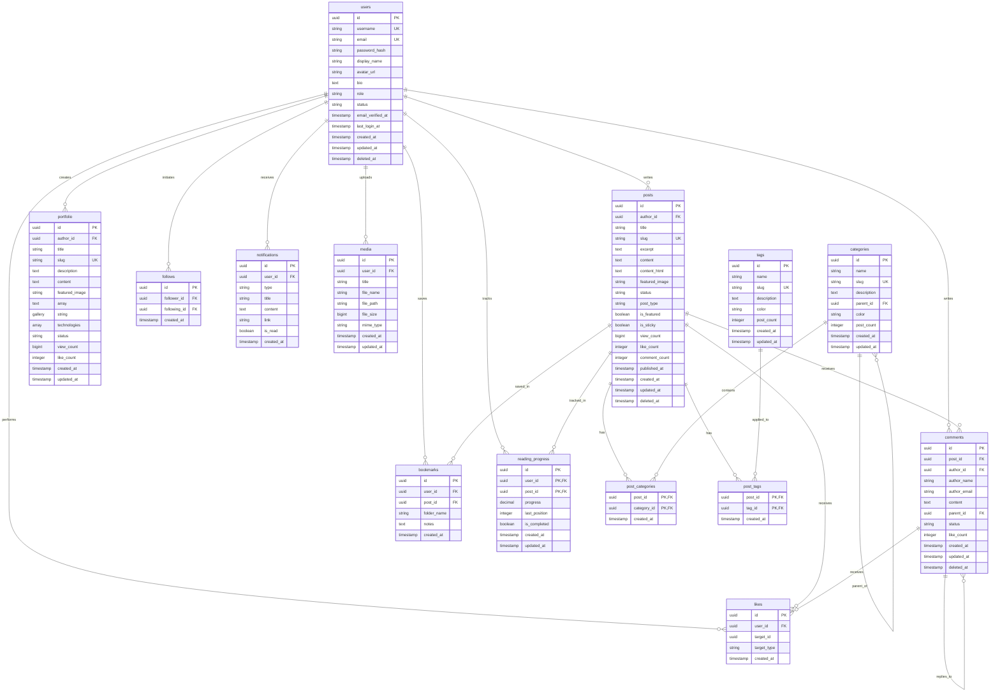

# CyberPress Platform - ER 图 (实体关系图)

## 📊 数据库实体关系图

```
┌─────────────────────────────────────────────────────────────────────────────────────┐
│                         CYBERPRESS PLATFORM - ER DIAGRAM                             │
└─────────────────────────────────────────────────────────────────────────────────────┘

┌──────────────┐         ┌──────────────┐         ┌──────────────┐
│    users     │         │    posts     │         │  categories  │
├──────────────┤         ├──────────────┤         ├──────────────┤
│ id (PK)      │──┐      │ id (PK)      │──┐      │ id (PK)      │
│ username     │  │      │ author_id    │  │      │ name         │
│ email        │  │      │ title        │  │      │ slug         │
│ password_hash│  │      │ slug         │  │      │ description  │
│ display_name │  │      │ content      │  │      │ parent_id    │
│ role         │  │      │ status       │  │      │ color        │
│ status       │  │      │ view_count   │  │      │ post_count   │
└──────────────┘  │      │ like_count   │  │      └──────────────┘
                   │      │ comment_count│  │              │
                   │      └──────────────┘  │              │
                   │                       │              │
                   │      ┌──────────────┐  │              │
                   │      │    tags      │  │              │
                   │      ├──────────────┤  │              │
                   │      │ id (PK)      │  │              │
                   │      │ name         │  │              │
                   │      │ slug         │  │              │
                   │      │ color        │  │              │
                   │      │ post_count   │  │              │
                   │      └──────────────┘  │              │
                   │                       │              │
                   │      ┌──────────────┐  │              │
                   │      │  portfolio   │  │              │
                   │      ├──────────────┤  │              │
                   │      │ id (PK)      │  │              │
                   │      │ author_id    │──┘              │
                   │      │ title        │                  │
                   │      │ slug         │                  │
                   │      │ technologies │                  │
                   │      │ view_count   │                  │
                   │      └──────────────┘                  │
                   │                                      │
┌──────────────────┴──────────────────────────────────────┴──────────────────┐
│                        关系表 (Junction Tables)                             │
├─────────────────────────────────────────────────────────────────────────────┤
│                                                                             │
│  ┌─────────────────┐         ┌─────────────────┐                           │
│  │ post_categories │         │   post_tags     │                           │
│  ├─────────────────┤         ├─────────────────┤                           │
│  │ post_id (FK)    │◄────────┤ post_id (FK)    │                           │
│  │ category_id (FK)│         │ tag_id (FK)     │                           │
│  └─────────────────┘         └─────────────────┘                           │
│           │                           │                                     │
│           └───────────────┬───────────┘                                     │
│                           ▼                                                 │
│                  ┌──────────────┐                                           │
│                  │    posts     │                                           │
│                  └──────────────┘                                           │
│                                                                             │
└─────────────────────────────────────────────────────────────────────────────┘

┌─────────────────────────────────────────────────────────────────────────────┐
│                          用户互动系统                                       │
├─────────────────────────────────────────────────────────────────────────────┤
│                                                                             │
│  ┌─────────────┐     ┌─────────────┐     ┌─────────────┐                 │
│  │   likes     │     │ bookmarks   │     │  follows    │                 │
│  ├─────────────┤     ├─────────────┤     ├─────────────┤                 │
│  │ id (PK)     │     │ id (PK)     │     │ id (PK)     │                 │
│  │ user_id     │     │ user_id     │     │ follower_id │                 │
│  │ target_id   │     │ post_id     │     │ following_id│                 │
│  │ target_type │     │ folder_name │     └─────────────┘                 │
│  └─────────────┘     └─────────────┘                                       │
│         │                   │                                                 │
│         └─────────┬─────────┘                                                 │
│                   ▼                                                           │
│          ┌────────────────┐                                                  │
│          │  interactions  │                                                  │
│          └────────────────┘                                                  │
│                                                                             │
│  ┌──────────────┐      ┌──────────────┐      ┌──────────────┐             │
│  │  comments    │      │notifications │      │reading_progress│           │
│  ├──────────────┤      ├──────────────┤      ├──────────────┤             │
│  │ id (PK)      │      │ id (PK)      │      │ id (PK)      │             │
│  │ post_id      │      │ user_id      │      │ user_id      │             │
│  │ author_id    │      │ type         │      │ post_id      │             │
│  │ parent_id    │      │ is_read      │      │ progress     │             │
│  │ content      │      │ created_at   │      │ is_completed │             │
│  └──────────────┘      └──────────────┘      └──────────────┘             │
│                                                                             │
└─────────────────────────────────────────────────────────────────────────────┘

┌─────────────────────────────────────────────────────────────────────────────┐
│                          支持系统                                           │
├─────────────────────────────────────────────────────────────────────────────┤
│                                                                             │
│  ┌─────────────┐     ┌──────────────────┐     ┌──────────────┐           │
│  │   media     │     │newsletter_subscribers│  │   settings   │           │
│  ├─────────────┤     ├──────────────────┤     ├──────────────┤           │
│  │ id (PK)     │     │ id (PK)          │     │ key (PK)     │           │
│  │ user_id     │     │ email            │     │ value        │           │
│  │ file_name   │     │ status           │     │ type         │           │
│  │ file_path   │     │ subscribed_at    │     │ description  │           │
│  │ mime_type   │     └──────────────────┘     └──────────────┘           │
│  └─────────────┘                                                           │
│                                                                             │
│  ┌──────────────┐     ┌──────────────┐                                    │
│  │search_history│     │activity_logs │                                    │
│  ├──────────────┤     ├──────────────┤                                    │
│  │ id (PK)      │     │ id (PK)      │                                    │
│  │ user_id      │     │ user_id      │                                    │
│  │ query        │     │ action       │                                    │
│  │ results_count│     │ entity_type  │                                    │
│  └──────────────┘     │ metadata     │                                    │
│                       └──────────────┘                                    │
│                                                                             │
└─────────────────────────────────────────────────────────────────────────────┘

┌─────────────────────────────────────────────────────────────────────────────┐
│                          关系说明                                           │
├─────────────────────────────────────────────────────────────────────────────┤
│                                                                             │
│  users ──< posts                 (一个用户可以写多篇文章)                    │
│  users ──< portfolio             (一个用户可以有多个作品)                    │
│  users ──< comments              (一个用户可以写多条评论)                    │
│  users ──< likes                 (一个用户可以点赞多次)                      │
│  users ──< bookmarks             (一个用户可以收藏多篇文章)                  │
│  users ──< follows               (一个用户可以关注多人)                      │
│  users ──< notifications         (一个用户可以收到多个通知)                  │
│  users ──< reading_progress      (一个用户可以有多条阅读进度)                │
│  users ──< media                 (一个用户可以上传多个媒体)                  │
│                                                                             │
│  posts ──< post_categories       (一篇文章可以有多个分类)                    │
│  posts ──< post_tags             (一篇文章可以有多个标签)                    │
│  posts ──< comments              (一篇文章可以有多条评论)                    │
│  posts ──< bookmarks             (一篇文章可以被多个用户收藏)                │
│  posts ──< reading_progress      (一篇文章可以有多条阅读进度)                │
│                                                                             │
│  categories ──< post_categories  (一个分类可以包含多篇文章)                  │
│  categories ──> categories       (分类可以有父子关系)                        │
│                                                                             │
│  tags ──< post_tags              (一个标签可以用于多篇文章)                  │
│                                                                             │
│  comments ──< comments           (评论可以嵌套回复)                          │
│                                                                             │
└─────────────────────────────────────────────────────────────────────────────┘

┌─────────────────────────────────────────────────────────────────────────────┐
│                          索引策略                                           │
├─────────────────────────────────────────────────────────────────────────────┤
│                                                                             │
│  主要索引:                                                                  │
│  - 所有主键 (PK)                                                            │
│  - 所有外键 (FK)                                                            │
│  - 常用查询字段 (email, username, slug, status)                             │
│  - 日期字段 (created_at, published_at)                                     │
│  - 统计字段 (view_count, like_count)                                       │
│                                                                             │
│  全文搜索索引:                                                              │
│  - posts (title, excerpt, content)                                         │
│  - users (username, display_name, bio)                                     │
│  - comments (content)                                                      │
│  - portfolio (title, description)                                          │
│                                                                             │
│  复合索引:                                                                  │
│  - (user_id, target_id, target_type) on likes                              │
│  - (follower_id, following_id) on follows                                  │
│  - (post_id, category_id) on post_categories                               │
│  - (post_id, tag_id) on post_tags                                          │
│                                                                             │
└─────────────────────────────────────────────────────────────────────────────┘
```

## 📐 Mermaid ER 图



## 📊 表统计信息

| 表名 | 预估行数 | 增长率 | 索引数 | 主要用途 |
|------|---------|--------|--------|----------|
| users | 10,000+ | 慢 | 5 | 用户管理 |
| posts | 100,000+ | 快 | 7 | 内容存储 |
| categories | 100+ | 慢 | 3 | 分类管理 |
| tags | 500+ | 慢 | 2 | 标签管理 |
| post_categories | 200,000+ | 快 | 2 | 文章分类关联 |
| post_tags | 300,000+ | 快 | 2 | 文章标签关联 |
| comments | 500,000+ | 快 | 5 | 评论系统 |
| likes | 1,000,000+ | 快 | 3 | 点赞系统 |
| bookmarks | 50,000+ | 中 | 3 | 收藏系统 |
| follows | 20,000+ | 中 | 2 | 关注关系 |
| notifications | 100,000+ | 快 | 3 | 通知系统 |
| media | 50,000+ | 中 | 3 | 媒体管理 |
| reading_progress | 30,000+ | 中 | 3 | 阅读进度 |
| portfolio | 1,000+ | 慢 | 4 | 作品集 |
| newsletter_subscribers | 5,000+ | 慢 | 2 | 邮件订阅 |
| settings | 50 | - | 1 | 系统配置 |
| search_history | 500,000+ | 快 | 3 | 搜索历史 |
| activity_logs | 2,000,000+ | 快 | 4 | 活动日志 |

## 🔍 查询模式

### 常用查询
1. **文章列表查询** - 按发布时间、浏览量排序
2. **全文搜索** - 标题、内容、标签搜索
3. **用户相关** - 用户信息、文章、评论
4. **社交互动** - 点赞、收藏、关注
5. **统计分析** - 浏览量、互动量统计

### 性能优化点
- **分区策略**: 按日期分区 posts, comments, activity_logs
- **缓存层**: Redis 缓存热门文章、用户信息
- **读写分离**: 主库写入，从库读取
- **连接池**: 使用连接池管理数据库连接

## 📈 扩展性考虑

### 水平扩展
- **分片策略**: 按 user_id 分片用户相关表
- **地理分布**: 多区域部署减少延迟
- **负载均衡**: 使用代理层分发查询

### 垂直扩展
- **内存优化**: 增加缓存大小
- **存储优化**: SSD 存储，定期归档
- **计算优化**: 更强的 CPU 用于全文搜索

---

**文档版本**: 1.0.0
**创建日期**: 2026-03-07
**维护者**: AI Development Team
