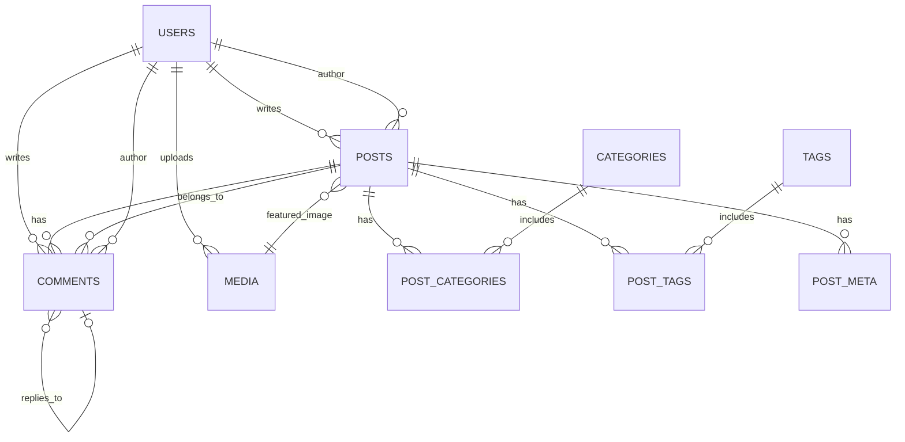

# CyberPress Platform - Database

数据库架构和初始化脚本。

## 📁 文件说明

- `schema.sql` - 完整的数据库架构定义
- `init.sql` - 初始数据和示例内容
- `ER-DIAGRAM.md` - 实体关系图文档

## 🚀 快速开始

### 1. 使用 MySQL 命令行

```bash
mysql -u root -p < schema.sql
mysql -u root -p cyberpress_db < init.sql
```

### 2. 使用 Docker

```bash
docker run -d \
  --name cyberpress-mysql \
  -e MYSQL_ROOT_PASSWORD=root_password \
  -e MYSQL_DATABASE=cyberpress_db \
  -p 3306:3306 \
  mysql:8.0
```

然后执行：

```bash
docker exec -i cyberpress-mysql mysql -u root -proot_password < schema.sql
docker exec -i cyberpress-mysql mysql -u root -proot_password cyberpress_db < init.sql
```

### 3. 使用 Docker Compose

项目根目录提供了完整的 Docker Compose 配置：

```bash
docker-compose up -d mysql
```

## 📊 数据库表结构

### 核心表

- `users` - 用户表
- `posts` - 文章表
- `categories` - 分类表
- `tags` - 标签表
- `comments` - 评论表
- `media` - 媒体文件表

### 关系表

- `post_categories` - 文章分类关系
- `post_tags` - 文章标签关系
- `term_relationships` - 术语关系
- `term_taxonomy` - 术语分类

### 元数据表

- `post_meta` - 文章元数据
- `user_meta` - 用户元数据
- `options` - 系统选项

### 其他表

- `links` - 链接表
- `terms` - 术语表

## 📈 ER 图



## 🔧 存储过程

### `update_category_counts()`

更新所有分类的文章计数。

```sql
CALL update_category_counts();
```

### `update_tag_counts()`

更新所有标签的文章计数。

```sql
CALL update_tag_counts();
```

### `increment_post_views(post_id)`

增加指定文章的浏览量。

```sql
CALL increment_post_views(1);
```

## 👥 默认用户

初始化脚本创建了以下测试用户：

| 用户名 | 密码 | 角色 |
|--------|------|------|
| admin | admin123 | 管理员 |
| editor | admin123 | 编辑 |
| author | admin123 | 作者 |
| subscriber | admin123 | 订阅者 |

**⚠️ 重要**：生产环境中请修改默认密码！

## 📝 视图

### `post_stats`

文章统计视图，包含浏览量、点赞数、评论数等。

### `popular_posts`

热门文章视图，按综合评分排序。

### `dashboard_stats`

仪表板统计视图，显示整体数据概览。

## 🔄 触发器

数据库自动维护以下触发器：

- `after_post_insert_update_categories` - 插入文章分类后更新计数
- `after_post_delete_update_categories` - 删除文章分类后更新计数
- `after_post_tag_insert_update_tags` - 插入文章标签后更新计数
- `after_post_tag_delete_update_tags` - 删除文章标签后更新计数

## 🔍 索引

所有表都建立了适当的索引以优化查询性能：

- 主键索引（PRIMARY KEY）
- 唯一索引（UNIQUE KEY）
- 普通索引（INDEX）
- 全文索引（FULLTEXT INDEX）

## 📦 备份与恢复

### 备份

```bash
mysqldump -u root -p cyberpress_db > backup_$(date +%Y%m%d).sql
```

### 恢复

```bash
mysql -u root -p cyberpress_db < backup_20240301.sql
```

## 🛠️ 维护

### 定期清理

```sql
-- 清理已删除的文章（30天前）
DELETE FROM posts 
WHERE deleted_at IS NOT NULL 
AND deleted_at < DATE_SUB(NOW(), INTERVAL 30 DAY);

-- 清理垃圾评论
DELETE FROM comments 
WHERE approved = 'trash' 
AND updated_at < DATE_SUB(NOW(), INTERVAL 7 DAY);
```

### 优化表

```sql
OPTIMIZE TABLE posts;
OPTIMIZE TABLE comments;
OPTIMIZE TABLE users;
```

## 🔐 安全建议

1. **修改默认密码**：更改所有默认用户的密码
2. **限制远程访问**：仅允许特定IP访问数据库
3. **定期备份**：设置自动备份计划
4. **监控日志**：启用慢查询日志
5. **更新权限**：根据需要调整用户权限

## 📚 参考

- [MySQL 8.0 文档](https://dev.mysql.com/doc/refman/8.0/en/)
- [数据库设计最佳实践](https://www.mysql.com/docs/)

---

**最后更新**: 2024-03-03
**维护者**: CyberPress Team
