# CyberPress Platform - ER 图设计

## 📊 实体关系图 (Entity-Relationship Diagram)

```mermaid
erDiagram
    %% 用户表
    users {
        bigserial id PK
        varchar username UK "用户名"
        varchar email UK "邮箱"
        varchar password_hash "密码哈希"
        varchar display_name "显示名称"
        text bio "个人简介"
        varchar avatar_url "头像URL"
        varchar role "角色: admin,author,editor,subscriber"
        boolean is_verified "是否验证"
        timestamp created_at "创建时间"
        timestamp updated_at "更新时间"
    }

    %% 分类表
    categories {
        bigserial id PK
        varchar name "分类名称"
        varchar slug UK "URL别名"
        text description "描述"
        bigint parent_id FK "父分类ID"
        integer sort_order "排序"
        integer post_count "文章数"
        timestamp created_at
        timestamp updated_at
    }

    %% 标签表
    tags {
        bigserial id PK
        varchar name "标签名称"
        varchar slug UK "URL别名"
        text description "描述"
        integer post_count "文章数"
        timestamp created_at
        timestamp updated_at
    }

    %% 文章表
    posts {
        bigserial id PK
        bigint author_id FK "作者ID"
        varchar title "标题"
        varchar slug UK "URL别名"
        text excerpt "摘要"
        text content "内容(Markdown)"
        text content_html "渲染后的HTML"
        varchar featured_image "特色图片"
        varchar status "状态: publish,draft,pending,private"
        varchar post_type "类型: post,portfolio,page"
        boolean is_featured "是否精选"
        boolean allow_comments "允许评论"
        integer view_count "浏览次数"
        integer like_count "点赞数"
        bigint comment_count "评论数"
        jsonb meta "元数据(JSON)"
        timestamp published_at "发布时间"
        timestamp created_at
        timestamp updated_at
    }

    %% 文章分类关联表
    post_categories {
        bigint post_id FK, PK
        bigint category_id FK, PK
        timestamp created_at
    }

    %% 文章标签关联表
    post_tags {
        bigint post_id FK, PK
        bigint tag_id FK, PK
        timestamp created_at
    }

    %% 评论表
    comments {
        bigserial id PK
        bigint post_id FK "文章ID"
        bigint parent_id FK "父评论ID"
        bigint author_id FK "作者ID(null=访客)"
        varchar author_name "访客姓名"
        varchar author_email "访客邮箱"
        text content "评论内容"
        varchar status "状态: approved,pending,spam,trash"
        integer like_count "点赞数"
        ipaddress ip_address "IP地址"
        text user_agent "用户代理"
        timestamp created_at
        timestamp updated_at
    }

    %% 媒体表
    media {
        bigserial id PK
        bigint uploader_id FK "上传者ID"
        varchar filename "文件名"
        varchar original_name "原始文件名"
        varchar mime_type "MIME类型"
        bigint file_size "文件大小(字节)"
        integer width "图片宽度"
        integer height "图片高度"
        varchar url "访问URL"
        varchar storage_path "存储路径"
        varchar alt_text "替代文本"
        text caption "说明"
        jsonb metadata "元数据(EXIF等)"
        timestamp created_at
    }

    %% 作品集表
    portfolios {
        bigserial id PK
        bigint author_id FK
        varchar title
        varchar slug UK
        text description
        text content
        varchar featured_image
        varchar status "completed,in-progress,planned"
        text technologies "技术栈"
        jsonb links "链接(demo,github,external)"
        date start_date
        date end_date
        integer sort_order
        timestamp created_at
        timestamp updated_at
    }

    %% 作品集标签关联
    portfolio_tags {
        bigint portfolio_id FK, PK
        bigint tag_id FK, PK
        timestamp created_at
    }

    %% 作品集媒体关联
    portfolio_media {
        bigint portfolio_id FK, PK
        bigint media_id FK, PK
        integer sort_order
        timestamp created_at
    }

    %% 订阅表
    subscribers {
        bigserial id PK
        varchar email UK
        varchar status "active,unconfirmed,unsubscribed"
        varchar confirmation_token
        timestamp confirmed_at
        timestamp created_at
        timestamp updated_at
    }

    %% 阅读历史
    reading_history {
        bigserial id PK
        bigint user_id FK
        bigint post_id FK
        integer progress "阅读进度(0-100)"
        timestamp last_read_at
        timestamp created_at
        timestamp updated_at
    }

    %% 书签表
    bookmarks {
        bigint user_id FK, PK
        bigint post_id FK, PK
        text notes "笔记"
        timestamp created_at
    }

    %% 点赞表
    likes {
        bigint user_id FK, PK
        bigint post_id FK, PK
        timestamp created_at
    }

    %% 关注表
    follows {
        bigint follower_id FK, PK "关注者"
        bigint following_id FK, PK "被关注者"
        timestamp created_at
    }

    %% 通知表
    notifications {
        bigserial id PK
        bigint user_id FK
        varchar type "comment,like,follow,system"
        varchar title
        text content
        jsonb data "额外数据"
        boolean is_read
        timestamp read_at
        timestamp created_at
    }

    %% 搜索日志
    search_logs {
        bigserial id PK
        bigint user_id FK
        varchar query "搜索关键词"
        integer results_count
        timestamp created_at
    }

    %% 分析数据
    analytics {
        bigserial id PK
        varchar date "日期(YYYY-MM-DD)"
        varchar metric_type "指标类型"
        bigint post_id FK "文章ID(null=全局)"
        bigint value "数值"
        jsonb dimensions "维度数据"
        timestamp created_at
    }

    %% 关系定义
    users ||--o{ posts : "writes"
    users ||--o{ comments : "writes"
    users ||--o{ media : "uploads"
    users ||--o{ portfolios : "creates"
    users ||--o{ reading_history : "tracks"
    users ||--o{ bookmarks : "saves"
    users ||--o{ likes : "gives"
    users ||--o{ follows : "initiates"
    users ||--o{ notifications : "receives"
    users ||--o{ search_logs : "performs"

    posts ||--o{ comments : "has"
    posts ||--o{ post_categories : "has"
    posts ||--o{ post_tags : "has"
    posts ||--o{ reading_history : "tracked_in"
    posts ||--o{ bookmarks : "saved_in"
    posts ||--o{ likes : "liked_in"
    posts ||--o{ analytics : "measured"

    categories ||--o{ categories : "parent_of"
    categories ||--o{ post_categories : "associated_with"

    tags ||--o{ post_tags : "associated_with"
    tags ||--o{ portfolio_tags : "associated_with"

    comments ||--o{ comments : "replies_to"

    portfolios ||--o{ portfolio_tags : "has"
    portfolios ||--o{ portfolio_media : "contains"

    media ||--o{ portfolio_media : "used_in"
```

## 🎯 核心设计原则

### 1. 数据规范化
- **第三范式 (3NF)**：消除传递依赖
- **适当反规范化**：在 `posts` 表中存储 `comment_count`, `view_count` 等统计信息

### 2. 性能优化
- **主键策略**：使用 `bigserial` 自增主键
- **外键约束**：确保数据完整性
- **索引设计**：所有查询字段都有对应索引

### 3. 扩展性
- **JSONB 字段**：`meta`, `metadata`, `data` 等字段存储灵活的扩展数据
- **多态关联**：通过关联表实现灵活的关系

### 4. 审计追踪
- **时间戳字段**：`created_at`, `updated_at` 记录所有变更
- **软删除**：重要数据使用 `status` 字段实现软删除

## 📈 数据量预估

| 表名 | 预估数据量 | 增长速度 |
|------|-----------|---------|
| users | 10,000 | 中等 |
| posts | 100,000 | 高 |
| comments | 500,000 | 高 |
| media | 200,000 | 中等 |
| portfolios | 1,000 | 低 |
| analytics | 10M+ | 极高 |

## 🔐 安全考虑

1. **密码存储**：使用 `password_hash` (bcrypt/argon2)
2. **SQL注入防护**：使用参数化查询
3. **隐私保护**：IP地址、用户代理等敏感信息单独存储
4. **数据加密**：敏感字段考虑应用层加密

## 📝 备注

- 此架构为 PostgreSQL 设计
- 可根据实际需求调整字段类型和长度
- 建议使用数据库迁移工具管理架构变更
- 生产环境需要配置适当的备份策略
