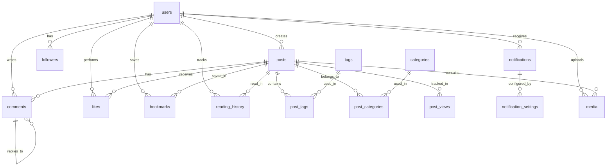

# CyberPress Platform - ER 图设计文档

## 数据库实体关系图



## 核心表关系说明

### 1. 用户中心
- **users**: 用户主表
- **user_profiles**: 用户详细资料
- **followers**: 关注关系（自关联）
- **notification_settings**: 通知偏好设置

### 2. 内容中心
- **posts**: 文章表
- **post_meta**: 文章元数据
- **post_categories**: 文章-分类关联
- **post_tags**: 文章-标签关联
- **categories**: 分类表
- **tags**: 标签表

### 3. 互动中心
- **comments**: 评论表
- **likes**: 点赞表
- **bookmarks**: 收藏表
- **bookmarks_folders**: 收藏夹

### 4. 阅读中心
- **reading_history**: 阅读历史
- **reading_list**: 阅读列表
- **reading_progress**: 阅读进度

### 5. 通知中心
- **notifications**: 通知表
- **notification_queue**: 通知队列

### 6. 媒体中心
- **media**: 媒体文件表
- **media_meta**: 媒体元数据

### 7. 分析中心
- **post_views**: 文章浏览统计
- **analytics_events**: 分析事件
- **analytics_sessions**: 会话追踪

## 索引策略

### 主键索引
所有表使用 `UUID` 或 `BIGINT AUTO_INCREMENT` 作为主键

### 唯一索引
- `users.email`
- `users.username`
- `posts.slug`
- `categories.slug`
- `tags.name`

### 复合索引
- `posts(status, created_at, published_at)`
- `posts(author_id, status)`
- `reading_history(user_id, post_id, read_at)`
- `notifications(user_id, is_read, created_at)`

### 全文索引
- `posts.title`
- `posts.content`
- `posts.excerpt`

## 外键约束

```sql
-- 用户相关
ALTER TABLE posts ADD CONSTRAINT fk_posts_author
  FOREIGN KEY (author_id) REFERENCES users(id) ON DELETE CASCADE;

ALTER TABLE comments ADD CONSTRAINT fk_comments_author
  FOREIGN KEY (author_id) REFERENCES users(id) ON DELETE CASCADE;

-- 文章相关
ALTER TABLE comments ADD CONSTRAINT fk_comments_post
  FOREIGN KEY (post_id) REFERENCES posts(id) ON DELETE CASCADE;

-- 互动相关
ALTER TABLE likes ADD CONSTRAINT fk_likes_user
  FOREIGN KEY (user_id) REFERENCES users(id) ON DELETE CASCADE;

ALTER TABLE likes ADD CONSTRAINT fk_likes_post
  FOREIGN KEY (post_id) REFERENCES posts(id) ON DELETE CASCADE;
```

## 数据完整性

### 级联操作
- **ON DELETE CASCADE**: 删除用户时，删除其相关数据
- **ON UPDATE CASCADE**: 更新ID时，级联更新关联表

### 触发器
- `posts` 表: 自动更新 `updated_at`
- `post_views` 表: 自动统计浏览量
- `users` 表: 自动创建用户资料

## 性能优化

### 分区策略
- `post_views`: 按月分区
- `analytics_events`: 按季度分区
- `reading_history`: 按年分区

### 缓存策略
- Redis 缓存热门文章
- 缓存用户会话
- 缓存分类和标签列表

### 查询优化
- 使用 Covering Index
- 优化 JOIN 查询
- 使用 EXPLAIN ANALYZE 分析慢查询

---

**创建时间**: 2026-03-07
**架构师**: AI Database Architect
**版本**: 1.0.0
