# 🎨 WordPress Cyberpunk Theme - 系统架构图

> **首席架构师 · 可视化系统设计**
> **日期**: 2026-02-28
> **版本**: 2.0.0

---

## 📊 目录

1. [整体架构图](#1-整体架构图)
2. [数据流图](#2-数据流图)
3. [模块依赖图](#3-模块依赖图)
4. [类图](#4-类图)
5. [序列图](#5-序列图)
6. [部署架构图](#6-部署架构图)

---

## 1. 整体架构图

### 1.1 三层架构

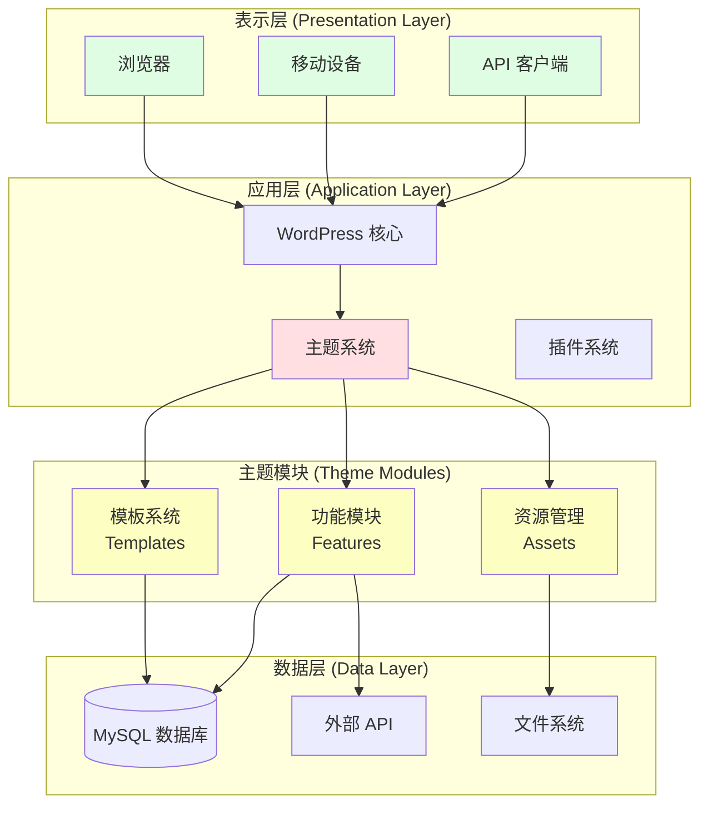
```mermaid
graph TB
    subgraph "表示层 (Presentation Layer)"
        A1[浏览器]
        A2[移动设备]
        A3[API 客户端]
    end

    subgraph "应用层 (Application Layer)"
        B1[WordPress 核心]
        B2[主题系统]
        B3[插件系统]
    end

    subgraph "主题模块 (Theme Modules)"
        C1[模板系统<br/>Templates]
        C2[功能模块<br/>Features]
        C3[资源管理<br/>Assets]
    end

    subgraph "数据层 (Data Layer)"
        D1[(MySQL 数据库)]
        D2[文件系统]
        D3[外部 API]
    end

    A1 --> B1
    A2 --> B1
    A3 --> B1
    B1 --> B2
    B2 --> C1
    B2 --> C2
    B2 --> C3
    C1 --> D1
    C2 --> D1
    C3 --> D2
    C2 --> D3

    style A1 fill:#00f0ff20
    style A2 fill:#00f0ff20
    style A3 fill:#00f0ff20
    style B2 fill:#ff00ff20
    style C1 fill:#f0ff0020
    style C2 fill:#f0ff0020
    style C3 fill:#f0ff0020
```

### 1.2 主题组件架构

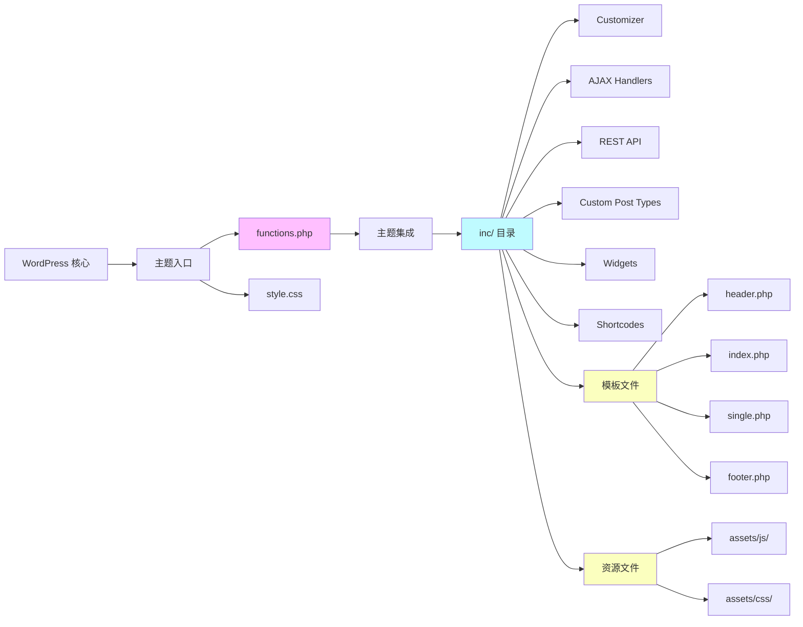
```mermaid
graph LR
    A[WordPress 核心] --> B[主题入口]
    B --> C[functions.php]
    B --> D[style.css]

    C --> E[主题集成]
    E --> F[inc/ 目录]

    F --> G[Customizer]
    F --> H[AJAX Handlers]
    F --> I[REST API]
    F --> J[Custom Post Types]
    F --> K[Widgets]
    F --> L[Shortcodes]

    F --> M[模板文件]
    M --> N[header.php]
    M --> O[index.php]
    M --> P[single.php]
    M --> Q[footer.php]

    F --> R[资源文件]
    R --> S[assets/js/]
    R --> T[assets/css/]

    style C fill:#ff00ff40
    style F fill:#00f0ff40
    style M fill:#f0ff0040
    style R fill:#f0ff0040
```

---

## 2. 数据流图

### 2.1 页面请求流程

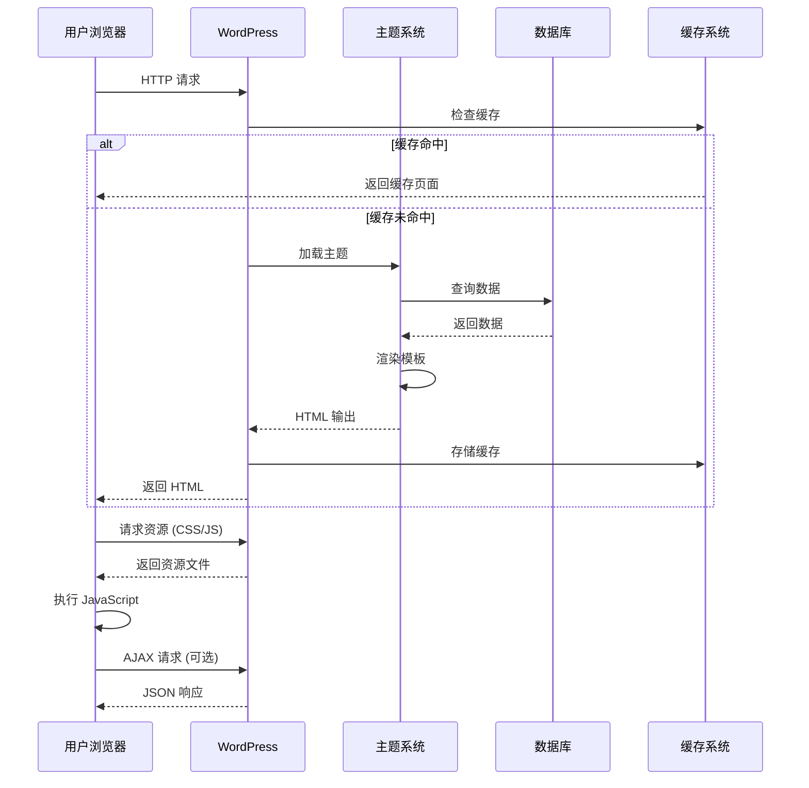
```mermaid
sequenceDiagram
    participant User as 用户浏览器
    participant WP as WordPress
    participant Theme as 主题系统
    participant DB as 数据库
    participant Cache as 缓存系统

    User->>WP: HTTP 请求
    WP->>Cache: 检查缓存

    alt 缓存命中
        Cache-->>User: 返回缓存页面
    else 缓存未命中
        WP->>Theme: 加载主题
        Theme->>DB: 查询数据
        DB-->>Theme: 返回数据
        Theme->>Theme: 渲染模板
        Theme-->>WP: HTML 输出
        WP->>Cache: 存储缓存
        WP-->>User: 返回 HTML
    end

    User->>WP: 请求资源 (CSS/JS)
    WP-->>User: 返回资源文件

    User->>User: 执行 JavaScript
    User->>WP: AJAX 请求 (可选)
    WP-->>User: JSON 响应
```

### 2.2 AJAX 交互流程

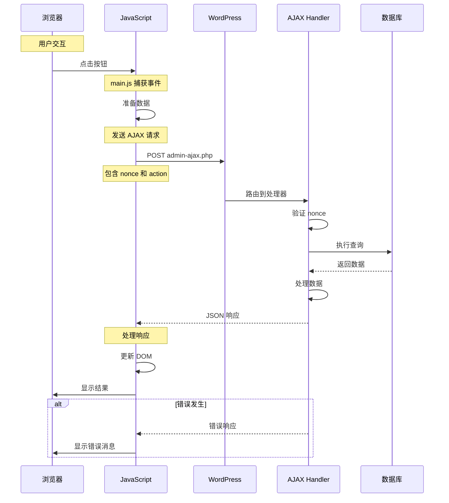
```mermaid
sequenceDiagram
    participant Browser as 浏览器
    participant JS as JavaScript
    participant WP as WordPress
    participant AJAX as AJAX Handler
    participant DB as 数据库

    Note over Browser: 用户交互
    Browser->>JS: 点击按钮

    Note over JS: main.js 捕获事件
    JS->>JS: 准备数据

    Note over JS: 发送 AJAX 请求
    JS->>WP: POST admin-ajax.php
    Note over JS: 包含 nonce 和 action

    WP->>AJAX: 路由到处理器
    AJAX->>AJAX: 验证 nonce
    AJAX->>DB: 执行查询
    DB-->>AJAX: 返回数据
    AJAX->>AJAX: 处理数据
    AJAX-->>JS: JSON 响应

    Note over JS: 处理响应
    JS->>JS: 更新 DOM
    JS->>Browser: 显示结果

    alt 错误发生
        AJAX-->>JS: 错误响应
        JS->>Browser: 显示错误消息
    end
```

### 2.3 主题定制器流程

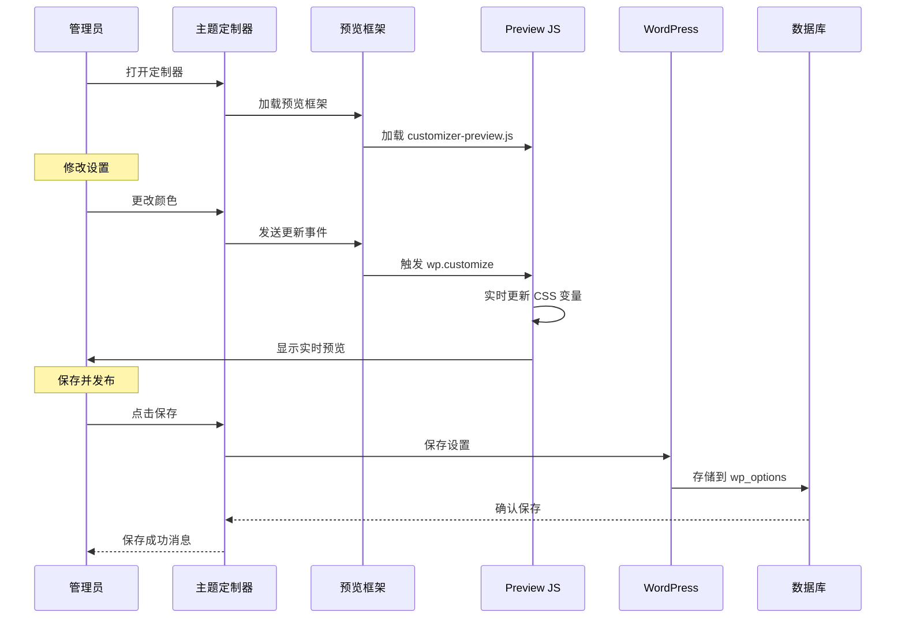
```mermaid
sequenceDiagram
    participant Admin as 管理员
    participant Customizer as 主题定制器
    participant Preview as 预览框架
    participant JS as Preview JS
    participant WP as WordPress
    participant DB as 数据库

    Admin->>Customizer: 打开定制器
    Customizer->>Preview: 加载预览框架
    Preview->>JS: 加载 customizer-preview.js

    Note over Admin: 修改设置
    Admin->>Customizer: 更改颜色
    Customizer->>Preview: 发送更新事件
    Preview->>JS: 触发 wp.customize
    JS->>JS: 实时更新 CSS 变量
    JS->>Admin: 显示实时预览

    Note over Admin: 保存并发布
    Admin->>Customizer: 点击保存
    Customizer->>WP: 保存设置
    WP->>DB: 存储到 wp_options
    DB-->>Customizer: 确认保存
    Customizer-->>Admin: 保存成功消息
```

---

## 3. 模块依赖图

### 3.1 模块加载顺序

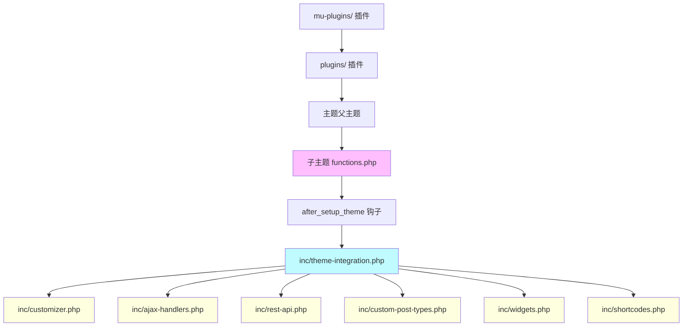
```mermaid
graph TD
    A[mu-plugins/ 插件] --> B[plugins/ 插件]
    B --> C[主题父主题]
    C --> D[子主题 functions.php]
    D --> E[after_setup_theme 钩子]
    E --> F[inc/theme-integration.php]
    F --> G[inc/customizer.php]
    F --> H[inc/ajax-handlers.php]
    F --> I[inc/rest-api.php]
    F --> J[inc/custom-post-types.php]
    F --> K[inc/widgets.php]
    F --> L[inc/shortcodes.php]

    style D fill:#ff00ff40
    style F fill:#00f0ff40
    style G fill:#f0ff0020
    style H fill:#f0ff0020
    style I fill:#f0ff0020
    style J fill:#f0ff0020
    style K fill:#f0ff0020
    style L fill:#f0ff0020
```

### 3.2 功能模块依赖关系

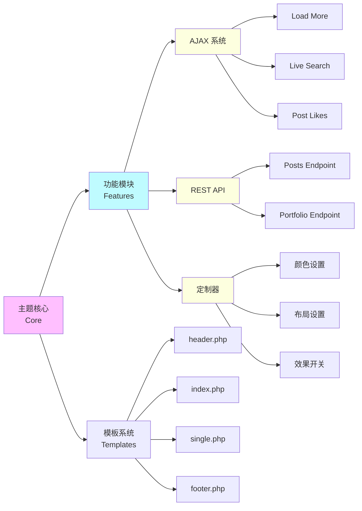
```mermaid
graph LR
    A[主题核心<br/>Core] --> B[模板系统<br/>Templates]
    A --> C[功能模块<br/>Features]

    C --> D[AJAX 系统]
    C --> E[REST API]
    C --> F[定制器]

    D --> G[Load More]
    D --> H[Live Search]
    D --> I[Post Likes]

    E --> J[Posts Endpoint]
    E --> K[Portfolio Endpoint]

    F --> L[颜色设置]
    F --> M[布局设置]
    F --> N[效果开关]

    B --> O[header.php]
    B --> P[index.php]
    B --> Q[single.php]
    B --> R[footer.php]

    style A fill:#ff00ff40
    style C fill:#00f0ff40
    style D fill:#f0ff0020
    style E fill:#f0ff0020
    style F fill:#f0ff0020
```

---

## 4. 类图

### 4.1 Widget 类结构

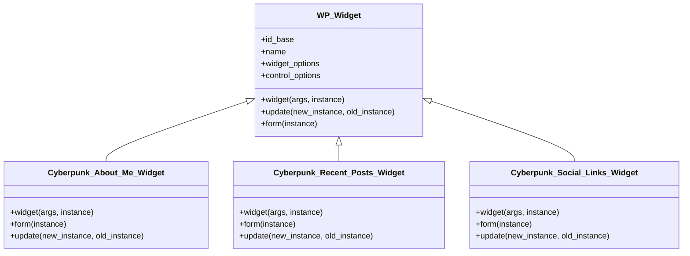
```mermaid
classDiagram
    class WP_Widget {
        +id_base
        +name
        +widget_options
        +control_options
        +widget(args, instance)
        +update(new_instance, old_instance)
        +form(instance)
    }

    class Cyberpunk_About_Me_Widget {
        +widget(args, instance)
        +form(instance)
        +update(new_instance, old_instance)
    }

    class Cyberpunk_Recent_Posts_Widget {
        +widget(args, instance)
        +form(instance)
        +update(new_instance, old_instance)
    }

    class Cyberpunk_Social_Links_Widget {
        +widget(args, instance)
        +form(instance)
        +update(new_instance, old_instance)
    }

    WP_Widget <|-- Cyberpunk_About_Me_Widget
    WP_Widget <|-- Cyberpunk_Recent_Posts_Widget
    WP_Widget <|-- Cyberpunk_Social_Links_Widget
```

### 4.2 AJAX 处理器类结构

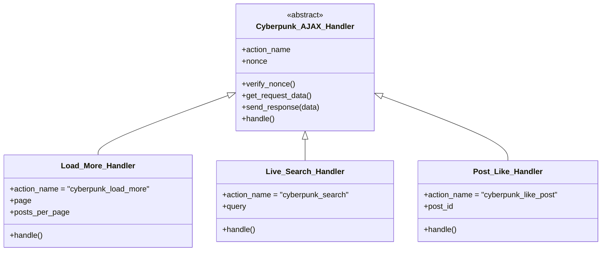
```mermaid
classDiagram
    class Cyberpunk_AJAX_Handler {
        <<abstract>>
        +action_name
        +nonce
        +verify_nonce()
        +get_request_data()
        +send_response(data)
        +handle()
    }

    class Load_More_Handler {
        +action_name = "cyberpunk_load_more"
        +page
        +posts_per_page
        +handle()
    }

    class Live_Search_Handler {
        +action_name = "cyberpunk_search"
        +query
        +handle()
    }

    class Post_Like_Handler {
        +action_name = "cyberpunk_like_post"
        +post_id
        +handle()
    }

    Cyberpunk_AJAX_Handler <|-- Load_More_Handler
    Cyberpunk_AJAX_Handler <|-- Live_Search_Handler
    Cyberpunk_AJAX_Handler <|-- Post_Like_Handler
```

---

## 5. 序列图

### 5.1 Load More 文章完整流程

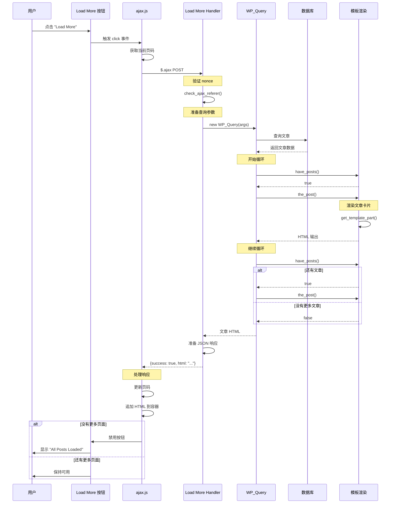
```mermaid
sequenceDiagram
    participant User as 用户
    participant UI as Load More 按钮
    participant JS as ajax.js
    participant AJAX as Load More Handler
    participant WP as WP_Query
    participant DB as 数据库
    participant Template as 模板渲染

    User->>UI: 点击 "Load More"
    UI->>JS: 触发 click 事件
    JS->>JS: 获取当前页码
    JS->>AJAX: $.ajax POST

    Note over AJAX: 验证 nonce
    AJAX->>AJAX: check_ajax_referer()

    Note over AJAX: 准备查询参数
    AJAX->>WP: new WP_Query(args)
    WP->>DB: 查询文章
    DB-->>WP: 返回文章数据

    Note over WP: 开始循环
    WP->>Template: have_posts()
    Template-->>WP: true
    WP->>Template: the_post()

    Note over Template: 渲染文章卡片
    Template->>Template: get_template_part()
    Template-->>WP: HTML 输出

    Note over WP: 继续循环
    WP->>Template: have_posts()
    alt 还有文章
        Template-->>WP: true
        WP->>Template: the_post()
    else 没有更多文章
        Template-->>WP: false
    end

    WP-->>AJAX: 文章 HTML
    AJAX->>AJAX: 准备 JSON 响应
    AJAX-->>JS: {success: true, html: "..."}

    Note over JS: 处理响应
    JS->>JS: 更新页码
    JS->>JS: 追加 HTML 到容器

    alt 没有更多页面
        JS->>UI: 禁用按钮
        UI->>User: 显示 "All Posts Loaded"
    else 还有更多页面
        UI->>User: 保持可用
    end
```

### 5.2 文章点赞流程

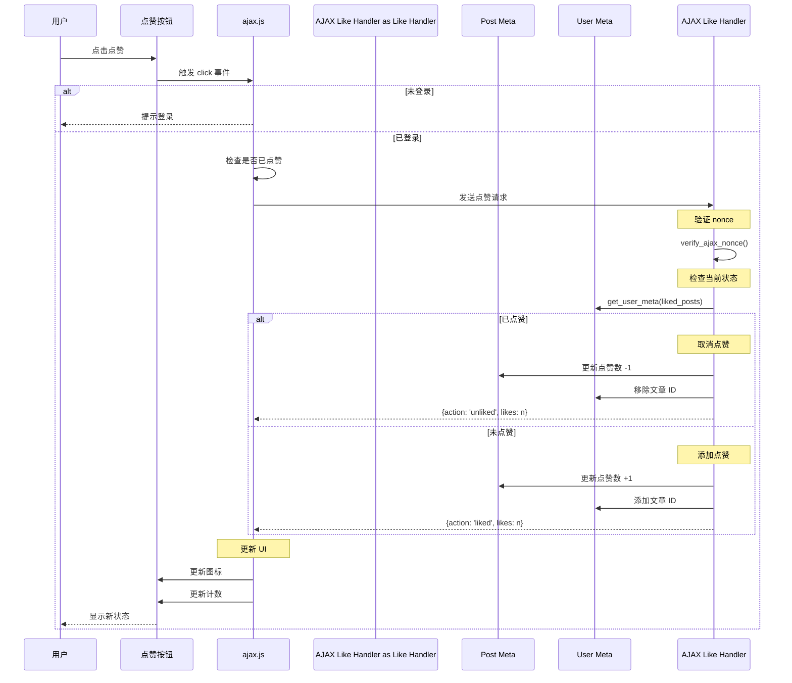
```mermaid
sequenceDiagram
    participant User as 用户
    participant Button as 点赞按钮
    participant JS as ajax.js
    participant AJAX Like Handler as Like Handler
    participant PostMeta as Post Meta
    participant UserMeta as User Meta

    User->>Button: 点击点赞
    Button->>JS: 触发 click 事件

    alt 未登录
        JS-->>User: 提示登录
    else 已登录
        JS->>JS: 检查是否已点赞
        JS->>AJAX Like Handler: 发送点赞请求

        Note over AJAX Like Handler: 验证 nonce
        AJAX Like Handler->>AJAX Like Handler: verify_ajax_nonce()

        Note over AJAX Like Handler: 检查当前状态
        AJAX Like Handler->>UserMeta: get_user_meta(liked_posts)

        alt 已点赞
            Note over AJAX Like Handler: 取消点赞
            AJAX Like Handler->>PostMeta: 更新点赞数 -1
            AJAX Like Handler->>UserMeta: 移除文章 ID
            AJAX Like Handler-->>JS: {action: 'unliked', likes: n}
        else 未点赞
            Note over AJAX Like Handler: 添加点赞
            AJAX Like Handler->>PostMeta: 更新点赞数 +1
            AJAX Like Handler->>UserMeta: 添加文章 ID
            AJAX Like Handler-->>JS: {action: 'liked', likes: n}
        end

        Note over JS: 更新 UI
        JS->>Button: 更新图标
        JS->>Button: 更新计数
        Button-->>User: 显示新状态
    end
```

### 5.3 实时搜索流程

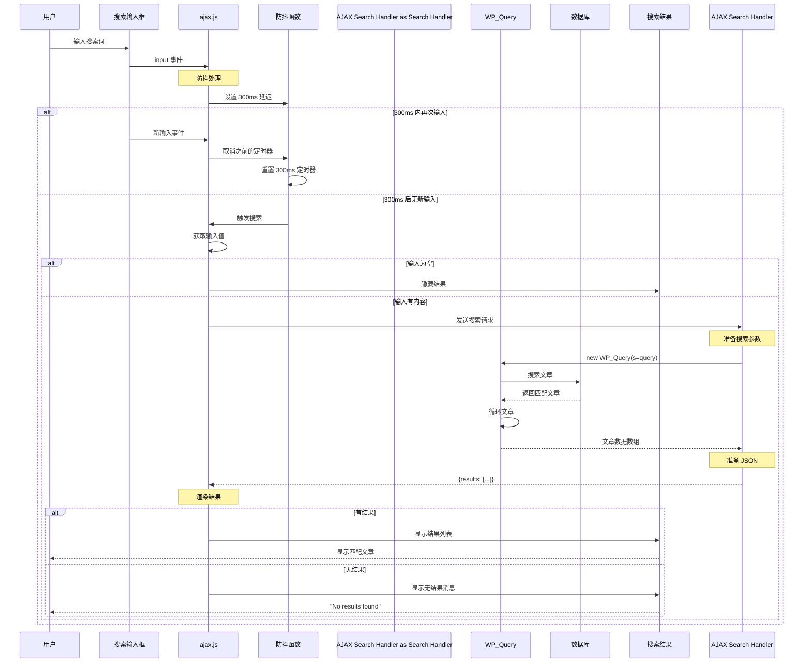
```mermaid
sequenceDiagram
    participant User as 用户
    participant Input as 搜索输入框
    participant JS as ajax.js
    participant Debounce as 防抖函数
    participant AJAX Search Handler as Search Handler
    participant WPQuery as WP_Query
    participant DB as 数据库
    participant Results as 搜索结果

    User->>Input: 输入搜索词
    Input->>JS: input 事件

    Note over JS: 防抖处理
    JS->>Debounce: 设置 300ms 延迟

    alt 300ms 内再次输入
        Input->>JS: 新输入事件
        JS->>Debounce: 取消之前的定时器
        Debounce->>Debounce: 重置 300ms 定时器
    else 300ms 后无新输入
        Debounce->>JS: 触发搜索
        JS->>JS: 获取输入值

        alt 输入为空
            JS->>Results: 隐藏结果
        else 输入有内容
            JS->>AJAX Search Handler: 发送搜索请求

            Note over AJAX Search Handler: 准备搜索参数
            AJAX Search Handler->>WPQuery: new WP_Query(s=query)

            WPQuery->>DB: 搜索文章
            DB-->>WPQuery: 返回匹配文章

            WPQuery->>WPQuery: 循环文章
            WPQuery-->>AJAX Search Handler: 文章数据数组

            Note over AJAX Search Handler: 准备 JSON
            AJAX Search Handler-->>JS: {results: [...]}

            Note over JS: 渲染结果
            alt 有结果
                JS->>Results: 显示结果列表
                Results-->>User: 显示匹配文章
            else 无结果
                JS->>Results: 显示无结果消息
                Results-->>User: "No results found"
            end
        end
    end
```

---

## 6. 部署架构图

### 6.1 标准部署架构

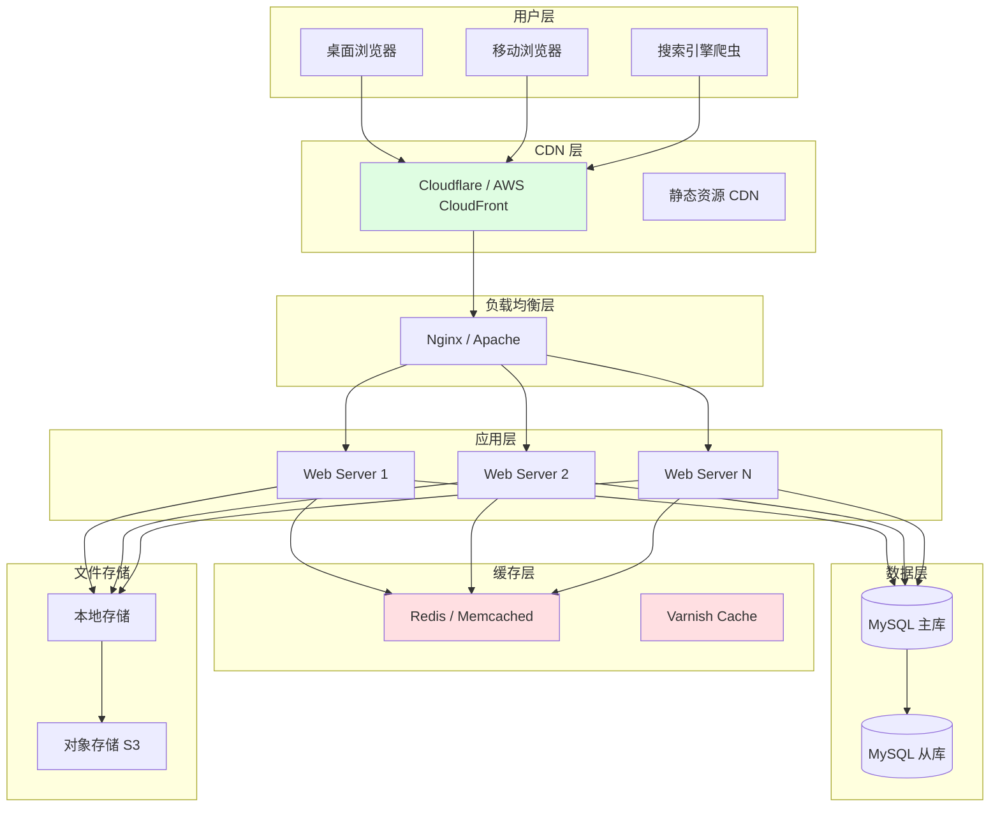
```mermaid
graph TB
    subgraph "用户层"
        A1[桌面浏览器]
        A2[移动浏览器]
        A3[搜索引擎爬虫]
    end

    subgraph "CDN 层"
        B1[Cloudflare / AWS CloudFront]
        B2[静态资源 CDN]
    end

    subgraph "负载均衡层"
        C1[Nginx / Apache]
    end

    subgraph "应用层"
        D1[Web Server 1]
        D2[Web Server 2]
        D3[Web Server N]
    end

    subgraph "缓存层"
        E1[Redis / Memcached]
        E2[Varnish Cache]
    end

    subgraph "数据层"
        F1[(MySQL 主库)]
        F2[(MySQL 从库)]
    end

    subgraph "文件存储"
        G1[本地存储]
        G2[对象存储 S3]
    end

    A1 --> B1
    A2 --> B1
    A3 --> B1
    B1 --> C1
    C1 --> D1
    C1 --> D2
    C1 --> D3
    D1 --> E1
    D2 --> E1
    D3 --> E1
    D1 --> F1
    D2 --> F1
    D3 --> F1
    F1 --> F2
    D1 --> G1
    D2 --> G1
    D3 --> G1
    G1 --> G2

    style B1 fill:#00f0ff20
    style E1 fill:#ff00ff20
    style E2 fill:#ff00ff20
```

### 6.2 开发环境架构

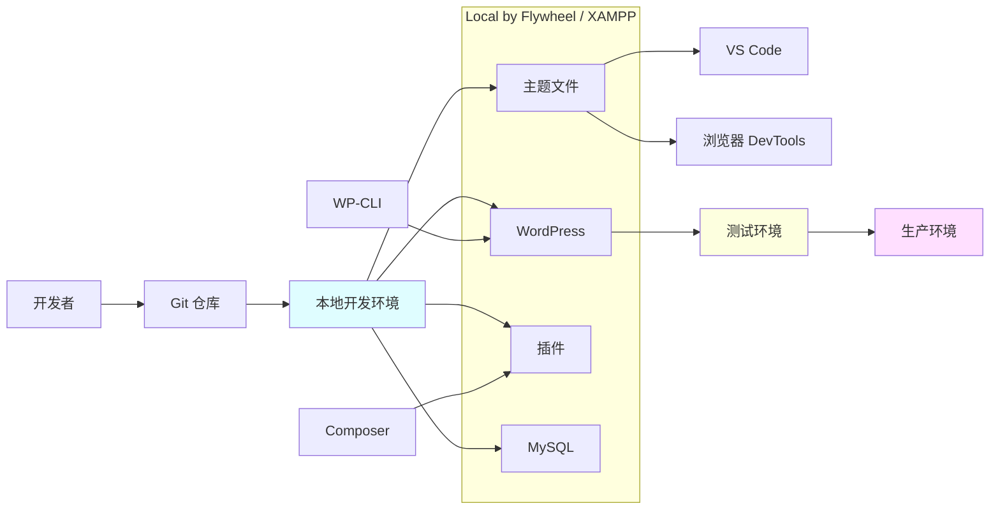
```mermaid
graph LR
    A[开发者] --> B[Git 仓库]
    B --> C[本地开发环境]

    subgraph "Local by Flywheel / XAMPP"
        C1[WordPress]
        C2[主题文件]
        C3[插件]
        C4[MySQL]
    end

    C --> C1
    C --> C2
    C --> C3
    C --> C4

    C2 --> D[VS Code]
    C2 --> E[浏览器 DevTools]

    F[WP-CLI] --> C1
    G[Composer] --> C3

    C1 --> H[测试环境]
    H --> I[生产环境]

    style C fill:#00f0ff20
    style H fill:#f0ff0020
    style I fill:#ff00ff20
```

### 6.3 无头 CMS 架构（未来）

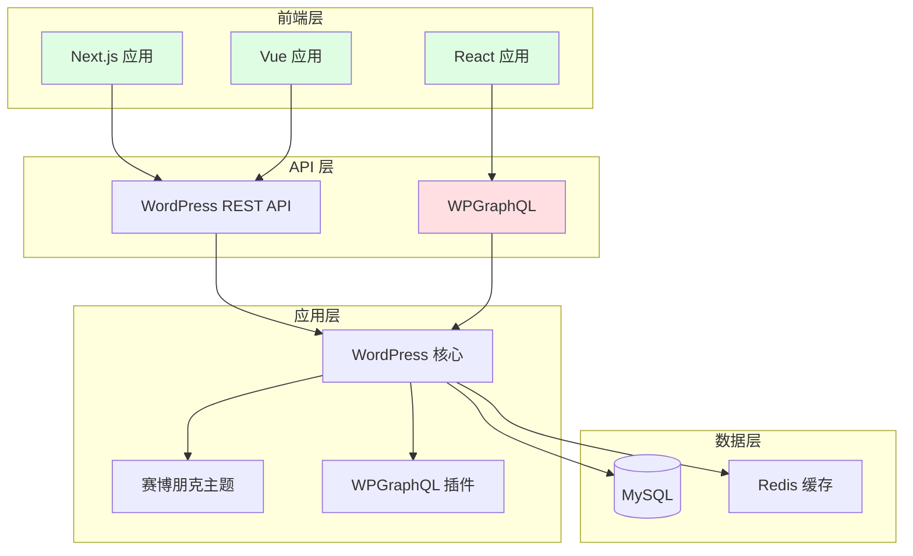
```mermaid
graph TB
    subgraph "前端层"
        A1[Next.js 应用]
        A2[Vue 应用]
        A3[React 应用]
    end

    subgraph "API 层"
        B1[WordPress REST API]
        B2[WPGraphQL]
    end

    subgraph "应用层"
        C1[WordPress 核心]
        C2[赛博朋克主题]
        C3[WPGraphQL 插件]
    end

    subgraph "数据层"
        D1[(MySQL)]
        D2[Redis 缓存]
    end

    A1 --> B1
    A2 --> B1
    A3 --> B2
    B1 --> C1
    B2 --> C1
    C1 --> C2
    C1 --> C3
    C1 --> D1
    C1 --> D2

    style A1 fill:#00f0ff20
    style A2 fill:#00f0ff20
    style A3 fill:#00f0ff20
    style B2 fill:#ff00ff20
```

---

## 📊 系统组件清单

### 6.1 核心文件

```yaml
主题根目录:
  - functions.php          # 主题核心功能 (276 行)
  - style.css              # 主样式表 (1190 行)
  - README.md              # 主题说明
  - screenshot.png         # 主题缩略图

模板文件:
  - header.php             # 头部模板
  - footer.php             # 底部模板
  - index.php              # 主页模板
  - single.php             # 单页模板
  - page.php               # 页面模板
  - archive.php            # 归档模板
  - search.php             # 搜索模板
  - sidebar.php            # 侧边栏
  - comments.php           # 评论模板

自定义模板:
  - archive-portfolio.php  # Portfolio 归档
  - single-portfolio.php   # Portfolio 单页
```

### 6.2 功能模块

```yaml
inc/ 目录:
  - theme-integration.php  # 模块集成 (10KB)
  - customizer.php         # 主题定制器 (23KB)
  - ajax-handlers.php      # AJAX 处理器 (17KB)
  - rest-api.php           # REST API (17KB)
  - custom-post-types.php  # 自定义文章类型 (16KB)
  - core-enhancements.php  # 核心增强 (19KB)
  - widgets.php            # 自定义 Widgets (待开发)
  - shortcodes.php         # 短代码系统 (待开发)
  - performance.php        # 性能优化 (待开发)
```

### 6.3 资源文件

```yaml
assets/js/:
  - main.js                # 主脚本 (待创建)
  - ajax.js                # AJAX 功能 (543 行, 已有)
  - customizer-preview.js  # 定制器预览 (待创建)

assets/css/:
  - admin.css              # 后台样式 (400+ 行)
  - comments.css           # 评论样式 (待创建)

template-parts/:
  - content/content-card.php      # 文章卡片
  - content/content-none.php      # 无结果页面
  - content/content-portfolio.php # Portfolio 卡片
```

---

## 🔄 数据流详解

### 用户请求生命周期

```
1. 用户请求
   ↓
2. DNS 解析
   ↓
3. CDN 检查 (可选)
   ↓
4. Web Server (Nginx/Apache)
   ↓
5. PHP-FPM
   ↓
6. WordPress Bootstrap
   ↓
7. 加载 wp-config.php
   ↓
8. 连接数据库
   ↓
9. 加载插件 (mu-plugins/plugins/)
   ↓
10. 加载主题 (functions.php)
    ↓
11. 执行 after_setup_theme 钩子
    ↓
12. 加载主题模块 (inc/*.php)
    ↓
13. 查询模板层级
    ↓
14. 加载模板文件 (header.php/index.php/footer.php)
    ↓
15. 执行 wp_head() / wp_footer()
    ↓
16. 输出 HTML
    ↓
17. 返回给用户
    ↓
18. 浏览器渲染
    ↓
19. 执行 JavaScript
    ↓
20. AJAX 交互 (可选)
```

### AJAX 请求生命周期

```
1. 用户触发事件
   ↓
2. JavaScript 捕获事件
   ↓
3. 准备请求数据
   ↓
4. 发送 XMLHttpRequest
   ↓
5. WordPress 接收请求
   ↓
6. admin-ajax.php 路由
   ↓
7. 验证 nonce
   ↓
8. 调用对应的处理函数
   ↓
9. 执行数据库查询
   ↓
10. 处理数据
    ↓
11. 构建 JSON 响应
    ↓
12. 返回响应
    ↓
13. JavaScript 接收响应
    ↓
14. 更新 DOM
    ↓
15. 显示结果给用户
```

---

## 📈 性能优化架构

### 前端性能优化

```
┌─────────────────────────────────────────┐
│         前端性能优化策略                  │
├─────────────────────────────────────────┤
│ 1. 资源优化                             │
│    ├─ 图片压缩 (WebP)                   │
│    ├─ CSS 压缩                          │
│    ├─ JS 压缩                           │
│    └─ 字体优化                          │
│                                         │
│ 2. 加载优化                             │
│    ├─ 预加载关键资源                    │
│    ├─ 延迟加载非关键资源                │
│    ├─ async/defer 脚本                  │
│    └─ 懒加载图片                        │
│                                         │
│ 3. 渲染优化                             │
│    ├─ 减少重排/重绘                     │
│    ├─ CSS 关键路径                      │
│    ├─ 优化 JavaScript 执行              │
│    └─ 使用 requestAnimationFrame       │
│                                         │
│ 4. 缓存优化                             │
│    ├─ 浏览器缓存                        │
│    ├─ Service Worker                    │
│    ├─ LocalStorage                      │
│    └─ SessionStorage                    │
└─────────────────────────────────────────┘
```

### 后端性能优化

```
┌─────────────────────────────────────────┐
│         后端性能优化策略                  │
├─────────────────────────────────────────┤
│ 1. 数据库优化                           │
│    ├─ 索引优化                          │
│    ├─ 查询优化                          │
│    ├─ 避免 N+1 查询                     │
│    └─ 使用对象缓存                      │
│                                         │
│ 2. PHP 优化                             │
│    ├─ OPcache 启用                      │
│    ├─ 使用 PHP 8.0+                     │
│    ├─ 优化 WordPress 钩子                │
│    └─ 减少不必要的查询                  │
│                                         │
│ 3. 缓存策略                             │
│    ├─ 页面缓存 (Varnish)                │
│    ├─ 对象缓存 (Redis)                  │
│    ├─ 查询缓存                          │
│    └─ HTTP 缓存头                       │
│                                         │
│ 4. CDN 集成                             │
│    ├─ 静态资源 CDN                      │
│    ├─ 图片 CDN                          │
│    └─ API 加速                          │
└─────────────────────────────────────────┘
```

---

## 🎯 总结

这些架构图提供了：

✅ **系统全景视图** - 从整体到细节的多层次架构
✅ **数据流向清晰** - 完整的请求/响应生命周期
✅ **模块关系明确** - 依赖关系和加载顺序
✅ **交互流程详细** - 关键功能的完整时序图
✅ **部署方案多样** - 从开发到生产的完整路径
✅ **性能优化策略** - 前后端全方位优化建议

---

**文档版本**: 1.0.0
**创建日期**: 2026-02-28
**作者**: Chief Architect
**状态**: ✅ Complete

---

*"A picture is worth a thousand words."*
*— Frederick R. Barnard*

**在赛博朋克世界，霓虹灯架构图价值百万。** 💜
