# 🏗️ WordPress Cyberpunk Theme - 架构图集

> **系统架构可视化文档**
> **版本**: 2.1.0
> **日期**: 2026-02-28

---

## 📊 目录

1. [整体系统架构](#整体系统架构)
2. [前端架构](#前端架构)
3. [后端架构](#后端架构)
4. [数据库架构](#数据库架构)
5. [组件架构](#组件架构)
6. [数据流架构](#数据流架构)
7. [部署架构](#部署架构)

---

## 整体系统架构

### 三层架构视图

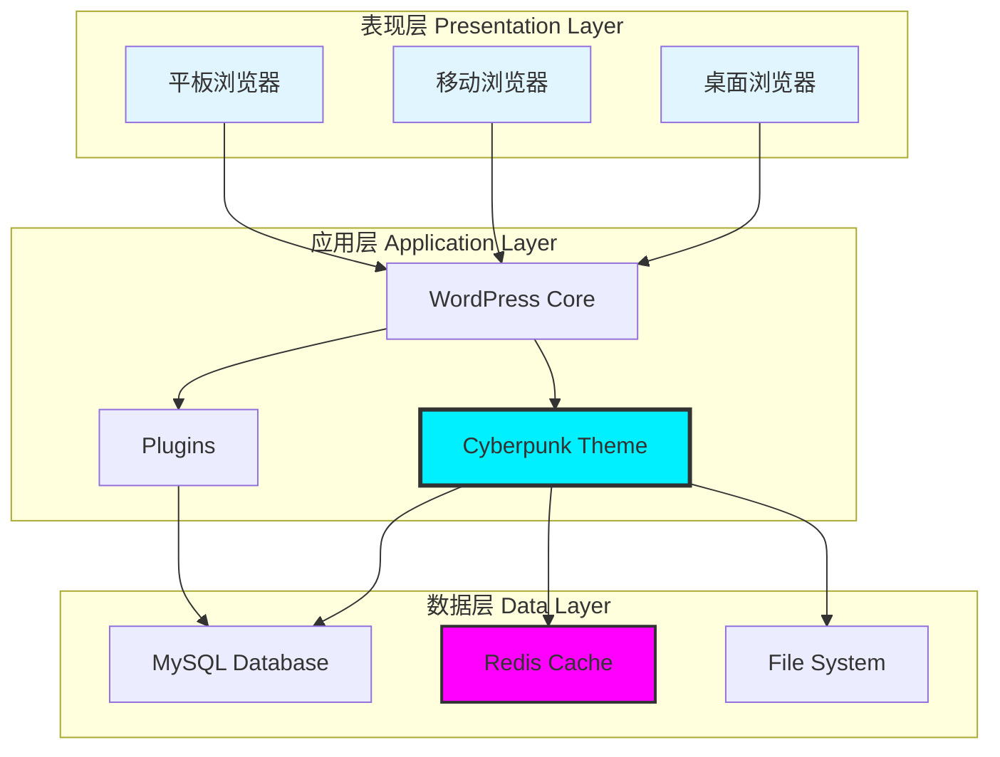

### 微服务化视图

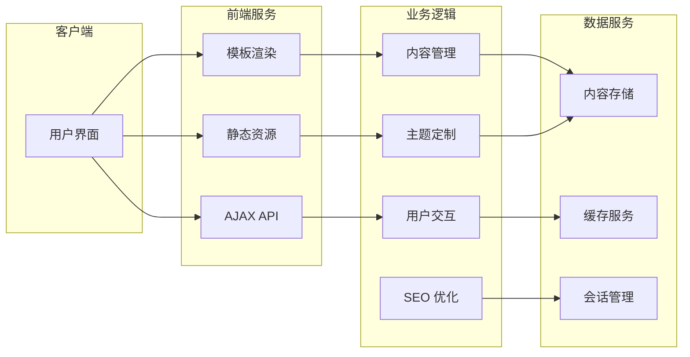

---

## 前端架构

### 前端组件树

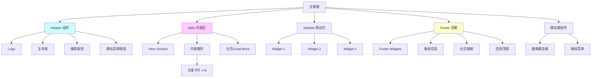

### JavaScript 模块架构

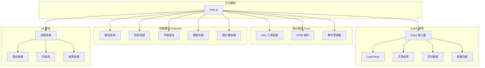

### CSS 架构 (BEM + CSS Variables)

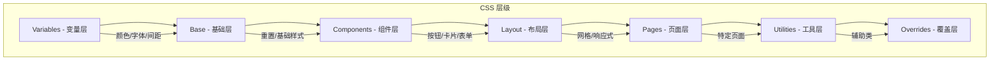

### 组件状态管理

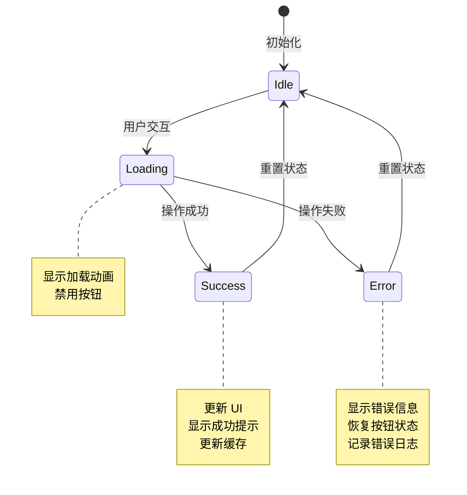

---

## 后端架构

### PHP 类架构

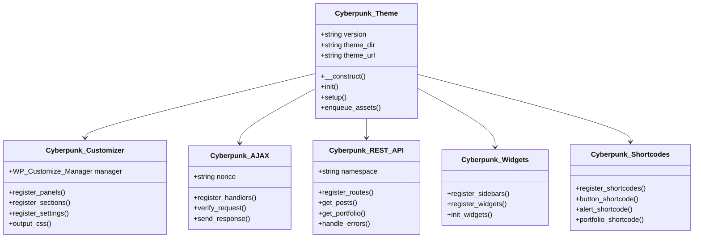

### Hook 系统架构

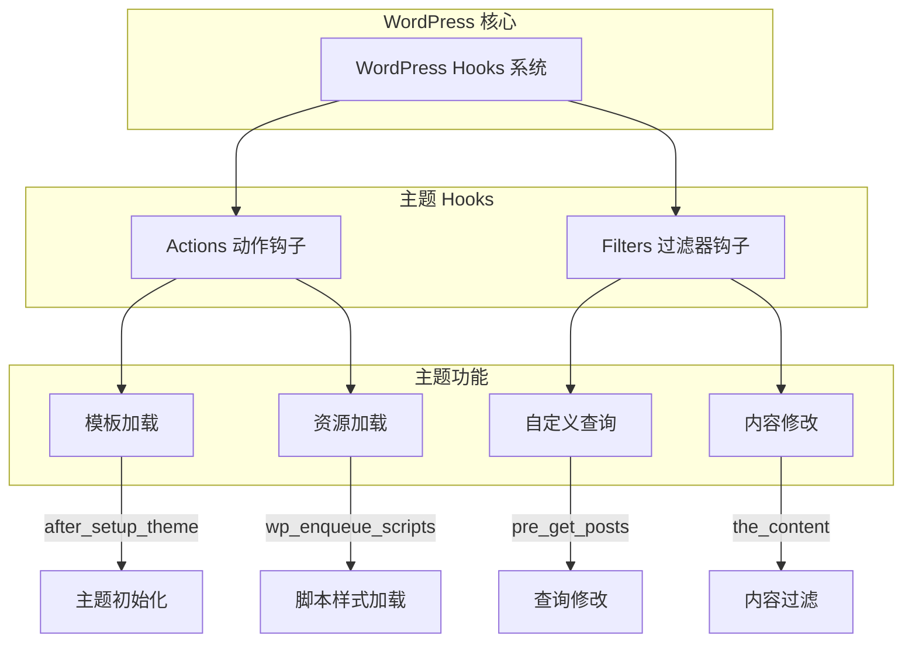

### 模板加载层次

```mermaid
graph TB
    A[WordPress 请求] --> B{模板加载器}

    B -->|首页| C1[index.php / front-page.php]
    B -->|单页| C2[single.php / single-{post-type}.php]
    B -->|页面| C3[page.php / page-{slug}.php]
    B -->|分类| C4[archive.php / category.php / tag.php]
    B -->|自定义| C5[archive-{post-type}.php]
    B -->|搜索| C6[search.php]
    B -->|404| C7[404.php]

    C1 --> D[get_header()]
    C1 --> E[template-parts/]
    C1 --> F[get_footer()]

    D --> D1[header.php]
    F --> F1[footer.php]
```

---

## 数据库架构

### 完整 ER 图

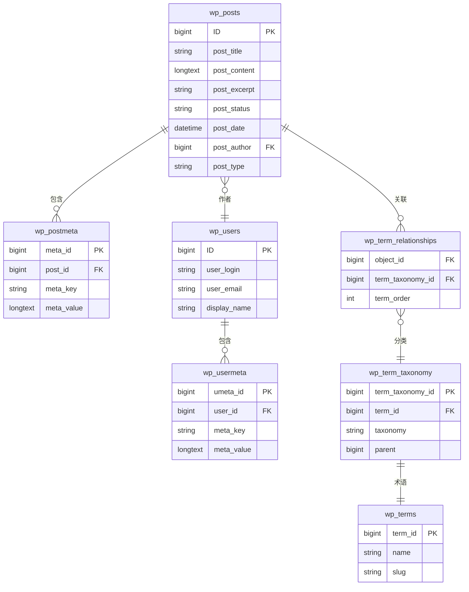

### 数据关系图

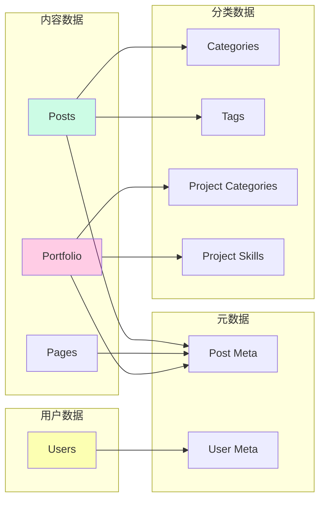

### 索引策略图

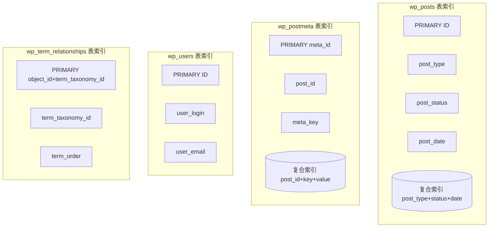

---

## 组件架构

### Widget 系统架构

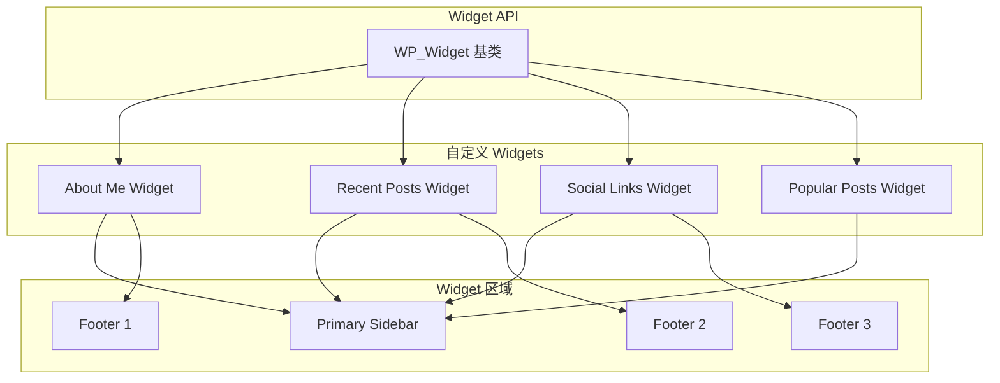

### 短代码系统架构

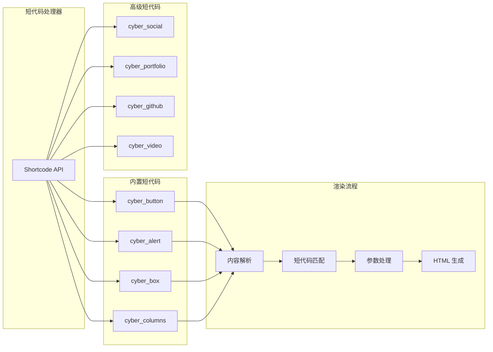

### Portfolio CPT 架构

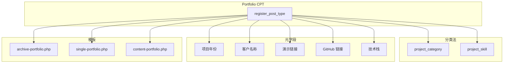

---

## 数据流架构

### HTTP 请求流程

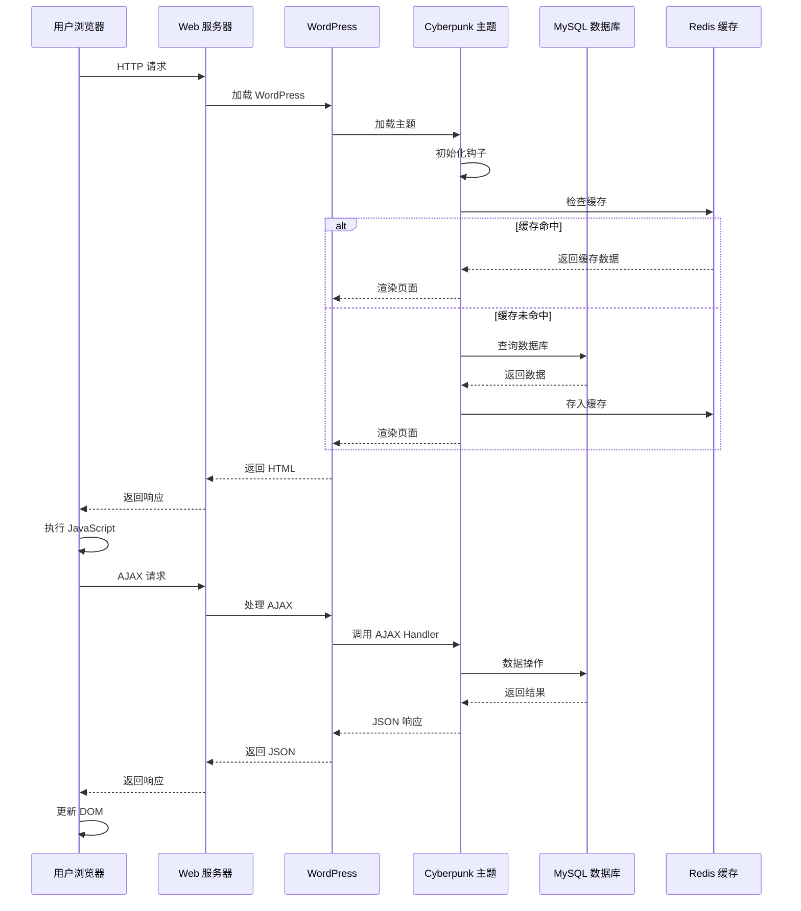

### AJAX 交互流程

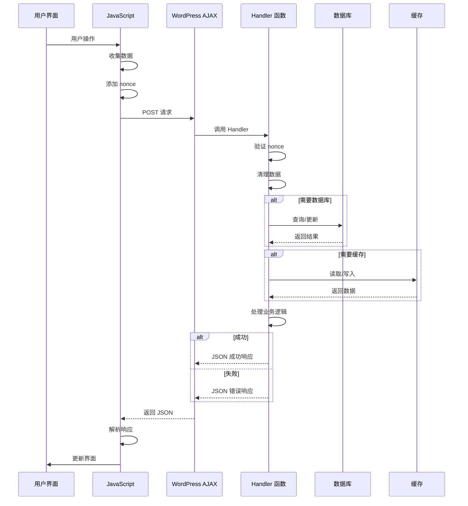

### 主题定制器数据流

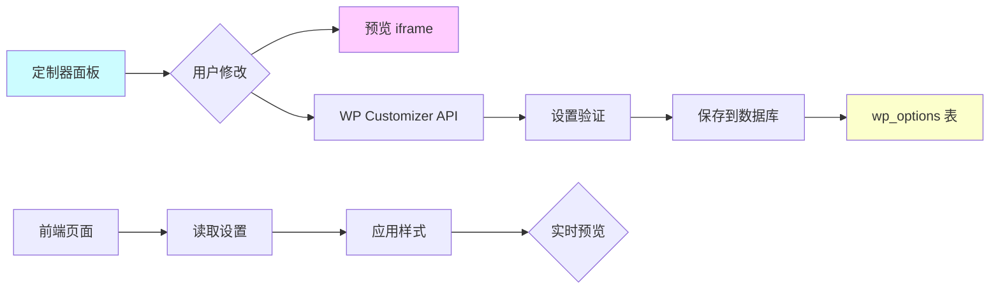

---

## 部署架构

### 生产环境部署

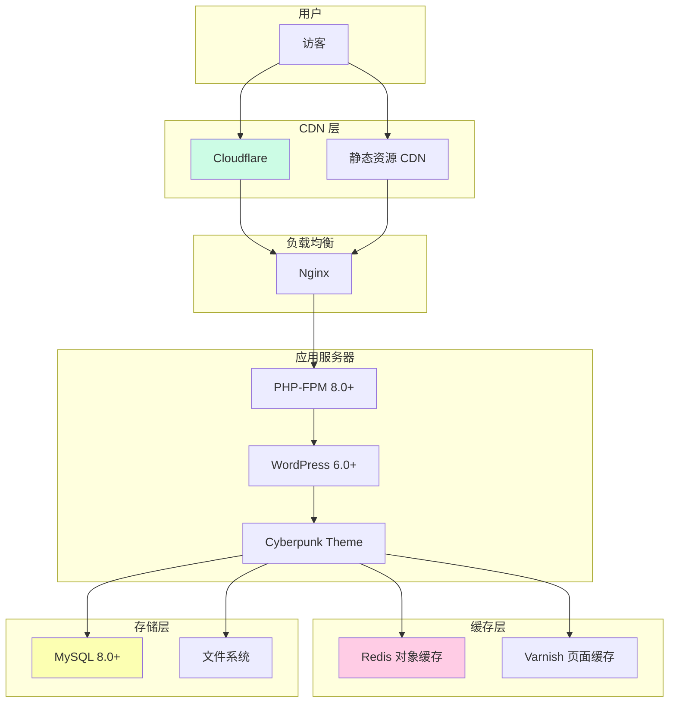

### 开发环境

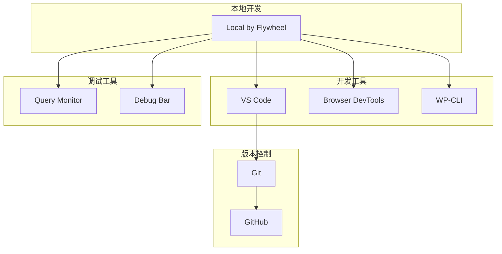

### CI/CD 流程

```mermaid
graph LR
    A[开发人员] --> B[Git Push]
    B --> C[GitHub Actions]

    C --> D[代码检查]
    D --> E{检查通过?}

    E -->|是| F[运行测试]
    E -->|否| G[通知失败]

    F --> H{测试通过?}

    H -->|是| I[构建发布包]
    H -->|否| G

    I --> J[创建 Release]
    J --> K[部署到预发布]
    K --> L{预发布测试}

    L -->|通过| M[部署到生产]
    L -->|失败| N[回滚]

    M --> O[通知成功]

    style G fill:#ff000033
    style O fill:#00ff0033
```

---

## 性能优化架构

### 缓存层级

```mermaid
graph TB
    A[用户请求] --> B{浏览器缓存?}

    B -->|命中| C[返回缓存]
    B -->|未命中| D{CDN 缓存?}

    D -->|命中| C
    D -->|未命中| E{Varnish 缓存?}

    E -->|命中| C
    E -->|未命中| F{Redis 缓存?}

    F -->|命中| C
    F -->|未命中| G[查询数据库]

    G --> H[存入 Redis]
    H --> C

    style C fill:#00ff0033
    style G fill:#ff000033
```

### 图片优化流程

```mermaid
graph LR
    A[原始图片] --> B[上传处理]
    B --> C[生成多个尺寸]
    C --> D[转换为 WebP]
    D --> E[Lazy Loading]
    E --> F[响应式图片 srcset]

    F --> G[显示图片]

    style B fill:#00f0ff33
    style D fill:#ff00ff33
    style E fill:#f0ff0033
```

---

## 安全架构

### 请求验证流程

```mermaid
graph TB
    A[用户请求] --> B{CSRF 检查}
    B -->|失败| C[拒绝访问]
    B -->|通过| D{用户验证}

    D -->|未登录| E{需要登录?}
    D -->|已登录| F{权限检查}

    E -->|是| C
    E -->|否| G[继续处理]

    F -->|无权限| C
    F -->|有权限| G

    G --> H{输入验证}
    H -->|无效| I[返回错误]
    H -->|有效| J[处理请求]

    J --> K{输出转义}
    K -->|完成| L[返回响应]

    style C fill:#ff000033
    style L fill:#00ff0033
```

---

## 监控与日志

### 性能监控架构

```mermaid
graph LR
    A[用户访问] --> B[性能数据收集]
    B --> C[Google Analytics]
    B --> D[PageSpeed Insights]
    B --> E[自建监控]

    E --> F[数据库日志]
    E --> G[错误日志]
    E --> H[性能日志]

    C --> I[分析报告]
    D --> I
    E --> I

    I --> J[优化建议]
    J --> K[实施优化]

    style B fill:#00f0ff33
    style I fill:#ff00ff33
    style K fill:#f0ff0033
```

---

## 总结

这套架构图集提供了 WordPress Cyberpunk Theme 的完整视图：

1. **整体系统架构** - 三层架构和微服务视图
2. **前端架构** - 组件树、模块架构、状态管理
3. **后端架构** - 类架构、Hook 系统、模板加载
4. **数据库架构** - ER 图、数据关系、索引策略
5. **组件架构** - Widget、短代码、CPT
6. **数据流架构** - HTTP 请求、AJAX、定制器
7. **部署架构** - 生产环境、开发环境、CI/CD

---

**文档版本**: 1.0.0
**创建日期**: 2026-02-28
**作者**: Chief Architect
**状态**: ✅ Complete
