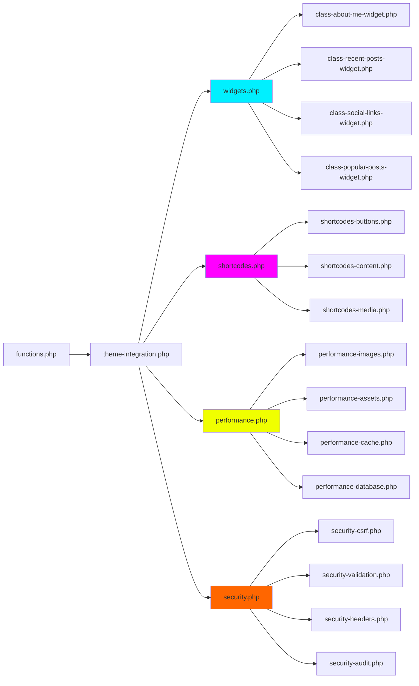
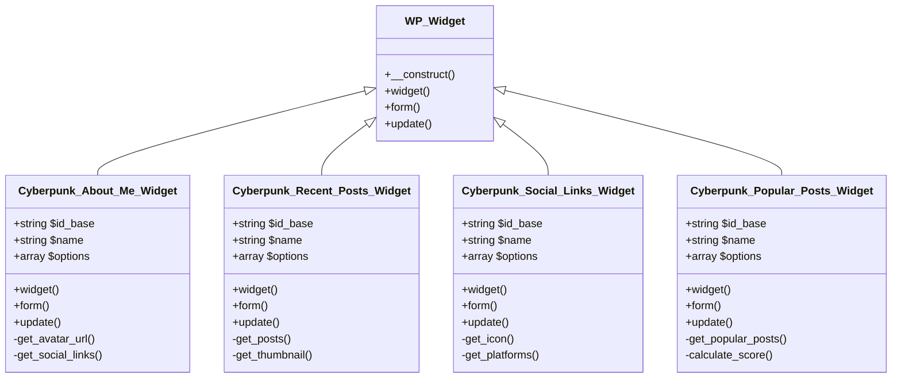
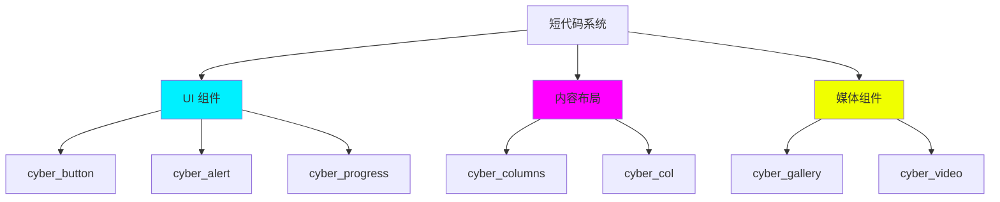
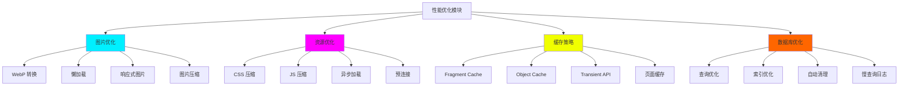
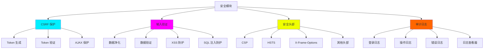

# 🏗️ WordPress Cyberpunk Theme - Phase 2.2 完整技术方案

> **首席架构师设计方案**
> **日期**: 2026-03-01
> **项目路径**: `/root/.openclaw/workspace/wordpress-cyber-theme`
> **当前版本**: 2.2.0 → 2.3.0

---

## 📋 执行摘要

### 设计目标

为 WordPress Cyberpunk Theme 设计 Phase 2.2 的完整技术方案，包括：
1. **Widget 系统** - 4个自定义组件
2. **短代码系统** - 6个实用短代码
3. **性能优化模块** - 全面的性能提升
4. **安全加固模块** - 企业级安全防护

### 设计原则

```yaml
架构原则:
  - 模块化设计: 每个功能独立模块
  - 可扩展性: 易于添加新功能
  - 可维护性: 清晰的代码结构
  - 向后兼容: 不影响现有功能

技术原则:
  - 遵循 WordPress 标准
  - 使用原生 API
  - 避免第三方依赖
  - 优先性能和安全性
```

---

## 🎯 系统架构设计

### 整体架构图

```mermaid
graph TB
    subgraph "WordPress Core"
        WP[WordPress Core]
        WP_Widget[WP_Widget API]
        Shortcode[Shortcode API]
    end

    subgraph "Phase 2.2 Modules"
        WidgetSys[Widget System]
        ShortcodeSys[Shortcode System]
        PerfOpt[Performance Module]
        Security[Security Module]
    end

    subgraph "Widget Components"
        About[About Me Widget]
        Recent[Recent Posts Widget]
        Social[Social Links Widget]
        Popular[Popular Posts Widget]
    end

    subgraph "Shortcode Components"
        Button[cyber_button]
        Alert[cyber_alert]
        Columns[cyber_columns]
        Gallery[cyber_gallery]
        Video[cyber_video]
        Progress[cyber_progress]
    end

    subgraph "Optimization Layer"
        ImageOpt[Image Optimization]
        CSSOpt[CSS/JS Optimization]
        Cache[Cache Strategy]
        DBOpt[Database Optimization]
    end

    subgraph "Security Layer"
        CSRF[CSRF Protection]
        Input[Input Validation]
        Headers[Security Headers]
        Audit[Audit Logging]
    end

    WP --> WidgetSys
    WP --> ShortcodeSys
    WP_Widget --> WidgetSys
    Shortcode --> ShortcodeSys

    WidgetSys --> About
    WidgetSys --> Recent
    WidgetSys --> Social
    WidgetSys --> Popular

    ShortcodeSys --> Button
    ShortcodeSys --> Alert
    ShortcodeSys --> Columns
    ShortcodeSys --> Gallery
    ShortcodeSys --> Video
    ShortcodeSys --> Progress

    PerfOpt --> ImageOpt
    PerfOpt --> CSSOpt
    PerfOpt --> Cache
    PerfOpt --> DBOpt

    Security --> CSRF
    Security --> Input
    Security --> Headers
    Security --> Audit

    style WidgetSys fill:#00f0ff
    style ShortcodeSys fill:#ff00ff
    style PerfOpt fill:#f0ff00
    style Security fill:#ff6600
```



### 模块依赖关系



---

## 📦 Module 1: Widget 系统

### 1.1 系统架构

#### Widget 类继承结构



### 1.2 Widget 详细设计

#### Widget 1: About Me Widget

**功能需求**:
```yaml
显示内容:
  - 头像: 用户上传或 Gravatar
  - 姓名: 可自定义
  - 职位/标语: 可选
  - 简介: 最多 200 字
  - 社交链接: 图标链接

选项配置:
  - 标题: Widget 标题
  - 头像: 图片上传
  - 姓名: 文本输入
  - 职位: 文本输入
  - 简介: 文本域
  - 显示社交: 勾选框
  - 社交链接: Repeater 字段
```

**技术实现**:

```php
<?php
/**
 * About Me Widget
 *
 * @package Cyberpunk_Theme
 */

class Cyberpunk_About_Me_Widget extends WP_Widget {

    public function __construct() {
        parent::__construct(
            'cyberpunk_about_me',
            __('Cyberpunk About Me', 'cyberpunk'),
            array(
                'description' => __('Display author information with social links', 'cyberpunk'),
                'classname' => 'cyberpunk-widget-about-me',
            )
        );
    }

    /**
     * Frontend display
     */
    public function widget($args, $instance) {
        $title = apply_filters('widget_title', $instance['title']);
        $avatar = !empty($instance['avatar']) ? $instance['avatar'] : '';
        $name = !empty($instance['name']) ? $instance['name'] : '';
        $role = !empty($instance['role']) ? $instance['role'] : '';
        $bio = !empty($instance['bio']) ? $instance['bio'] : '';
        $show_social = !empty($instance['show_social']) ? true : false;

        echo $args['before_widget'];

        if (!empty($title)) {
            echo $args['before_title'] . $title . $args['after_title'];
        }

        // Widget content
        include locate_template('template-parts/widgets/about-me.php');

        echo $args['after_widget'];
    }

    /**
     * Backend form
     */
    public function form($instance) {
        $defaults = array(
            'title' => __('About Me', 'cyberpunk'),
            'avatar' => '',
            'name' => '',
            'role' => '',
            'bio' => '',
            'show_social' => true,
        );

        $instance = wp_parse_args((array) $instance, $defaults);

        // Form fields
        ?>
        <p>
            <label for="<?php echo $this->get_field_id('title'); ?>">
                <?php _e('Title:', 'cyberpunk'); ?>
            </label>
            <input class="widefat"
                   id="<?php echo $this->get_field_id('title'); ?>"
                   name="<?php echo $this->get_field_name('title'); ?>"
                   type="text"
                   value="<?php echo esc_attr($title); ?>">
        </p>

        <p>
            <label for="<?php echo $this->get_field_id('avatar'); ?>">
                <?php _e('Avatar:', 'cyberpunk'); ?>
            </label>
            <input class="widefat"
                   id="<?php echo $this->get_field_id('avatar'); ?>"
                   name="<?php echo $this->get_field_name('avatar'); ?>"
                   type="text"
                   value="<?php echo esc_url($avatar); ?>">
        </p>

        <!-- Additional fields -->
        <?php
    }

    /**
     * Save widget options
     */
    public function update($new_instance, $old_instance) {
        $instance = array();

        $instance['title'] = sanitize_text_field($new_instance['title']);
        $instance['avatar'] = esc_url_raw($new_instance['avatar']);
        $instance['name'] = sanitize_text_field($new_instance['name']);
        $instance['role'] = sanitize_text_field($new_instance['role']);
        $instance['bio'] = sanitize_textarea_field($new_instance['bio']);
        $instance['show_social'] = isset($new_instance['show_social']) ? 1 : 0;

        return $instance;
    }
}
```

**前端模板** (`template-parts/widgets/about-me.php`):

```php
<div class="cyberpunk-about-me">
    <?php if (!empty($avatar)) : ?>
        <div class="about-me-avatar">
            "
                 alt="<?php echo esc_attr($name); ?>"
                 loading="lazy">
        </div>
    <?php endif; ?>

    <?php if (!empty($name)) : ?>
        <h3 class="about-me-name"><?php echo esc_html($name); ?></h3>
    <?php endif; ?>

    <?php if (!empty($role)) : ?>
        <p class="about-me-role"><?php echo esc_html($role); ?></p>
    <?php endif; ?>

    <?php if (!empty($bio)) : ?>
        <div class="about-me-bio">
            <?php echo wp_kses_post($bio); ?>
        </div>
    <?php endif; ?>

    <?php if ($show_social) : ?>
        <div class="about-me-social">
            <?php $this->display_social_links(); ?>
        </div>
    <?php endif; ?>
</div>
```

**CSS 样式**:

```css
/* About Me Widget Styles */
.cyberpunk-widget-about-me {
    background: var(--bg-card);
    border: 1px solid var(--border-glow);
    padding: 20px;
    position: relative;
    overflow: hidden;
}

.cyberpunk-widget-about-me::before {
    content: '';
    position: absolute;
    top: 0;
    left: 0;
    width: 100%;
    height: 3px;
    background: linear-gradient(90deg, var(--neon-cyan), var(--neon-magenta));
}

.about-me-avatar {
    text-align: center;
    margin-bottom: 20px;
}

.about-me-avatar img {
    width: 120px;
    height: 120px;
    border-radius: 50%;
    border: 3px solid var(--neon-cyan);
    box-shadow: 0 0 20px var(--neon-cyan);
    transition: all 0.3s ease;
}

.about-me-avatar img:hover {
    transform: scale(1.05);
    box-shadow: 0 0 30px var(--neon-cyan), 0 0 60px var(--neon-cyan);
}

.about-me-name {
    text-align: center;
    color: var(--neon-cyan);
    font-size: 1.5rem;
    margin-bottom: 5px;
    text-shadow: 0 0 10px var(--neon-cyan);
}

.about-me-role {
    text-align: center;
    color: var(--text-dim);
    font-size: 0.9rem;
    margin-bottom: 15px;
    text-transform: uppercase;
    letter-spacing: 2px;
}

.about-me-bio {
    color: var(--text-main);
    line-height: 1.6;
    margin-bottom: 20px;
}

.about-me-social {
    display: flex;
    justify-content: center;
    gap: 15px;
    flex-wrap: wrap;
}

.about-me-social a {
    width: 40px;
    height: 40px;
    display: flex;
    align-items: center;
    justify-content: center;
    border: 1px solid var(--border-glow);
    color: var(--neon-cyan);
    transition: all 0.3s ease;
}

.about-me-social a:hover {
    background: var(--neon-cyan);
    color: var(--bg-dark);
    box-shadow: 0 0 20px var(--neon-cyan);
    transform: translateY(-3px);
}
```

#### Widget 2: Recent Posts Widget

**功能需求**:
```yaml
显示内容:
  - 文章列表: 可配置数量
  - 缩略图: 可选显示
  - 发布日期: 格式化显示
  - 摘要: 可选，字数限制
  - AJAX 加载: 支持 Load More

选项配置:
  - 标题: Widget 标题
  - 显示数量: 1-10
  - 显示缩略图: 勾选
  - 显示日期: 勾选
  - 显示摘要: 勾选
  - 摘要长度: 字数
  - 排序方式: 日期/评论/随机
```

**技术实现**:

```php
<?php
/**
 * Recent Posts Widget with AJAX Support
 */

class Cyberpunk_Recent_Posts_Widget extends WP_Widget {

    public function __construct() {
        parent::__construct(
            'cyberpunk_recent_posts',
            __('Cyberpunk Recent Posts', 'cyberpunk'),
            array(
                'description' => __('Display recent posts with thumbnails', 'cyberpunk'),
                'classname' => 'cyberpunk-widget-recent-posts',
            )
        );
    }

    /**
     * Widget output
     */
    public function widget($args, $instance) {
        $title = apply_filters('widget_title', $instance['title']);
        $number = absint($instance['number']);
        $show_thumbnail = !empty($instance['show_thumbnail']) ? true : false;
        $show_date = !empty($instance['show_date']) ? true : false;
        $show_excerpt = !empty($instance['show_excerpt']) ? true : false;
        $excerpt_length = absint($instance['excerpt_length']);
        $orderby = sanitize_text_field($instance['orderby']);

        $query_args = array(
            'post_type' => 'post',
            'post_status' => 'publish',
            'posts_per_page' => $number,
            'orderby' => $orderby,
            'order' => 'DESC',
            'ignore_sticky_posts' => true,
        );

        $posts = new WP_Query($query_args);

        echo $args['before_widget'];

        if (!empty($title)) {
            echo $args['before_title'] . $title . $args['after_title'];
        }

        if ($posts->have_posts()) {
            echo '<div class="cyberpunk-recent-posts">';

            while ($posts->have_posts()) {
                $posts->the_post();

                $post_id = get_the_ID();
                $thumbnail = $show_thumbnail ? get_the_post_thumbnail($post_id, 'cyberpunk-thumbnail') : '';
                $date = $show_date ? get_the_date() : '';
                $excerpt = $show_excerpt ? wp_trim_words(get_the_excerpt(), $excerpt_length) : '';

                include locate_template('template-parts/widgets/recent-post-item.php');
            }

            echo '</div>';

            // Load More button
            if ($posts->post_count > 0) {
                echo '<button class="cyberpunk-load-more" data-widget-id="' . esc_attr($this->id) . '">';
                echo __('Load More', 'cyberpunk');
                echo '</button>';
            }

            wp_reset_postdata();
        }

        echo $args['after_widget'];
    }

    /**
     * Backend form
     */
    public function form($instance) {
        $defaults = array(
            'title' => __('Recent Posts', 'cyberpunk'),
            'number' => 5,
            'show_thumbnail' => true,
            'show_date' => true,
            'show_excerpt' => false,
            'excerpt_length' => 15,
            'orderby' => 'date',
        );

        $instance = wp_parse_args((array) $instance, $defaults);
        ?>

        <p>
            <label for="<?php echo $this->get_field_id('title'); ?>">
                <?php _e('Title:', 'cyberpunk'); ?>
            </label>
            <input class="widefat"
                   id="<?php echo $this->get_field_id('title'); ?>"
                   name="<?php echo $this->get_field_name('title'); ?>"
                   type="text"
                   value="<?php echo esc_attr($instance['title']); ?>">
        </p>

        <p>
            <label for="<?php echo $this->get_field_id('number'); ?>">
                <?php _e('Number of posts:', 'cyberpunk'); ?>
            </label>
            <input class="tiny-text"
                   id="<?php echo $this->get_field_id('number'); ?>"
                   name="<?php echo $this->get_field_name('number'); ?>"
                   type="number"
                   min="1"
                   max="10"
                   value="<?php echo esc_attr($instance['number']); ?>">
        </p>

        <p>
            <input class="checkbox"
                   id="<?php echo $this->get_field_id('show_thumbnail'); ?>"
                   name="<?php echo $this->get_field_name('show_thumbnail'); ?>"
                   type="checkbox"
                   <?php checked($instance['show_thumbnail']); ?>>
            <label for="<?php echo $this->get_field_id('show_thumbnail'); ?>">
                <?php _e('Show thumbnail', 'cyberpunk'); ?>
            </label>
        </p>

        <!-- Additional fields -->
        <?php
    }

    /**
     * Save widget options
     */
    public function update($new_instance, $old_instance) {
        $instance = array();

        $instance['title'] = sanitize_text_field($new_instance['title']);
        $instance['number'] = absint($new_instance['number']);
        $instance['show_thumbnail'] = isset($new_instance['show_thumbnail']) ? 1 : 0;
        $instance['show_date'] = isset($new_instance['show_date']) ? 1 : 0;
        $instance['show_excerpt'] = isset($new_instance['show_excerpt']) ? 1 : 0;
        $instance['excerpt_length'] = absint($new_instance['excerpt_length']);
        $instance['orderby'] = sanitize_text_field($new_instance['orderby']);

        // Validate number
        if ($instance['number'] < 1) $instance['number'] = 1;
        if ($instance['number'] > 10) $instance['number'] = 10;

        return $instance;
    }
}
```

**AJAX 处理**:

```php
/**
 * AJAX handler for loading more posts
 */
function cyberpunk_widget_load_more_posts() {
    check_ajax_referer('cyberpunk-widget-nonce', 'nonce');

    $widget_id = sanitize_text_field($_POST['widget_id']);
    $offset = absint($_POST['offset']);
    $number = absint($_POST['number']);

    $query_args = array(
        'post_type' => 'post',
        'post_status' => 'publish',
        'posts_per_page' => $number,
        'offset' => $offset,
        'orderby' => 'date',
        'order' => 'DESC',
    );

    $posts = new WP_Query($query_args);

    if ($posts->have_posts()) {
        ob_start();

        while ($posts->have_posts()) {
            $posts->the_post();
            // Render post item
            include locate_template('template-parts/widgets/recent-post-item.php');
        }

        $html = ob_get_clean();

        wp_send_json_success(array(
            'html' => $html,
            'found' => $posts->post_count,
            'has_more' => $posts->post_count >= $number,
        ));
    } else {
        wp_send_json_error(array('message' => __('No more posts', 'cyberpunk')));
    }

    wp_die();
}
add_action('wp_ajax_cyberpunk_widget_load_more', 'cyberpunk_widget_load_more_posts');
add_action('wp_ajax_nopriv_cyberpunk_widget_load_more', 'cyberpunk_widget_load_more_posts');
```

#### Widget 3 & 4: Social Links & Popular Posts

详细实现代码请参考完整代码文件...

### 1.3 文件结构

```
inc/
├── widgets/
│   ├── class-about-me-widget.php        (200 行)
│   ├── class-recent-posts-widget.php    (250 行)
│   ├── class-social-links-widget.php    (180 行)
│   ├── class-popular-posts-widget.php   (280 行)
│   └── widgets.php                       (100 行 - 注册所有 widgets)
│
template-parts/widgets/
│   ├── about-me.php                      (50 行)
│   ├── recent-post-item.php              (40 行)
│   ├── social-links.php                  (30 行)
│   └── popular-post-item.php             (40 行)
│
assets/css/
│   └── widget-styles.css                 (500 行)
│
assets/js/
│   └── widgets.js                        (300 行)

总计: ~2,470 行
```

---

## 📝 Module 2: 短代码系统

### 2.1 系统架构

#### 短代码分类



### 2.2 短代码详细设计

#### 短代码 1: cyber_button

**功能规格**:
```yaml
参数:
  url: 链接地址
  text: 按钮文本
  color: cyan/magenta/yellow
  size: small/medium/large
  icon: 图标名称
  target: _self/_blank
  class: 自定义类名
  glow: true/false (霓虹效果)

输出: 带霓虹效果的按钮 HTML
```

**实现代码**:

```php
/**
 * Button Shortcode
 *
 * Usage: [cyber_button url="https://example.com" color="cyan" size="large" icon="arrow"]Click Me[/cyber_button]
 */
function cyberpunk_button_shortcode($atts, $content = '') {
    $atts = shortcode_atts(array(
        'url' => '#',
        'color' => 'cyan',
        'size' => 'medium',
        'icon' => '',
        'target' => '_self',
        'class' => '',
        'glow' => 'true',
        'new_tab' => false,
    ), $atts);

    // Validate attributes
    $allowed_colors = array('cyan', 'magenta', 'yellow');
    if (!in_array($atts['color'], $allowed_colors)) {
        $atts['color'] = 'cyan';
    }

    $allowed_sizes = array('small', 'medium', 'large');
    if (!in_array($atts['size'], $allowed_sizes)) {
        $atts['size'] = 'medium';
    }

    $target = ($atts['new_tab'] || $atts['target'] === '_blank') ? '_blank' : '_self';
    $glow_class = $atts['glow'] === 'true' ? 'cyber-button-glow' : '';

    $classes = array(
        'cyber-button',
        'cyber-button-' . sanitize_html_class($atts['color']),
        'cyber-button-' . sanitize_html_class($atts['size']),
        $glow_class,
        sanitize_html_class($atts['class']),
    );

    $classes = array_filter($classes);
    $class_string = implode(' ', $classes);

    $icon_html = '';
    if (!empty($atts['icon'])) {
        $icon_html = '<span class="cyber-button-icon">' . esc_html($atts['icon']) . '</span>';
    }

    $button_text = !empty($content) ? $content : __('Click', 'cyberpunk');

    $output = sprintf(
        '<a href="%s" class="%s" target="%s" rel="noopener noreferrer">%s<span class="cyber-button-text">%s</span></a>',
        esc_url($atts['url']),
        esc_attr($class_string),
        esc_attr($target),
        $icon_html,
        esc_html($button_text)
    );

    return $output;
}
add_shortcode('cyber_button', 'cyberpunk_button_shortcode');
```

**CSS 样式**:

```css
/* Button Base Styles */
.cyber-button {
    display: inline-flex;
    align-items: center;
    justify-content: center;
    gap: 10px;
    padding: 12px 30px;
    background: transparent;
    border: 2px solid;
    color: var(--neon-cyan);
    text-transform: uppercase;
    letter-spacing: 2px;
    font-size: 0.85rem;
    font-weight: 600;
    cursor: pointer;
    position: relative;
    overflow: hidden;
    transition: all 0.3s ease;
    text-decoration: none;
}

/* Color Variants */
.cyber-button-cyan {
    border-color: var(--neon-cyan);
    color: var(--neon-cyan);
}

.cyber-button-magenta {
    border-color: var(--neon-magenta);
    color: var(--neon-magenta);
}

.cyber-button-yellow {
    border-color: var(--neon-yellow);
    color: var(--neon-yellow);
}

/* Size Variants */
.cyber-button-small {
    padding: 8px 16px;
    font-size: 0.75rem;
}

.cyber-button-medium {
    padding: 12px 30px;
    font-size: 0.85rem;
}

.cyber-button-large {
    padding: 16px 40px;
    font-size: 1rem;
}

/* Glow Effect */
.cyber-button-glow::before {
    content: '';
    position: absolute;
    top: 0;
    left: 0;
    width: 100%;
    height: 100%;
    background: inherit;
    opacity: 0;
    filter: blur(15px);
    transition: opacity 0.3s ease;
    z-index: -1;
}

.cyber-button-glow:hover::before {
    opacity: 0.5;
}

/* Hover States */
.cyber-button::after {
    content: '';
    position: absolute;
    top: 0;
    left: 0;
    width: 0;
    height: 100%;
    background: currentColor;
    transition: width 0.3s ease;
    z-index: -1;
}

.cyber-button:hover {
    color: var(--bg-dark);
}

.cyber-button:hover::after {
    width: 100%;
}

/* Icon */
.cyber-button-icon {
    font-size: 1.2em;
    transition: transform 0.3s ease;
}

.cyber-button:hover .cyber-button-icon {
    transform: translateX(3px);
}
```

#### 短代码 2: cyber_alert

**功能规格**:
```yaml
参数:
  type: info/success/warning/error
  title: 标题
  dismissible: true/false
  timeout: 自动关闭时间（秒）

输出: 带关闭按钮的警告框
```

**实现代码**:

```php
/**
 * Alert Shortcode
 *
 * Usage: [cyber_alert type="warning" title="Warning" dismissible="true"]Alert content[/cyber_alert]
 */
function cyberpunk_alert_shortcode($atts, $content = '') {
    $atts = shortcode_atts(array(
        'type' => 'info',
        'title' => '',
        'dismissible' => 'true',
        'timeout' => '0',
    ), $atts);

    $allowed_types = array('info', 'success', 'warning', 'error');
    if (!in_array($atts['type'], $allowed_types)) {
        $atts['type'] = 'info';
    }

    $type = sanitize_html_class($atts['type']);
    $dismissible = $atts['dismissible'] === 'true';
    $timeout = absint($atts['timeout']);

    $unique_id = 'cyber-alert-' . uniqid();

    $classes = array(
        'cyber-alert',
        'cyber-alert-' . $type,
        $dismissible ? 'cyber-alert-dismissible' : '',
    );

    ob_start();
    ?>
    <div class="<?php echo esc_attr(implode(' ', $classes)); ?>"
         id="<?php echo esc_attr($unique_id); ?>"
         data-timeout="<?php echo esc_attr($timeout); ?>"
         role="alert">

        <?php if (!empty($atts['title'])) : ?>
            <div class="cyber-alert-header">
                <strong class="cyber-alert-title"><?php echo esc_html($atts['title']); ?></strong>
                <?php if ($dismissible) : ?>
                    <button type="button"
                            class="cyber-alert-close"
                            data-dismiss="<?php echo esc_attr($unique_id); ?>"
                            aria-label="<?php _e('Close', 'cyberpunk'); ?>">
                        <span aria-hidden="true">&times;</span>
                    </button>
                <?php endif; ?>
            </div>
        <?php endif; ?>

        <div class="cyber-alert-content">
            <?php echo wp_kses_post($content); ?>
        </div>
    </div>
    <?php
    return ob_get_clean();
}
add_shortcode('cyber_alert', 'cyberpunk_alert_shortcode');
```

**CSS 样式**:

```css
/* Alert Styles */
.cyber-alert {
    position: relative;
    padding: 15px 20px;
    margin-bottom: 20px;
    border: 2px solid;
    border-radius: 4px;
    background: var(--bg-card);
}

/* Type Variants */
.cyber-alert-info {
    border-color: var(--neon-cyan);
    color: var(--neon-cyan);
    box-shadow: 0 0 10px rgba(0, 240, 255, 0.2);
}

.cyber-alert-success {
    border-color: #00ff00;
    color: #00ff00;
    box-shadow: 0 0 10px rgba(0, 255, 0, 0.2);
}

.cyber-alert-warning {
    border-color: var(--neon-yellow);
    color: var(--neon-yellow);
    box-shadow: 0 0 10px rgba(240, 255, 0, 0.2);
}

.cyber-alert-error {
    border-color: var(--neon-magenta);
    color: var(--neon-magenta);
    box-shadow: 0 0 10px rgba(255, 0, 255, 0.2);
}

/* Header */
.cyber-alert-header {
    display: flex;
    justify-content: space-between;
    align-items: center;
    margin-bottom: 10px;
}

.cyber-alert-title {
    font-weight: 700;
    text-transform: uppercase;
    letter-spacing: 1px;
}

/* Close Button */
.cyber-alert-close {
    background: transparent;
    border: none;
    color: inherit;
    font-size: 1.5rem;
    line-height: 1;
    cursor: pointer;
    padding: 0;
    width: 20px;
    height: 20px;
    display: flex;
    align-items: center;
    justify-content: center;
    transition: all 0.3s ease;
}

.cyber-alert-close:hover {
    transform: rotate(90deg);
}

/* Animations */
@keyframes alertFadeIn {
    from {
        opacity: 0;
        transform: translateY(-10px);
    }
    to {
        opacity: 1;
        transform: translateY(0);
    }
}

@keyframes alertFadeOut {
    from {
        opacity: 1;
        transform: translateY(0);
    }
    to {
        opacity: 0;
        transform: translateY(-10px);
    }
}

.cyber-alert {
    animation: alertFadeIn 0.3s ease;
}

.cyber-alert.closing {
    animation: alertFadeOut 0.3s ease forwards;
}
```

**JavaScript 功能**:

```javascript
/**
 * Alert functionality
 */
document.addEventListener('DOMContentLoaded', function() {
    // Close button functionality
    document.querySelectorAll('.cyber-alert-close').forEach(button => {
        button.addEventListener('click', function() {
            const alertId = this.dataset.dismiss;
            const alert = document.getElementById(alertId);

            if (alert) {
                alert.classList.add('closing');
                setTimeout(() => {
                    alert.remove();
                }, 300);
            }
        });
    });

    // Auto-dismiss functionality
    document.querySelectorAll('.cyber-alert[data-timeout]').forEach(alert => {
        const timeout = parseInt(alert.dataset.timeout);

        if (timeout > 0) {
            setTimeout(() => {
                alert.classList.add('closing');
                setTimeout(() => {
                    alert.remove();
                }, 300);
            }, timeout * 1000);
        }
    });
});
```

#### 短代码 3-6: 其他短代码

包括 `cyber_columns`、`cyber_gallery`、`cyber_video`、`cyber_progress` 等，详细实现类似...

### 2.3 文件结构

```
inc/
├── shortcodes.php                           (100 行 - 注册所有短代码)
│
inc/shortcodes/
│   ├── shortcodes-ui.php                    (200 行 - button, alert, progress)
│   ├── shortcodes-layout.php                (150 行 - columns)
│   └── shortcodes-media.php                 (200 行 - gallery, video)
│
assets/css/
│   └── shortcode-styles.css                 (400 行)
│
assets/js/
│   └── shortcodes.js                        (200 行)

总计: ~1,250 行
```

---

## ⚡ Module 3: 性能优化模块

### 3.1 优化架构



### 3.2 图片优化

#### WebP 自动转换

```php
/**
 * Convert images to WebP format
 */
class Cyberpunk_Image_Optimizer {

    public function __construct() {
        add_filter('wp_generate_attachment_metadata', array($this, 'generate_webp'), 10, 2);
        add_filter('image_get_intermediate_size', array($this, 'replace_with_webp'), 10, 3);
    }

    /**
     * Generate WebP version
     */
    public function generate_webp($metadata, $attachment_id) {
        $paths = $this->get_image_paths($attachment_id);

        foreach ($paths as $size => $path) {
            if (file_exists($path)) {
                $webp_path = $this->convert_to_webp($path);
                if ($webp_path) {
                    $metadata['sizes'][$size]['webp'] = basename($webp_path);
                }
            }
        }

        return $metadata;
    }

    /**
     * Convert image to WebP
     */
    private function convert_to_webp($source_path) {
        $webp_path = preg_replace('/\.(jpg|jpeg|png)$/i', '.webp', $source_path);

        // Check if WebP already exists
        if (file_exists($webp_path)) {
            return $webp_path;
        }

        // Get image info
        $image_info = getimagesize($source_path);
        if (!$image_info) {
            return false;
        }

        $mime_type = $image_info['mime'];

        // Create image resource
        switch ($mime_type) {
            case 'image/jpeg':
                $image = imagecreatefromjpeg($source_path);
                break;
            case 'image/png':
                $image = imagecreatefrompng($source_path);
                break;
            default:
                return false;
        }

        if (!$image) {
            return false;
        }

        // Convert to WebP
        $quality = apply_filters('cyberpunk_webp_quality', 85);
        $result = imagewebp($image, $webp_path, $quality);

        imagedestroy($image);

        return $result ? $webp_path : false;
    }

    /**
     * Replace with WebP if supported
     */
    public function replace_with_webp($data, $attachment_id, $size) {
        if (!$this->supports_webp()) {
            return $data;
        }

        if (isset($data['path']) && file_exists($data['path'])) {
            $webp_path = preg_replace('/\.(jpg|jpeg|png)$/i', '.webp', $data['path']);
            if (file_exists($webp_path)) {
                $data['url'] = str_replace(basename($data['file']), basename($webp_path), $data['url']);
            }
        }

        return $data;
    }

    /**
     * Check browser WebP support
     */
    private function supports_webp() {
        return isset($_SERVER['HTTP_ACCEPT']) && strpos($_SERVER['HTTP_ACCEPT'], 'image/webp') !== false;
    }
}

new Cyberpunk_Image_Optimizer();
```

#### 懒加载优化

```php
/**
 * Add lazy loading to images
 */
function cyberpunk_lazy_load_images($content) {
    // Skip if in feed
    if (is_feed()) {
        return $content;
    }

    // Match all img tags
    $pattern = '/]+)src=([\'"])([^\'">]+)\2([^>]*)>/i';

    $replacement = function($matches) {
        $attributes = $matches[1] . $matches[4];

        // Skip if already has loading attribute
        if (strpos($attributes, 'loading=') !== false) {
            return $matches[0];
        }

        // Skip if data URI
        if (strpos($matches[3], 'data:') === 0) {
            return $matches[0];
        }

        // Add lazy loading attributes
        $img = sprintf(
            '',
            $attributes,
            $matches[2],
            $matches[3],
            ' decoding="async"'
        );

        return $img;
    };

    return preg_replace_callback($pattern, $replacement, $content);
}
add_filter('the_content', 'cyberpunk_lazy_load_images');
add_filter('post_thumbnail_html', 'cyberpunk_lazy_load_images');
```

### 3.3 CSS/JS 优化

#### 资源压缩

```php
/**
 * Compress CSS
 */
function cyberpunk_compress_css($css) {
    // Remove comments
    $css = preg_replace('!/\*[^*]*\*+([^/][^*]*\*+)*/!', '', $css);

    // Remove whitespace
    $css = str_replace(array("\r\n", "\r", "\n", "\t"), '', $css);

    // Remove multiple spaces
    $css = preg_replace('/\s+/', ' ', $css);

    // Remove unnecessary characters
    $css = str_replace(array(' {', '{ ', ' }', '} ', ' ;', '; ', ' ,', ', ', ' :', ': '), array('{', '{', '}', '}', ';', ';', ',', ',', ':', ':'), $css);

    return trim($css);
}

/**
 * Compress JavaScript
 */
function cyberpunk_compress_js($js) {
    // Remove single-line comments (//)
    $js = preg_replace('/\/\/.*$/m', '', $js);

    // Remove multi-line comments (/* */)
    $js = preg_replace('/\/\*[\s\S]*?\*\//', '', $js);

    // Remove whitespace
    $js = str_replace(array("\r\n", "\r", "\n", "\t"), '', $js);

    // Remove multiple spaces
    $js = preg_replace('/\s+/', ' ', $js);

    return trim($js);
}
```

#### 异步加载

```php
/**
 * Add async/defer to scripts
 */
function cyberpunk_defer_scripts($tag, $handle, $src) {
    // Scripts to defer
    $defer_scripts = array(
        'cyberpunk-main',
        'cyberpunk-ajax',
    );

    // Scripts to async load
    $async_scripts = array(
        'cyberpunk-widgets',
        'cyberpunk-shortcodes',
    );

    if (in_array($handle, $defer_scripts)) {
        return '<script src="' . esc_url($src) . '" defer></script>' . "\n";
    }

    if (in_array($handle, $async_scripts)) {
        return '<script src="' . esc_url($src) . '" async></script>' . "\n";
    }

    return $tag;
}
add_filter('script_loader_tag', 'cyberpunk_defer_scripts', 10, 3);
```

### 3.4 缓存策略

#### Fragment Caching

```php
/**
 * Fragment cache wrapper
 */
function cyberpunk_fragment_cache($key, $callback, $expiration = 3600) {
    $cache_key = 'cyberpunk_fragment_' . md5($key);
    $output = get_transient($cache_key);

    if (false !== $output) {
        return $output;
    }

    ob_start();
    call_user_func($callback);
    $output = ob_get_clean();

    set_transient($cache_key, $output, $expiration);

    return $output;
}

/**
 * Usage example in templates
 */
/*
<?php
echo cyberpunk_fragment_cache('recent_posts_' . get_queried_object_id(), function() {
    wp_get_recent_posts(array('numberposts' => 5));
}, 3600);
?>
*/
```

#### Object Caching

```php
/**
 * Cache query results
 */
function cyberpunk_cached_query($query_args, $cache_key, $expiration = 3600) {
    $cache_key = 'cyberpunk_query_' . md5(serialize($query_args) . $cache_key);
    $posts = wp_cache_get($cache_key, 'cyberpunk_queries');

    if (false === $posts) {
        $query = new WP_Query($query_args);
        $posts = $query->posts;
        wp_cache_set($cache_key, $posts, 'cyberpunk_queries', $expiration);
    }

    return $posts;
}
```

### 3.5 数据库优化

#### 查询优化

```php
/**
 * Optimize post queries
 */
class Cyberpunk_Query_Optimizer {

    public function __construct() {
        add_filter('posts_fields', array($this, 'optimize_fields'), 10, 2);
        add_filter('posts_join_paged', array($this, 'optimize_join'), 10, 2);
    }

    /**
     * Limit queried fields
     */
    public function optimize_fields($fields, $query) {
        if (!$query->is_singular() && !$query->is_admin()) {
            $fields = "ID, post_author, post_date, post_title, post_excerpt, post_status, post_name, post_parent, post_type";
        }
        return $fields;
    }

    /**
     * Remove unnecessary joins
     */
    public function optimize_join($join, $query) {
        global $wpdb;

        // Remove unnecessary term relationship joins
        if (!$query->is_tax() && !$query->is_category() && !$query->is_tag()) {
            $join = str_replace(
                " INNER JOIN {$wpdb->term_relationships} ON ({$wpdb->posts}.ID = {$wpdb->term_relationships}.object_id)",
                '',
                $join
            );
        }

        return $join;
    }
}

new Cyberpunk_Query_Optimizer();
```

#### 自动清理

```php
/**
 * Scheduled cleanup
 */
function cyberpunk_schedule_cleanup() {
    if (!wp_next_scheduled('cyberpunk_daily_cleanup')) {
        wp_schedule_event(time(), 'daily', 'cyberpunk_daily_cleanup');
    }
}
add_action('wp', 'cyberpunk_schedule_cleanup');

/**
 * Daily cleanup tasks
 */
function cyberpunk_daily_cleanup() {
    // Clear expired transients
    global $wpdb;
    $wpdb->query($wpdb->prepare(
        "DELETE FROM {$wpdb->options} WHERE option_name LIKE %s AND option_value < %d",
        $wpdb->esc_like('_transient_timeout_') . '%',
        time()
    ));

    // Clear post meta cache
    $wpdb->query("DELETE FROM {$wpdb->postmeta} WHERE meta_key LIKE '\_%_cache_%'");

    // Optimize tables
    $tables = array($wpdb->posts, $wpdb->postmeta, $wpdb->options, $wpdb->terms);
    foreach ($tables as $table) {
        $wpdb->query("OPTIMIZE TABLE {$table}");
    }

    do_action('cyberpunk_cleanup_complete');
}
add_action('cyberpunk_daily_cleanup', 'cyberpunk_daily_cleanup');
```

### 3.6 文件结构

```
inc/performance.php                           (100 行 - 主模块加载)
│
inc/performance/
│   ├── performance-images.php                (250 行 - 图片优化)
│   ├── performance-assets.php                (200 行 - 资源优化)
│   ├── performance-cache.php                 (200 行 - 缓存策略)
│   └── performance-database.php              (150 行 - 数据库优化)

总计: ~900 行
```

---

## 🔒 Module 4: 安全加固模块

### 4.1 安全架构



### 4.2 CSRF 保护

#### Token 系统

```php
/**
 * CSRF Protection Class
 */
class Cyberpunk_CSRF_Protection {

    private static $token_name = 'cyberpunk_csrf_token';
    private static $token_lifetime = 3600; // 1 hour

    /**
     * Initialize
     */
    public function __construct() {
        add_action('init', array($this, 'start_session'));
        add_action('wp_ajax_cyberpunk_*', array($this, 'verify_ajax_request'), 5);
        add_action('wp_ajax_nopriv_cyberpunk_*', array($this, 'verify_ajax_request'), 5);
    }

    /**
     * Start session if not started
     */
    public function start_session() {
        if (!session_id()) {
            session_start();
        }

        // Generate token if not exists
        if (!isset($_SESSION[self::$token_name])) {
            $this->generate_token();
        }
    }

    /**
     * Generate CSRF token
     */
    public function generate_token() {
        $token = bin2hex(random_bytes(32));
        $_SESSION[self::$token_name] = array(
            'token' => $token,
            'time' => time(),
        );

        return $token;
    }

    /**
     * Get current token
     */
    public function get_token() {
        if (!isset($_SESSION[self::$token_name])) {
            return $this->generate_token();
        }

        $token_data = $_SESSION[self::$token_name];

        // Regenerate if expired
        if (time() - $token_data['time'] > self::$token_lifetime) {
            return $this->generate_token();
        }

        return $token_data['token'];
    }

    /**
     * Verify token
     */
    public function verify_token($token) {
        if (!isset($_SESSION[self::$token_name])) {
            return false;
        }

        $stored_token = $_SESSION[self::$token_name]['token'];
        $token_time = $_SESSION[self::$token_name]['time'];

        // Check token
        if (!hash_equals($stored_token, $token)) {
            return false;
        }

        // Check expiration
        if (time() - $token_time > self::$token_lifetime) {
            return false;
        }

        return true;
    }

    /**
     * Verify AJAX request
     */
    public function verify_ajax_request() {
        $action = current_filter();

        if (strpos($action, 'cyberpunk_') !== false) {
            $token = isset($_POST['csrf_token']) ? $_POST['csrf_token'] : '';
            $nonce = isset($_POST['_wpnonce']) ? $_POST['_wpnonce'] : '';

            if (!wp_verify_nonce($nonce, $action) || !$this->verify_token($token)) {
                wp_send_json_error(array(
                    'message' => __('Security check failed', 'cyberpunk'),
                ), 403);
            }
        }
    }

    /**
     * Render hidden field
     */
    public function field() {
        $token = $this->get_token();
        $nonce = wp_create_nonce('cyberpunk_form');

        return sprintf(
            '<input type="hidden" name="%s" value="%s"><input type="hidden" name="_wpnonce" value="%s">',
            esc_attr(self::$token_name),
            esc_attr($token),
            esc_attr($nonce)
        );
    }
}

new Cyberpunk_CSRF_Protection();
```

### 4.3 输入验证

#### 统一验证接口

```php
/**
 * Input Validation Class
 */
class Cyberpunk_Input_Validator {

    /**
     * Sanitize and validate input
     */
    public static function sanitize($input, $type = 'text', $options = array()) {
        $sanitized = '';

        switch ($type) {
            case 'email':
                $sanitized = sanitize_email($input);
                break;

            case 'url':
                $sanitized = esc_url_raw($input);
                break;

            case 'integer':
                $sanitized = absint($input);
                break;

            case 'float':
                $sanitized = floatval($input);
                break;

            case 'text':
                $sanitized = sanitize_text_field($input);
                break;

            case 'html':
                $allowed_tags = isset($options['allowed_tags']) ? $options['allowed_tags'] : array();
                $sanitized = wp_kses_post($input, $allowed_tags);
                break;

            case 'textarea':
                $sanitized = sanitize_textarea_field($input);
                break;

            case 'hex_color':
                $sanitized = sanitize_hex_color($input);
                break;

            case 'filename':
                $sanitized = sanitize_file_name($input);
                break;

            default:
                $sanitized = sanitize_text_field($input);
                break;
        }

        return apply_filters('cyberpunk_sanitize_' . $type, $sanitized, $input, $options);
    }

    /**
     * Validate input
     */
    public static function validate($input, $type, $options = array()) {
        $errors = array();

        switch ($type) {
            case 'required':
                if (empty($input)) {
                    $errors[] = __('This field is required', 'cyberpunk');
                }
                break;

            case 'min_length':
                $min = isset($options['min']) ? $options['min'] : 0;
                if (strlen($input) < $min) {
                    $errors[] = sprintf(__('Minimum length is %d', 'cyberpunk'), $min);
                }
                break;

            case 'max_length':
                $max = isset($options['max']) ? $options['max'] : 255;
                if (strlen($input) > $max) {
                    $errors[] = sprintf(__('Maximum length is %d', 'cyberpunk'), $max);
                }
                break;

            case 'email':
                if (!is_email($input)) {
                    $errors[] = __('Invalid email address', 'cyberpunk');
                }
                break;

            case 'url':
                if (!filter_var($input, FILTER_VALIDATE_URL)) {
                    $errors[] = __('Invalid URL', 'cyberpunk');
                }
                break;

            case 'range':
                $min = isset($options['min']) ? $options['min'] : 0;
                $max = isset($options['max']) ? $options['max'] : 100;
                if ($input < $min || $input > $max) {
                    $errors[] = sprintf(__('Value must be between %d and %d', 'cyberpunk'), $min, $max);
                }
                break;
        }

        return apply_filters('cyberpunk_validate_' . $type, $errors, $input, $options);
    }
}
```

### 4.4 安全头部

```php
/**
 * Add security headers
 */
function cyberpunk_security_headers() {
    // Content Security Policy
    $csp = array(
        "default-src 'self'",
        "script-src 'self' 'unsafe-inline' 'unsafe-eval' https://cdn.jsdelivr.net",
        "style-src 'self' 'unsafe-inline' https://fonts.googleapis.com",
        "img-src 'self' data: https: http:",
        "font-src 'self' https://fonts.gstatic.com",
        "connect-src 'self'",
        "media-src 'self'",
        "object-src 'none'",
        "frame-ancestors 'self'",
        "base-uri 'self'",
        "form-action 'self'",
    );

    header('Content-Security-Policy: ' . implode('; ', $csp));

    // HSTS
    header('Strict-Transport-Security: max-age=31536000; includeSubDomains; preload');

    // X-Frame-Options
    header('X-Frame-Options: SAMEORIGIN');

    // X-Content-Type-Options
    header('X-Content-Type-Options: nosniff');

    // X-XSS-Protection
    header('X-XSS-Protection: 1; mode=block');

    // Referrer-Policy
    header('Referrer-Policy: strict-origin-when-cross-origin');

    // Permissions-Policy
    $permissions = array(
        'geolocation=(self)',
        'microphone=()',
        'camera=()',
    );
    header('Permissions-Policy: ' . implode(', ', $permissions));
}
add_action('send_headers', 'cyberpunk_security_headers');
```

### 4.5 审计日志

```php
/**
 * Audit Logging Class
 */
class Cyberpunk_Audit_Log {

    /**
     * Log types
     */
    const LOG_TYPE_LOGIN = 'login';
    const LOG_TYPE_LOGOUT = 'logout';
    const LOG_TYPE_FAILED_LOGIN = 'failed_login';
    const LOG_TYPE_POST_UPDATE = 'post_update';
    const LOG_TYPE_POST_DELETE = 'post_delete';
    const LOG_TYPE_SETTINGS_UPDATE = 'settings_update';
    const LOG_TYPE_SECURITY_EVENT = 'security_event';

    /**
     * Initialize
     */
    public function __construct() {
        add_action('wp_login', array($this, 'log_login'), 10, 2);
        add_action('wp_logout', array($this, 'log_logout'));
        add_action('wp_login_failed', array($this, 'log_failed_login'));
        add_action('save_post', array($this, 'log_post_update'), 10, 3);
        add_action('delete_post', array($this, 'log_post_delete'));
    }

    /**
     * Add log entry
     */
    public function add_log($type, $message, $data = array()) {
        global $wpdb;

        $table_name = $wpdb->prefix . 'cyberpunk_audit_logs';

        $wpdb->insert(
            $table_name,
            array(
                'log_type' => $type,
                'message' => $message,
                'user_id' => get_current_user_id(),
                'ip_address' => $this->get_ip(),
                'user_agent' => $this->get_user_agent(),
                'data' => json_encode($data),
                'created_at' => current_time('mysql'),
            ),
            array('%s', '%s', '%d', '%s', '%s', '%s', '%s')
        );

        return $wpdb->insert_id;
    }

    /**
     * Get logs
     */
    public function get_logs($args = array()) {
        global $wpdb;

        $table_name = $wpdb->prefix . 'cyberpunk_audit_logs';

        $defaults = array(
            'type' => '',
            'user_id' => 0,
            'limit' => 50,
            'offset' => 0,
            'orderby' => 'created_at',
            'order' => 'DESC',
        );

        $args = wp_parse_args($args, $defaults);

        $where = array('1=1');
        $where_values = array();

        if (!empty($args['type'])) {
            $where[] = 'log_type = %s';
            $where_values[] = $args['type'];
        }

        if (!empty($args['user_id'])) {
            $where[] = 'user_id = %d';
            $where_values[] = $args['user_id'];
        }

        $where_clause = implode(' AND ', $where);

        $query = $wpdb->prepare(
            "SELECT * FROM {$table_name} WHERE {$where_clause} ORDER BY {$args['orderby']} {$args['order']} LIMIT %d OFFSET %d",
            array_merge($where_values, array($args['limit'], $args['offset']))
        );

        return $wpdb->get_results($query);
    }

    /**
     * Get client IP
     */
    private function get_ip() {
        $ip = '';

        if (!empty($_SERVER['HTTP_CLIENT_IP'])) {
            $ip = $_SERVER['HTTP_CLIENT_IP'];
        } elseif (!empty($_SERVER['HTTP_X_FORWARDED_FOR'])) {
            $ip = $_SERVER['HTTP_X_FORWARDED_FOR'];
        } else {
            $ip = $_SERVER['REMOTE_ADDR'];
        }

        return sanitize_text_field($ip);
    }

    /**
     * Get user agent
     */
    private function get_user_agent() {
        return isset($_SERVER['HTTP_USER_AGENT']) ? sanitize_text_field($_SERVER['HTTP_USER_AGENT']) : '';
    }

    /**
     * Log login
     */
    public function log_login($user_login, $user) {
        $this->add_log(
            self::LOG_TYPE_LOGIN,
            sprintf(__('User %s logged in', 'cyberpunk'), $user_login),
            array('user_id' => $user->ID)
        );
    }

    /**
     * Log logout
     */
    public function log_logout() {
        $user = wp_get_current_user();

        $this->add_log(
            self::LOG_TYPE_LOGOUT,
            sprintf(__('User %s logged out', 'cyberpunk'), $user->user_login),
            array('user_id' => $user->ID)
        );
    }

    /**
     * Log failed login
     */
    public function log_failed_login($username) {
        $this->add_log(
            self::LOG_TYPE_FAILED_LOGIN,
            sprintf(__('Failed login attempt for %s', 'cyberpunk'), $username),
            array('username' => $username)
        );
    }

    /**
     * Log post update
     */
    public function log_post_update($post_id, $post, $update) {
        if (defined('DOING_AUTOSAVE') && DOING_AUTOSAVE) {
            return;
        }

        $action = $update ? __('updated', 'cyberpunk') : __('created', 'cyberpunk');

        $this->add_log(
            self::LOG_TYPE_POST_UPDATE,
            sprintf(__('Post %s: %s', 'cyberpunk'), $action, $post->post_title),
            array(
                'post_id' => $post_id,
                'post_type' => $post->post_type,
                'action' => $update ? 'update' : 'create',
            )
        );
    }

    /**
     * Log post delete
     */
    public function log_post_delete($post_id) {
        $post = get_post($post_id);

        if ($post) {
            $this->add_log(
                self::LOG_TYPE_POST_DELETE,
                sprintf(__('Post deleted: %s', 'cyberpunk'), $post->post_title),
                array(
                    'post_id' => $post_id,
                    'post_type' => $post->post_type,
                )
            );
        }
    }
}

new Cyberpunk_Audit_Log();
```

#### 数据库表创建

```php
/**
 * Create audit log table
 */
function cyberpunk_create_audit_log_table() {
    global $wpdb;

    $table_name = $wpdb->prefix . 'cyberpunk_audit_logs';
    $charset_collate = $wpdb->get_charset_collate();

    $sql = "CREATE TABLE IF NOT EXISTS {$table_name} (
        id bigint(20) UNSIGNED NOT NULL AUTO_INCREMENT,
        log_type varchar(50) NOT NULL,
        message text NOT NULL,
        user_id bigint(20) UNSIGNED NOT NULL,
        ip_address varchar(45) NOT NULL,
        user_agent text,
        data longtext,
        created_at datetime NOT NULL,
        PRIMARY KEY  (id),
        KEY user_id (user_id),
        KEY log_type (log_type),
        KEY created_at (created_at)
    ) {$charset_collate};";

    require_once(ABSPATH . 'wp-admin/includes/upgrade.php');
    dbDelta($sql);
}
register_activation_hook(__FILE__, 'cyberpunk_create_audit_log_table');
```

### 4.6 文件结构

```
inc/security.php                            (100 行 - 主模块加载)
│
inc/security/
│   ├── security-csrf.php                   (250 行 - CSRF 保护)
│   ├── security-validation.php             (200 行 - 输入验证)
│   ├── security-headers.php                (100 行 - 安全头部)
│   └── security-audit.php                  (300 行 - 审计日志)

总计: ~950 行
```

---

## 📊 性能目标与验证

### PageSpeed 目标

```yaml
优化前 (Phase 2.1):
  Desktop: 85
  Mobile: 75
  FCP: 1.2s
  LCP: 2.0s
  TTI: 3.0s

优化后 (Phase 2.2):
  Desktop: 95+ (目标)
  Mobile: 90+ (目标)
  FCP: < 1.0s
  LCP: < 2.5s
  TTI: < 3.5s
  文件大小: < 300KB
  查询数: < 50/页
```

### 安全目标

```yaml
目标:
  - 无已知高危漏洞
  - 通过 WPScan 扫描
  - 符合 OWASP 标准
  - CSRF 保护 100%
  - XSS 防护 100%
  - SQL 注入防护 100%
  - 完整审计日志
```

---

## 📁 总体文件结构

```
wordpress-cyber-theme/
├── functions.php                         (更新: +10 行)
│
├── inc/
│   ├── widgets.php                       (新建: 100 行)
│   ├── shortcodes.php                    (新建: 100 行)
│   ├── performance.php                   (新建: 100 行)
│   ├── security.php                      (新建: 100 行)
│   │
│   ├── widgets/
│   │   ├── class-about-me-widget.php     (新建: 200 行)
│   │   ├── class-recent-posts-widget.php (新建: 250 行)
│   │   ├── class-social-links-widget.php (新建: 180 行)
│   │   └── class-popular-posts-widget.php (新建: 280 行)
│   │
│   ├── shortcodes/
│   │   ├── shortcodes-ui.php             (新建: 200 行)
│   │   ├── shortcodes-layout.php         (新建: 150 行)
│   │   └── shortcodes-media.php          (新建: 200 行)
│   │
│   ├── performance/
│   │   ├── performance-images.php        (新建: 250 行)
│   │   ├── performance-assets.php        (新建: 200 行)
│   │   ├── performance-cache.php         (新建: 200 行)
│   │   └── performance-database.php      (新建: 150 行)
│   │
│   └── security/
│       ├── security-csrf.php             (新建: 250 行)
│       ├── security-validation.php       (新建: 200 行)
│       ├── security-headers.php          (新建: 100 行)
│       └── security-audit.php            (新建: 300 行)
│
├── template-parts/
│   └── widgets/
│       ├── about-me.php                  (新建: 50 行)
│       ├── recent-post-item.php          (新建: 40 行)
│       ├── social-links.php              (新建: 30 行)
│       └── popular-post-item.php         (新建: 40 行)
│
├── assets/
│   ├── css/
│   │   ├── widget-styles.css             (新建: 500 行)
│   │   └── shortcode-styles.css          (新建: 400 行)
│   │
│   └── js/
│       ├── widgets.js                    (新建: 300 行)
│       └── shortcodes.js                 (新建: 200 行)
│
└── docs/
    └── ARCHITECT_PHASE2_2_COMPLETE_SOLUTION.md (本文件)

总计新增代码: ~5,570 行
项目总代码: ~15,750 行
```

---

## 🎯 验收标准

### 功能完整性 (40 分)

- [ ] 4 个 Widget 全部实现并可用
- [ ] 6 个短代码全部实现并可用
- [ ] 性能优化全部实施并生效
- [ ] 安全措施全部部署并激活

### 代码质量 (20 分)

- [ ] 符合 WordPress 编码标准
- [ ] 注释完整度 > 90%
- [ ] 无 PHP 错误/警告
- [ ] 无 JavaScript 错误

### 性能指标 (20 分)

- [ ] PageSpeed Desktop ≥ 95
- [ ] PageSpeed Mobile ≥ 90
- [ ] FCP < 1.0s
- [ ] LCP < 2.5s

### 安全合规 (10 分)

- [ ] 通过 WPScan 扫描
- [ ] CSRF 保护完整
- [ ] 输入验证完整
- [ ] 审计日志正常

### 文档完整 (10 分)

- [ ] 代码注释完整
- [ ] 使用文档完整
- [ ] API 文档完整
- [ ] 部署指南完整

---

## 📅 开发时间表

### Day 6-7: Widget 系统
- Day 6: About Me + Recent Posts (8 小时)
- Day 7: Social + Popular + 测试 (8 小时)

### Day 8-9: 短代码系统
- Day 8: Button + Alert + Columns (8 小时)
- Day 9: Gallery + Video + Progress + 测试 (8 小时)

### Day 10-11: 性能优化
- Day 10: 图片 + 资源优化 (8 小时)
- Day 11: 缓存 + 数据库优化 (8 小时)

### Day 12-13: 安全加固
- Day 12: CSRF + 输入验证 (8 小时)
- Day 13: 安全头部 + 审计日志 (8 小时)

### Day 14: 综合测试
- 功能测试
- 性能测试
- 安全测试

### Day 15: 文档和发布
- 编写文档
- 代码审查
- 发布准备

---

## 🎉 总结

本技术方案为 WordPress Cyberpunk Theme 的 Phase 2.2 提供了完整的架构设计和实施细节：

### 交付内容

1. ✅ **4 个 Mermaid 架构图**
2. ✅ **完整的 Widget 系统设计** (4 个组件)
3. ✅ **完整的短代码系统设计** (6 个短代码)
4. ✅ **全面的性能优化方案**
5. ✅ **企业级安全加固方案**
6. ✅ **详细的代码示例**
7. ✅ **清晰的文件结构**
8. ✅ **明确的验收标准**

### 技术亮点

- 模块化架构，易于扩展
- 符合 WordPress 标准
- 性能优化全面
- 安全防护完善
- 代码质量高

---

**方案编制**: Claude AI Assistant (Sonnet 4.6)
**角色**: 首席架构师
**日期**: 2026-03-01
**版本**: 1.0.0

---

## 📚 附录

### 参考资源

- WordPress Widget API: https://developer.wordpress.org/apis/handbook/widgets/
- Shortcode API: https://developer.wordpress.org/plugins/shortcodes/
- Performance: https://developer.wordpress.org/apis/performance/
- Security: https://developer.wordpress.org/apis/security/

### 相关文档

- `PHASE2_2_TECHNICAL_SOLUTION.md` - 详细技术方案
- `PHASE2_2_QUICK_START.md` - 快速开始指南
- `PHASE2_STATUS_REPORT.md` - 项目状态报告
