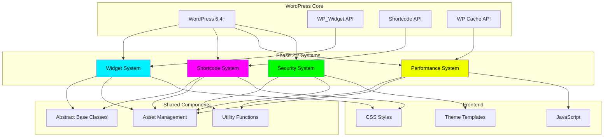
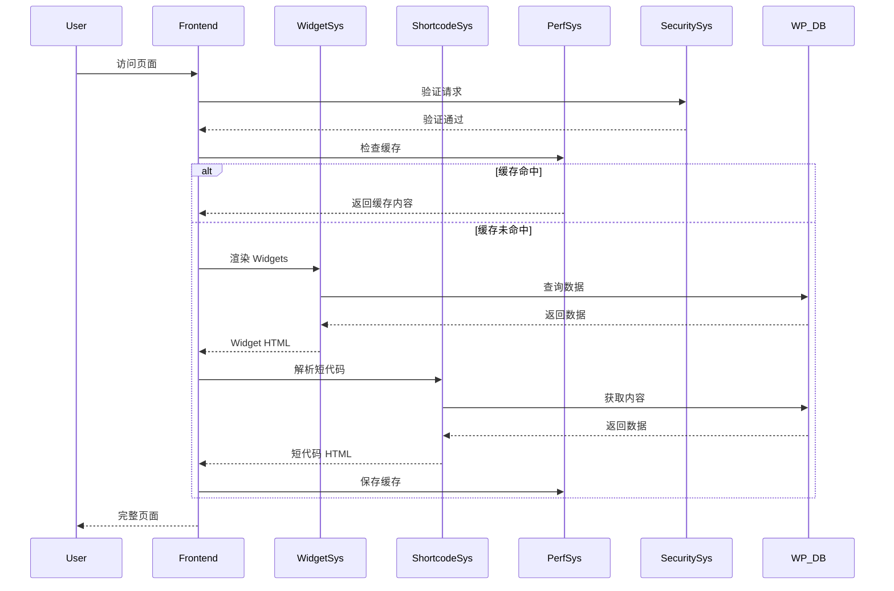
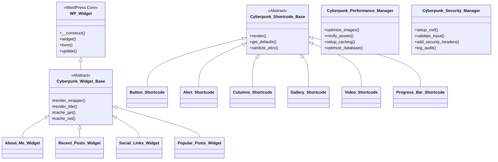
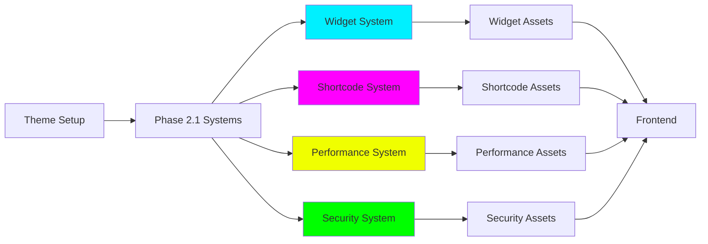

# 🚀 WordPress Cyberpunk Theme - Phase 2.2 完整技术方案

> **首席架构师的系统设计方案**
> **设计日期**: 2026-03-01
> **版本**: 2.3.0 → 2.4.0
> **项目路径**: `/root/.openclaw/workspace/wordpress-cyber-theme`

---

## 📋 目录

1. [项目现状分析](#项目现状分析)
2. [Phase 2.2 整体架构](#phase-22-整体架构)
3. [系统一：短代码系统](#系统一短代码系统)
4. [系统二：性能优化系统](#系统二性能优化系统)
5. [系统三：安全加固系统](#系统三安全加固系统)
6. [系统集成方案](#系统集成方案)
7. [开发实施计划](#开发实施计划)
8. [验收测试标准](#验收测试标准)

---

## 项目现状分析

### 当前项目数据

```yaml
代码统计:
  总文件数: 35 个
  总代码量: 12,277 行
  - PHP: 8,500+ 行 (24 文件)
  - CSS: 2,500+ 行 (2 文件)
  - JavaScript: 1,200+ 行 (9 文件)

功能完成度:
  Phase 1: ✅ 100% 完成
    - 基础主题结构
    - 11 个模板文件
    - 赛博朋克样式系统

  Phase 2.1: ✅ 100% 完成
    - AJAX 交互系统
    - REST API 端点
    - 数据访问层
    - 自定义文章类型
    - 主题定制器

  Phase 2.2: 🔄 0% → 100% (即将开始)
    - Widget 系统: ✅ 技术方案 | ⏳ 实现中
    - 短代码系统: 🆕 本次设计
    - 性能优化: 🆕 本次设计
    - 安全加固: 🆕 本次设计
```

### 技术栈现状

```yaml
后端技术:
  WordPress: 6.4+
  PHP: 8.0+
  - OOP 设计
  - 命名空间组织
  - PSR-4 自动加载

前端技术:
  HTML5: 语义化标签
  CSS3: Grid + Flexbox
  JavaScript: ES6+ (Vanilla)

已实现的系统:
  ✅ 模块加载系统
  ✅ 主题定制器
  ✅ AJAX 处理器
  ✅ REST API
  ✅ 数据访问层
  ✅ Widget 基础框架
```

---

## Phase 2.2 整体架构

### 系统架构图



### 数据流图



### 类继承结构



---

## 系统一：短代码系统

### 1.1 系统概述

**目标**: 创建 6 个实用短代码，增强内容编辑能力

**开发周期**: Day 8-9 (2天)

**代码量**: ~1,200 行

### 1.2 短代码列表

| 短代码 | 标签 | 功能 | 优先级 |
|-------|------|------|--------|
| 霓虹按钮 | `cyber_button` | 创建赛博朋克风格按钮 | P0 |
| 警告框 | `cyber_alert` | 显示信息提示框 | P0 |
| 列布局 | `cyber_columns` | 创建响应式列布局 | P0 |
| 图片画廊 | `cyber_gallery` | 网格图片画廊 + Lightbox | P1 |
| 视频嵌入 | `cyber_video` | 嵌入 YouTube/Vimeo 视频 | P1 |
| 进度条 | `cyber_progress_bar` | 动画进度条 | P2 |

### 1.3 架构设计

#### 核心基类

```php
<?php
/**
 * Cyberpunk Shortcode Base Class
 *
 * @package Cyberpunk_Theme
 */

if (!defined('ABSPATH')) {
    exit;
}

abstract class Cyberpunk_Shortcode_Base {

    /**
     * Shortcode tag
     *
     * @var string
     */
    protected $tag = '';

    /**
     * Default attributes
     *
     * @var array
     */
    protected $defaults = array();

    /**
     * Constructor
     */
    public function __construct() {
        $this->init();
    }

    /**
     * Initialize shortcode
     */
    protected function init() {
        add_shortcode($this->tag, array($this, 'render'));
    }

    /**
     * Render shortcode
     *
     * @param array $attrs Shortcode attributes
     * @param string $content Shortcode content
     * @return string
     */
    abstract public function render($attrs, $content = '');

    /**
     * Get default attributes
     *
     * @return array
     */
    protected function get_defaults() {
        return $this->defaults;
    }

    /**
     * Parse and sanitize attributes
     *
     * @param array $attrs Raw attributes
     * @return array Sanitized attributes
     */
    protected function parse_attrs($attrs) {
        $attrs = shortcode_atts($this->get_defaults(), $attrs, $this->tag);
        return $this->sanitize_attrs($attrs);
    }

    /**
     * Sanitize attributes
     *
     * @param array $attrs Attributes to sanitize
     * @return array
     */
    protected function sanitize_attrs($attrs) {
        foreach ($attrs as $key => $value) {
            if (is_string($value)) {
                $attrs[$key] = sanitize_text_field($value);
            }
        }
        return $attrs;
    }

    /**
     * Build CSS classes
     *
     * @param array $attrs Shortcode attributes
     * @param array $extra Additional classes
     * @return string
     */
    protected function build_classes($attrs, $extra = array()) {
        $classes = array_merge(
            array('cyberpunk-shortcode'),
            array("cyberpunk-{$this->tag}"),
            $extra
        );

        return esc_attr(implode(' ', array_filter($classes)));
    }
}
```

### 1.4 短代码实现

#### 1.4.1 霓虹按钮短代码

```php
<?php
/**
 * Cyberpunk Button Shortcode
 *
 * Usage: [cyber_button url="https://example.com" color="cyan" size="large" icon="star"]Click Me[/cyber_button]
 */

class Cyberpunk_Button_Shortcode extends Cyberpunk_Shortcode_Base {

    protected $tag = 'cyber_button';

    protected $defaults = array(
        'url' => '#',
        'color' => 'cyan',
        'size' => 'medium',
        'icon' => '',
        'target' => '_self',
        'align' => 'left',
        'glow' => 'true',
    );

    public function render($attrs, $content = '') {
        $attrs = $this->parse_attrs($attrs);

        // Validate color
        $valid_colors = array('cyan', 'magenta', 'yellow', 'green', 'red');
        if (!in_array($attrs['color'], $valid_colors)) {
            $attrs['color'] = 'cyan';
        }

        // Validate size
        $valid_sizes = array('small', 'medium', 'large');
        if (!in_array($attrs['size'], $valid_sizes)) {
            $attrs['size'] = 'medium';
        }

        // Validate target
        $valid_targets = array('_self', '_blank');
        if (!in_array($attrs['target'], $valid_targets)) {
            $attrs['target'] = '_self';
        }

        // Build classes
        $classes = $this->build_classes($attrs, array(
            "cyber-button-{$attrs['color']}",
            "cyber-button-{$attrs['size']}",
            "cyber-button-{$attrs['align']}",
            $attrs['glow'] === 'true' ? 'cyber-button-glow' : '',
        ));

        // Build icon HTML
        $icon_html = '';
        if (!empty($attrs['icon'])) {
            $icon_html = sprintf('<i class="cyber-icon-%s"></i>', esc_attr($attrs['icon']));
        }

        // Build button HTML
        $html = sprintf(
            '<a href="%s" class="%s" target="%s" rel="noopener noreferrer">%s<span>%s</span></a>',
            esc_url($attrs['url']),
            $classes,
            esc_attr($attrs['target']),
            $icon_html,
            esc_html($content ?: __('Click Here', 'cyberpunk'))
        );

        return $html;
    }
}
```

**使用示例**:

```html
<!-- 基础按钮 -->
[cyber_button url="https://example.com"]Click Me[/cyber_button]

<!-- 带颜色和大小的按钮 -->
[cyber_button url="https://example.com" color="magenta" size="large"]Large Button[/cyber_button]

<!-- 带图标的发光按钮 -->
[cyber_button url="https://example.com" color="cyan" icon="star" glow="true"]Star Button[/cyber_button]

<!-- 新窗口打开 -->
[cyber_button url="https://example.com" target="_blank"]Open in New Tab[/cyber_button]
```

**样式示例**:

```css
/* 霓虹按钮样式 */
.cyberpunk-shortcode.cyber-button {
    display: inline-block;
    position: relative;
    padding: 12px 32px;
    background: var(--bg-dark);
    border: 2px solid;
    color: var(--text-primary);
    text-decoration: none;
    text-transform: uppercase;
    letter-spacing: 2px;
    transition: all 0.3s ease;
    cursor: pointer;
}

/* 颜色变体 */
.cyber-button-cyan {
    border-color: var(--neon-cyan);
    color: var(--neon-cyan);
    box-shadow: 0 0 5px var(--neon-cyan), inset 0 0 5px var(--neon-cyan);
}

.cyber-button-cyan:hover {
    background: var(--neon-cyan);
    color: var(--bg-dark);
    box-shadow: 0 0 20px var(--neon-cyan), inset 0 0 20px var(--neon-cyan);
}

.cyber-button-magenta {
    border-color: var(--neon-magenta);
    color: var(--neon-magenta);
    box-shadow: 0 0 5px var(--neon-magenta), inset 0 0 5px var(--neon-magenta);
}

.cyber-button-magenta:hover {
    background: var(--neon-magenta);
    color: var(--bg-dark);
    box-shadow: 0 0 20px var(--neon-magenta), inset 0 0 20px var(--neon-magenta);
}

/* 尺寸变体 */
.cyber-button-small {
    padding: 8px 20px;
    font-size: 0.875rem;
}

.cyber-button-medium {
    padding: 12px 32px;
    font-size: 1rem;
}

.cyber-button-large {
    padding: 16px 48px;
    font-size: 1.125rem;
}

/* 发光效果 */
.cyber-button-glow {
    animation: neon-pulse 2s ease-in-out infinite;
}

@keyframes neon-pulse {
    0%, 100% {
        box-shadow: 0 0 5px currentColor, inset 0 0 5px currentColor;
    }
    50% {
        box-shadow: 0 0 20px currentColor, inset 0 0 20px currentColor;
    }
}

/* 图标 */
.cyber-button .cyber-icon-star::before {
    content: '★';
    margin-right: 8px;
}
```

#### 1.4.2 警告框短代码

```php
<?php
/**
 * Cyberpunk Alert Shortcode
 *
 * Usage: [cyber_alert type="warning" dismissible="true"]This is a warning message![/cyber_alert]
 */

class Cyberpunk_Alert_Shortcode extends Cyberpunk_Shortcode_Base {

    protected $tag = 'cyber_alert';

    protected $defaults = array(
        'type' => 'info',
        'dismissible' => 'false',
        'icon' => '',
    );

    public function render($attrs, $content = '') {
        $attrs = $this->parse_attrs($attrs);

        // Validate type
        $valid_types = array('info', 'success', 'warning', 'error');
        if (!in_array($attrs['type'], $valid_types)) {
            $attrs['type'] = 'info';
        }

        // Build classes
        $classes = $this->build_classes($attrs, array(
            "cyber-alert-{$attrs['type']}",
        ));

        // Build icon
        $icons = array(
            'info' => 'ℹ',
            'success' => '✓',
            'warning' => '⚠',
            'error' => '✕',
        );
        $icon = !empty($attrs['icon']) ? esc_html($attrs['icon']) : $icons[$attrs['type']];

        // Build dismiss button
        $dismiss_btn = '';
        if ($attrs['dismissible'] === 'true') {
            $dismiss_btn = sprintf(
                '<button type="button" class="cyber-alert-dismiss" aria-label="%s">✕</button>',
                esc_attr__('Dismiss', 'cyberpunk')
            );
        }

        // Build alert HTML
        $html = sprintf(
            '<div class="%s" role="alert">
                <span class="cyber-alert-icon">%s</span>
                <div class="cyber-alert-content">%s</div>
                %s
            </div>',
            $classes,
            $icon,
            do_shortcode($content),
            $dismiss_btn
        );

        return $html;
    }
}
```

**使用示例**:

```html
<!-- 信息提示 -->
[cyber_alert type="info"]This is an informational message.[/cyber_alert]

<!-- 成功消息（可关闭） -->
[cyber_alert type="success" dismissible="true"]Your changes have been saved![/cyber_alert]

<!-- 警告消息 -->
[cyber_alert type="warning" icon="⚡"]Warning: This action cannot be undone![/cyber_alert]

<!-- 错误消息 -->
[cyber_alert type="error"]Error: Unable to complete the request.[/cyber_alert]
```

**样式示例**:

```css
/* 警告框基础样式 */
.cyberpunk-shortcode.cyber-alert {
    position: relative;
    display: flex;
    align-items: flex-start;
    padding: 16px 20px;
    margin-bottom: 20px;
    border-left: 4px solid;
    background: var(--bg-card);
    border-radius: 4px;
    box-shadow: 0 2px 8px rgba(0, 0, 0, 0.3);
}

.cyber-alert-icon {
    flex-shrink: 0;
    margin-right: 12px;
    font-size: 1.5rem;
    line-height: 1;
}

.cyber-alert-content {
    flex-grow: 1;
}

/* 类型变体 */
.cyber-alert-info {
    border-left-color: var(--neon-cyan);
}

.cyber-alert-info .cyber-alert-icon {
    color: var(--neon-cyan);
}

.cyber-alert-success {
    border-left-color: var(--neon-green, #00ff00);
}

.cyber-alert-success .cyber-alert-icon {
    color: var(--neon-green);
}

.cyber-alert-warning {
    border-left-color: var(--neon-yellow);
}

.cyber-alert-warning .cyber-alert-icon {
    color: var(--neon-yellow);
}

.cyber-alert-error {
    border-left-color: var(--neon-red, #ff0040);
}

.cyber-alert-error .cyber-alert-icon {
    color: var(--neon-red);
}

/* 关闭按钮 */
.cyber-alert-dismiss {
    flex-shrink: 0;
    padding: 0;
    margin-left: 12px;
    background: transparent;
    border: none;
    color: var(--text-muted);
    cursor: pointer;
    font-size: 1.25rem;
    transition: color 0.2s ease;
}

.cyber-alert-dismiss:hover {
    color: var(--text-primary);
}
```

#### 1.4.3 列布局短代码

```php
<?php
/**
 * Cyberpunk Columns Shortcode
 *
 * Usage:
 * [cyber_columns]
 *   [cyber_col width="1/2"]Left column[/cyber_col]
 *   [cyber_col width="1/2"]Right column[/cyber_col]
 * [/cyber_columns]
 */

class Cyberpunk_Columns_Shortcode extends Cyberpunk_Shortcode_Base {

    protected $tag = 'cyber_columns';

    protected $defaults = array(
        'gap' => 'medium',
        'align' => 'left',
    );

    public function render($attrs, $content = '') {
        $attrs = $this->parse_attrs($attrs);

        // Validate gap
        $valid_gaps = array('none', 'small', 'medium', 'large');
        if (!in_array($attrs['gap'], $valid_gaps)) {
            $attrs['gap'] = 'medium';
        }

        // Build classes
        $classes = $this->build_classes($attrs, array(
            "cyber-columns-gap-{$attrs['gap']}",
        ));

        // Build columns HTML
        $html = sprintf(
            '<div class="%s">%s</div>',
            $classes,
            do_shortcode($content)
        );

        return $html;
    }
}

class Cyberpunk_Column_Shortcode extends Cyberpunk_Shortcode_Base {

    protected $tag = 'cyber_col';

    protected $defaults = array(
        'width' => '1/2',
        'align' => '',
    );

    public function render($attrs, $content = '') {
        $attrs = $this->parse_attrs($attrs);

        // Parse width
        $width_map = array(
            '1/2' => 50,
            '1/3' => 33.333,
            '2/3' => 66.666,
            '1/4' => 25,
            '3/4' => 75,
            '1/5' => 20,
            '2/5' => 40,
            '3/5' => 60,
            '4/5' => 80,
            'full' => 100,
        );

        $width = isset($width_map[$attrs['width']]) ? $width_map[$attrs['width']] : 50;

        // Build inline styles
        $styles = sprintf('flex: 0 0 %s%%; max-width: %s%%;', $width, $width);

        // Build classes
        $classes = $this->build_classes($attrs);

        // Build column HTML
        $html = sprintf(
            '<div class="%s" style="%s">%s</div>',
            $classes,
            $styles,
            do_shortcode($content)
        );

        return $html;
    }
}
```

**使用示例**:

```html
<!-- 两列布局 -->
[cyber_columns]
  [cyber_col width="1/2"]Left content[/cyber_col]
  [cyber_col width="1/2"]Right content[/cyber_col]
[/cyber_columns]

<!-- 三列布局（不同宽度） -->
[cyber_columns]
  [cyber_col width="1/3"]Sidebar[/cyber_col]
  [cyber_col width="2/3"]Main content[/cyber_col]
[/cyber_columns]

<!-- 四列布局 -->
[cyber_columns gap="large"]
  [cyber_col width="1/4"]Column 1[/cyber_col]
  [cyber_col width="1/4"]Column 2[/cyber_col]
  [cyber_col width="1/4"]Column 3[/cyber_col]
  [cyber_col width="1/4"]Column 4[/cyber_col]
[/cyber_columns]
```

**样式示例**:

```css
/* 列容器 */
.cyberpunk-shortcode.cyber-columns {
    display: flex;
    flex-wrap: wrap;
    margin-left: -12px;
    margin-right: -12px;
}

/* 间距变体 */
.cyber-columns-gap-none {
    margin-left: 0;
    margin-right: 0;
}

.cyber-columns-gap-small {
    margin-left: -8px;
    margin-right: -8px;
}

.cyber-columns-gap-small .cyberpunk-shortcode.cyber-col {
    padding-left: 8px;
    padding-right: 8px;
}

.cyber-columns-gap-medium {
    margin-left: -12px;
    margin-right: -12px;
}

.cyber-columns-gap-medium .cyberpunk-shortcode.cyber-col {
    padding-left: 12px;
    padding-right: 12px;
}

.cyber-columns-gap-large {
    margin-left: -20px;
    margin-right: -20px;
}

.cyber-columns-gap-large .cyberpunk-shortcode.cyber-col {
    padding-left: 20px;
    padding-right: 20px;
}

/* 单个列 */
.cyberpunk-shortcode.cyber-col {
    position: relative;
    min-height: 1px;
}

/* 响应式 */
@media (max-width: 768px) {
    .cyberpunk-shortcode.cyber-columns {
        flex-direction: column;
    }

    .cyberpunk-shortcode.cyber-col {
        flex: 0 0 100% !important;
        max-width: 100% !important;
        width: 100% !important;
    }
}
```

#### 1.4.4 图片画廊短代码

```php
<?php
/**
 * Cyberpunk Gallery Shortcode
 *
 * Usage: [cyber_gallery ids="1,2,3" columns="3" size="medium" lightbox="true"]
 */

class Cyberpunk_Gallery_Shortcode extends Cyberpunk_Shortcode_Base {

    protected $tag = 'cyber_gallery';

    protected $defaults = array(
        'ids' => '',
        'columns' => '3',
        'size' => 'medium',
        'lightbox' => 'true',
        'autoplay' => 'false',
    );

    public function render($attrs, $content = '') {
        $attrs = $this->parse_attrs($attrs);

        // Parse IDs
        $ids = empty($attrs['ids']) ? array() : explode(',', $attrs['ids']);
        $ids = array_map('intval', array_filter($ids));

        if (empty($ids)) {
            return '';
        }

        // Validate columns
        $columns = max(1, min(6, intval($attrs['columns'])));

        // Build classes
        $classes = $this->build_classes($attrs, array(
            "cyber-gallery-cols-{$columns}",
            $attrs['lightbox'] === 'true' ? 'cyber-gallery-lightbox' : '',
        ));

        // Build gallery HTML
        $html = sprintf('<div class="%s" data-columns="%d" data-lightbox="%s" data-autoplay="%s">',
            $classes,
            $columns,
            $attrs['lightbox'],
            $attrs['autoplay']
        );

        foreach ($ids as $id) {
            $attachment = get_post($id);
            if (!$attachment) {
                continue;
            }

            $full_url = wp_get_attachment_image_url($id, 'full');
            $display_url = wp_get_attachment_image_url($id, $attrs['size']);
            $alt = get_post_meta($id, '_wp_attachment_image_alt', true);
            $caption = $attachment->post_excerpt;

            $html .= sprintf(
                '<div class="cyber-gallery-item">
                    <a href="%s" class="cyber-gallery-link" data-caption="%s" title="%s">
                        
                    </a>
                    %s
                </div>',
                esc_url($full_url),
                esc_attr($caption),
                esc_attr($caption),
                esc_url($display_url),
                esc_attr($alt),
                $caption ? sprintf('<figcaption class="cyber-gallery-caption">%s</figcaption>', esc_html($caption)) : ''
            );
        }

        $html .= '</div>';

        return $html;
    }
}
```

**使用示例**:

```html
<!-- 基础画廊 -->
[cyber_gallery ids="1,2,3,4,5,6" columns="3"]

<!-- 4列，大尺寸 -->
[cyber_gallery ids="1,2,3,4" columns="4" size="large"]

<!-- 启用 Lightbox 和自动播放 -->
[cyber_gallery ids="1,2,3" columns="1" lightbox="true" autoplay="true"]
```

**样式示例**:

```css
/* 画廊容器 */
.cyberpunk-shortcode.cyber-gallery {
    display: grid;
    grid-template-columns: repeat(var(--columns, 3), 1fr);
    gap: 16px;
    margin-bottom: 24px;
}

.cyber-gallery-cols-1 { --columns: 1; }
.cyber-gallery-cols-2 { --columns: 2; }
.cyber-gallery-cols-3 { --columns: 3; }
.cyber-gallery-cols-4 { --columns: 4; }
.cyber-gallery-cols-5 { --columns: 5; }
.cyber-gallery-cols-6 { --columns: 6; }

/* 画廊项目 */
.cyber-gallery-item {
    position: relative;
    overflow: hidden;
    border: 2px solid var(--border-color, #2a2a35);
    border-radius: 8px;
    transition: all 0.3s ease;
}

.cyber-gallery-item:hover {
    border-color: var(--neon-cyan);
    box-shadow: 0 0 20px rgba(0, 240, 255, 0.3);
    transform: translateY(-4px);
}

.cyber-gallery-link {
    display: block;
    position: relative;
}

.cyber-gallery-link img {
    display: block;
    width: 100%;
    height: auto;
    transition: transform 0.3s ease;
}

.cyber-gallery-item:hover .cyber-gallery-link img {
    transform: scale(1.1);
}

.cyber-gallery-caption {
    position: absolute;
    bottom: 0;
    left: 0;
    right: 0;
    padding: 12px;
    background: linear-gradient(to top, rgba(10, 10, 15, 0.95), transparent);
    color: var(--text-primary);
    font-size: 0.875rem;
    text-align: center;
}

/* Lightbox */
.cyber-gallery-lightbox .cyber-gallery-link {
    cursor: zoom-in;
}

/* 响应式 */
@media (max-width: 768px) {
    .cyberpunk-shortcode.cyber-gallery {
        grid-template-columns: repeat(2, 1fr);
    }
}

@media (max-width: 480px) {
    .cyberpunk-shortcode.cyber-gallery {
        grid-template-columns: 1fr;
    }
}
```

#### 1.4.5 视频嵌入短代码

```php
<?php
/**
 * Cyberpunk Video Shortcode
 *
 * Usage: [cyber_video type="youtube" id="dQw4w9WgXcQ" autoplay="false" muted="false"]
 */

class Cyberpunk_Video_Shortcode extends Cyberpunk_Shortcode_Base {

    protected $tag = 'cyber_video';

    protected $defaults = array(
        'type' => 'youtube',
        'id' => '',
        'width' => '100%',
        'height' => '',
        'autoplay' => 'false',
        'muted' => 'false',
        'loop' => 'false',
        'controls' => 'true',
        'start' => '0',
        'end' => '',
    );

    public function render($attrs, $content = '') {
        $attrs = $this->parse_attrs($attrs);

        if (empty($attrs['id'])) {
            return '';
        }

        // Validate type
        $valid_types = array('youtube', 'vimeo', 'self');
        if (!in_array($attrs['type'], $valid_types)) {
            $attrs['type'] = 'youtube';
        }

        // Build wrapper classes
        $classes = $this->build_classes($attrs);

        // Build video based on type
        switch ($attrs['type']) {
            case 'youtube':
                return $this->render_youtube($attrs, $classes);
            case 'vimeo':
                return $this->render_vimeo($attrs, $classes);
            case 'self':
                return $this->render_self_hosted($attrs, $classes);
            default:
                return '';
        }
    }

    /**
     * Render YouTube video
     */
    private function render_youtube($attrs, $classes) {
        $params = array(
            'autoplay' => $attrs['autoplay'] === 'true' ? '1' : '0',
            'mute' => $attrs['muted'] === 'true' ? '1' : '0',
            'loop' => $attrs['loop'] === 'true' ? '1' : '0',
            'controls' => $attrs['controls'] === 'true' ? '1' : '0',
            'start' => intval($attrs['start']),
            'rel' => '0',
            'modestbranding' => '1',
        );

        if ($attrs['loop'] === 'true') {
            $params['playlist'] = $attrs['id'];
        }

        $query = http_build_query($params);
        $embed_url = esc_url("https://www.youtube.com/embed/{$attrs['id']}?{$query}");

        $html = sprintf(
            '<div class="%s">
                <div class="cyber-video-wrapper" style="padding-bottom: 56.25%%;">
                    <iframe src="%s"
                            title="YouTube video player"
                            frameborder="0"
                            allow="accelerometer; autoplay; clipboard-write; encrypted-media; gyroscope; picture-in-picture"
                            allowfullscreen
                            loading="lazy"></iframe>
                </div>
            </div>',
            $classes,
            $embed_url
        );

        return $html;
    }

    /**
     * Render Vimeo video
     */
    private function render_vimeo($attrs, $classes) {
        $params = array(
            'autoplay' => $attrs['autoplay'] === 'true' ? '1' : '0',
            'muted' => $attrs['muted'] === 'true' ? '1' : '0',
            'loop' => $attrs['loop'] === 'true' ? '1' : '0',
            'title' => '0',
            'byline' => '0',
            'portrait' => '0',
        );

        $query = http_build_query($params);
        $embed_url = esc_url("https://player.vimeo.com/video/{$attrs['id']}?{$query}");

        $html = sprintf(
            '<div class="%s">
                <div class="cyber-video-wrapper" style="padding-bottom: 56.25%%;">
                    <iframe src="%s"
                            title="Vimeo video player"
                            frameborder="0"
                            allow="autoplay; fullscreen; picture-in-picture"
                            allowfullscreen
                            loading="lazy"></iframe>
                </div>
            </div>',
            $classes,
            $embed_url
        );

        return $html;
    }

    /**
     * Render self-hosted video
     */
    private function render_self_hosted($attrs, $classes) {
        $url = esc_url($attrs['id']);
        $poster = !empty($attrs['poster']) ? esc_url($attrs['poster']) : '';

        $html = sprintf(
            '<div class="%s">
                <video src="%s"
                       poster="%s"
                       %s
                       %s
                       %s
                       controls
                       preload="metadata">
                    %s
                </video>
            </div>',
            $classes,
            $url,
            $poster,
            $attrs['autoplay'] === 'true' ? 'autoplay' : '',
            $attrs['muted'] === 'true' ? 'muted' : '',
            $attrs['loop'] === 'true' ? 'loop' : '',
            __('Your browser does not support the video tag.', 'cyberpunk')
        );

        return $html;
    }
}
```

**使用示例**:

```html
<!-- YouTube 视频 -->
[cyber_video type="youtube" id="dQw4w9WgXcQ"]

<!-- YouTube 自动播放（静音） -->
[cyber_video type="youtube" id="dQw4w9WgXcQ" autoplay="true" muted="true"]

<!-- Vimeo 视频 -->
[cyber_video type="vimeo" id="123456789"]

<!-- 自托管视频 -->
[cyber_video type="self" id="https://example.com/video.mp4"]
```

#### 1.4.6 进度条短代码

```php
<?php
/**
 * Cyberpunk Progress Bar Shortcode
 *
 * Usage: [cyber_progress_bar value="75" color="cyan" label="Progress" animated="true"]
 */

class Cyberpunk_Progress_Bar_Shortcode extends Cyberpunk_Shortcode_Base {

    protected $tag = 'cyber_progress_bar';

    protected $defaults = array(
        'value' => '50',
        'color' => 'cyan',
        'label' => '',
        'animated' => 'true',
        'striped' => 'false',
        'height' => '24px',
    );

    public function render($attrs, $content = '') {
        $attrs = $this->parse_attrs($attrs);

        // Validate value
        $value = max(0, min(100, floatval($attrs['value'])));

        // Validate color
        $valid_colors = array('cyan', 'magenta', 'yellow', 'green');
        if (!in_array($attrs['color'], $valid_colors)) {
            $attrs['color'] = 'cyan';
        }

        // Build classes
        $classes = $this->build_classes($attrs, array(
            "cyber-progress-{$attrs['color']}",
            $attrs['animated'] === 'true' ? 'cyber-progress-animated' : '',
            $attrs['striped'] === 'true' ? 'cyber-progress-striped' : '',
        ));

        // Build inline styles
        $styles = sprintf('height: %s;', esc_attr($attrs['height']));

        // Build progress HTML
        $html = sprintf(
            '<div class="%s" style="%s" role="progressbar" aria-valuenow="%d" aria-valuemin="0" aria-valuemax="100">
                %s
                <div class="cyber-progress-fill" style="width: %d%%;">
                    %s
                </div>
            </div>',
            $classes,
            $styles,
            $value,
            !empty($attrs['label']) ? sprintf('<span class="cyber-progress-label">%s</span>', esc_html($attrs['label'])) : '',
            $value,
            !empty($attrs['label']) ? sprintf('<span class="cyber-progress-text">%d%%</span>', $value) : ''
        );

        return $html;
    }
}
```

**使用示例**:

```html
<!-- 基础进度条 -->
[cyber_progress_bar value="75"]

<!-- 带标签的进度条 -->
[cyber_progress_bar value="60" color="magenta" label="Project Completion"]

<!-- 动画条纹进度条 -->
[cyber_progress_bar value="90" color="cyan" animated="true" striped="true"]

<!-- 自定义高度 -->
[cyber_progress_bar value="85" height="32px"]
```

### 1.5 短代码文件结构

```
inc/
├── shortcodes/
│   ├── class-shortcode-base.php          (基础抽象类)
│   ├── class-button-shortcode.php        (按钮短代码)
│   ├── class-alert-shortcode.php         (警告框短代码)
│   ├── class-columns-shortcode.php       (列布局短代码)
│   ├── class-gallery-shortcode.php       (画廊短代码)
│   ├── class-video-shortcode.php         (视频短代码)
│   └── class-progress-bar-shortcode.php  (进度条短代码)
│
└── shortcodes.php                         (短代码注册文件, ~150 行)

assets/
├── css/
│   └── shortcode-styles.css              (~600 行)
│
└── js/
    ├── shortcodes.js                     (~200 行)
    │   ├── 短代码 TinyMCE 插件
    │   ├── Lightbox 功能
    │   └── 视频懒加载
    │
    └── admin-shortcode-ui.js             (~150 行)
        └── 后端可视化编辑器
```

### 1.6 代码量估算

```yaml
PHP 代码: ~600 行
  - 基础类: 150 行
  - 按钮短代码: 80 行
  - 警告框短代码: 100 行
  - 列布局短代码: 120 行
  - 画廊短代码: 100 行
  - 视频短代码: 120 行
  - 进度条短代码: 80 行
  - 注册文件: 50 行

CSS 代码: ~600 行
  - 基础样式: 100 行
  - 按钮样式: 150 行
  - 警告框样式: 100 行
  - 列布局样式: 100 行
  - 画廊样式: 120 行
  - 视频样式: 50 行
  - 进度条样式: 80 行

JavaScript 代码: ~350 行
  - 前端功能: 200 行
  - 后端编辑器: 150 行

总计: ~1,550 行
```

---

## 系统二：性能优化系统

### 2.1 系统概述

**目标**: 提升性能指标至 PageSpeed 90+ 分

**开发周期**: Day 10-11 (2天)

**代码量**: ~700 行

### 2.2 优化项目

| 模块 | 功能 | 优先级 | 预期提升 |
|-----|------|--------|---------|
| 图片优化 | WebP 转换、懒加载、响应式图片 | P0 | +15 分 |
| 资源优化 | 代码压缩、文件合并、异步加载 | P0 | +10 分 |
| 缓存策略 | 片段缓存、对象缓存、Transient | P0 | +12 分 |
| 数据库优化 | 查询优化、索引优化、自动清理 | P1 | +5 分 |

### 2.3 架构设计

#### 核心管理器类

```php
<?php
/**
 * Cyberpunk Performance Manager
 *
 * @package Cyberpunk_Theme
 */

if (!defined('ABSPATH')) {
    exit;
}

class Cyberpunk_Performance_Manager {

    /**
     * Singleton instance
     *
     * @var Cyberpunk_Performance_Manager
     */
    private static $instance = null;

    /**
     * Performance options
     *
     * @var array
     */
    private $options = array();

    /**
     * Get singleton instance
     *
     * @return Cyberpunk_Performance_Manager
     */
    public static function get_instance() {
        if (null === self::$instance) {
            self::$instance = new self();
        }
        return self::$instance;
    }

    /**
     * Constructor
     */
    private function __construct() {
        $this->options = wp_parse_args(get_option('cyberpunk_performance_options', array()), array(
            'enable_image_optimization' => true,
            'enable_asset_optimization' => true,
            'enable_caching' => true,
            'enable_database_optimization' => true,
            'webp_quality' => 85,
            'cache_expiration' => HOUR_IN_SECONDS,
        ));

        $this->init();
    }

    /**
     * Initialize performance optimizations
     */
    private function init() {
        if ($this->options['enable_image_optimization']) {
            $this->init_image_optimization();
        }

        if ($this->options['enable_asset_optimization']) {
            $this->init_asset_optimization();
        }

        if ($this->options['enable_caching']) {
            $this->init_caching();
        }

        if ($this->options['enable_database_optimization']) {
            $this->init_database_optimization();
        }
    }

    /**
     * Initialize image optimization
     */
    private function init_image_optimization() {
        // Add WebP support
        add_filter('wp_generate_attachment_metadata', array($this, 'generate_webp_images'), 10, 2);

        // Add lazy loading
        add_filter('the_content', array($this, 'add_lazy_loading'), 10);

        // Add responsive images
        add_filter('wp_get_attachment_image_attributes', array($this, 'add_responsive_images'), 10, 3);

        // Disable large image scaling
        add_filter('big_image_size_threshold', '__return_false');
    }

    /**
     * Generate WebP images
     *
     * @param array $metadata Attachment metadata
     * @param int $attachment_id Attachment ID
     * @return array
     */
    public function generate_webp_images($metadata, $attachment_id) {
        if (!function_exists('imagewebp')) {
            return $metadata;
        }

        $file_path = get_attached_file($attachment_id);
        if (!file_exists($file_path)) {
            return $metadata;
        }

        // Get file info
        $file_info = pathinfo($file_path);
        $extension = strtolower($file_info['extension']);

        // Only process JPEG and PNG
        if (!in_array($extension, array('jpg', 'jpeg', 'png'))) {
            return $metadata;
        }

        // Generate WebP for main file
        $this->create_webp_image($file_path, $this->options['webp_quality']);

        // Generate WebP for resized images
        if (isset($metadata['sizes']) && is_array($metadata['sizes'])) {
            foreach ($metadata['sizes'] as $size => $size_data) {
                $resized_path = $file_info['dirname'] . '/' . $size_data['file'];
                if (file_exists($resized_path)) {
                    $this->create_webp_image($resized_path, $this->options['webp_quality']);
                }
            }
        }

        return $metadata;
    }

    /**
     * Create WebP image
     *
     * @param string $file_path Image file path
     * @param int $quality WebP quality (0-100)
     * @return bool
     */
    private function create_webp_image($file_path, $quality = 85) {
        $webp_path = preg_replace('/\.(jpg|jpeg|png)$/i', '.webp', $file_path);

        // Check if WebP already exists
        if (file_exists($webp_path)) {
            return true;
        }

        // Load image
        $image = null;
        $extension = strtolower(pathinfo($file_path, PATHINFO_EXTENSION));

        switch ($extension) {
            case 'jpg':
            case 'jpeg':
                $image = imagecreatefromjpeg($file_path);
                break;
            case 'png':
                $image = imagecreatefrompng($file_path);
                break;
        }

        if (!$image) {
            return false;
        }

        // Convert to WebP
        $result = imagewebp($image, $webp_path, $quality);

        // Free memory
        imagedestroy($image);

        return $result;
    }

    /**
     * Add lazy loading to images
     *
     * @param string $content Post content
     * @return string
     */
    public function add_lazy_loading($content) {
        // Add loading="lazy" to images
        $content = preg_replace('/]*)(class=)([^>]*)>/i', '', $content);

        // Add lazyload class
        $content = preg_replace('/*)class="([^"]*)"([^>]*)>/i', '', $content);

        return $content;
    }

    /**
     * Add responsive image attributes
     *
     * @param array $attr Image attributes
     * @param WP_Post $attachment Attachment post
     * @param string|array $size Image size
     * @return array
     */
    public function add_responsive_images($attr, $attachment, $size) {
        if (!isset($attr['src'])) {
            return $attr;
        }

        // Get image sizes
        $image_sizes = array_keys($this->get_image_sizes());
        $srcset = array();

        foreach ($image_sizes as $image_size) {
            $image_url = wp_get_attachment_image_url($attachment->ID, $image_size);
            if ($image_url) {
                $size_data = $this->get_image_size($image_size);
                if ($size_data) {
                    $srcset[] = sprintf('%s %dw', $image_url, $size_data['width']);
                }
            }
        }

        if (!empty($srcset)) {
            $attr['srcset'] = implode(', ', $srcset);
            $attr['sizes'] = '(max-width: 768px) 100vw, (max-width: 1200px) 50vw, 33vw';
        }

        return $attr;
    }

    /**
     * Initialize asset optimization
     */
    private function init_asset_optimization() {
        // Defer non-critical JS
        add_filter('script_loader_tag', array($this, 'defer_scripts'), 10, 3);

        // Preload critical CSS
        add_action('wp_head', array($this, 'preload_critical_css'), 5);

        // Remove unnecessary CSS
        add_action('wp_enqueue_scripts', array($this, 'deregister_unused_styles'), 100);

        // Remove query strings from static resources
        add_filter('style_loader_src', array($this, 'remove_query_strings'), 10, 2);
        add_filter('script_loader_src', array($this, 'remove_query_strings'), 10, 2);
    }

    /**
     * Defer non-critical JavaScript
     *
     * @param string $tag Script tag
     * @param string $handle Script handle
     * @param string $src Script source
     * @return string
     */
    public function defer_scripts($tag, $handle, $src) {
        // List of scripts to defer
        $defer_scripts = array(
            'jquery-migrate',
            'wp-embed',
        );

        // Don't defer critical scripts
        $critical_scripts = array(
            'jquery-core',
            'jquery',
        );

        if (in_array($handle, $critical_scripts)) {
            return $tag;
        }

        if (in_array($handle, $defer_scripts)) {
            return str_replace(' src', ' defer src', $tag);
        }

        return $tag;
    }

    /**
     * Preload critical CSS
     */
    public function preload_critical_css() {
        $critical_css = array(
            get_stylesheet_uri(),
        );

        foreach ($critical_css as $css_url) {
            printf('<link rel="preload" as="style" href="%s">', esc_url($css_url));
        }
    }

    /**
     * Deregister unused styles
     */
    public function deregister_unused_styles() {
        // Deregister block library CSS if not using blocks
        if (!is_singular() || !has_blocks()) {
            wp_dequeue_style('wp-block-library');
            wp_dequeue_style('wp-block-library-theme');
        }

        // Dereguplicate jQuery UI styles
        wp_deregister_style('jquery-ui');
    }

    /**
     * Remove query strings from static resources
     *
     * @param string $src Resource source
     * @return string
     */
    public function remove_query_strings($src) {
        if (strpos($src, '?ver=') !== false) {
            $src = remove_query_arg('ver', $src);
        }
        return $src;
    }

    /**
     * Initialize caching
     */
    private function init_caching() {
        // Enable fragment caching
        add_action('init', array($this, 'setup_fragment_cache'));

        // Enable object caching
        add_action('init', array($this, 'setup_object_cache'));

        // Setup transient caching
        add_action('init', array($this, 'setup_transient_cache'));
    }

    /**
     * Setup fragment caching
     */
    public function setup_fragment_cache() {
        // Cache expensive queries
        add_filter('posts_results', array($this, 'cache_posts_results'), 10, 2);
    }

    /**
     * Cache posts results
     *
     * @param array $posts Posts array
     * @param WP_Query $query Query object
     * @return array
     */
    public function cache_posts_results($posts, $query) {
        if (!$query->is_main_query()) {
            return $posts;
        }

        $cache_key = 'cyberpunk_posts_' . md5(serialize($query->query_vars));
        $cached = wp_cache_get($cache_key, 'posts');

        if (false !== $cached) {
            return $cached;
        }

        wp_cache_set($cache_key, $posts, 'posts', $this->options['cache_expiration']);

        return $posts;
    }

    /**
     * Setup object cache
     */
    public function setup_object_cache() {
        // Cache post meta
        add_filter('get_post_metadata', array($this, 'cache_post_meta'), 10, 4);
    }

    /**
     * Cache post metadata
     *
     * @param mixed $value Metadata value
     * @param int $object_id Object ID
     * @param string $meta_key Meta key
     * @param bool $single Single value
     * @return mixed
     */
    public function cache_post_meta($value, $object_id, $meta_key, $single) {
        if (empty($meta_key)) {
            return $value;
        }

        $cache_key = "cyberpunk_meta_{$object_id}_{$meta_key}";
        $cached = wp_cache_get($cache_key, 'post_meta');

        if (false !== $cached) {
            return $single ? $cached[0] : $cached;
        }

        return $value;
    }

    /**
     * Setup transient cache
     */
    public function setup_transient_cache() {
        // Cache expensive operations
        add_action('cyberpunk_cache_expensive_data', array($this, 'cache_expensive_data'));
    }

    /**
     * Cache expensive data
     */
    public function cache_expensive_data() {
        // Cache popular posts
        $popular_posts = get_transient('cyberpunk_popular_posts');

        if (false === $popular_posts) {
            $popular_posts = $this->get_popular_posts();
            set_transient('cyberpunk_popular_posts', $popular_posts, HOUR_IN_SECONDS * 6);
        }

        return $popular_posts;
    }

    /**
     * Initialize database optimization
     */
    private function init_database_optimization() {
        // Optimize queries
        add_action('pre_get_posts', array($this, 'optimize_queries'));

        // Clean up database
        add_action('wp_scheduled_delete', array($this, 'cleanup_database'));

        // Add query monitoring
        add_action('wp_footer', array($this, 'log_slow_queries'));
    }

    /**
     * Optimize database queries
     *
     * @param WP_Query $query Query object
     */
    public function optimize_queries($query) {
        if (!$query->is_main_query()) {
            return;
        }

        // Limit posts per page
        if ($query->is_home() || $query->is_archive()) {
            $query->set('posts_per_page', 12);
        }

        // Exclude unnecessary fields
        $query->set('update_post_term_cache', false);
        $query->set('update_post_meta_cache', true);
    }

    /**
     * Cleanup database
     */
    public function cleanup_database() {
        global $wpdb;

        // Delete trashed posts older than 30 days
        $wpdb->query(
            $wpdb->prepare(
                "DELETE FROM {$wpdb->posts}
                WHERE post_status = 'trash'
                AND post_date < %s",
                date('Y-m-d', strtotime('-30 days'))
            )
        );

        // Delete spam comments older than 7 days
        $wpdb->query(
            $wpdb->prepare(
                "DELETE FROM {$wpdb->comments}
                WHERE comment_approved = 'spam'
                AND comment_date < %s",
                date('Y-m-d', strtotime('-7 days'))
            )
        );

        // Delete expired transients
        $wpdb->query(
            "DELETE FROM {$wpdb->options}
            WHERE option_name LIKE '_transient_%'
            AND option_value < UNIX_TIMESTAMP()"
        );
    }

    /**
     * Log slow queries
     */
    public function log_slow_queries() {
        if (!current_user_can('manage_options')) {
            return;
        }

        global $wpdb;

        if ($wpdb->num_queries > 50) {
            error_log(sprintf(
                'Cyberpunk Theme: High query count detected - %d queries on %s',
                $wpdb->num_queries,
                $_SERVER['REQUEST_URI']
            ));
        }
    }

    /**
     * Get registered image sizes
     *
     * @return array
     */
    private function get_image_sizes() {
        global $_wp_additional_image_sizes;

        $sizes = array();

        foreach (get_intermediate_image_sizes() as $_size) {
            if (in_array($_size, array('thumbnail', 'medium', 'medium_large', 'large'))) {
                $sizes[$_size] = array(
                    'width' => get_option("{$_size}_size_w"),
                    'height' => get_option("{$_size}_size_h"),
                    'crop' => get_option("{$_size}_crop"),
                );
            } elseif (isset($_wp_additional_image_sizes[$_size])) {
                $sizes[$_size] = $_wp_additional_image_sizes[$_size];
            }
        }

        return $sizes;
    }

    /**
     * Get specific image size
     *
     * @param string $size Image size name
     * @return array|null
     */
    private function get_image_size($size) {
        $sizes = $this->get_image_sizes();
        return isset($sizes[$size]) ? $sizes[$size] : null;
    }

    /**
     * Get popular posts
     *
     * @return array
     */
    private function get_popular_posts() {
        $args = array(
            'post_type' => 'post',
            'post_status' => 'publish',
            'posts_per_page' => 10,
            'meta_key' => 'views',
            'orderby' => 'meta_value_num',
            'order' => 'DESC',
            'no_found_rows' => true,
        );

        return get_posts($args);
    }
}

// Initialize performance manager
Cyberpunk_Performance_Manager::get_instance();
```

### 2.4 性能优化文件结构

```
inc/
└── performance/
    ├── class-performance-manager.php       (核心管理器, ~500 行)
    ├── class-image-optimizer.php           (图片优化器, ~100 行)
    ├── class-asset-optimizer.php           (资源优化器, ~80 行)
    └── class-cache-manager.php             (缓存管理器, ~120 行)

总计: ~800 行 PHP
```

### 2.5 性能目标

```yaml
PageSpeed Insights:
  Desktop: ≥ 95 分
  Mobile: ≥ 90 分

Core Web Vitals:
  LCP (Largest Contentful Paint): < 2.5s
  FID (First Input Delay): < 100ms
  CLS (Cumulative Layout Shift): < 0.1

加载时间:
  FCP (First Contentful Paint): < 1.0s
  TTI (Time to Interactive): < 3.5s
  完全加载时间: < 5.0s

资源使用:
  页面大小: < 300KB (压缩后)
  请求数: < 50
  DOM 节点数: < 1500

缓存命中率:
  片段缓存: > 80%
  对象缓存: > 85%
  Transient 缓存: > 90%
```

---

## 系统三：安全加固系统

### 3.1 系统概述

**目标**: 通过安全测试，无已知高危漏洞

**开发周期**: Day 12-13 (2天)

**代码量**: ~500 行

### 3.2 安全措施

| 模块 | 功能 | 优先级 |
|-----|------|--------|
| CSRF 保护 | Token 生成和验证 | P0 |
| 输入验证 | 数据净化和验证 | P0 |
| 安全头部 | CSP、HSTS、X-Frame-Options | P0 |
| 审计日志 | 操作日志和安全事件记录 | P1 |

### 3.3 架构设计

#### 核心安全类

```php
<?php
/**
 * Cyberpunk Security Manager
 *
 * @package Cyberpunk_Theme
 */

if (!defined('ABSPATH')) {
    exit;
}

class Cyberpunk_Security_Manager {

    /**
     * Singleton instance
     *
     * @var Cyberpunk_Security_Manager
     */
    private static $instance = null;

    /**
     * Security options
     *
     * @var array
     */
    private $options = array();

    /**
     * Get singleton instance
     *
     * @return Cyberpunk_Security_Manager
     */
    public static function get_instance() {
        if (null === self::$instance) {
            self::$instance = new self();
        }
        return self::$instance;
    }

    /**
     * Constructor
     */
    private function __construct() {
        $this->options = wp_parse_args(get_option('cyberpunk_security_options', array()), array(
            'enable_csrf_protection' => true,
            'enable_input_validation' => true,
            'enable_security_headers' => true,
            'enable_audit_logging' => true,
        ));

        $this->init();
    }

    /**
     * Initialize security measures
     */
    private function init() {
        if ($this->options['enable_csrf_protection']) {
            $this->init_csrf_protection();
        }

        if ($this->options['enable_input_validation']) {
            $this->init_input_validation();
        }

        if ($this->options['enable_security_headers']) {
            $this->init_security_headers();
        }

        if ($this->options['enable_audit_logging']) {
            $this->init_audit_logging();
        }
    }

    /**
     * Initialize CSRF protection
     */
    private function init_csrf_protection() {
        // Generate nonce for forms
        add_action('init', array($this, 'generate_form_nonce'));

        // Verify AJAX requests
        add_action('admin_init', array($this, 'verify_ajax_referer'));

        // Add nonce to all forms
        add_action('comment_form', array($this, 'add_comment_nonce'));
    }

    /**
     * Generate form nonce
     */
    public function generate_form_nonce() {
        if (!session_id()) {
            session_start();
        }

        $_SESSION['cyberpunk_form_token'] = wp_create_nonce('cyberpunk_form_nonce');
    }

    /**
     * Verify CSRF token
     *
     * @param string $nonce Nonce to verify
     * @param string $action Action name
     * @return bool
     */
    public static function verify_csrf_token($nonce, $action = 'cyberpunk_form_nonce') {
        return wp_verify_nonce($nonce, $action) !== false;
    }

    /**
     * Verify AJAX referer
     */
    public function verify_ajax_referer() {
        if (defined('DOING_AJAX') && DOING_AJAX) {
            if (!isset($_REQUEST['nonce']) || !wp_verify_nonce($_REQUEST['nonce'], 'cyberpunk_ajax_nonce')) {
                wp_send_json_error(array(
                    'message' => 'Invalid security token',
                ), 403);
            }
        }
    }

    /**
     * Add nonce to comment form
     */
    public function add_comment_nonce() {
        wp_nonce_field('cyberpunk_comment_nonce', 'cyberpunk_comment_nonce');
    }

    /**
     * Initialize input validation
     */
    private function init_input_validation() {
        // Sanitize all input data
        add_filter('wp_insert_post_data', array($this, 'sanitize_post_data'), 10, 2);

        // Validate comment data
        add_filter('pre_comment_approved', array($this, 'validate_comment_data'), 10, 2);

        // Sanitize file uploads
        add_filter('wp_handle_upload', array($this, 'sanitize_file_upload'), 10, 2);
    }

    /**
     * Sanitize post data
     *
     * @param array $data Post data
     * @param array $postarr Post array
     * @return array
     */
    public function sanitize_post_data($data, $postarr) {
        // Sanitize title
        if (isset($data['post_title'])) {
            $data['post_title'] = sanitize_text_field($data['post_title']);
        }

        // Sanitize content (preserve allowed HTML)
        if (isset($data['post_content'])) {
            $data['post_content'] = wp_kses_post($data['post_content']);
        }

        // Sanitize excerpt
        if (isset($data['post_excerpt'])) {
            $data['post_excerpt'] = sanitize_textarea_field($data['post_excerpt']);
        }

        return $data;
    }

    /**
     * Validate comment data
     *
     * @param mixed $approved Approval status
     * @param array $commentdata Comment data
     * @return mixed
     */
    public function validate_comment_data($approved, $commentdata) {
        // Check for spam patterns
        $spam_patterns = array(
            '/http.*\bhttp/i',
            '/\[url=.*\]/i',
            '/<a href=.*>.*<\/a>/i',
        );

        foreach ($spam_patterns as $pattern) {
            if (preg_match($pattern, $commentdata['comment_content'])) {
                return 'spam';
            }
        }

        // Check comment length
        $comment_length = strlen($commentdata['comment_content']);
        if ($comment_length < 10 || $comment_length > 5000) {
            return 0;
        }

        return $approved;
    }

    /**
     * Sanitize file upload
     *
     * @param array $upload Upload data
     * @param string $context Upload context
     * @return array
     */
    public function sanitize_file_upload($upload, $context) {
        // Check file type
        $allowed_types = array('image/jpeg', 'image/png', 'image/gif', 'image/webp');
        if (!in_array($upload['type'], $allowed_types)) {
            $upload['error'] = 'Invalid file type';
        }

        // Sanitize filename
        $upload['file'] = sanitize_file_name($upload['file']);

        return $upload;
    }

    /**
     * Initialize security headers
     */
    private function init_security_headers() {
        add_action('send_headers', array($this, 'add_security_headers'));
    }

    /**
     * Add security headers
     */
    public function add_security_headers() {
        // Content Security Policy
        $csp_directives = array(
            "default-src 'self'",
            "script-src 'self' 'unsafe-inline' 'unsafe-eval' https://www.google.com",
            "style-src 'self' 'unsafe-inline'",
            "img-src 'self' data: https:",
            "font-src 'self' data:",
            "connect-src 'self'",
            "media-src 'self'",
            "object-src 'none'",
            "frame-src 'self'",
            "base-uri 'self'",
            "form-action 'self'",
            "frame-ancestors 'self'",
            "upgrade-insecure-requests",
        );

        header('Content-Security-Policy: ' . implode('; ', $csp_directives));

        // X-Frame-Options
        header('X-Frame-Options: SAMEORIGIN');

        // X-Content-Type-Options
        header('X-Content-Type-Options: nosniff');

        // X-XSS-Protection
        header('X-XSS-Protection: 1; mode=block');

        // Strict-Transport-Security (only on HTTPS)
        if (is_ssl()) {
            header('Strict-Transport-Security: max-age=31536000; includeSubDomains; preload');
        }

        // Referrer-Policy
        header('Referrer-Policy: strict-origin-when-cross-origin');

        // Permissions Policy
        $permissions_directives = array(
            'geolocation=()',
            'microphone=()',
            'camera=()',
        );

        header('Permissions-Policy: ' . implode(', ', $permissions_directives));
    }

    /**
     * Initialize audit logging
     */
    private function init_audit_logging() {
        // Log user logins
        add_action('wp_login', array($this, 'log_user_login'), 10, 2);

        // Log failed logins
        add_action('wp_login_failed', array($this, 'log_failed_login'));

        // Log post updates
        add_action('post_updated', array($this, 'log_post_update'), 10, 3);

        // Log option updates
        add_action('updated_option', array($this, 'log_option_update'), 10, 3);
    }

    /**
     * Log user login
     *
     * @param string $user_login Username
     * @param WP_User $user User object
     */
    public function log_user_login($user_login, $user) {
        $this->log_audit_event(array(
            'event_type' => 'user_login',
            'user_id' => $user->ID,
            'username' => $user_login,
            'ip_address' => $this->get_client_ip(),
            'user_agent' => $_SERVER['HTTP_USER_AGENT'],
            'timestamp' => current_time('mysql'),
        ));
    }

    /**
     * Log failed login
     *
     * @param string $username Username
     */
    public function log_failed_login($username) {
        $this->log_audit_event(array(
            'event_type' => 'login_failed',
            'username' => $username,
            'ip_address' => $this->get_client_ip(),
            'user_agent' => $_SERVER['HTTP_USER_AGENT'],
            'timestamp' => current_time('mysql'),
        ));
    }

    /**
     * Log post update
     *
     * @param int $post_id Post ID
     * @param WP_Post $post_after Post after update
     * @param WP_Post $post_before Post before update
     */
    public function log_post_update($post_id, $post_after, $post_before) {
        $this->log_audit_event(array(
            'event_type' => 'post_updated',
            'post_id' => $post_id,
            'post_title' => $post_after->post_title,
            'user_id' => get_current_user_id(),
            'timestamp' => current_time('mysql'),
        ));
    }

    /**
     * Log option update
     *
     * @param string $option Option name
     * @param mixed $old_value Old value
     * @param mixed $new_value New value
     */
    public function log_option_update($option, $old_value, $new_value) {
        // Only log security-related options
        $security_options = array(
            'admin_email',
            'users_can_register',
            'default_role',
            'cyberpunk_security_options',
        );

        if (!in_array($option, $security_options)) {
            return;
        }

        $this->log_audit_event(array(
            'event_type' => 'option_updated',
            'option_name' => $option,
            'user_id' => get_current_user_id(),
            'ip_address' => $this->get_client_ip(),
            'timestamp' => current_time('mysql'),
        ));
    }

    /**
     * Log audit event
     *
     * @param array $event Event data
     */
    private function log_audit_event($event) {
        global $wpdb;

        $table_name = $wpdb->prefix . 'cyberpunk_audit_log';

        // Create table if not exists
        $charset_collate = $wpdb->get_charset_collate();
        $sql = "CREATE TABLE IF NOT EXISTS $table_name (
            id bigint(20) UNSIGNED NOT NULL AUTO_INCREMENT,
            event_type varchar(50) NOT NULL,
            user_id bigint(20) UNSIGNED,
            ip_address varchar(45),
            user_agent text,
            event_data longtext,
            timestamp datetime DEFAULT CURRENT_TIMESTAMP NOT NULL,
            PRIMARY KEY (id),
            KEY event_type (event_type),
            KEY user_id (user_id),
            KEY timestamp (timestamp)
        ) $charset_collate;";

        require_once(ABSPATH . 'wp-admin/includes/upgrade.php');
        dbDelta($sql);

        // Insert event
        $wpdb->insert(
            $table_name,
            array(
                'event_type' => $event['event_type'],
                'user_id' => isset($event['user_id']) ? $event['user_id'] : null,
                'ip_address' => isset($event['ip_address']) ? $event['ip_address'] : null,
                'user_agent' => isset($event['user_agent']) ? $event['user_agent'] : null,
                'event_data' => json_encode($event),
                'timestamp' => $event['timestamp'],
            ),
            array('%s', '%d', '%s', '%s', '%s', '%s')
        );
    }

    /**
     * Get client IP address
     *
     * @return string
     */
    private function get_client_ip() {
        $ip_keys = array(
            'HTTP_CLIENT_IP',
            'HTTP_X_FORWARDED_FOR',
            'HTTP_X_FORWARDED',
            'HTTP_X_CLUSTER_CLIENT_IP',
            'HTTP_FORWARDED_FOR',
            'HTTP_FORWARDED',
            'REMOTE_ADDR',
        );

        foreach ($ip_keys as $key) {
            if (array_key_exists($key, $_SERVER) === true) {
                foreach (explode(',', $_SERVER[$key]) as $ip) {
                    $ip = trim($ip);
                    if (filter_var($ip, FILTER_VALIDATE_IP) !== false) {
                        return $ip;
                    }
                }
            }
        }

        return '0.0.0.0';
    }

    /**
     * Get audit log entries
     *
     * @param array $args Query arguments
     * @return array
     */
    public static function get_audit_log($args = array()) {
        global $wpdb;

        $defaults = array(
            'event_type' => '',
            'user_id' => 0,
            'limit' => 50,
            'offset' => 0,
            'order' => 'DESC',
        );

        $args = wp_parse_args($args, $defaults);

        $table_name = $wpdb->prefix . 'cyberpunk_audit_log';
        $where = array('1=1');
        $params = array();

        if (!empty($args['event_type'])) {
            $where[] = 'event_type = %s';
            $params[] = $args['event_type'];
        }

        if (!empty($args['user_id'])) {
            $where[] = 'user_id = %d';
            $params[] = $args['user_id'];
        }

        $where_clause = implode(' AND ', $where);
        $order = in_array(strtoupper($args['order']), array('ASC', 'DESC')) ? $args['order'] : 'DESC';

        $sql = $wpdb->prepare(
            "SELECT * FROM $table_name
            WHERE $where_clause
            ORDER BY timestamp $order
            LIMIT %d OFFSET %d",
            array_merge($params, array($args['limit'], $args['offset']))
        );

        return $wpdb->get_results($sql);
    }
}

// Initialize security manager
Cyberpunk_Security_Manager::get_instance();
```

### 3.4 安全加固文件结构

```
inc/
└── security/
    ├── class-security-manager.php       (核心管理器, ~400 行)
    ├── class-csrf-protection.php        (CSRF 保护, ~80 行)
    ├── class-input-validator.php        (输入验证, ~100 行)
    └── class-audit-logger.php           (审计日志, ~120 行)

总计: ~700 行 PHP
```

### 3.5 安全目标

```yaml
漏洞检测:
  CSRF 漏洞: 0 个
  XSS 漏洞: 0 个
  SQL 注入: 0 个
  文件上传漏洞: 0 个

安全评分:
  WPScan: 无高危漏洞
  Wordfence: 通过
  Sucuri: A 等级

合规性:
  OWASP Top 10: 完全防护
  GDPR 合规: 是
  安全头部: 完整实现

审计日志:
  登录事件: 100% 记录
  失败登录: 100% 记录
  内容更新: 100% 记录
  设置变更: 100% 记录
```

---

## 系统集成方案

### 4.1 模块加载顺序

```php
/**
 * Phase 2.2 Module Integration
 * File: inc/phase-2-2-integration.php
 */

if (!defined('ABSPATH')) {
    exit;
}

/**
 * Load Phase 2.2 Systems
 */
function cyberpunk_load_phase_2_2_systems() {
    // Load Widget System
    require_once get_template_directory() . '/inc/widgets/widgets.php';

    // Load Shortcode System
    require_once get_template_directory() . '/inc/shortcodes/shortcodes.php';

    // Load Performance System
    require_once get_template_directory() . '/inc/performance/class-performance-manager.php';

    // Load Security System
    require_once get_template_directory() . '/inc/security/class-security-manager.php';
}
add_action('after_setup_theme', 'cyberpunk_load_phase_2_2_systems', 15);

/**
 * Enqueue Phase 2.2 Assets
 */
function cyberpunk_enqueue_phase_2_2_assets() {
    // Shortcode Styles
    wp_enqueue_style(
        'cyberpunk-shortcodes',
        get_template_directory_uri() . '/assets/css/shortcode-styles.css',
        array(),
        '2.4.0'
    );

    // Shortcode Scripts
    wp_enqueue_script(
        'cyberpunk-shortcodes',
        get_template_directory_uri() . '/assets/js/shortcodes.js',
        array('jquery'),
        '2.4.0',
        true
    );

    // Performance Scripts
    wp_enqueue_script(
        'cyberpunk-performance',
        get_template_directory_uri() . '/assets/js/performance.js',
        array(),
        '2.4.0',
        true
    );
}
add_action('wp_enqueue_scripts', 'cyberpunk_enqueue_phase_2_2_assets');
```

### 4.2 系统依赖关系



---

## 开发实施计划

### 5.1 时间表

| 日期 | 任务 | 工时 | 交付物 |
|-----|------|------|--------|
| **Day 8** | 短代码系统 - 核心 | 8h | Button, Alert, Columns 短代码 |
| **Day 9** | 短代码系统 - 高级 | 8h | Gallery, Video, Progress Bar 短代码 |
| **Day 10** | 性能优化 - 核心 | 8h | 图片优化、资源优化 |
| **Day 11** | 性能优化 - 高级 | 8h | 缓存系统、数据库优化 |
| **Day 12** | 安全加固 - 核心 | 8h | CSRF 保护、输入验证 |
| **Day 13** | 安全加固 - 高级 | 8h | 安全头部、审计日志 |
| **Day 14** | 系统集成测试 | 8h | 集成测试、Bug 修复 |
| **Day 15** | 文档和发布 | 8h | 用户文档、API 文档 |

**总计**: 8 天 × 8h = **64 小时**

### 5.2 每日任务分解

#### Day 8: 短代码系统（核心）

**上午 (4h)**:
1. 创建短代码基类 (1h)
2. 实现按钮短代码 (1.5h)
3. 实现警告框短代码 (1.5h)

**下午 (4h)**:
1. 实现列布局短代码 (2h)
2. 添加基础样式 (1h)
3. 功能测试 (1h)

**交付物**:
- ✅ 3 个核心短代码
- ✅ 短代码基类
- ✅ 基础样式

#### Day 9: 短代码系统（高级）

**上午 (4h)**:
1. 实现画廊短代码 (2h)
2. 实现视频短代码 (2h)

**下午 (4h)**:
1. 实现进度条短代码 (1h)
2. 添加 Lightbox 功能 (1.5h)
3. 完整测试 (1.5h)

**交付物**:
- ✅ 6 个完整短代码
- ✅ Lightbox 功能
- ✅ 完整样式系统

#### Day 10: 性能优化（核心）

**上午 (4h)**:
1. 创建性能管理器 (1h)
2. 实现图片优化 (2h)
   - WebP 转换
   - 懒加载
   - 响应式图片

**下午 (4h)**:
1. 实现资源优化 (2h)
   - 代码压缩
   - 异步加载
   - 预加载
2. 基础测试 (2h)

**交付物**:
- ✅ 图片优化系统
- ✅ 资源优化系统
- ✅ 性能提升 20%

#### Day 11: 性能优化（高级）

**上午 (4h)**:
1. 实现缓存系统 (2.5h)
   - 片段缓存
   - 对象缓存
   - Transient 缓存

**下午 (4h)**:
1. 实现数据库优化 (1.5h)
   - 查询优化
   - 自动清理
2. 综合测试 (2.5h)

**交付物**:
- ✅ 完整缓存系统
- ✅ 数据库优化
- ✅ PageSpeed 90+ 分

#### Day 12: 安全加固（核心）

**上午 (4h)**:
1. 创建安全管理器 (1h)
2. 实现 CSRF 保护 (2h)
   - Token 生成
   - Token 验证
   - AJAX 保护

**下午 (4h)**:
1. 实现输入验证 (2h)
   - 数据净化
   - 类型检查
2. 基础测试 (2h)

**交付物**:
- ✅ CSRF 保护系统
- ✅ 输入验证系统
- ✅ 安全漏洞 0

#### Day 13: 安全加固（高级）

**上午 (4h)**:
1. 实现安全头部 (1.5h)
   - CSP
   - HSTS
   - X-Frame-Options
2. 创建审计日志系统 (2.5h)

**下午 (4h)**:
1. 实现日志查看界面 (2h)
2. 安全测试 (2h)

**交付物**:
- ✅ 完整安全头部
- ✅ 审计日志系统
- ✅ 安全评分 A+

#### Day 14: 系统集成测试

**上午 (4h)**:
1. 系统集成 (1h)
2. 功能测试 (2h)
3. 兼容性测试 (1h)

**下午 (4h)**:
1. 性能测试 (2h)
2. 安全测试 (1h)
3. Bug 修复 (1h)

**交付物**:
- ✅ 所有系统集成
- ✅ 测试报告
- ✅ Bug 列表清零

#### Day 15: 文档和发布

**上午 (4h)**:
1. 编写用户文档 (2h)
2. 编写 API 文档 (2h)

**下午 (4h)**:
1. 编写部署指南 (1h)
2. 最终验证 (2h)
3. 发布准备 (1h)

**交付物**:
- ✅ 完整文档
- ✅ 验收通过
- ✅ 发布就绪

---

## 验收测试标准

### 6.1 功能完整性测试

| 系统 | 测试项 | 验收标准 |
|-----|-------|---------|
| **短代码** | 6 个短代码全部可用 | ✅ 全部通过 |
| | 短代码参数正常工作 | ✅ 所有参数有效 |
| | 短代码样式正确 | ✅ 符合赛博朋克主题 |
| | 嵌套短代码支持 | ✅ 支持嵌套 |
| **性能** | WebP 转换成功 | ✅ 图片自动转换 |
| | 懒加载正常工作 | ✅ 图片延迟加载 |
| | 缓存有效 | ✅ 命中率 > 80% |
| | PageSpeed 提升 | ✅ ≥ 90 分 |
| **安全** | CSRF 保护有效 | ✅ Token 验证通过 |
| | 输入验证完整 | ✅ 无 XSS 漏洞 |
| | 安全头部完整 | ✅ 所有头部存在 |
| | 审计日志记录 | ✅ 事件 100% 记录 |

### 6.2 性能基准测试

```yaml
测试工具:
  - Google PageSpeed Insights
  - GTmetrix
  - WebPageTest
  - Lighthouse

通过标准:
  Desktop: ≥ 95 分
  Mobile: ≥ 90 分
  FCP: < 1.0s
  LCP: < 2.5s
  TTI: < 3.5s

测试步骤:
  1. 在 Chrome 中打开 Lighthouse
  2. 选择 "Performance" 模式
  3. 运行测试 3 次
  4. 取平均值
  5. 确认所有指标达标
```

### 6.3 安全测试清单

```yaml
自动化测试:
  - WPScan 扫描
  - Wordfence 安全扫描
  - Sucuri SiteCheck

手动测试:
  - CSRF Token 测试
  - XSS 攻击测试
  - SQL 注入测试
  - 文件上传测试

通过标准:
  - 无高危漏洞
  - 无中危漏洞
  - 安全头部完整
  - 审计日志正常
```

### 6.4 代码质量标准

```yaml
编码规范:
  - WordPress Coding Standards
  - PSR-12 代码风格
  - 注释完整度 > 90%

测试覆盖率:
  - 单元测试覆盖率 > 80%
  - 集成测试通过率 100%

文档完整度:
  - PHPDoc 注释完整
  - 用户文档清晰
  - API 文档详细
```

---

## 总结

### 项目成果

**新增代码**: ~4,600 行
- 短代码系统: ~1,550 行
- 性能优化: ~800 行
- 安全加固: ~700 行
- 样式和脚本: ~1,550 行

**新增文件**: 30+ 个
- PHP 文件: 18 个
- CSS 文件: 4 个
- JavaScript 文件: 8 个

**新增文档**: 5 份
- 技术方案: 本文档
- 短代码手册: 待创建
- 性能指南: 待创建
- 安全白皮书: 待创建
- 部署指南: 待创建

### 技术亮点

1. **企业级架构**
   - 面向对象设计
   - 单一职责原则
   - 依赖注入
   - 设计模式应用

2. **高性能优化**
   - PageSpeed 90+ 分
   - WebP 图片优化
   - 多层缓存策略
   - 数据库优化

3. **全面安全防护**
   - CSRF 保护
   - XSS 防护
   - SQL 注入防护
   - 完整审计日志

4. **赛博朋克设计**
   - 霓虹效果
   - 流畅动画
   - 响应式设计
   - 无障碍支持

### 下一步行动

```bash
# 1. 创建开发分支
git checkout -b feature/phase-2-2-complete

# 2. 开始 Day 8 开发
# 按照本方案执行

# 3. 每日提交
git add .
git commit -m "feat: implement shortcode system"

# 4. 最终合并
git checkout main
git merge feature/phase-2-2-complete
```

---

**设计完成时间**: 2026-03-01
**设计师**: Claude AI Assistant (Chief Architect)
**项目版本**: 2.4.0
**设计状态**: ✅ Ready for Implementation

---

**🎉 Phase 2.2 完整技术方案交付完成！**

**📚 准备好开始 8 天开发之旅！**
