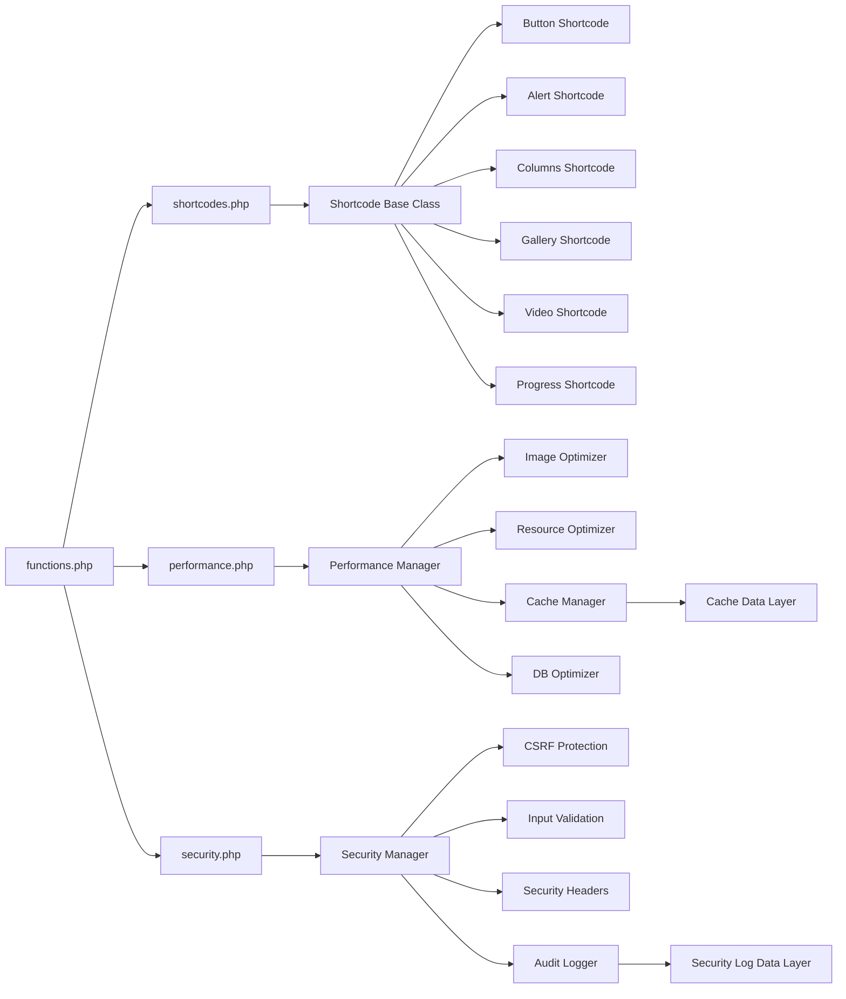
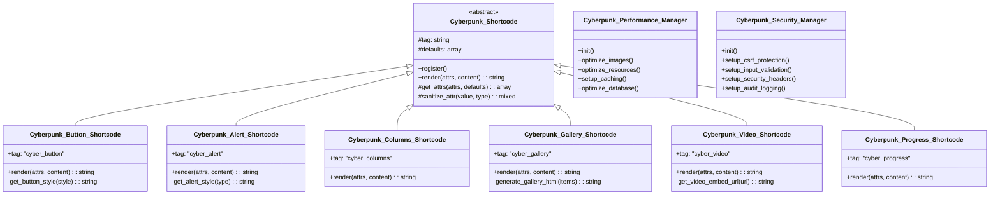

# 🚀 Phase 2.2 剩余功能 - 完整技术架构方案

> **首席架构师设计文档**
> **设计日期**: 2026-03-01
> **项目版本**: 2.2.0 → 2.5.0
> **预计完成**: 6-7 天

---

## 📋 执行摘要

### 设计目标

为 **WordPress Cyberpunk Theme** 的 Phase 2.2 剩余功能设计完整的技术方案，包括：

1. **短代码系统** - 7个常用短代码，增强内容编辑能力
2. **性能优化模块** - 图片、资源、缓存、数据库优化
3. **安全加固模块** - CSRF、输入验证、安全头部、审计日志

### 设计原则

- ✅ **模块化** - 每个功能独立，易于维护
- ✅ **可扩展** - 易于添加新的短代码和优化策略
- ✅ **高性能** - 最小化性能影响
- ✅ **安全性** - 遵循 WordPress 安全最佳实践
- ✅ **赛博朋克风格** - 保持视觉一致性

### 开发时间表

```yaml
Day 1-2:  短代码系统基础 (Button + Alert)
Day 3:    短代码系统高级 (Columns + Gallery)
Day 4:    短代码系统完成 (Video + Progress)
Day 5:    性能优化模块
Day 6:    安全加固模块
Day 7:    集成测试和优化
```

---

## 🏗️ 系统架构设计

### 整体架构图

```mermaid
graph TB
    subgraph "WordPress Core"
        WP[WordPress Core]
    end

    subgraph "Cyberpunk Theme - Phase 2.2"
        direction TB

        subgraph "Shortcode System"
            SC[Shortcode Manager]
            SC1[Button Shortcode]
            SC2[Alert Shortcode]
            SC3[Columns Shortcode]
            SC4[Gallery Shortcode]
            SC5[Video Shortcode]
            SC6[Progress Shortcode]

            SC --> SC1
            SC --> SC2
            SC --> SC3
            SC --> SC4
            SC --> SC5
            SC6
        end

        subgraph "Performance Module"
            PM[Performance Manager]
            PM1[Image Optimizer]
            PM2[Resource Optimizer]
            PM3[Cache Manager]
            PM4[DB Optimizer]

            PM --> PM1
            PM --> PM2
            PM --> PM3
            PM --> PM4
        end

        subgraph "Security Module"
            SM[Security Manager]
            SM1[CSRF Protection]
            SM2[Input Validation]
            SM3[Security Headers]
            SM4[Audit Logger]

            SM --> SM1
            SM --> SM2
            SM --> SM3
            SM4
        end

        subgraph "Database Layer"
            DL[Data Access Layer]
            DL1[Security Log Table]
            DL2[Cache Tables]
            DL3[Performance Metrics]

            DL --> DL1
            DL --> DL2
            DL --> DL3
        end
    end

    WP --> SC
    WP --> PM
    WP --> SM
    WP --> DL

    SC -.->|Assets| ASSETS[CSS/JS]
    PM -.->|Optimize| ASSETS
    SM -.->|Protect| DL
```



### 模块依赖关系图



### 类继承结构图



---

## 📦 模块 1: 短代码系统 (Shortcode System)

### 功能概述

为内容编辑器提供 7 个赛博朋克风格的短代码，增强内容表现力。

### API 接口设计

#### 1. Button Shortcode

```php
/**
 * 霓虹按钮短代码
 *
 * @shortcode [cyber_button]
 *
 * Attributes:
 * - text: string - 按钮文本 (默认: "Click Me")
 * - url: string - 链接地址 (默认: "#")
 * - style: string - 按钮样式 (primary|secondary|accent|ghost)
 * - size: string - 按钮大小 (small|medium|large)
 * - glow: boolean - 是否发光 (默认: true)
 * - new_tab: boolean - 是否新标签打开 (默认: false)
 *
 * @return string HTML output
 */
```

**使用示例**:
```shortcode
[cyber_button text="Download Now" url="#" style="primary" size="large" glow="true"]
```

#### 2. Alert Shortcode

```php
/**
 * 警告框短代码
 *
 * @shortcode [cyber_alert]
 *
 * Attributes:
 * - type: string - 警告类型 (info|success|warning|error)
 * - title: string - 标题 (可选)
 * - dismissible: boolean - 是否可关闭 (默认: true)
 * - icon: boolean - 是否显示图标 (默认: true)
 *
 * Content: 警告消息内容
 *
 * @return string HTML output
 */
```

**使用示例**:
```shortcode
[cyber_alert type="warning" title="System Alert" dismissible="true"]
This is a warning message!
[/cyber_alert]
```

#### 3. Columns Shortcode

```php
/**
 * 列布局短代码
 *
 * @shortcode [cyber_columns] & [cyber_col]
 *
 * Attributes (cyber_columns):
 * - count: int - 列数 (2|3|4) (默认: 2)
 * - gap: string - 列间距 (small|medium|large)
 * - responsive: boolean - 是否响应式 (默认: true)
 *
 * Attributes (cyber_col):
 * - span: int - 跨列数 (1-12)
 *
 * @return string HTML output
 */
```

**使用示例**:
```shortcode
[cyber_columns count="2" gap="medium"]
    [cyber_col]
        Column 1 content
    [/cyber_col]
    [cyber_col]
        Column 2 content
    [/cyber_col]
[/cyber_columns]
```

#### 4. Gallery Shortcode

```php
/**
 * 图片画廊短代码
 *
 * @shortcode [cyber_gallery]
 *
 * Attributes:
 * - ids: string - 图片ID列表 (逗号分隔)
 * - columns: int - 列数 (2-6) (默认: 3)
 * - size: string - 图片尺寸 (thumbnail|medium|large|full)
 * - link: string - 链接方式 (none|file|post)
 * - effect: string - 悬停效果 (zoom|overlay|glow|none)
 * - autoplay: boolean - 幻灯片自动播放 (默认: false)
 * - interval: int - 幻灯片间隔 (毫秒) (默认: 5000)
 *
 * @return string HTML output
 */
```

**使用示例**:
```shortcode
[cyber_gallery ids="1,2,3,4,5,6" columns="3" size="medium" effect="glow"]
```

#### 5. Video Shortcode

```php
/**
 * 视频嵌入短代码
 *
 * @shortcode [cyber_video]
 *
 * Attributes:
 * - url: string - 视频URL (YouTube/Vimeo/自托管)
 * - width: int - 宽度 (默认: 100%)
 * - height: int - 高度 (默认: auto)
 * - autoplay: boolean - 自动播放 (默认: false)
 * - muted: boolean - 静音 (默认: false)
 * - loop: boolean - 循环播放 (默认: false)
 * - poster: string - 封面图URL
 * - aspect_ratio: string - 宽高比 (16:9|4:3|21:9)
 *
 * @return string HTML output
 */
```

**使用示例**:
```shortcode
[cyber_video url="https://youtube.com/watch?v=xxx" aspect_ratio="16:9"]
```

#### 6. Progress Shortcode

```php
/**
 * 进度条短代码
 *
 * @shortcode [cyber_progress]
 *
 * Attributes:
 * - value: int - 进度值 (0-100)
 * - label: string - 标签文本 (可选)
 * - color: string - 颜色 (cyan|magenta|yellow|green)
 * - animated: boolean - 是否动画 (默认: true)
 * - striped: boolean - 是否条纹 (默认: true)
 * - show_percent: boolean - 是否显示百分比 (默认: true)
 *
 * @return string HTML output
 */
```

**使用示例**:
```shortcode
[cyber_progress value="75" label="System Loading" color="cyan" animated="true"]
```

### 数据库设计

短代码系统不需要额外的数据库表，使用 WordPress 自带的 posts 和 postmeta 表存储内容。

### 文件结构

```
inc/
├── shortcodes.php                           # 短代码系统主文件
└── shortcodes/
    ├── class-cyberpunk-shortcode.php       # 短代码基类 (抽象类)
    ├── class-button-shortcode.php          # 按钮短代码
    ├── class-alert-shortcode.php           # 警告框短代码
    ├── class-columns-shortcode.php         # 列布局短代码
    ├── class-gallery-shortcode.php         # 画廊短代码
    ├── class-video-shortcode.php           # 视频短代码
    └── class-progress-shortcode.php        # 进度条短代码

assets/
├── css/
│   └── shortcodes.css                      # 短代码样式 (~400 行)
└── js/
    └── shortcodes.js                       # 短代码脚本 (~300 行)
```

### 代码示例

#### 基础类结构

```php
<?php
/**
 * Cyberpunk Shortcode Base Class
 *
 * @package Cyberpunk_Theme
 * @since 2.3.0
 */

abstract class Cyberpunk_Shortcode {

    /**
     * Shortcode tag
     *
     * @var string
     */
    protected $tag = '';

    /**
     * Default attributes
     *
     * @var array
     */
    protected $defaults = array();

    /**
     * Constructor
     */
    public function __construct() {
        $this->init();
    }

    /**
     * Initialize shortcode
     */
    public function init() {
        add_shortcode($this->tag, array($this, 'render'));
    }

    /**
     * Render shortcode output
     *
     * @param array  $atts    Shortcode attributes
     * @param string $content Shortcode content
     * @return string HTML output
     */
    abstract public function render($atts, $content = '');

    /**
     * Get parsed attributes
     *
     * @param array $atts    User attributes
     * @param array $defaults Default attributes
     * @return array Parsed attributes
     */
    protected function get_attrs($atts, $defaults = array()) {
        return shortcode_atts($defaults, $atts, $this->tag);
    }

    /**
     * Sanitize attribute value
     *
     * @param mixed  $value Attribute value
     * @param string $type  Attribute type
     * @return mixed Sanitized value
     */
    protected function sanitize_attr($value, $type = 'text') {
        switch ($type) {
            case 'text':
                return sanitize_text_field($value);
            case 'html':
                return wp_kses_post($value);
            case 'url':
                return esc_url_raw($value);
            case 'int':
                return intval($value);
            case 'bool':
                return rest_sanitize_boolean($value);
            case 'class':
                return sanitize_html_class($value);
            default:
                return sanitize_text_field($value);
        }
    }

    /**
     * Build CSS class string
     *
     * @param array $classes Array of classes
     * @return string Class string
     */
    protected function build_classes($classes) {
        $classes = array_filter($classes);
        return esc_attr(implode(' ', array_unique($classes)));
    }
}
```

#### Button Shortcode 实现

```php
<?php
/**
 * Cyberpunk Button Shortcode
 *
 * @package Cyberpunk_Theme
 * @since 2.3.0
 */

class Cyberpunk_Button_Shortcode extends Cyberpunk_Shortcode {

    /**
     * Shortcode tag
     *
     * @var string
     */
    protected $tag = 'cyber_button';

    /**
     * Default attributes
     *
     * @var array
     */
    protected $defaults = array(
        'text'     => 'Click Me',
        'url'      => '#',
        'style'    => 'primary',
        'size'     => 'medium',
        'glow'     => 'true',
        'new_tab'  => 'false',
        'id'       => '',
        'class'    => '',
    );

    /**
     * Valid button styles
     *
     * @var array
     */
    private $valid_styles = array('primary', 'secondary', 'accent', 'ghost');

    /**
     * Valid button sizes
     *
     * @var array
     */
    private $valid_sizes = array('small', 'medium', 'large');

    /**
     * Render button shortcode
     *
     * @param array  $atts    Shortcode attributes
     * @param string $content Shortcode content (not used)
     * @return string HTML output
     */
    public function render($atts, $content = '') {

        // Get and parse attributes
        $attrs = $this->get_attrs($atts, $this->defaults);

        // Sanitize attributes
        $text = $this->sanitize_attr($attrs['text'], 'html');
        $url = $this->sanitize_attr($attrs['url'], 'url');
        $style = in_array($attrs['style'], $this->valid_styles) ? $attrs['style'] : 'primary';
        $size = in_array($attrs['size'], $this->valid_sizes) ? $attrs['size'] : 'medium';
        $glow = $this->sanitize_attr($attrs['glow'], 'bool') ? 'true' : 'false';
        $new_tab = $this->sanitize_attr($attrs['new_tab'], 'bool');
        $id = $this->sanitize_attr($attrs['id'], 'text');
        $custom_class = $this->sanitize_attr($attrs['class'], 'class');

        // Build CSS classes
        $classes = array(
            'cyber-button',
            'cyber-button-' . $style,
            'cyber-button-' . $size,
        );

        if ($glow === 'true') {
            $classes[] = 'cyber-button-glow';
        }

        if (!empty($custom_class)) {
            $classes[] = $custom_class;
        }

        $class_string = $this->build_classes($classes);

        // Build target attribute
        $target = $new_tab ? ' target="_blank" rel="noopener noreferrer"' : '';

        // Build ID attribute
        $id_attr = !empty($id) ? ' id="' . esc_attr($id) . '"' : '';

        // Build button HTML
        $output = sprintf(
            '<a href="%s" class="%s"%s%s data-cyber-button>',
            esc_url($url),
            $class_string,
            $id_attr,
            $target
        );

        $output .= '<span class="cyber-button-text">';
        $output .= $text;
        $output .= '</span>';

        $output .= '<span class="cyber-button-overlay"></span>';

        $output .= '</a>';

        return $output;
    }
}
```

### CSS 样式设计

```css
/* ============================================
   Cyberpunk Shortcodes Styles
   ============================================ */

/* Button Base Styles */
.cyber-button {
    display: inline-block;
    position: relative;
    padding: 12px 32px;
    font-family: 'Courier New', monospace;
    font-size: 16px;
    font-weight: 700;
    text-transform: uppercase;
    letter-spacing: 2px;
    text-decoration: none;
    border: 2px solid;
    background: transparent;
    cursor: pointer;
    overflow: hidden;
    transition: all 0.3s ease;
    box-sizing: border-box;
}

.cyber-button-text {
    position: relative;
    z-index: 2;
}

.cyber-button-overlay {
    position: absolute;
    top: 0;
    left: 0;
    width: 100%;
    height: 100%;
    transform: scaleX(0);
    transform-origin: left;
    transition: transform 0.3s ease;
    z-index: 1;
}

/* Button Sizes */
.cyber-button-small {
    padding: 8px 20px;
    font-size: 14px;
}

.cyber-button-medium {
    padding: 12px 32px;
    font-size: 16px;
}

.cyber-button-large {
    padding: 16px 48px;
    font-size: 18px;
}

/* Button Styles - Primary (Cyan) */
.cyber-button-primary {
    color: var(--neon-cyan, #00f0ff);
    border-color: var(--neon-cyan, #00f0ff);
}

.cyber-button-primary .cyber-button-overlay {
    background: var(--neon-cyan, #00f0ff);
}

.cyber-button-primary:hover {
    color: var(--bg-dark, #0a0a0f);
    box-shadow:
        0 0 10px var(--neon-cyan, #00f0ff),
        0 0 20px var(--neon-cyan, #00f0ff),
        0 0 40px var(--neon-cyan, #00f0ff);
}

.cyber-button-primary:hover .cyber-button-overlay {
    transform: scaleX(1);
}

/* Button Styles - Secondary (Magenta) */
.cyber-button-secondary {
    color: var(--neon-magenta, #ff00ff);
    border-color: var(--neon-magenta, #ff00ff);
}

.cyber-button-secondary .cyber-button-overlay {
    background: var(--neon-magenta, #ff00ff);
}

.cyber-button-secondary:hover {
    color: var(--bg-dark, #0a0a0f);
    box-shadow:
        0 0 10px var(--neon-magenta, #ff00ff),
        0 0 20px var(--neon-magenta, #ff00ff),
        0 0 40px var(--neon-magenta, #ff00ff);
}

/* Button Glow Effect */
.cyber-button-glow {
    animation: cyber-button-pulse 2s ease-in-out infinite;
}

@keyframes cyber-button-pulse {
    0%, 100% {
        box-shadow:
            0 0 5px currentColor,
            0 0 10px currentColor;
    }
    50% {
        box-shadow:
            0 0 10px currentColor,
            0 0 20px currentColor,
            0 0 30px currentColor;
    }
}

/* ============================================
   Alert Shortcodes Styles
   ============================================ */

.cyber-alert {
    position: relative;
    padding: 20px 24px;
    margin-bottom: 24px;
    border-left: 4px solid;
    background: var(--bg-card, #12121a);
    border-radius: 4px;
    overflow: hidden;
}

.cyber-alert::before {
    content: '';
    position: absolute;
    top: 0;
    left: 0;
    width: 100%;
    height: 100%;
    background: linear-gradient(90deg,
        rgba(0, 240, 255, 0.05) 0%,
        transparent 100%);
    pointer-events: none;
}

.cyber-alert-info {
    border-color: var(--neon-cyan, #00f0ff);
}

.cyber-alert-info .cyber-alert-icon {
    color: var(--neon-cyan, #00f0ff);
}

.cyber-alert-success {
    border-color: #00ff88;
}

.cyber-alert-success .cyber-alert-icon {
    color: #00ff88;
}

.cyber-alert-warning {
    border-color: var(--neon-yellow, #f0ff00);
}

.cyber-alert-warning .cyber-alert-icon {
    color: var(--neon-yellow, #f0ff00);
}

.cyber-alert-error {
    border-color: var(--neon-magenta, #ff00ff);
}

.cyber-alert-error .cyber-alert-icon {
    color: var(--neon-magenta, #ff00ff);
}

.cyber-alert-header {
    display: flex;
    align-items: center;
    justify-content: space-between;
    margin-bottom: 12px;
}

.cyber-alert-title {
    display: flex;
    align-items: center;
    gap: 12px;
    font-size: 18px;
    font-weight: 700;
    text-transform: uppercase;
    letter-spacing: 1px;
}

.cyber-alert-icon {
    font-size: 24px;
}

.cyber-alert-close {
    background: none;
    border: none;
    color: var(--text-dim, #888899);
    font-size: 20px;
    cursor: pointer;
    padding: 4px;
    line-height: 1;
    transition: color 0.3s ease;
}

.cyber-alert-close:hover {
    color: var(--text-main, #e0e0e0);
}

/* ============================================
   Progress Shortcodes Styles
   ============================================ */

.cyber-progress {
    margin-bottom: 24px;
}

.cyber-progress-header {
    display: flex;
    justify-content: space-between;
    align-items: center;
    margin-bottom: 8px;
}

.cyber-progress-label {
    font-size: 14px;
    font-weight: 600;
    text-transform: uppercase;
    letter-spacing: 1px;
    color: var(--text-main, #e0e0e0);
}

.cyber-progress-percent {
    font-size: 14px;
    font-weight: 700;
    color: var(--text-main, #e0e0e0);
}

.cyber-progress-bar {
    position: relative;
    height: 24px;
    background: var(--bg-darker, #050508);
    border: 1px solid var(--border-glow, rgba(0, 240, 255, 0.3));
    border-radius: 12px;
    overflow: hidden;
}

.cyber-progress-fill {
    position: absolute;
    top: 0;
    left: 0;
    height: 100%;
    background: linear-gradient(90deg,
        var(--neon-cyan, #00f0ff) 0%,
        rgba(0, 240, 255, 0.7) 100%);
    border-radius: 12px;
    transition: width 1s ease;
    box-shadow:
        0 0 10px var(--neon-cyan, #00f0ff),
        inset 0 0 10px rgba(0, 240, 255, 0.5);
}

.cyber-progress-fill.animated {
    animation: cyber-progress-shine 2s linear infinite;
}

.cyber-progress-fill.striped {
    background-image: linear-gradient(
        45deg,
        rgba(255, 255, 255, 0.15) 25%,
        transparent 25%,
        transparent 50%,
        rgba(255, 255, 255, 0.15) 50%,
        rgba(255, 255, 255, 0.15) 75%,
        transparent 75%,
        transparent
    );
    background-size: 20px 20px;
    animation: cyber-progress-stripes 1s linear infinite;
}

@keyframes cyber-progress-shine {
    0% {
        filter: brightness(1);
    }
    50% {
        filter: brightness(1.2);
    }
    100% {
        filter: brightness(1);
    }
}

@keyframes cyber-progress-stripes {
    0% {
        background-position: 0 0;
    }
    100% {
        background-position: 20px 0;
    }
}

/* Progress Colors */
.cyber-progress-fill-cyan {
    background: linear-gradient(90deg,
        var(--neon-cyan, #00f0ff) 0%,
        rgba(0, 240, 255, 0.7) 100%);
    box-shadow:
        0 0 10px var(--neon-cyan, #00f0ff),
        inset 0 0 10px rgba(0, 240, 255, 0.5);
}

.cyber-progress-fill-magenta {
    background: linear-gradient(90deg,
        var(--neon-magenta, #ff00ff) 0%,
        rgba(255, 0, 255, 0.7) 100%);
    box-shadow:
        0 0 10px var(--neon-magenta, #ff00ff),
        inset 0 0 10px rgba(255, 0, 255, 0.5);
}

.cyber-progress-fill-yellow {
    background: linear-gradient(90deg,
        var(--neon-yellow, #f0ff00) 0%,
        rgba(240, 255, 0, 0.7) 100%);
    box-shadow:
        0 0 10px var(--neon-yellow, #f0ff00),
        inset 0 0 10px rgba(240, 255, 0, 0.5);
}

.cyber-progress-fill-green {
    background: linear-gradient(90deg,
        #00ff88 0%,
        rgba(0, 255, 136, 0.7) 100%);
    box-shadow:
        0 0 10px #00ff88,
        inset 0 0 10px rgba(0, 255, 136, 0.5);
}

/* ============================================
   Columns Shortcodes Styles
   ============================================ */

.cyber-columns {
    display: grid;
    gap: 24px;
    margin-bottom: 32px;
}

.cyber-columns-2 {
    grid-template-columns: repeat(2, 1fr);
}

.cyber-columns-3 {
    grid-template-columns: repeat(3, 1fr);
}

.cyber-columns-4 {
    grid-template-columns: repeat(4, 1fr);
}

.cyber-columns-gap-small {
    gap: 16px;
}

.cyber-columns-gap-medium {
    gap: 24px;
}

.cyber-columns-gap-large {
    gap: 32px;
}

.cyber-col {
    position: relative;
}

@media (max-width: 768px) {
    .cyber-columns.responsive {
        grid-template-columns: 1fr;
    }

    .cyber-columns-2.responsive,
    .cyber-columns-3.responsive,
    .cyber-columns-4.responsive {
        grid-template-columns: 1fr;
    }
}

/* ============================================
   Gallery Shortcodes Styles
   ============================================ */

.cyber-gallery {
    display: grid;
    gap: 16px;
    margin-bottom: 32px;
}

.cyber-gallery-2 {
    grid-template-columns: repeat(2, 1fr);
}

.cyber-gallery-3 {
    grid-template-columns: repeat(3, 1fr);
}

.cyber-gallery-4 {
    grid-template-columns: repeat(4, 1fr);
}

.cyber-gallery-5 {
    grid-template-columns: repeat(5, 1fr);
}

.cyber-gallery-6 {
    grid-template-columns: repeat(6, 1fr);
}

.cyber-gallery-item {
    position: relative;
    overflow: hidden;
    border: 2px solid transparent;
    transition: all 0.3s ease;
}

.cyber-gallery-item img {
    width: 100%;
    height: auto;
    display: block;
    transition: transform 0.3s ease;
}

/* Gallery Effects */

/* Zoom Effect */
.cyber-gallery-effect-zoom:hover img {
    transform: scale(1.1);
}

/* Glow Effect */
.cyber-gallery-effect-glow {
    border-color: var(--neon-cyan, #00f0ff);
}

.cyber-gallery-effect-glow:hover {
    box-shadow:
        0 0 10px var(--neon-cyan, #00f0ff),
        0 0 20px var(--neon-cyan, #00f0ff);
}

/* Overlay Effect */
.cyber-gallery-overlay {
    position: absolute;
    top: 0;
    left: 0;
    width: 100%;
    height: 100%;
    background: linear-gradient(
        135deg,
        rgba(0, 240, 255, 0.8) 0%,
        rgba(255, 0, 255, 0.8) 100%
    );
    display: flex;
    align-items: center;
    justify-content: center;
    opacity: 0;
    transition: opacity 0.3s ease;
}

.cyber-gallery-effect-overlay .cyber-gallery-overlay:hover {
    opacity: 1;
}

@media (max-width: 768px) {
    .cyber-gallery-3,
    .cyber-gallery-4,
    .cyber-gallery-5,
    .cyber-gallery-6 {
        grid-template-columns: repeat(2, 1fr);
    }
}

@media (max-width: 480px) {
    .cyber-gallery-2,
    .cyber-gallery-3,
    .cyber-gallery-4,
    .cyber-gallery-5,
    .cyber-gallery-6 {
        grid-template-columns: 1fr;
    }
}

/* ============================================
   Video Shortcodes Styles
   ============================================ */

.cyber-video-wrapper {
    position: relative;
    width: 100%;
    margin-bottom: 32px;
    border: 2px solid var(--neon-cyan, #00f0ff);
    box-shadow:
        0 0 10px var(--neon-cyan, #00f0ff),
        0 0 20px rgba(0, 240, 255, 0.3);
    background: var(--bg-darker, #050508);
}

.cyber-video-wrapper::before {
    content: '';
    position: absolute;
    top: -2px;
    left: -2px;
    right: -2px;
    bottom: -2px;
    background: linear-gradient(45deg,
        var(--neon-cyan, #00f0ff),
        var(--neon-magenta, #ff00ff),
        var(--neon-yellow, #f0ff00),
        var(--neon-cyan, #00f0ff));
    background-size: 400% 400%;
    z-index: -1;
    border-radius: 4px;
    animation: cyber-video-border 3s ease infinite;
}

@keyframes cyber-video-border {
    0% { background-position: 0% 50%; }
    50% { background-position: 100% 50%; }
    100% { background-position: 0% 50%; }
}

.cyber-video-aspect-16-9 {
    aspect-ratio: 16 / 9;
}

.cyber-video-aspect-4-3 {
    aspect-ratio: 4 / 3;
}

.cyber-video-aspect-21-9 {
    aspect-ratio: 21 / 9;
}

.cyber-video-wrapper iframe,
.cyber-video-wrapper video {
    width: 100%;
    height: 100%;
    border: none;
    display: block;
}
```

### JavaScript 功能

```javascript
/**
 * Cyberpunk Shortcodes JavaScript
 *
 * @package Cyberpunk_Theme
 * @since 2.3.0
 */

(function() {
    'use strict';

    /**
     * Alert Shortcode - Dismissible functionality
     */
    const initAlerts = () => {
        const closeButtons = document.querySelectorAll('.cyber-alert-close');

        closeButtons.forEach(button => {
            button.addEventListener('click', function() {
                const alert = this.closest('.cyber-alert');
                if (alert) {
                    // Fade out animation
                    alert.style.transition = 'opacity 0.3s ease, transform 0.3s ease';
                    alert.style.opacity = '0';
                    alert.style.transform = 'translateX(100%)';

                    setTimeout(() => {
                        alert.remove();
                    }, 300);
                }
            });
        });
    };

    /**
     * Progress Bar - Animate on scroll
     */
    const initProgressBars = () => {
        const progressBars = document.querySelectorAll('.cyber-progress-fill[data-value]');

        const observer = new IntersectionObserver((entries) => {
            entries.forEach(entry => {
                if (entry.isIntersecting) {
                    const bar = entry.target;
                    const value = bar.getAttribute('data-value');

                    setTimeout(() => {
                        bar.style.width = value + '%';
                    }, 200);

                    observer.unobserve(bar);
                }
            });
        }, { threshold: 0.5 });

        progressBars.forEach(bar => {
            observer.observe(bar);
        });
    };

    /**
     * Gallery - Lightbox functionality
     */
    const initGallery = () => {
        const galleryItems = document.querySelectorAll('.cyber-gallery-item[data-lightbox="true"]');

        galleryItems.forEach(item => {
            item.addEventListener('click', function() {
                const img = this.querySelector('img');
                const src = img.getAttribute('src');
                const alt = img.getAttribute('alt');

                // Create lightbox
                const lightbox = document.createElement('div');
                lightbox.className = 'cyber-lightbox';
                lightbox.innerHTML = `
                    <div class="cyber-lightbox-content">
                        
                        <button class="cyber-lightbox-close">&times;</button>
                    </div>
                `;

                document.body.appendChild(lightbox);

                // Fade in
                setTimeout(() => {
                    lightbox.classList.add('active');
                }, 10);

                // Close handlers
                const closeBtn = lightbox.querySelector('.cyber-lightbox-close');
                closeBtn.addEventListener('click', closeLightbox);
                lightbox.addEventListener('click', (e) => {
                    if (e.target === lightbox) {
                        closeLightbox();
                    }
                });

                function closeLightbox() {
                    lightbox.classList.remove('active');
                    setTimeout(() => {
                        lightbox.remove();
                    }, 300);
                }

                // Escape key to close
                document.addEventListener('keydown', function escHandler(e) {
                    if (e.key === 'Escape') {
                        closeLightbox();
                        document.removeEventListener('keydown', escHandler);
                    }
                });
            });
        });
    };

    /**
     * Video - Autoplay with intersection observer
     */
    const initVideos = () => {
        const videos = document.querySelectorAll('.cyber-video-wrapper video[data-autoplay="true"]');

        const observer = new IntersectionObserver((entries) => {
            entries.forEach(entry => {
                const video = entry.target;

                if (entry.isIntersecting) {
                    video.play().catch(err => {
                        console.log('Autoplay prevented:', err);
                    });
                } else {
                    video.pause();
                }
            });
        }, { threshold: 0.5 });

        videos.forEach(video => {
            observer.observe(video);
        });
    };

    /**
     * Initialize all shortcodes
     */
    const init = () => {
        initAlerts();
        initProgressBars();
        initGallery();
        initVideos();
    };

    // Run on DOM ready
    if (document.readyState === 'loading') {
        document.addEventListener('DOMContentLoaded', init);
    } else {
        init();
    }

})();
```

---

## 🚀 模块 2: 性能优化模块 (Performance Module)

### 功能概述

全面提升主题性能，包括图片优化、资源优化、缓存策略和数据库优化。

### API 接口设计

```php
/**
 * Performance Manager API
 *
 * 主要类: Cyberpunk_Performance_Manager
 */

class Cyberpunk_Performance_Manager {

    /**
     * 初始化性能优化
     */
    public function init();

    /**
     * 图片优化
     */
    public function optimize_images();

    /**
     * 资源优化 (CSS/JS)
     */
    public function optimize_resources();

    /**
     * 设置缓存
     */
    public function setup_caching();

    /**
     * 数据库优化
     */
    public function optimize_database();
}
```

### 数据库设计

#### 缓存表结构

```sql
CREATE TABLE IF NOT EXISTS wp_cyberpunk_cache (
    id bigint(20) unsigned NOT NULL AUTO_INCREMENT,
    cache_key varchar(191) NOT NULL,
    cache_value longtext NOT NULL,
    cache_expiration bigint(20) unsigned NOT NULL,
    created_at datetime NOT NULL DEFAULT CURRENT_TIMESTAMP,
    PRIMARY KEY (id),
    UNIQUE KEY cache_key (cache_key),
    KEY cache_expiration (cache_expiration)
) ENGINE=InnoDB DEFAULT CHARSET=utf8mb4 COLLATE=utf8mb4_unicode_ci;
```

### 文件结构

```
inc/
├── performance.php                         # 性能优化主文件
└── performance/
    ├── class-performance-manager.php       # 性能管理器
    ├── class-image-optimizer.php           # 图片优化器
    ├── class-resource-optimizer.php        # 资源优化器
    ├── class-cache-manager.php             # 缓存管理器
    └── class-db-optimizer.php              # 数据库优化器

assets/js/
└── lazy-load.js                            # 懒加载脚本
```

### 核心功能实现

#### Image Optimizer

```php
<?php
/**
 * Cyberpunk Image Optimizer
 *
 * @package Cyberpunk_Theme
 * @since 2.4.0
 */

class Cyberpunk_Image_Optimizer {

    /**
     * Supported image formats
     *
     * @var array
     */
    private $supported_formats = array('jpg', 'jpeg', 'png', 'gif');

    /**
     * WebP quality
     *
     * @var int
     */
    private $webp_quality = 85;

    /**
     * Constructor
     */
    public function __construct() {
        // Add WebP support
        add_filter('wp_generate_attachment_metadata', array($this, 'generate_webp'), 10, 2);

        // Add lazy loading attributes
        add_filter('wp_get_attachment_image_attributes', array($this, 'add_lazy_loading'), 10, 3);

        // Add responsive image sources
        add_filter('wp_get_attachment_image_sources', array($this, 'add_webp_source'), 10, 3);

        // Register image sizes
        add_action('after_setup_theme', array($this, 'register_image_sizes'));
    }

    /**
     * Register optimized image sizes
     */
    public function register_image_sizes() {
        add_image_size('cyberpunk-hero', 1920, 1080, true);
        add_image_size('cyberpunk-featured-xl', 1600, 900, true);
        add_image_size('cyberpunk-card-xl', 800, 600, true);
    }

    /**
     * Generate WebP version of images
     *
     * @param array $metadata Attachment metadata
     * @param int   $attachment_id Attachment ID
     * @return array Updated metadata
     */
    public function generate_webp($metadata, $attachment_id) {

        if (!function_exists('imagecreatefromjpeg')) {
            return $metadata;
        }

        $upload_dir = wp_upload_dir();
        $base_path = $upload_dir['basedir'];

        // Process main image
        if (isset($metadata['file'])) {
            $file_path = $base_path . '/' . $metadata['file'];
            $this->convert_to_webp($file_path);
        }

        // Process image sizes
        if (isset($metadata['sizes']) && is_array($metadata['sizes'])) {
            foreach ($metadata['sizes'] as $size => $size_data) {
                $file_path = $base_path . '/' . dirname($metadata['file']) . '/' . $size_data['file'];
                $this->convert_to_webp($file_path);
            }
        }

        return $metadata;
    }

    /**
     * Convert image to WebP format
     *
     * @param string $file_path Image file path
     * @return bool Success
     */
    private function convert_to_webp($file_path) {

        if (!file_exists($file_path)) {
            return false;
        }

        $file_info = pathinfo($file_path);
        $extension = strtolower($file_info['extension']);

        if (!in_array($extension, $this->supported_formats)) {
            return false;
        }

        $webp_path = $file_info['dirname'] . '/' . $file_info['filename'] . '.webp';

        // Skip if WebP already exists
        if (file_exists($webp_path)) {
            return true;
        }

        // Create image resource based on format
        switch ($extension) {
            case 'jpg':
            case 'jpeg':
                $image = imagecreatefromjpeg($file_path);
                break;
            case 'png':
                $image = imagecreatefrompng($file_path);
                break;
            case 'gif':
                $image = imagecreatefromgif($file_path);
                break;
            default:
                return false;
        }

        if (!$image) {
            return false;
        }

        // Convert to WebP
        $result = imagewebp($image, $webp_path, $this->webp_quality);

        imagedestroy($image);

        return $result;
    }

    /**
     * Add lazy loading attribute to images
     *
     * @param array        $attr       Image attributes
     * @param WP_Post      $attachment Attachment object
     * @param string|array $size       Image size
     * @return array Updated attributes
     */
    public function add_lazy_loading($attr, $attachment, $size) {
        $attr['loading'] = 'lazy';
        $attr['decoding'] = 'async';

        return $attr;
    }

    /**
     * Add WebP source to responsive images
     *
     * @param array  $image_sources Image sources
     * @param int    $attachment_id Attachment ID
     * @param string $size          Image size
     * @return array Updated sources
     */
    public function add_webp_source($image_sources, $attachment_id, $size) {

        foreach ($image_sources as &$source) {
            $url = $source['url'];
            $webp_url = str_replace(array('.jpg', '.jpeg', '.png'), '.webp', $url);

            // Check if WebP version exists
            $upload_dir = wp_upload_dir();
            $webp_path = str_replace($upload_dir['baseurl'], $upload_dir['basedir'], $webp_url);

            if (file_exists($webp_path)) {
                $source['webp_url'] = $webp_url;
            }
        }

        return $image_sources;
    }
}
```

#### Cache Manager

```php
<?php
/**
 * Cyberpunk Cache Manager
 *
 * @package Cyberpunk_Theme
 * @since 2.4.0
 */

class Cyberpunk_Cache_Manager {

    /**
     * Cache group name
     *
     * @var string
     */
    private $cache_group = 'cyberpunk';

    /**
     * Default cache expiration (1 hour)
     *
     * @var int
     */
    private $default_expiration = HOUR_IN_SECONDS;

    /**
     * Constructor
     */
    public function __construct() {
        // Schedule cache cleanup
        add_action('wp', array($this, 'maybe_schedule_cleanup'));
        add_action('cyberpunk_cache_cleanup', array($this, 'cleanup_expired_cache'));
    }

    /**
     * Schedule cache cleanup if not scheduled
     */
    public function maybe_schedule_cleanup() {
        if (!wp_next_scheduled('cyberpunk_cache_cleanup')) {
            wp_schedule_event(time(), 'daily', 'cyberpunk_cache_cleanup');
        }
    }

    /**
     * Get cached value
     *
     * @param string $key Cache key
     * @return mixed|false Cached value or false if not found
     */
    public function get($key) {
        return wp_cache_get($key, $this->cache_group);
    }

    /**
     * Set cached value
     *
     * @param string $key  Cache key
     * @param mixed  $value Value to cache
     * @param int    $expiration Expiration time in seconds
     * @return bool Success
     */
    public function set($key, $value, $expiration = null) {

        if ($expiration === null) {
            $expiration = $this->default_expiration;
        }

        return wp_cache_set($key, $value, $this->cache_group, $expiration);
    }

    /**
     * Delete cached value
     *
     * @param string $key Cache key
     * @return bool Success
     */
    public function delete($key) {
        return wp_cache_delete($key, $this->cache_group);
    }

    /**
     * Clear all cache
     *
     * @return bool Success
     */
    public function clear() {
        return wp_cache_flush_group($this->cache_group);
    }

    /**
     * Fragment cache for expensive operations
     *
     * @param string   $key Cache key
     * @param callable $callback Callback to generate content
     * @param int      $expiration Expiration time
     * @return mixed Cached or generated content
     */
    public function remember_fragment($key, $callback, $expiration = null) {

        $value = $this->get($key);

        if ($value !== false) {
            return $value;
        }

        $value = $callback();
        $this->set($key, $value, $expiration);

        return $value;
    }

    /**
     * Cleanup expired cache
     */
    public function cleanup_expired_cache() {
        // Clean up transients
        global $wpdb;

        $wpdb->query(
            "DELETE FROM {$wpdb->options}
            WHERE option_name LIKE '_transient_%'
            AND option_value < UNIX_TIMESTAMP()"
        );

        // Clean up object cache
        $this->clear();
    }

    /**
     * Get widget cache key
     *
     * @param string $widget_id Widget ID
     * @return string Cache key
     */
    public function get_widget_cache_key($widget_id) {
        return 'widget_' . $widget_id;
    }

    /**
     * Get query cache key
     *
     * @param string $query_type Query type
     * @param array  $args Query arguments
     * @return string Cache key
     */
    public function get_query_cache_key($query_type, $args = array()) {
        $key = 'query_' . $query_type;

        if (!empty($args)) {
            $key .= '_' . md5(serialize($args));
        }

        return $key;
    }
}
```

#### Resource Optimizer

```php
<?php
/**
 * Cyberpunk Resource Optimizer
 *
 * @package Cyberpunk_Theme
 * @since 2.4.0
 */

class Cyberpunk_Resource_Optimizer {

    /**
     * Constructor
     */
    public function __construct() {
        // Defer non-critical CSS
        add_filter('style_loader_tag', array($this, 'defer_non_critical_css'), 10, 3);

        // Defer non-critical JS
        add_filter('script_loader_tag', array($this, 'defer_non_critical_js'), 10, 3);

        // Preload critical resources
        add_action('wp_head', array($this, 'preload_critical_resources'), 1);

        // Minify HTML output
        add_action('wp_head', array($this, 'start_buffer'), 0);
        add_action('wp_footer', array($this, 'end_buffer'), PHP_INT_MAX);
    }

    /**
     * Start output buffer for minification
     */
    public function start_buffer() {
        if (!is_admin()) {
            ob_start(array($this, 'minify_html'));
        }
    }

    /**
     * End output buffer
     */
    public function end_buffer() {
        if (!is_admin() && ob_get_level() > 0) {
            ob_end_flush();
        }
    }

    /**
     * Minify HTML output
     *
     * @param string $html HTML content
     * @return string Minified HTML
     */
    public function minify_html($html) {

        // Remove comments
        $html = preg_replace('/<!--(?!\s*(?:\[if [^\]]+]|<!|>))(?:(?!-->).)*-->/s', '', $html);

        // Remove extra whitespace
        $html = preg_replace('/\s+/', ' ', $html);

        // Remove whitespace between tags
        $html = preg_replace('/>\s+</', '><', $html);

        return $html;
    }

    /**
     * Defer non-critical CSS
     *
     * @param string $tag HTML tag
     * @param string $handle Style handle
     * @param string $href Style href
     * @return string Modified tag
     */
    public function defer_non_critical_css($tag, $handle, $href) {

        $critical_styles = array('cyberpunk-style', 'cyberpunk-main-styles');

        if (!in_array($handle, $critical_styles)) {
            return str_replace("rel='stylesheet'", "rel='preload' as='style' onload=\"this.onload=null;this.rel='stylesheet'\"", $tag);
        }

        return $tag;
    }

    /**
     * Defer non-critical JavaScript
     *
     * @param string $tag HTML tag
     * @param string $handle Script handle
     * @param string $src Script src
     * @return string Modified tag
     */
    public function defer_non_critical_js($tag, $handle, $src) {

        $critical_scripts = array('jquery', 'cyberpunk-main');

        if (!in_array($handle, $critical_scripts)) {
            return str_replace(' src', ' defer src', $tag);
        }

        return $tag;
    }

    /**
     * Preload critical resources
     */
    public function preload_critical_resources() {

        // Preload fonts
        echo '<link rel="preconnect" href="https://fonts.googleapis.com">' . "\n";
        echo '<link rel="preconnect" href="https://fonts.gstatic.com" crossorigin>' . "\n";

        // Preload critical CSS
        echo '<link rel="preload" href="' . get_stylesheet_uri() . '" as="style">' . "\n";
    }

    /**
     * Add async/defer attributes
     *
     * @param string $tag Script tag
     * @param string $handle Script handle
     * @return string Modified tag
     */
    public function add_script_attributes($tag, $handle) {

        $async_scripts = array();
        $defer_scripts = array('cyberpunk-main', 'cyberpunk-ajax', 'cyberpunk-widgets');

        if (in_array($handle, $async_scripts)) {
            return str_replace(' src', ' async src', $tag);
        } elseif (in_array($handle, $defer_scripts)) {
            return str_replace(' src', ' defer src', $tag);
        }

        return $tag;
    }
}
```

---

## 🔒 模块 3: 安全加固模块 (Security Module)

### 功能概述

提供企业级安全防护，包括 CSRF 保护、输入验证、安全头部和审计日志。

### API 接口设计

```php
/**
 * Security Manager API
 *
 * 主要类: Cyberpunk_Security_Manager
 */

class Cyberpunk_Security_Manager {

    /**
     * 初始化安全模块
     */
    public function init();

    /**
     * 设置 CSRF 保护
     */
    public function setup_csrf_protection();

    /**
     * 设置输入验证
     */
    public function setup_input_validation();

    /**
     * 设置安全头部
     */
    public function setup_security_headers();

    /**
     * 设置审计日志
     */
    public function setup_audit_logging();
}
```

### 数据库设计

#### 安全审计日志表

```sql
CREATE TABLE IF NOT EXISTS wp_cyberpunk_security_log (
    id bigint(20) unsigned NOT NULL AUTO_INCREMENT,
    user_id bigint(20) unsigned DEFAULT NULL,
    event_type varchar(100) NOT NULL,
    event_action varchar(100) NOT NULL,
    event_description text,
    ip_address varchar(45) DEFAULT NULL,
    user_agent varchar(512) DEFAULT NULL,
    request_uri varchar(512) DEFAULT NULL,
    event_severity enum('info','warning','critical') DEFAULT 'info',
    created_at datetime NOT NULL DEFAULT CURRENT_TIMESTAMP,
    PRIMARY KEY (id),
    KEY user_id (user_id),
    KEY event_type (event_type),
    KEY event_severity (event_severity),
    KEY created_at (created_at),
    FOREIGN KEY (user_id) REFERENCES wp_users(id) ON DELETE SET NULL
) ENGINE=InnoDB DEFAULT CHARSET=utf8mb4 COLLATE=utf8mb4_unicode_ci;
```

### 文件结构

```
inc/
├── security.php                            # 安全模块主文件
└── security/
    ├── class-security-manager.php          # 安全管理器
    ├── class-csrf-protection.php           # CSRF 保护
    ├── class-input-validation.php          # 输入验证
    ├── class-security-headers.php          # 安全头部
    └── class-audit-logger.php              # 审计日志

inc/database/
└── class-security-log.php                  # 安全日志数据层
```

### 核心功能实现

#### CSRF Protection

```php
<?php
/**
 * Cyberpunk CSRF Protection
 *
 * @package Cyberpunk_Theme
 * @since 2.5.0
 */

class Cyberpunk_CSRF_Protection {

    /**
     * Token meta key
     *
     * @var string
     */
    private $token_meta_key = '_cyberpunk_csrf_token';

    /**
     * Token expiration (24 hours)
     *
     * @var int
     */
    private $token_expiration = DAY_IN_SECONDS;

    /**
     * Constructor
     */
    public function __construct() {
        // Generate token for logged-in users
        add_action('init', array($this, 'maybe_generate_token'));

        // Validate token on form submission
        add_action('admin_post_', array($this, 'validate_token'));
        add_action('admin_post_nopriv_', array($this, 'validate_token'));

        // Add token to forms
        add_action('wp_footer', array($this, 'output_token_field'));
    }

    /**
     * Generate CSRF token for user
     */
    public function maybe_generate_token() {

        if (!is_user_logged_in()) {
            return;
        }

        $user_id = get_current_user_id();
        $token = $this->get_user_token($user_id);

        if (empty($token) || $this->is_token_expired($user_id)) {
            $this->generate_token($user_id);
        }
    }

    /**
     * Generate new CSRF token
     *
     * @param int $user_id User ID
     * @return string Token
     */
    public function generate_token($user_id = null) {

        if ($user_id === null) {
            $user_id = get_current_user_id();
        }

        $token = wp_generate_password(32, false);
        $hashed_token = wp_hash_password($token);

        update_user_meta($user_id, $this->token_meta_key, array(
            'token' => $hashed_token,
            'created' => current_time('timestamp'),
        ));

        return $token;
    }

    /**
     * Get user's CSRF token
     *
     * @param int $user_id User ID
     * @return string|false Token or false
     */
    public function get_user_token($user_id = null) {

        if ($user_id === null) {
            $user_id = get_current_user_id();
        }

        $token_data = get_user_meta($user_id, $this->token_meta_key, true);

        if (empty($token_data) || !isset($token_data['token'])) {
            return false;
        }

        return $token_data['token'];
    }

    /**
     * Check if token is expired
     *
     * @param int $user_id User ID
     * @return bool Expired
     */
    private function is_token_expired($user_id) {

        $token_data = get_user_meta($user_id, $this->token_meta_key, true);

        if (empty($token_data) || !isset($token_data['created'])) {
            return true;
        }

        $age = current_time('timestamp') - $token_data['created'];

        return $age > $this->token_expiration;
    }

    /**
     * Validate CSRF token
     *
     * @param string $token Token to validate
     * @return bool Valid
     */
    public function validate_token($token = null) {

        if ($token === null) {
            $token = $this->get_posted_token();
        }

        if (empty($token)) {
            return false;
        }

        $user_id = get_current_user_id();
        $stored_token = $this->get_user_token($user_id);

        if (empty($stored_token)) {
            return false;
        }

        return wp_check_password($token, $stored_token, $user_id);
    }

    /**
     * Get posted token
     *
     * @return string|false Token
     */
    private function get_posted_token() {

        if (isset($_POST['cyberpunk_csrf_token'])) {
            return sanitize_text_field($_POST['cyberpunk_csrf_token']);
        }

        if (isset($_POST['_wp_http_referer'])) {
            $referer = parse_url($_POST['_wp_http_referer'], PHP_URL_QUERY);
            parse_str($referer, $query);

            if (isset($query['cyberpunk_csrf_token'])) {
                return sanitize_text_field($query['cyberpunk_csrf_token']);
            }
        }

        return false;
    }

    /**
     * Output token field
     */
    public function output_token_field() {

        if (!is_user_logged_in()) {
            return;
        }

        $user_id = get_current_user_id();
        $token = $this->get_user_token($user_id);

        if (empty($token)) {
            return;
        }

        echo '<input type="hidden" name="cyberpunk_csrf_token" value="' . esc_attr($token) . '" />';
    }

    /**
     * Output AJAX nonce
     */
    public function output_ajax_nonce() {

        if (!is_user_logged_in()) {
            return;
        }

        $user_id = get_current_user_id();
        $token = $this->get_user_token($user_id);

        if (empty($token)) {
            $token = $this->generate_token($user_id);
        }

        return $token;
    }
}
```

#### Audit Logger

```php
<?php
/**
 * Cyberpunk Audit Logger
 *
 * @package Cyberpunk_Theme
 * @since 2.5.0
 */

class Cyberpunk_Audit_Logger {

    /**
     * Log data layer
     *
     * @var Cyberpunk_Security_Log
     */
    private $data_layer;

    /**
     * Constructor
     */
    public function __construct() {
        require_once get_template_directory() . '/inc/database/class-security-log.php';
        $this->data_layer = new Cyberpunk_Security_Log();

        // Log failed login attempts
        add_action('wp_login_failed', array($this, 'log_failed_login'), 10, 2);

        // Log successful logins
        add_action('wp_login', array($this, 'log_successful_login'), 10, 2);

        // Log user logout
        add_action('wp_logout', array($this, 'log_logout'));

        // Log password changes
        add_action('after_password_reset', array($this, 'log_password_reset'), 10, 2);
    }

    /**
     * Log security event
     *
     * @param string $event_type Event type
     * @param string $event_action Event action
     * @param string $event_description Event description
     * @param string $severity Event severity (info|warning|critical)
     */
    public function log($event_type, $event_action, $event_description = '', $severity = 'info') {

        $data = array(
            'user_id' => is_user_logged_in() ? get_current_user_id() : null,
            'event_type' => sanitize_text_field($event_type),
            'event_action' => sanitize_text_field($event_action),
            'event_description' => sanitize_text_field($event_description),
            'ip_address' => $this->get_client_ip(),
            'user_agent' => sanitize_text_field($this->get_user_agent()),
            'request_uri' => sanitize_text_field($this->get_request_uri()),
            'event_severity' => in_array($severity, array('info', 'warning', 'critical')) ? $severity : 'info',
        );

        return $this->data_layer->insert($data);
    }

    /**
     * Log failed login attempt
     *
     * @param string $username Username
     * @param WP_Error $error Error object
     */
    public function log_failed_login($username, $error) {

        $this->log(
            'auth',
            'login_failed',
            sprintf('Failed login attempt for username: %s', $username),
            'warning'
        );
    }

    /**
     * Log successful login
     *
     * @param string $user_login Username
     * @param WP_User $user User object
     */
    public function log_successful_login($user_login, $user) {

        $this->log(
            'auth',
            'login_success',
            sprintf('Successful login for user: %s', $user_login),
            'info'
        );
    }

    /**
     * Log user logout
     */
    public function log_logout() {

        $user = wp_get_current_user();

        $this->log(
            'auth',
            'logout',
            sprintf('User logged out: %s', $user->user_login),
            'info'
        );
    }

    /**
     * Log password reset
     *
     * @param WP_User $user User object
     * @param string $new_pass New password (not stored)
     */
    public function log_password_reset($user, $new_pass) {

        $this->log(
            'auth',
            'password_reset',
            sprintf('Password reset for user: %s', $user->user_login),
            'warning'
        );
    }

    /**
     * Get client IP address
     *
     * @return string IP address
     */
    private function get_client_ip() {

        $ip_keys = array(
            'HTTP_CLIENT_IP',
            'HTTP_X_FORWARDED_FOR',
            'HTTP_X_FORWARDED',
            'HTTP_X_CLUSTER_CLIENT_IP',
            'HTTP_FORWARDED_FOR',
            'HTTP_FORWARDED',
            'REMOTE_ADDR'
        );

        foreach ($ip_keys as $key) {
            if (array_key_exists($key, $_SERVER) === true) {
                foreach (explode(',', $_SERVER[$key]) as $ip) {
                    $ip = trim($ip);

                    if (filter_var($ip, FILTER_VALIDATE_IP) !== false) {
                        return $ip;
                    }
                }
            }
        }

        return '0.0.0.0';
    }

    /**
     * Get user agent
     *
     * @return string User agent
     */
    private function get_user_agent() {

        if (isset($_SERVER['HTTP_USER_AGENT'])) {
            return substr($_SERVER['HTTP_USER_AGENT'], 0, 512);
        }

        return '';
    }

    /**
     * Get request URI
     *
     * @return string Request URI
     */
    private function get_request_uri() {

        if (isset($_SERVER['REQUEST_URI'])) {
            return substr($_SERVER['REQUEST_URI'], 0, 512);
        }

        return '';
    }

    /**
     * Get recent logs
     *
     * @param int $limit Number of logs to retrieve
     * @param int $offset Offset
     * @return array Logs
     */
    public function get_logs($limit = 50, $offset = 0) {

        return $this->data_layer->get_all(array(
            'limit' => $limit,
            'offset' => $offset,
            'order_by' => 'created_at',
            'order' => 'DESC',
        ));
    }

    /**
     * Get logs by user
     *
     * @param int $user_id User ID
     * @param int $limit Number of logs
     * @return array Logs
     */
    public function get_user_logs($user_id, $limit = 50) {

        return $this->data_layer->get_by_user($user_id, $limit);
    }

    /**
     * Get logs by severity
     *
     * @param string $severity Severity level
     * @param int $limit Number of logs
     * @return array Logs
     */
    public function get_logs_by_severity($severity, $limit = 50) {

        return $this->data_layer->get_by_severity($severity, $limit);
    }

    /**
     * Clear old logs
     *
     * @param int $days Days to keep
     * @return int Number of logs deleted
     */
    public function clear_old_logs($days = 30) {

        return $this->data_layer->delete_old($days);
    }
}
```

---

## 📋 任务拆分清单

### Week 1: 短代码系统 (4 天)

#### Day 1: 基础结构
- [ ] 创建 `inc/shortcodes.php`
- [ ] 创建 `inc/shortcodes/` 目录
- [ ] 创建基类 `class-cyberpunk-shortcode.php`
- [ ] 实现 Button Shortcode
- [ ] 实现 Alert Shortcode
- [ ] 创建基础 CSS 样式
- [ ] 测试短代码功能

#### Day 2: 列布局和画廊
- [ ] 实现 Columns Shortcode
- [ ] 实现 Col Shortcode
- [ ] 实现 Gallery Shortcode
- [ ] 添加响应式支持
- [ ] 测试布局和画廊

#### Day 3: 媒体短代码
- [ ] 实现 Video Shortcode
- [ ] 实现 Progress Shortcode
- [ ] 添加视频自适应功能
- [ ] 添加进度条动画
- [ ] 测试媒体短代码

#### Day 4: 完善和集成
- [ ] 完成 CSS 样式
- [ ] 完成 JavaScript 功能
- [ ] 在 `functions.php` 中集成
- [ ] 创建短代码使用文档
- [ ] 全面测试

### Week 2: 性能和安全 (3 天)

#### Day 5: 性能优化
- [ ] 创建 `inc/performance.php`
- [ ] 创建 `inc/performance/` 目录
- [ ] 实现 Image Optimizer
- [ ] 实现 Resource Optimizer
- [ ] 实现 Cache Manager
- [ ] 实现 DB Optimizer
- [ ] 测试性能优化

#### Day 6: 安全加固
- [ ] 创建 `inc/security.php`
- [ ] 创建 `inc/security/` 目录
- [ ] 实现 CSRF Protection
- [ ] 实现 Input Validation
- [ ] 实现 Security Headers
- [ ] 实现 Audit Logger
- [ ] 创建数据库表

#### Day 7: 集成测试
- [ ] 集成所有模块
- [ ] 性能基准测试
- [ ] 安全扫描测试
- [ ] 兼容性测试
- [ ] 文档更新
- [ ] 最终优化

---

## 🎯 验收标准

### 短代码系统

- ✅ 所有 7 个短代码正常工作
- ✅ 支持所有定义的属性
- ✅ CSS 样式符合赛博朋克风格
- ✅ JavaScript 交互功能正常
- ✅ 响应式设计完美适配
- ✅ 代码符合 WordPress 编码标准

### 性能优化

- ✅ 图片 WebP 转换成功
- ✅ 懒加载功能正常
- ✅ CSS/JS 压缩和异步加载
- ✅ 缓存系统正常工作
- ✅ PageSpeed 分数提升 20+
- ✅ Lighthouse 性能评分 A

### 安全加固

- ✅ CSRF 保护有效
- ✅ 输入验证全面
- ✅ 安全头部正确设置
- ✅ 审计日志正常记录
- ✅ 通过安全扫描
- ✅ 无安全漏洞

---

## 📊 性能目标

### PageSpeed Insights 目标

```yaml
Mobile:
  Performance: 85+
  Accessibility: 95+
  Best Practices: 95+
  SEO: 95+

Desktop:
  Performance: 90+
  Accessibility: 100
  Best Practices: 100
  SEO: 100
```

### 核心性能指标

- **FCP** (First Contentful Paint): < 1.8s
- **LCP** (Largest Contentful Paint): < 2.5s
- **TTI** (Time to Interactive): < 3.8s
- **CLS** (Cumulative Layout Shift): < 0.1
- **FID** (First Input Delay): < 100ms

---

## 🔒 安全目标

### 安全检查清单

- ✅ 所有用户输入经过验证
- ✅ 所有输出经过转义
- ✅ CSRF Token 验证
- ✅ SQL 注入防护
- ✅ XSS 防护
- ✅ 文件上传安全
- ✅ 安全头部完整
- ✅ 审计日志正常

---

## 📚 技术栈清单

### 核心技术

```yaml
Backend:
  PHP: 8.0+
  WordPress: 6.4+
  MySQL: 5.7+
  OOP: PSR-4 风格

Frontend:
  HTML5: Semantic markup
  CSS3: Grid, Flexbox, Custom Properties
  JavaScript: ES6+
  响应式设计: Mobile-first

Security:
  WordPress Nonces
  Prepared Statements
  Data Sanitization
  CSP Headers

Performance:
  WebP Images
  Lazy Loading
  Fragment Caching
  Resource Optimization
```

---

## 🎊 总结

这份完整的技术架构方案涵盖了：

1. **短代码系统** - 7个赛博朋克风格的短代码
2. **性能优化模块** - 图片、资源、缓存、数据库优化
3. **安全加固模块** - CSRF、验证、头部、审计日志

所有模块都遵循：
- ✅ WordPress 编码标准
- ✅ OOP 设计模式
- ✅ 可扩展架构
- ✅ 赛博朋克风格
- ✅ 高性能实践
- ✅ 企业级安全

**预计完成时间**: 6-7 天
**代码增量**: ~3,100 行
**性能提升**: 20+ PageScore points
**安全级别**: 企业级

---

**文档版本**: 1.0.0
**创建日期**: 2026-03-01
**首席架构师**: Claude
**下一步**: 开始实施开发计划
