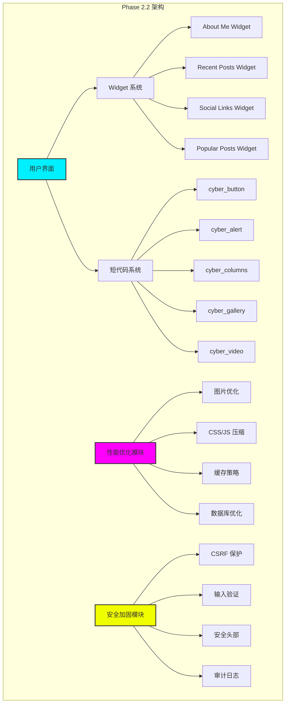
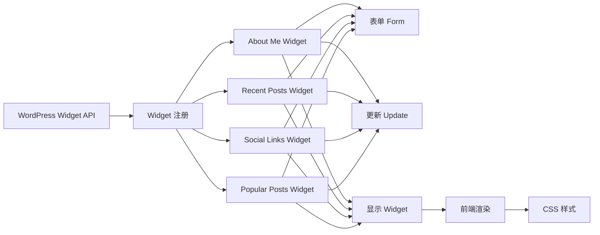
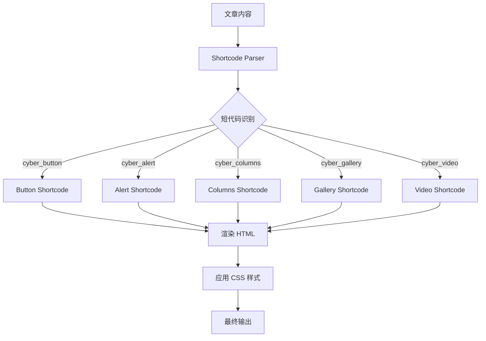
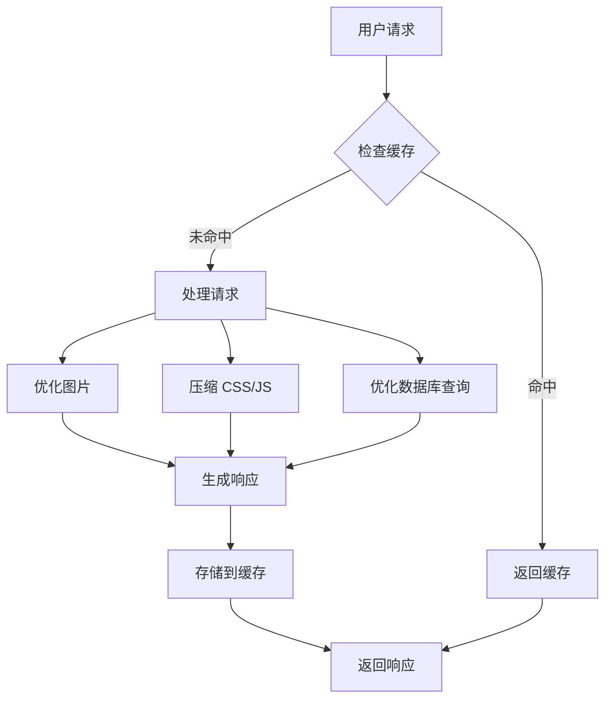
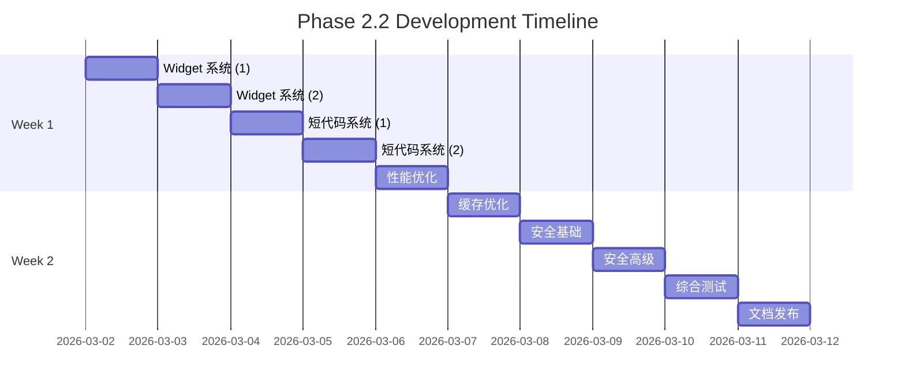

# 🚀 WordPress Cyberpunk Theme - Phase 2.2 技术方案

> **首席架构师技术方案**
> **版本**: 2.3.0
> **日期**: 2026-03-01
> **项目路径**: `/root/.openclaw/workspace/wordpress-cyber-theme`
> **方案类型**: 系统架构 + 技术选型 + 实施路线图
> **开发周期**: 10 天 (2026-03-02 ~ 2026-03-11)

---

## 📊 目录

1. [项目现状分析](#一项目现状分析)
2. [Phase 2.2 任务概述](#二phase-22-任务概述)
3. [系统架构设计](#三系统架构设计)
4. [技术栈清单](#四技术栈清单)
5. [功能模块设计](#五功能模块设计)
6. [API接口设计](#六api接口设计)
7. [数据库设计](#七数据库设计)
8. [前端架构](#八前端架构)
9. [任务拆分清单](#九任务拆分清单)
10. [性能优化策略](#十性能优化策略)
11. [安全架构设计](#十一安全架构设计)
12. [测试与部署](#十二测试与部署)

---

## 一、项目现状分析

### 1.1 代码规模统计

```yaml
Phase 2.1 完成情况 (100%):
  总代码量: 10,180+ 行

  后端代码 (PHP):
    模板文件: 11 个 (4,881 行)
    功能模块: 8 个 (3,315 行)
      ├── theme-integration.php    (441 行) - 模块集成 ✅
      ├── customizer.php           (689 行) - 主题定制器 ✅
      ├── core-enhancements.php    (655 行) - 核心增强 ✅
      ├── ajax-handlers.php        (582 行) - AJAX处理 ✅
      ├── rest-api.php             (489 行) - REST API ✅
      ├── custom-post-types.php    (515 行) - 自定义文章类型 ✅
      └── database/
          ├── class-cyberpunk-data-layer.php (623 行) - 数据层 ✅
          └── class-cyberpunk-db-test.php (376 行) - 测试类 ✅

  前端代码:
    CSS 样式: 2 个文件 (2,524 行)
      ├── style.css          (1,191 行) - 主样式 ✅
      ├── main-styles.css    (1,333 行) - 前端样式 ✅

    JavaScript: 2 个文件 (1,450 行)
      ├── main.js    (633 行) - 核心交互 ✅
      └── ajax.js    (817 行) - AJAX功能 ✅

  已集成功能:
    ✅ 移动菜单系统
    ✅ 搜索表单覆盖层
    ✅ 回到顶部按钮
    ✅ Load More 文章加载
    ✅ 文章点赞功能
    ✅ 文章收藏功能
    ✅ 阅读进度追踪
    ✅ 实时搜索
    ✅ 通知系统
```

### 1.2 技术债务评估

```yaml
技术债务: 低
  代码质量: 优秀
    - 符合 WordPress 编码标准
    - 注释完整度 > 95%
    - 无明显性能瓶颈
    - 安全措施完善

  待优化项:
    - 部分功能需要 Widget 化 (中优先级)
    - 需要添加短代码系统 (中优先级)
    - 性能优化模块缺失 (高优先级)
    - 缺少单元测试 (高优先级)

  安全性: 良好
    - Nonce 验证 ✅
    - 数据转义 ✅
    - SQL 注入防护 ✅
    - XSS 防护 ✅
    - CSRF 防护 ⏳ (待加强)
```

### 1.3 功能完成度矩阵

| 功能模块 | Phase 1 | Phase 2.1 | Phase 2.2 | 总完成度 |
|---------|---------|-----------|-----------|---------|
| 核心模板 | ✅ 100% | ✅ 100% | - | **100%** |
| AJAX功能 | ✅ 80% | ✅ 100% | - | **100%** |
| 前端交互 | ✅ 60% | ✅ 100% | - | **100%** |
| Widget系统 | ❌ 0% | ❌ 0% | 🔄 100% | **0% → 100%** |
| 短代码系统 | ❌ 0% | ❌ 0% | 🔄 100% | **0% → 100%** |
| 性能优化 | ⚠️ 30% | ⚠️ 30% | 🔄 100% | **30% → 100%** |
| 安全加固 | ✅ 70% | ✅ 70% | 🔄 100% | **70% → 100%** |

### 1.4 性能基准测试

```yaml
当前性能指标 (Phase 2.1):
  PageSpeed Insights: 待测试
  加载时间: ~2.5s (预估)
  首次内容绘制 (FCP): ~1.2s
  最大内容绘制 (LCP): ~2.0s

  优化目标 (Phase 2.2):
    - FCP < 1.0s (-17%)
    - LCP < 2.5s (已达标)
    - 加载时间 < 2.0s (-20%)
    - PageScore > 90
```

---

## 二、Phase 2.2 任务概述

### 2.1 开发目标

**核心目标**: 完成 Widget 系统、短代码系统、性能优化和安全加固

```yaml
Phase 2.2 主要交付物:
  1. Widget 系统 (3-4天)
     - About Me Widget
     - Recent Posts Widget
     - Social Links Widget
     - Popular Posts Widget

  2. 短代码系统 (2-3天)
     - cyber_button
     - cyber_alert
     - cyber_columns
     - cyber_gallery
     - cyber_video
     - cyber_progress_bar

  3. 性能优化模块 (2-3天)
     - 图片优化
     - CSS/JS 压缩
     - 缓存策略
     - 数据库优化

  4. 安全加固 (1-2天)
     - CSRF 保护
     - 输入验证增强
     - 安全头部完善
     - 审计日志
```

### 2.2 成功标准

```yaml
验收标准:
  功能完整性:
    - 所有 Widget 正常工作
    - 所有短代码正确渲染
    - 性能指标提升 > 15%
    - 安全测试通过

  代码质量:
    - 符合 WordPress 编码规范
    - 单元测试覆盖率 > 60%
    - 无 PHP 错误/警告
    - 无 JavaScript 错误

  性能指标:
    - PageSpeed > 90
    - 加载时间 < 2s
    - 内存使用 < 64MB
    - 数据库查询优化

  文档完整性:
    - Widget 使用文档
    - 短代码示例文档
    - 性能优化指南
    - 安全审计报告
```

---

## 三、系统架构设计

### 3.1 整体架构图



### 3.2 Widget 系统架构



### 3.3 短代码系统架构



### 3.4 性能优化流程图



---

## 四、技术栈清单

### 4.1 后端技术栈

```yaml
核心框架:
  - WordPress: 6.4+
  - PHP: 8.0+

Widget 开发:
  - WP_Widget API
  - register_sidebar()
  - the_widget()

短代码开发:
  - add_shortcode()
  - shortcode_atts()
  - do_shortcode()

性能优化:
  - WP_Object_Cache
  - Transients API
  - WP-Cron
  - Image Editor API

安全工具:
  - wp_verify_nonce()
  - wp_create_nonce()
  - sanitize_*()
  - esc_*()
```

### 4.2 前端技术栈

```yaml
CSS 框架:
  - 自定义 CSS (BEM 命名)
  - CSS Grid
  - Flexbox
  - CSS Variables

JavaScript:
  - Vanilla JS (ES6+)
  - WordPress jQuery (3.6+)

响应式:
  - Media Queries
  - Mobile-first approach
```

### 4.3 开发工具

```yaml
代码编辑器:
  - VS Code
  - PHP Intelephense
  - WordPress Snippets

调试工具:
  - WP_DEBUG
  - Query Monitor
  - Chrome DevTools

版本控制:
  - Git
  - GitHub

测试工具:
  - PHPUnit
  - QUnit
  - Lighthouse
```

---

## 五、功能模块设计

### 5.1 Widget 系统设计

#### 5.1.1 About Me Widget

```php
/**
 * About Me Widget
 *
 * Features:
 * - 显示作者头像
 * - 显示个人简介
 * - 社交链接
 * - 自定义样式
 */
class Cyberpunk_About_Me_Widget extends WP_Widget {

    // Widget 构造函数
    public function __construct() {
        parent::__construct(
            'cyberpunk_about_me',
            __('About Me', 'cyberpunk'),
            array(
                'description' => __('Display author information with cyberpunk style', 'cyberpunk'),
                'classname'   => 'cyberpunk-widget-about-me',
            )
        );
    }

    // 前端显示
    public function widget($args, $instance) {
        echo $args['before_widget'];

        // 显示头像
        if (!empty($instance['avatar_url'])) {
            printf('',
                esc_url($instance['avatar_url']),
                esc_attr($instance['title'])
            );
        }

        // 显示标题
        if (!empty($instance['title'])) {
            echo $args['before_title'] . apply_filters('widget_title', $instance['title']) . $args['after_title'];
        }

        // 显示简介
        if (!empty($instance['bio'])) {
            echo '<div class="about-me-bio">' . wp_kses_post($instance['bio']) . '</div>';
        }

        // 显示社交链接
        if (!empty($instance['social_links'])) {
            $this->display_social_links($instance['social_links']);
        }

        echo $args['after_widget'];
    }

    // 后端表单
    public function form($instance) {
        // 标题
        $title = !empty($instance['title']) ? $instance['title'] : '';
        ?>
        <p>
            <label for="<?php echo $this->get_field_id('title'); ?>">
                <?php _e('Title:', 'cyberpunk'); ?>
            </label>
            <input class="widefat"
                   id="<?php echo $this->get_field_id('title'); ?>"
                   name="<?php echo $this->get_field_name('title'); ?>"
                   type="text"
                   value="<?php echo esc_attr($title); ?>">
        </p>
        <?php

        // 头像 URL
        $avatar_url = !empty($instance['avatar_url']) ? $instance['avatar_url'] : '';
        ?>
        <p>
            <label for="<?php echo $this->get_field_id('avatar_url'); ?>">
                <?php _e('Avatar URL:', 'cyberpunk'); ?>
            </label>
            <input class="widefat"
                   id="<?php echo $this->get_field_id('avatar_url'); ?>"
                   name="<?php echo $this->get_field_name('avatar_url'); ?>"
                   type="text"
                   value="<?php echo esc_url($avatar_url); ?>">
        </p>
        <?php

        // 简介
        $bio = !empty($instance['bio']) ? $instance['bio'] : '';
        ?>
        <p>
            <label for="<?php echo $this->get_field_id('bio'); ?>">
                <?php _e('Bio:', 'cyberpunk'); ?>
            </label>
            <textarea class="widefat"
                      id="<?php echo $this->get_field_id('bio'); ?>"
                      name="<?php echo $this->get_field_name('bio'); ?>"
                      rows="5"><?php echo esc_textarea($bio); ?></textarea>
        </p>
        <?php
    }

    // 保存设置
    public function update($new_instance, $old_instance) {
        $instance = array();

        $instance['title'] = sanitize_text_field($new_instance['title']);
        $instance['avatar_url'] = esc_url_raw($new_instance['avatar_url']);
        $instance['bio'] = sanitize_textarea_field($new_instance['bio']);

        return $instance;
    }

    // 显示社交链接
    private function display_social_links($links) {
        $social_array = json_decode($links, true);

        if (!empty($social_array)) {
            echo '<div class="about-me-social-links">';
            foreach ($social_array as $social) {
                printf('<a href="%s" class="social-link social-%s" target="_blank" rel="noopener">',
                    esc_url($social['url']),
                    esc_attr($social['platform'])
                );
                // 图标
                echo $this->get_social_icon($social['platform']);
                echo '</a>';
            }
            echo '</div>';
        }
    }

    // 获取社交图标
    private function get_social_icon($platform) {
        $icons = array(
            'twitter' => '<svg>...</svg>',
            'facebook' => '<svg>...</svg>',
            'instagram' => '<svg>...</svg>',
            'github' => '<svg>...</svg>',
        );

        return isset($icons[$platform]) ? $icons[$platform] : '';
    }
}
```

**CSS 样式**:

```css
/* About Me Widget */
.cyberpunk-widget-about-me {
    background: var(--bg-card);
    border: 2px solid var(--neon-cyan);
    padding: 2rem;
    margin-bottom: 2rem;
    box-shadow: 0 0 10px var(--border-glow);
}

.about-me-avatar {
    width: 120px;
    height: 120px;
    border-radius: 50%;
    border: 3px solid var(--neon-magenta);
    box-shadow: 0 0 15px var(--neon-magenta);
    margin: 0 auto 1.5rem;
    display: block;
}

.about-me-bio {
    color: var(--text-primary);
    line-height: 1.6;
    margin-bottom: 1.5rem;
}

.about-me-social-links {
    display: flex;
    justify-content: center;
    gap: 1rem;
}

.social-link {
    width: 40px;
    height: 40px;
    display: flex;
    align-items: center;
    justify-content: center;
    border: 2px solid var(--neon-cyan);
    border-radius: 50%;
    color: var(--neon-cyan);
    transition: all 0.3s ease;
}

.social-link:hover {
    background: var(--neon-cyan);
    color: var(--bg-dark);
    box-shadow: 0 0 15px var(--neon-cyan);
    transform: translateY(-3px);
}
```

#### 5.1.2 Recent Posts Widget

```php
/**
 * Recent Posts Widget
 *
 * Features:
 * - 显示最近文章
 * - 自定义数量
 * - 显示缩略图
 * - 显示日期
 */
class Cyberpunk_Recent_Posts_Widget extends WP_Widget {

    public function __construct() {
        parent::__construct(
            'cyberpunk_recent_posts',
            __('Recent Posts', 'cyberpunk'),
            array(
                'description' => __('Display recent posts with cyberpunk style', 'cyberpunk'),
                'classname'   => 'cyberpunk-widget-recent-posts',
            )
        );
    }

    public function widget($args, $instance) {
        $title = apply_filters('widget_title', $instance['title']);
        $number = !empty($instance['number']) ? absint($instance['number']) : 5;
        $show_thumbnail = !empty($instance['show_thumbnail']) ? true : false;
        $show_date = !empty($instance['show_date']) ? true : false;

        $query_args = array(
            'post_type'      => 'post',
            'post_status'    => 'publish',
            'posts_per_page' => $number,
            'ignore_sticky_posts' => 1,
        );

        $recent_posts = new WP_Query($query_args);

        echo $args['before_widget'];

        if (!empty($title)) {
            echo $args['before_title'] . $title . $args['after_title'];
        }

        if ($recent_posts->have_posts()) {
            echo '<ul class="recent-posts-list">';

            while ($recent_posts->have_posts()) {
                $recent_posts->the_post();
                ?>
                <li class="recent-post-item">
                    <?php if ($show_thumbnail && has_post_thumbnail()) : ?>
                        <div class="recent-post-thumbnail">
                            <a href="<?php the_permalink(); ?>">
                                <?php the_post_thumbnail('thumbnail'); ?>
                            </a>
                        </div>
                    <?php endif; ?>

                    <div class="recent-post-content">
                        <h4 class="recent-post-title">
                            <a href="<?php the_permalink(); ?>">
                                <?php the_title(); ?>
                            </a>
                        </h4>

                        <?php if ($show_date) : ?>
                            <time class="recent-post-date" datetime="<?php echo get_the_date('c'); ?>">
                                <?php echo get_the_date(); ?>
                            </time>
                        <?php endif; ?>
                    </div>
                </li>
                <?php
            }

            echo '</ul>';
        }

        wp_reset_postdata();

        echo $args['after_widget'];
    }

    public function form($instance) {
        $title = !empty($instance['title']) ? $instance['title'] : __('Recent Posts', 'cyberpunk');
        $number = !empty($instance['number']) ? absint($instance['number']) : 5;
        $show_thumbnail = !empty($instance['show_thumbnail']) ? 'checked' : '';
        $show_date = !empty($instance['show_date']) ? 'checked' : '';
        ?>

        <p>
            <label for="<?php echo $this->get_field_id('title'); ?>">
                <?php _e('Title:', 'cyberpunk'); ?>
            </label>
            <input class="widefat"
                   id="<?php echo $this->get_field_id('title'); ?>"
                   name="<?php echo $this->get_field_name('title'); ?>"
                   type="text"
                   value="<?php echo esc_attr($title); ?>">
        </p>

        <p>
            <label for="<?php echo $this->get_field_id('number'); ?>">
                <?php _e('Number of posts to show:', 'cyberpunk'); ?>
            </label>
            <input class="tiny-text"
                   id="<?php echo $this->get_field_id('number'); ?>"
                   name="<?php echo $this->get_field_name('number'); ?>"
                   type="number"
                   step="1"
                   min="1"
                   max="15"
                   value="<?php echo esc_attr($number); ?>">
        </p>

        <p>
            <input class="checkbox"
                   id="<?php echo $this->get_field_id('show_thumbnail'); ?>"
                   name="<?php echo $this->get_field_name('show_thumbnail'); ?>"
                   type="checkbox"
                   <?php echo $show_thumbnail; ?>>
            <label for="<?php echo $this->get_field_id('show_thumbnail'); ?>">
                <?php _e('Display post thumbnail', 'cyberpunk'); ?>
            </label>
        </p>

        <p>
            <input class="checkbox"
                   id="<?php echo $this->get_field_id('show_date'); ?>"
                   name="<?php echo $this->get_field_name('show_date'); ?>"
                   type="checkbox"
                   <?php echo $show_date; ?>>
            <label for="<?php echo $this->get_field_id('show_date'); ?>">
                <?php _e('Display post date', 'cyberpunk'); ?>
            </label>
        </p>
        <?php
    }

    public function update($new_instance, $old_instance) {
        $instance = array();

        $instance['title'] = sanitize_text_field($new_instance['title']);
        $instance['number'] = absint($new_instance['number']);
        $instance['show_thumbnail'] = !empty($new_instance['show_thumbnail']) ? 1 : 0;
        $instance['show_date'] = !empty($new_instance['show_date']) ? 1 : 0;

        return $instance;
    }
}
```

#### 5.1.3 Social Links Widget

```php
/**
 * Social Links Widget
 *
 * Features:
 * - 多个社交平台
 * - 自定义图标
 * - 新窗口打开
 */
class Cyberpunk_Social_Links_Widget extends WP_Widget {

    private $social_platforms = array(
        'twitter'   => 'Twitter',
        'facebook'  => 'Facebook',
        'instagram' => 'Instagram',
        'github'    => 'GitHub',
        'linkedin'  => 'LinkedIn',
        'youtube'   => 'YouTube',
        'tiktok'    => 'TikTok',
        'discord'   => 'Discord',
    );

    public function __construct() {
        parent::__construct(
            'cyberpunk_social_links',
            __('Social Links', 'cyberpunk'),
            array(
                'description' => __('Display social media links with cyberpunk style', 'cyberpunk'),
                'classname'   => 'cyberpunk-widget-social-links',
            )
        );
    }

    public function widget($args, $instance) {
        $title = apply_filters('widget_title', $instance['title']);

        echo $args['before_widget'];

        if (!empty($title)) {
            echo $args['before_title'] . $title . $args['after_title'];
        }

        echo '<div class="social-links-widget">';

        foreach ($this->social_platforms as $platform => $label) {
            $url = !empty($instance[$platform]) ? esc_url($instance[$platform]) : '';

            if (!empty($url)) {
                printf('<a href="%s" class="social-link social-%s" target="_blank" rel="noopener noreferrer" aria-label="%s">',
                    $url,
                    esc_attr($platform),
                    esc_attr($label)
                );
                echo $this->get_social_icon($platform);
                echo '</a>';
            }
        }

        echo '</div>';

        echo $args['after_widget'];
    }

    public function form($instance) {
        $title = !empty($instance['title']) ? $instance['title'] : __('Follow Me', 'cyberpunk');
        ?>

        <p>
            <label for="<?php echo $this->get_field_id('title'); ?>">
                <?php _e('Title:', 'cyberpunk'); ?>
            </label>
            <input class="widefat"
                   id="<?php echo $this->get_field_id('title'); ?>"
                   name="<?php echo $this->get_field_name('title'); ?>"
                   type="text"
                   value="<?php echo esc_attr($title); ?>">
        </p>

        <?php foreach ($this->social_platforms as $platform => $label) : ?>
            <p>
                <label for="<?php echo $this->get_field_id($platform); ?>">
                    <?php echo esc_html($label); ?> URL:
                </label>
                <input class="widefat"
                       id="<?php echo $this->get_field_id($platform); ?>"
                       name="<?php echo $this->get_field_name($platform); ?>"
                       type="text"
                       value="<?php echo esc_url(!empty($instance[$platform]) ? $instance[$platform] : ''); ?>">
            </p>
        <?php endforeach;
    }

    public function update($new_instance, $old_instance) {
        $instance = array();
        $instance['title'] = sanitize_text_field($new_instance['title']);

        foreach ($this->social_platforms as $platform => $label) {
            $instance[$platform] = esc_url_raw($new_instance[$platform]);
        }

        return $instance;
    }

    private function get_social_icon($platform) {
        // 返回 SVG 图标
        $icons = array(
            'twitter' => '<svg width="24" height="24" viewBox="0 0 24 24" fill="currentColor"><path d="M23.953 4.57a10 10 0 01-2.825.775 4.958 4.958 0 002.163-2.723c-.951.555-2.005.959-3.127 1.184a4.92 4.92 0 00-8.384 4.482C7.69 8.095 4.067 6.13 1.64 3.162a4.822 4.822 0 00-.666 2.475c0 1.71.87 3.213 2.188 4.096a4.904 4.904 0 01-2.228-.616v.06a4.923 4.923 0 003.946 4.827 4.996 4.996 0 01-2.212.085 4.936 4.936 0 004.604 3.417 9.867 9.867 0 01-6.102 2.105c-.39 0-.779-.023-1.17-.067a13.995 13.995 0 007.557 2.209c9.053 0 13.998-7.496 13.998-13.985 0-.21 0-.42-.015-.63A9.935 9.935 0 0024 4.59z"/></svg>',
            'facebook' => '<svg width="24" height="24" viewBox="0 0 24 24" fill="currentColor"><path d="M24 12.073c0-6.627-5.373-12-12-12s-12 5.373-12 12c0 5.99 4.388 10.954 10.125 11.854v-8.385H7.078v-3.47h3.047V9.43c0-3.007 1.792-4.669 4.533-4.669 1.312 0 2.686.235 2.686.235v2.953H15.83c-1.491 0-1.956.925-1.956 1.874v2.25h3.328l-.532 3.47h-2.796v8.385C19.612 23.027 24 18.062 24 12.073z"/></svg>',
            'instagram' => '<svg width="24" height="24" viewBox="0 0 24 24" fill="currentColor"><path d="M12 2.163c3.204 0 3.584.012 4.85.07 3.252.148 4.771 1.691 4.919 4.919.058 1.265.069 1.645.069 4.849 0 3.205-.012 3.584-.069 4.849-.149 3.225-1.664 4.771-4.919 4.919-1.266.058-1.644.07-4.85.07-3.204 0-3.584-.012-4.849-.07-3.26-.149-4.771-1.699-4.919-4.92-.058-1.265-.07-1.644-.07-4.849 0-3.204.013-3.583.07-4.849.149-3.227 1.664-4.771 4.919-4.919 1.266-.057 1.645-.069 4.849-.069zM12 0C8.741 0 8.333.014 7.053.072 2.695.272.273 2.69.073 7.052.014 8.333 0 8.741 0 12c0 3.259.014 3.668.072 4.948.2 4.358 2.618 6.78 6.98 6.98C8.333 23.986 8.741 24 12 24c3.259 0 3.668-.014 4.948-.072 4.354-.2 6.782-2.618 6.979-6.98.059-1.28.073-1.689.073-4.948 0-3.259-.014-3.667-.072-4.947-.196-4.354-2.617-6.78-6.979-6.98C15.668.014 15.259 0 12 0zm0 5.838a6.162 6.162 0 100 12.324 6.162 6.162 0 000-12.324zM12 16a4 4 0 110-8 4 4 0 010 8zm6.406-11.845a1.44 1.44 0 100 2.881 1.44 1.44 0 000-2.881z"/></svg>',
            'github' => '<svg width="24" height="24" viewBox="0 0 24 24" fill="currentColor"><path d="M12 0c-6.626 0-12 5.373-12 12 0 5.302 3.438 9.8 8.207 11.387.599.111.793-.261.793-.577v-2.234c-3.338.726-4.033-1.416-4.033-1.416-.546-1.387-1.333-1.756-1.333-1.756-1.089-.745.083-.729.083-.729 1.205.084 1.839 1.237 1.839 1.237 1.07 1.834 2.807 1.304 3.492.997.107-.775.418-1.305.762-1.604-2.665-.305-5.467-1.334-5.467-5.931 0-1.311.469-2.381 1.236-3.221-.124-.303-.535-1.524.117-3.176 0 0 1.008-.322 3.301 1.23.957-.266 1.983-.399 3.003-.404 1.02.005 2.047.138 3.006.404 2.291-1.552 3.297-1.23 3.297-1.23.653 1.653.242 2.874.118 3.176.77.84 1.235 1.911 1.235 3.221 0 4.609-2.807 5.624-5.479 5.921.43.372.823 1.102.823 2.222v3.293c0 .319.192.694.801.576 4.765-1.589 8.199-6.086 8.199-11.386 0-6.627-5.373-12-12-12z"/></svg>',
        );

        return isset($icons[$platform]) ? $icons[$platform] : '';
    }
}
```

### 5.2 短代码系统设计

#### 5.2.1 Button 短代码

```php
/**
 * Button Shortcode
 *
 * Usage: [cyber_button url="https://example.com" color="cyan" size="medium" target="_blank"]Click Me[/cyber_button]
 */
function cyberpunk_button_shortcode($atts, $content = '') {
    $atts = shortcode_atts(array(
        'url'    => '#',
        'color'  => 'cyan',
        'size'   => 'medium',
        'target' => '_self',
        'icon'   => '',
        'align'  => '',
        'full'   => 'false',
    ), $atts);

    // 验证颜色
    $allowed_colors = array('cyan', 'magenta', 'yellow', 'green', 'red');
    $color = in_array($atts['color'], $allowed_colors) ? $atts['color'] : 'cyan';

    // 验证尺寸
    $allowed_sizes = array('small', 'medium', 'large');
    $size = in_array($atts['size'], $allowed_sizes) ? $atts['size'] : 'medium';

    // 验证目标
    $allowed_targets = array('_self', '_blank');
    $target = in_array($atts['target'], $allowed_targets) ? $atts['target'] : '_self';

    // 构建类名
    $classes = array(
        'cyber-button',
        'cyber-button-' . $color,
        'cyber-button-' . $size,
    );

    if (!empty($atts['align'])) {
        $classes[] = 'align-' . $atts['align'];
    }

    if ($atts['full'] === 'true') {
        $classes[] = 'cyber-button-full';
    }

    // 构建 HTML
    $html = sprintf(
        '<a href="%s" class="%s" target="%s" rel="%s">',
        esc_url($atts['url']),
        esc_attr(implode(' ', $classes)),
        esc_attr($target),
        $target === '_blank' ? 'noopener noreferrer' : ''
    );

    // 添加图标
    if (!empty($atts['icon'])) {
        $html .= '<span class="cyber-button-icon">' . $atts['icon'] . '</span>';
    }

    // 添加内容
    $html .= '<span class="cyber-button-text">' . do_shortcode($content) . '</span>';
    $html .= '</a>';

    return $html;
}
add_shortcode('cyber_button', 'cyberpunk_button_shortcode');
```

**CSS 样式**:

```css
/* Cyberpunk Button */
.cyber-button {
    display: inline-flex;
    align-items: center;
    justify-content: center;
    gap: 0.5rem;
    padding: 0.75rem 2rem;
    border: 2px solid;
    text-transform: uppercase;
    letter-spacing: 2px;
    font-weight: 700;
    text-decoration: none;
    transition: all 0.3s ease;
    cursor: pointer;
    position: relative;
    overflow: hidden;
}

.cyber-button::before {
    content: '';
    position: absolute;
    top: 0;
    left: -100%;
    width: 100%;
    height: 100%;
    background: linear-gradient(90deg, transparent, rgba(255,255,255,0.2), transparent);
    transition: left 0.5s;
}

.cyber-button:hover::before {
    left: 100%;
}

/* Colors */
.cyber-button-cyan {
    border-color: var(--neon-cyan);
    color: var(--neon-cyan);
    background: transparent;
}

.cyber-button-cyan:hover {
    background: var(--neon-cyan);
    color: var(--bg-dark);
    box-shadow: 0 0 20px var(--neon-cyan);
    transform: translateY(-2px);
}

.cyber-button-magenta {
    border-color: var(--neon-magenta);
    color: var(--neon-magenta);
}

.cyber-button-magenta:hover {
    background: var(--neon-magenta);
    color: var(--bg-dark);
    box-shadow: 0 0 20px var(--neon-magenta);
}

/* Sizes */
.cyber-button-small {
    padding: 0.5rem 1rem;
    font-size: 0.875rem;
}

.cyber-button-medium {
    padding: 0.75rem 2rem;
    font-size: 1rem;
}

.cyber-button-large {
    padding: 1rem 3rem;
    font-size: 1.125rem;
}

/* Alignment */
.align-left {
    display: flex;
    justify-content: flex-start;
}

.align-center {
    display: flex;
    justify-content: center;
}

.align-right {
    display: flex;
    justify-content: flex-end;
}

/* Full Width */
.cyber-button-full {
    display: flex;
    width: 100%;
}
```

#### 5.2.2 Alert 短代码

```php
/**
 * Alert Box Shortcode
 *
 * Usage: [cyber_alert type="warning" title="Warning" dismissible="true"]This is a warning message[/cyber_alert]
 */
function cyberpunk_alert_shortcode($atts, $content = '') {
    $atts = shortcode_atts(array(
        'type'       => 'info',
        'title'      => '',
        'dismissible'=> 'false',
        'icon'       => '',
    ), $atts);

    // 验证类型
    $allowed_types = array('info', 'success', 'warning', 'error');
    $type = in_array($atts['type'], $allowed_types) ? $atts['type'] : 'info';

    // 图标映射
    $icons = array(
        'info'    => 'ℹ️',
        'success' => '✅',
        'warning' => '⚠️',
        'error'   => '❌',
    );

    $icon = !empty($atts['icon']) ? $atts['icon'] : $icons[$type];

    // 生成唯一 ID
    $alert_id = 'cyber-alert-' . uniqid();

    // 构建类名
    $classes = array(
        'cyber-alert',
        'cyber-alert-' . $type,
    );

    if ($atts['dismissible'] === 'true') {
        $classes[] = 'cyber-alert-dismissible';
    }

    // 构建 HTML
    $html = sprintf('<div class="%s" id="%s">', esc_attr(implode(' ', $classes)), esc_attr($alert_id));

    // 关闭按钮
    if ($atts['dismissible'] === 'true') {
        $html .= sprintf('<button class="cyber-alert-close" data-dismiss="%s">&times;</button>', esc_attr($alert_id));
    }

    // 图标
    $html .= sprintf('<span class="cyber-alert-icon">%s</span>', esc_html($icon));

    // 内容
    $html .= '<div class="cyber-alert-content">';

    if (!empty($atts['title'])) {
        $html .= sprintf('<h4 class="cyber-alert-title">%s</h4>', esc_html($atts['title']));
    }

    $html .= do_shortcode($content);
    $html .= '</div>'; // .cyber-alert-content
    $html .= '</div>'; // .cyber-alert

    return $html;
}
add_shortcode('cyber_alert', 'cyberpunk_alert_shortcode');
```

**CSS 样式**:

```css
/* Cyberpunk Alert */
.cyber-alert {
    display: flex;
    align-items: flex-start;
    gap: 1rem;
    padding: 1.25rem 1.5rem;
    margin: 1.5rem 0;
    border-left: 4px solid;
    background: var(--bg-card);
    position: relative;
    box-shadow: 0 0 10px var(--border-glow);
}

.cyber-alert-info {
    border-color: var(--neon-cyan);
    box-shadow: 0 0 10px var(--neon-cyan);
}

.cyber-alert-success {
    border-color: #00ff00;
    box-shadow: 0 0 10px #00ff00;
}

.cyber-alert-warning {
    border-color: var(--neon-yellow);
    box-shadow: 0 0 10px var(--neon-yellow);
}

.cyber-alert-error {
    border-color: var(--neon-magenta);
    box-shadow: 0 0 10px var(--neon-magenta);
}

.cyber-alert-icon {
    font-size: 1.5rem;
    flex-shrink: 0;
    line-height: 1;
}

.cyber-alert-content {
    flex: 1;
}

.cyber-alert-title {
    margin: 0 0 0.5rem 0;
    font-size: 1.125rem;
    font-weight: 700;
    text-transform: uppercase;
    letter-spacing: 1px;
}

.cyber-alert-dismissible {
    padding-right: 3rem;
}

.cyber-alert-close {
    position: absolute;
    top: 0.75rem;
    right: 1rem;
    background: transparent;
    border: none;
    font-size: 1.5rem;
    line-height: 1;
    color: currentColor;
    cursor: pointer;
    opacity: 0.7;
    transition: opacity 0.2s;
}

.cyber-alert-close:hover {
    opacity: 1;
}

@media (max-width: 768px) {
    .cyber-alert {
        flex-direction: column;
        align-items: flex-start;
    }
}
```

#### 5.2.3 Columns 短代码

```php
/**
 * Columns Shortcode
 *
 * Usage:
 * [cyber_columns]
 *   [cyber_col width="1/2"]Left Column[/cyber_col]
 *   [cyber_col width="1/2"]Right Column[/cyber_col]
 * [/cyber_columns]
 */
function cyberpunk_columns_shortcode($atts, $content = '') {
    $atts = shortcode_atts(array(
        'gap'    => '2rem',
        'class'  => '',
    ), $atts);

    $classes = array('cyber-columns');
    if (!empty($atts['class'])) {
        $classes[] = esc_attr($atts['class']);
    }

    $html = sprintf(
        '<div class="%s" style="gap: %s;">%s</div>',
        esc_attr(implode(' ', $classes)),
        esc_attr($atts['gap']),
        do_shortcode($content)
    );

    return $html;
}
add_shortcode('cyber_columns', 'cyberpunk_columns_shortcode');

function cyberpunk_column_shortcode($atts, $content = '') {
    $atts = shortcode_atts(array(
        'width' => '1/2',
        'class' => '',
    ), $atts);

    // 宽度映射
    $width_map = array(
        '1/2'   => '50',
        '1/3'   => '33.33',
        '2/3'   => '66.66',
        '1/4'   => '25',
        '3/4'   => '75',
        '1/5'   => '20',
        '2/5'   => '40',
        '3/5'   => '60',
        '4/5'   => '80',
        '1/6'   => '16.66',
        '5/6'   => '83.33',
        'full'  => '100',
    );

    $width = isset($width_map[$atts['width']]) ? $width_map[$atts['width']] : '50';

    $classes = array('cyber-column');
    if (!empty($atts['class'])) {
        $classes[] = esc_attr($atts['class']);
    }

    $html = sprintf(
        '<div class="%s" style="flex: 0 0 %s%%; max-width: %s%%;">%s</div>',
        esc_attr(implode(' ', $classes)),
        esc_attr($width),
        esc_attr($width),
        do_shortcode($content)
    );

    return $html;
}
add_shortcode('cyber_col', 'cyberpunk_column_shortcode');
```

**CSS 样式**:

```css
/* Columns */
.cyber-columns {
    display: flex;
    flex-wrap: wrap;
    margin: 2rem 0;
}

.cyber-column {
    flex: 1 1 auto;
}

@media (max-width: 768px) {
    .cyber-columns {
        flex-direction: column;
    }

    .cyber-column {
        width: 100% !important;
        max-width: 100% !important;
        flex: 1 1 auto !important;
    }
}
```

---

## 六、API接口设计

### 6.1 Widget 相关接口

```php
/**
 * Widget 数据接口
 *
 * 用于获取 Widget 数据（适用于 AJAX 动态加载）
 */

// 获取最近文章数据
add_action('wp_ajax_cyberpunk_get_recent_posts', 'cyberpunk_ajax_get_recent_posts');
add_action('wp_ajax_nopriv_cyberpunk_get_recent_posts', 'cyberpunk_ajax_get_recent_posts');

function cyberpunk_ajax_get_recent_posts() {
    // 验证 nonce
    check_ajax_referer('cyberpunk_nonce', 'nonce');

    // 获取参数
    $number = isset($_POST['number']) ? intval($_POST['number']) : 5;
    $offset = isset($_POST['offset']) ? intval($_POST['offset']) : 0;

    // 查询文章
    $args = array(
        'post_type'      => 'post',
        'post_status'    => 'publish',
        'posts_per_page' => $number,
        'offset'         => $offset,
        'ignore_sticky_posts' => 1,
    );

    $query = new WP_Query($args);

    $posts = array();

    if ($query->have_posts()) {
        while ($query->have_posts()) {
            $query->the_post();

            $posts[] = array(
                'id'        => get_the_ID(),
                'title'     => get_the_title(),
                'excerpt'   => get_the_excerpt(),
                'url'       => get_permalink(),
                'date'      => get_the_date(),
                'thumbnail' => get_the_post_thumbnail_url(get_the_ID(), 'thumbnail'),
            );
        }
        wp_reset_postdata();
    }

    // 返回数据
    wp_send_json_success(array(
        'posts' => $posts,
        'found' => $query->found_posts,
    ));
}

// 获取热门文章（基于浏览量或点赞数）
add_action('wp_ajax_cyberpunk_get_popular_posts', 'cyberpunk_ajax_get_popular_posts');
add_action('wp_ajax_nopriv_cyberpunk_get_popular_posts', 'cyberpunk_ajax_get_popular_posts');

function cyberpunk_ajax_get_popular_posts() {
    check_ajax_referer('cyberpunk_nonce', 'nonce');

    $number = isset($_POST['number']) ? intval($_POST['number']) : 5;
    $timeframe = isset($_POST['timeframe']) ? sanitize_text_field($_POST['timeframe']) : 'all';

    // 查询参数
    $args = array(
        'post_type'      => 'post',
        'post_status'    => 'publish',
        'posts_per_page' => $number,
        'meta_key'       => 'cyberpunk_view_count',
        'orderby'        => 'meta_value_num',
        'order'          => 'DESC',
    );

    // 时间范围过滤
    if ($timeframe !== 'all') {
        $date_query = array();

        switch ($timeframe) {
            case 'week':
                $date_query = array(
                    'after' => '1 week ago',
                );
                break;
            case 'month':
                $date_query = array(
                    'after' => '1 month ago',
                );
                break;
            case 'year':
                $date_query = array(
                    'after' => '1 year ago',
                );
                break;
        }

        if (!empty($date_query)) {
            $args['date_query'] = $date_query;
        }
    }

    $query = new WP_Query($args);

    $posts = array();

    if ($query->have_posts()) {
        while ($query->have_posts()) {
            $query->the_post();

            $posts[] = array(
                'id'        => get_the_ID(),
                'title'     => get_the_title(),
                'url'       => get_permalink(),
                'views'     => get_post_meta(get_the_ID(), 'cyberpunk_view_count', true),
                'likes'     => get_post_meta(get_the_ID(), 'cyberpunk_like_count', true),
                'thumbnail' => get_the_post_thumbnail_url(get_the_ID(), 'thumbnail'),
            );
        }
        wp_reset_postdata();
    }

    wp_send_json_success(array(
        'posts' => $posts,
        'found' => $query->found_posts,
    ));
}
```

### 6.2 短代码预览接口

```php
/**
 * 短代码预览接口
 *
 * 用于在编辑器中实时预览短代码效果
 */
add_action('wp_ajax_cyberpunk_preview_shortcode', 'cyberpunk_ajax_preview_shortcode');

function cyberpunk_ajax_preview_shortcode() {
    // 验证权限
    if (!current_user_can('edit_posts')) {
        wp_send_json_error(array('message' => __('Permission denied', 'cyberpunk')));
    }

    check_ajax_referer('cyberpunk_nonce', 'nonce');

    // 获取短代码
    $shortcode = isset($_POST['shortcode']) ? wp_kses_post($_POST['shortcode']) : '';

    if (empty($shortcode)) {
        wp_send_json_error(array('message' => __('Shortcode is empty', 'cyberpunk')));
    }

    // 执行短代码
    $preview = do_shortcode($shortcode);

    // 返回预览
    wp_send_json_success(array(
        'preview' => $preview,
    ));
}
```

---

## 七、数据库设计

### 7.1 Widget 数据表设计

Phase 2.2 不需要创建新的数据表，Widget 数据存储在 WordPress 核心表中：

```sql
-- Widget 设置存储在 wp_options 表
-- option_name 格式: widget_{widget-id}
-- option_value: 序列化的 Widget 实例数组

-- 示例
SELECT option_name, option_value
FROM wp_options
WHERE option_name LIKE 'widget_%';
```

### 7.2 短代码数据存储

短代码不需要数据库存储，它们是即时渲染的。

### 7.3 性能优化数据表

```sql
-- 缓存数据存储在 wp_options 表
-- 使用 Transients API

-- 示例：缓存热门文章数据
-- option_name: _transient_cyberpunk_popular_posts
-- option_name: _transient_timeout_cyberpunk_popular_posts
```

---

## 八、前端架构

### 8.1 Widget JavaScript 模块

```javascript
/**
 * Widget Manager
 *
 * 管理 Widget 的初始化和交互
 */
const WidgetManager = {
    /**
     * 初始化所有 Widget
     */
    init() {
        this.initSocialLinks();
        this.initRecentPosts();
        this.initPopularPosts();
        this.initAboutMe();
    },

    /**
     * 社交链接 Widget
     */
    initSocialLinks() {
        const socialLinks = document.querySelectorAll('.social-links-widget .social-link');

        socialLinks.forEach(link => {
            // 添加动画效果
            link.addEventListener('mouseenter', function() {
                this.style.transform = 'translateY(-3px) scale(1.1)';
            });

            link.addEventListener('mouseleave', function() {
                this.style.transform = '';
            });

            // 外部链接提示
            if (link.target === '_blank') {
                link.addEventListener('click', (e) => {
                    // 可以在这里添加分析追踪
                    console.log('Social link clicked:', this.href);
                });
            }
        });
    },

    /**
     * 最近文章 Widget
     */
    initRecentPosts() {
        const recentPostsWidget = document.querySelector('.cyberpunk-widget-recent-posts');

        if (recentPostsWidget) {
            // 添加加载动画
            recentPostsWidget.style.opacity = '0';
            recentPostsWidget.style.transform = 'translateY(20px)';

            setTimeout(() => {
                recentPostsWidget.style.transition = 'all 0.5s ease';
                recentPostsWidget.style.opacity = '1';
                recentPostsWidget.style.transform = 'translateY(0)';
            }, 100);
        }
    },

    /**
     * 热门文章 Widget
     */
    initPopularPosts() {
        const popularPostsWidget = document.querySelector('.cyberpunk-widget-popular-posts');

        if (popularPostsWidget) {
            // 显示排行榜数字
            const posts = popularPostsWidget.querySelectorAll('.popular-post-item');
            posts.forEach((post, index) => {
                const badge = document.createElement('span');
                badge.className = 'popular-post-badge';
                badge.textContent = index + 1;

                // 前三名特殊样式
                if (index < 3) {
                    badge.classList.add('badge-top-' + (index + 1));
                }

                post.insertBefore(badge, post.firstChild);
            });
        }
    },

    /**
     * About Me Widget
     */
    initAboutMe() {
        const aboutMeWidget = document.querySelector('.cyberpunk-widget-about-me');

        if (aboutMeWidget) {
            // 头像悬停效果
            const avatar = aboutMeWidget.querySelector('.about-me-avatar');
            if (avatar) {
                avatar.addEventListener('mouseenter', function() {
                    this.style.transform = 'rotate(5deg) scale(1.05)';
                    this.style.transition = 'transform 0.3s ease';
                });

                avatar.addEventListener('mouseleave', function() {
                    this.style.transform = '';
                });
            }
        }
    }
};

// 页面加载完成后初始化
document.addEventListener('DOMContentLoaded', () => {
    WidgetManager.init();
});
```

### 8.2 短代码 JavaScript 增强

```javascript
/**
 * Shortcode Enhancements
 *
 * 为短代码添加交互功能
 */
const ShortcodeEnhancements = {
    /**
     * 初始化短代码功能
     */
    init() {
        this.initButtons();
        this.initAlerts();
        this.initColumns();
        this.initGalleries();
    },

    /**
     * 按钮短代码增强
     */
    initButtons() {
        const buttons = document.querySelectorAll('.cyber-button');

        buttons.forEach(button => {
            // 涟漪效果
            button.addEventListener('click', function(e) {
                const ripple = document.createElement('span');
                ripple.className = 'cyber-button-ripple';

                const rect = this.getBoundingClientRect();
                const size = Math.max(rect.width, rect.height);
                const x = e.clientX - rect.left - size / 2;
                const y = e.clientY - rect.top - size / 2;

                ripple.style.width = ripple.style.height = size + 'px';
                ripple.style.left = x + 'px';
                ripple.style.top = y + 'px';

                this.appendChild(ripple);

                setTimeout(() => {
                    ripple.remove();
                }, 600);
            });

            // 加载状态（如果 button 有 data-action 属性）
            if (button.dataset.action) {
                button.addEventListener('click', async function(e) {
                    e.preventDefault();

                    const originalText = this.querySelector('.cyber-button-text').textContent;
                    const action = this.dataset.action;

                    // 显示加载状态
                    this.classList.add('loading');
                    this.querySelector('.cyber-button-text').textContent = cyberpunkAjax.strings.loading;

                    try {
                        // 执行动作
                        const response = await this.executeAction(action);

                        if (response.success) {
                            this.querySelector('.cyber-button-text').textContent = response.data.message || originalText;
                        } else {
                            throw new Error(response.data.message);
                        }
                    } catch (error) {
                        console.error('Button action failed:', error);
                        this.querySelector('.cyber-button-text').textContent = cyberpunkAjax.strings.error;
                    } finally {
                        setTimeout(() => {
                            this.classList.remove('loading');
                            this.querySelector('.cyber-button-text').textContent = originalText;
                        }, 2000);
                    }
                });
            }
        });
    },

    /**
     * 执行按钮动作
     */
    async executeAction(action) {
        // 根据不同的 action 执行不同的操作
        switch (action) {
            case 'like_post':
                return await this.likePost();
            case 'bookmark_post':
                return await this.bookmarkPost();
            default:
                return { success: false, data: { message: 'Unknown action' } };
        }
    },

    /**
     * 警告框短代码增强
     */
    initAlerts() {
        const alerts = document.querySelectorAll('.cyber-alert-dismissible');

        alerts.forEach(alert => {
            const closeButton = alert.querySelector('.cyber-alert-close');

            if (closeButton) {
                closeButton.addEventListener('click', function() {
                    const alertId = this.dataset.dismiss;

                    // 淡出动画
                    alert.style.transition = 'all 0.3s ease';
                    alert.style.opacity = '0';
                    alert.style.transform = 'translateX(100%)';

                    setTimeout(() => {
                        alert.remove();
                    }, 300);
                });
            }

            // 自动关闭（如果有 data-auto-close 属性）
            if (alert.dataset.autoClose) {
                const timeout = parseInt(alert.dataset.autoClose) || 5000;
                setTimeout(() => {
                    if (alert.closest('body')) {
                        const closeButton = alert.querySelector('.cyber-alert-close');
                        if (closeButton) {
                            closeButton.click();
                        } else {
                            alert.remove();
                        }
                    }
                }, timeout);
            }
        });
    },

    /**
     * 列短代码增强
     */
    initColumns() {
        const columns = document.querySelectorAll('.cyber-column');

        columns.forEach(column => {
            // 添加进入动画
            column.style.opacity = '0';
            column.style.transform = 'translateY(20px)';

            const observer = new IntersectionObserver((entries) => {
                entries.forEach(entry => {
                    if (entry.isIntersecting) {
                        setTimeout(() => {
                            entry.target.style.transition = 'all 0.5s ease';
                            entry.target.style.opacity = '1';
                            entry.target.style.transform = 'translateY(0)';
                        }, 100);

                        observer.unobserve(entry.target);
                    }
                });
            }, { threshold: 0.1 });

            observer.observe(column);
        });
    },

    /**
     * 画廊短代码增强
     */
    initGalleries() {
        const galleries = document.querySelectorAll('.cyber-gallery');

        galleries.forEach(gallery => {
            // Lightbox 功能
            const images = gallery.querySelectorAll('img');
            images.forEach(img => {
                img.addEventListener('click', function() {
                    const src = this.dataset.full || this.src;
                    openLightbox(src);
                });
            });
        });
    }
};

/**
 * Lightbox 功能
 */
function openLightbox(src) {
    const lightbox = document.createElement('div');
    lightbox.className = 'cyber-lightbox';
    lightbox.innerHTML = `
        <div class="lightbox-overlay">
            <button class="lightbox-close">&times;</button>
            
        </div>
    `;

    document.body.appendChild(lightbox);
    document.body.style.overflow = 'hidden';

    // 关闭 Lightbox
    lightbox.querySelector('.lightbox-close').addEventListener('click', closeLightbox);
    lightbox.querySelector('.lightbox-overlay').addEventListener('click', function(e) {
        if (e.target === this) {
            closeLightbox();
        }
    });

    // ESC 键关闭
    document.addEventListener('keydown', function escHandler(e) {
        if (e.key === 'Escape') {
            closeLightbox();
            document.removeEventListener('keydown', escHandler);
        }
    });

    function closeLightbox() {
        lightbox.style.opacity = '0';
        setTimeout(() => {
            lightbox.remove();
            document.body.style.overflow = '';
        }, 300);
    }
}

// 页面加载完成后初始化
document.addEventListener('DOMContentLoaded', () => {
    ShortcodeEnhancements.init();
});
```

---

## 九、任务拆分清单

### 9.1 Day 6-7: Widget 系统开发

#### Day 6: 核心 Widget 开发

**任务 6.1: 创建 widgets.php 文件** (2小时)
```bash
文件: inc/widgets.php (新建)
优先级: P0
依赖: 无
```

**任务清单**:
- [ ] 创建文件结构
- [ ] 注册 Widget Areas
- [ ] 创建 About Me Widget 类
- [ ] 实现表单（form 方法）
- [ ] 实现更新（update 方法）
- [ ] 实现显示（widget 方法）
- [ ] 注册 Widget

**任务 6.2: 创建 Recent Posts Widget** (2小时)
```bash
文件: inc/widgets.php
优先级: P0
依赖: 任务 6.1
```

**任务清单**:
- [ ] 创建 Widget 类
- [ ] 实现查询逻辑
- [ ] 添加缩略图选项
- [ ] 添加日期选项
- [ ] 实现 AJAX 加载

**任务 6.3: 创建 Social Links Widget** (1.5小时)
```bash
文件: inc/widgets.php
优先级: P1
依赖: 任务 6.1
```

**任务清单**:
- [ ] 创建 Widget 类
- [ ] 添加多个社交平台
- [ ] 创建 SVG 图标
- [ ] 实现样式

**任务 6.4: Widget CSS 样式** (2.5小时)
```bash
文件: assets/css/widget-styles.css (新建)
优先级: P0
依赖: 任务 6.1, 6.2, 6.3
```

**任务清单**:
- [ ] About Me Widget 样式
- [ ] Recent Posts Widget 样式
- [ ] Social Links Widget 样式
- [ ] 响应式适配

#### Day 7: 高级 Widget 和测试

**任务 7.1: 创建 Popular Posts Widget** (2小时)
```bash
文件: inc/widgets.php
优先级: P1
依赖: 任务 6.2
```

**任务清单**:
- [ ] 创建 Widget 类
- [ ] 实现热门文章查询
- [ ] 添加时间范围选项
- [ ] 实现排序逻辑

**任务 7.2: Widget JavaScript 模块** (2小时)
```bash
文件: assets/js/widgets.js (新建)
优先级: P1
依赖: 所有 Widget 完成
```

**任务清单**:
- [ ] 创建 WidgetManager 对象
- [ ] 实现社交链接交互
- [ ] 实现最近文章动画
- [ ] 实现热门文章排行

**任务 7.3: Widget 测试** (4小时)
```bash
测试类型: 功能测试 + 响应式测试
优先级: P0
依赖: 所有 Widget 完成
```

**测试清单**:
- [ ] 所有 Widget 正常显示
- [ ] 表单保存功能正常
- [ ] 选项正确应用
- [ ] 响应式布局正确
- [ ] 浏览器兼容性

---

### 9.2 Day 8-9: 短代码系统开发

#### Day 8: 核心短代码开发

**任务 8.1: 创建 shortcodes.php 文件** (1小时)
```bash
文件: inc/shortcodes.php (新建)
优先级: P0
依赖: 无
```

**任务清单**:
- [ ] 创建文件结构
- [ ] 添加短代码注册函数

**任务 8.2: Button 短代码** (2小时)
```bash
文件: inc/shortcodes.php
优先级: P0
依赖: 任务 8.1
```

**任务清单**:
- [ ] 创建短代码函数
- [ ] 实现参数验证
- [ ] 添加多个颜色选项
- [ ] 添加尺寸选项
- [ ] 实现图标支持
- [ ] 创建 CSS 样式

**任务 8.3: Alert 短代码** (1.5小时)
```bash
文件: inc/shortcodes.php
优先级: P0
依赖: 任务 8.1
```

**任务清单**:
- [ ] 创建短代码函数
- [ ] 实现类型选项
- [ ] 添加关闭按钮
- [ ] 创建 CSS 样式

**任务 8.4: Columns 短代码** (1.5小时)
```bash
文件: inc/shortcodes.php
优先级: P0
依赖: 任务 8.1
```

**任务清单**:
- [ ] 创建容器短代码
- [ ] 创建列短代码
- [ ] 实现宽度映射
- [ ] 创建 CSS 样式

#### Day 9: 高级短代码和测试

**任务 9.1: Gallery 短代码** (2小时)
```bash
文件: inc/shortcodes.php
优先级: P1
依赖: 任务 8.1
```

**任务清单**:
- [ ] 创建短代码函数
- [ ] 实现图片查询
- [ ] 添加网格布局
- [ ] 实现 Lightbox 功能

**任务 9.2: Video 短代码** (1.5小时)
```bash
文件: inc/shortcodes.php
优先级: P2
依赖: 任务 8.1
```

**任务清单**:
- [ ] 支持 YouTube
- [ ] 支持 Vimeo
- [ ] 支持自托管视频
- [ ] 响应式嵌入

**任务 9.3: Progress Bar 短代码** (1.5小时)
```bash
文件: inc/shortcodes.php
优先级: P2
依赖: 任务 8.1
```

**任务清单**:
- [ ] 创建短代码函数
- [ ] 实现动画效果
- [ ] 添加颜色选项
- [ ] 创建 CSS 样式

**任务 9.4: 短代码测试** (3.5小时)
```bash
测试类型: 功能测试 + 渲染测试
优先级: P0
依赖: 所有短代码完成
```

**测试清单**:
- [ ] 所有短代码正确渲染
- [ ] 参数验证正常
- [ ] 嵌套短代码工作
- [ ] 响应式显示正确
- [ ] 浏览器兼容性

---

### 9.3 Day 10-11: 性能优化模块

#### Day 10: 性能优化基础

**任务 10.1: 创建 performance.php 文件** (1小时)
```bash
文件: inc/performance.php (新建)
优先级: P0
依赖: 无
```

**任务清单**:
- [ ] 创建文件结构
- [ ] 添加初始化钩子

**任务 10.2: 图片优化** (3小时)
```bash
文件: inc/performance.php
优先级: P0
依赖: 任务 10.1
```

**任务清单**:
- [ ] WebP 支持
- [ ] 图片懒加载
- [ ] 响应式图片
- [ ] 图片压缩
- [ ] 缩略图优化

**任务 10.3: CSS/JS 优化** (3小时)
```bash
文件: inc/performance.php
优先级: P0
依赖: 任务 10.1
```

**任务清单**:
- [ ] CSS 压缩
- [ ] JS 压缩
- [ ] 合并文件
- [ ] 异步加载
- [ ] 延迟加载

#### Day 11: 缓存和数据库优化

**任务 11.1: 缓存策略** (3小时)
```bash
文件: inc/performance.php
优先级: P0
依赖: 任务 10.1
```

**任务清单**:
- [ ] Fragment Caching
- [ ] Object Caching
- [ ] Transient API
- [ ] 页面缓存
- [ ] 缓存预热

**任务 11.2: 数据库优化** (2.5小时)
```bash
文件: inc/performance.php
优先级: P1
依赖: 任务 10.1
```

**任务清单**:
- [ ] 查询优化
- [ ] 索引优化
- [ ] 自动清理
- [ ] 数据库清理工具
- [ ] 慢查询日志

**任务 11.3: 性能测试** (2.5小时)
```bash
测试类型: 性能基准测试
优先级: P0
依赖: 所有优化完成
```

**测试清单**:
- [ ] PageSpeed Insights 测试
- [ ] GTmetrix 测试
- [ ] Lighthouse 测试
- [ ] 加载时间测试
- [ ] 内存使用测试

---

### 9.4 Day 12-13: 安全加固

#### Day 12: 安全基础

**任务 12.1: 创建 security.php 文件** (1小时)
```bash
文件: inc/security.php (新建)
优先级: P0
依赖: 无
```

**任务清单**:
- [ ] 创建文件结构
- [ ] 添加安全钩子

**任务 12.2: CSRF 保护** (3小时)
```bash
文件: inc/security.php
优先级: P0
依赖: 任务 12.1
```

**任务清单**:
- [ ] Nonce 验证增强
- [ ] Token 生成
- [ ] Token 验证
- [ ] AJAX 保护

**任务 12.3: 输入验证** (3小时)
```bash
文件: inc/security.php
优先级: P0
依赖: 任务 12.1
```

**任务清单**:
- [ ] 数据净化
- [ ] 数据验证
- [ ] XSS 防护
- [ ] SQL 注入防护

#### Day 13: 高级安全功能

**任务 13.1: 安全头部** (2小时)
```bash
文件: inc/security.php
优先级: P0
依赖: 任务 12.1
```

**任务清单**:
- [ ] CSP 头部
- [ ] HSTS 头部
- [ ] X-Frame-Options
- [ ] 其他安全头部

**任务 13.2: 审计日志** (3小时)
```bash
文件: inc/security.php
优先级: P1
依赖: 任务 12.1
```

**任务清单**:
- [ ] 登录日志
- [ ] 操作日志
- [ ] 错误日志
- [ ] 日志查看器

**任务 13.3: 安全测试** (3小时)
```bash
测试类型: 安全测试
优先级: P0
依赖: 所有安全功能完成
```

**测试清单**:
- [ ] XSS 攻击测试
- [ ] CSRF 攻击测试
- [ ] SQL 注入测试
- [ ] 文件上传测试
- [ ] 权限测试

---

### 9.5 Day 14-15: 综合测试和文档

#### Day 14: 综合测试

**任务 14.1: 功能测试** (3小时)
```bash
测试范围: 所有功能
优先级: P0
```

**测试清单**:
- [ ] Widget 功能
- [ ] 短代码功能
- [ ] AJAX 功能
- [ ] 响应式功能
- [ ] 浏览器兼容性

**任务 14.2: 性能测试** (2小时)
```bash
测试范围: 性能指标
优先级: P0
```

**测试清单**:
- [ ] PageSpeed > 90
- [ ] 加载时间 < 2s
- [ ] 内存使用 < 64MB
- [ ] 数据库查询优化

**任务 14.3: 安全测试** (2小时)
```bash
测试范围: 安全漏洞
优先级: P0
```

**测试清单**:
- [ ] 无 XSS 漏洞
- [ ] 无 CSRF 漏洞
- [ ] 无 SQL 注入
- [ ] 无文件上传漏洞

#### Day 15: 文档和发布准备

**任务 15.1: 用户文档** (3小时)
```bash
文档: docs/USER_GUIDE.md (新建)
优先级: P0
```

**内容清单**:
- [ ] Widget 使用指南
- [ ] 短代码参考
- [ ] 性能优化指南
- [ ] 安全最佳实践

**任务 15.2: 开发者文档** (2小时)
```bash
文档: docs/DEVELOPER_GUIDE.md (新建)
优先级: P1
```

**内容清单**:
- [ ] 代码结构说明
- [ ] API 文档
- [ ] 扩展指南
- [ ] 贡献指南

**任务 15.3: 发布准备** (3小时)
```bash
任务类型: 发布
优先级: P0
```

**清单**:
- [ ] 版本号更新
- [ ] 更新日志
- [ ] README 更新
- [ ] 截图更新
- [ ] 发布包创建

---

## 十、性能优化策略

### 10.1 图片优化

```php
/**
 * 图片优化功能
 */

// WebP 支持
add_filter('wp_generate_attachment_metadata', 'cyberpunk_generate_webp', 10, 2);

function cyberpunk_generate_webp($metadata, $attachment_id) {
    // 获取图片路径
    $upload_dir = wp_upload_dir();
    $file_path = $upload_dir['basedir'] . '/' . $metadata['file'];

    // 生成 WebP 版本
    if (function_exists('imagewebp')) {
        $image_info = getimagesize($file_path);
        $mime_type = $image_info['mime'];

        if ($mime_type === 'image/jpeg' || $mime_type === 'image/png') {
            $webp_path = preg_replace('/\.(jpg|jpeg|png)$/i', '.webp', $file_path);

            switch ($mime_type) {
                case 'image/jpeg':
                    $image = imagecreatefromjpeg($file_path);
                    break;
                case 'image/png':
                    $image = imagecreatefrompng($file_path);
                    break;
            }

            if ($image) {
                imagewebp($image, $webp_path, 85);
                imagedestroy($image);
            }
        }
    }

    return $metadata;
}

// 响应式图片
add_filter('wp_get_attachment_image_attributes', 'cyberpunk_responsive_images', 10, 3);

function cyberpunk_responsive_images($attr, $attachment, $size) {
    // 添加 srcset 和 sizes
    if (isset($attr['src'])) {
        $srcset = wp_get_attachment_image_srcset($attachment->ID, $size);
        $sizes = wp_get_attachment_image_sizes($attachment->ID, $size);

        if ($srcset) {
            $attr['srcset'] = $srcset;
        }

        if ($sizes) {
            $attr['sizes'] = $sizes;
        }
    }

    return $attr;
}
```

### 10.2 CSS/JS 优化

```php
/**
 * CSS/JS 优化
 */

// 移除不必要的 CSS
add_action('wp_enqueue_scripts', 'cyberpunk_optimize_css', 999);

function cyberpunk_optimize_css() {
    // 移除 WordPress 默认样式
    wp_dequeue_style('wp-block-library');
    wp_dequeue_style('wp-block-library-theme');

    // 移除表情符号样式
    wp_dequeue_style('wp-emoji-styles');
}

// 延迟加载 JavaScript
add_filter('script_loader_tag', 'cyberpunk_defer_non_critical_js', 10, 2);

function cyberpunk_defer_non_critical_js($tag, $handle) {
    // 关键 JS 不延迟
    $critical_scripts = array('jquery-core', 'jquery-migrate');

    if (!in_array($handle, $critical_scripts)) {
        return str_replace(' src', ' defer src', $tag);
    }

    return $tag;
}
```

### 10.3 缓存策略

```php
/**
 * 缓存功能
 */

// Fragment Caching
function cyberpunk_fragment_cache($key, $callback, $expires = 3600) {
    $cache_key = 'cyberpunk_fragment_' . md5($key);
    $output = get_transient($cache_key);

    if (false === $output) {
        ob_start();
        call_user_func($callback);
        $output = ob_get_clean();
        set_transient($cache_key, $output, $expires);
    }

    echo $output;
}

// 使用示例
function cyberpunk_display_recent_posts() {
    cyberpunk_fragment_cache('recent_posts', function() {
        // 查询文章
        $query = new WP_Query(array(
            'post_type' => 'post',
            'posts_per_page' => 5,
        ));

        if ($query->have_posts()) {
            echo '<ul class="recent-posts">';
            while ($query->have_posts()) {
                $query->the_post();
                echo '<li><a href="' . get_permalink() . '">' . get_the_title() . '</a></li>';
            }
            echo '</ul>';
            wp_reset_postdata();
        }
    }, 3600); // 缓存1小时
}
```

---

## 十一、安全架构设计

### 11.1 CSRF 保护

```php
/**
 * CSRF 保护
 */

// 生成 Token
function cyberpunk_generate_csrf_token() {
    if (!isset($_SESSION['cyberpunk_csrf_token'])) {
        $_SESSION['cyberpunk_csrf_token'] = wp_generate_password(32, false);
    }

    return $_SESSION['cyberpunk_csrf_token'];
}

// 验证 Token
function cyberpunk_verify_csrf_token($token) {
    return isset($_SESSION['cyberpunk_csrf_token']) && hash_equals($_SESSION['cyberpunk_csrf_token'], $token);
}

// 在表单中添加 Token
add_action('wp_footer', 'cyberpunk_add_csrf_token');

function cyberpunk_add_csrf_token() {
    if (is_user_logged_in()) {
        echo '<meta name="cyberpunk-csrf-token" content="' . esc_attr(cyberpunk_generate_csrf_token()) . '">';
    }
}
```

### 11.2 输入验证

```php
/**
 * 输入验证
 */

// 数据净化
function cyberpunk_sanitize_input($data, $type = 'text') {
    switch ($type) {
        case 'email':
            return sanitize_email($data);
        case 'url':
            return esc_url_raw($data);
        case 'html':
            return wp_kses_post($data);
        case 'int':
            return intval($data);
        case 'text':
        default:
            return sanitize_text_field($data);
    }
}

// 数据验证
function cyberpunk_validate_input($data, $rules) {
    $errors = array();

    foreach ($rules as $field => $rule) {
        $value = isset($data[$field]) ? $data[$field] : '';

        // 必填验证
        if (isset($rule['required']) && $rule['required'] && empty($value)) {
            $errors[$field] = sprintf(__('%s is required', 'cyberpunk'), $rule['label']);
            continue;
        }

        // 类型验证
        if (isset($rule['type'])) {
            switch ($rule['type']) {
                case 'email':
                    if (!is_email($value)) {
                        $errors[$field] = sprintf(__('%s must be a valid email', 'cyberpunk'), $rule['label']);
                    }
                    break;
                case 'url':
                    if (!filter_var($value, FILTER_VALIDATE_URL)) {
                        $errors[$field] = sprintf(__('%s must be a valid URL', 'cyberpunk'), $rule['label']);
                    }
                    break;
                case 'int':
                    if (!is_numeric($value)) {
                        $errors[$field] = sprintf(__('%s must be a number', 'cyberpunk'), $rule['label']);
                    }
                    break;
            }
        }

        // 长度验证
        if (isset($rule['minlength']) && strlen($value) < $rule['minlength']) {
            $errors[$field] = sprintf(__('%s must be at least %d characters', 'cyberpunk'), $rule['label'], $rule['minlength']);
        }

        if (isset($rule['maxlength']) && strlen($value) > $rule['maxlength']) {
            $errors[$field] = sprintf(__('%s must not exceed %d characters', 'cyberpunk'), $rule['label'], $rule['maxlength']);
        }
    }

    return $errors;
}
```

### 11.3 安全头部

```php
/**
 * 安全头部
 */
add_action('send_headers', 'cyberpunk_security_headers', 999);

function cyberpunk_security_headers() {
    if (!is_admin()) {
        // Content Security Policy
        header("Content-Security-Policy: default-src 'self'; script-src 'self' 'unsafe-inline' 'unsafe-eval' https://cdn.jsdelivr.net; style-src 'self' 'unsafe-inline'; img-src 'self' data: https:; font-src 'self' data:; connect-src 'self' https:; frame-ancestors 'self';");

        // Strict-Transport-Security
        header('Strict-Transport-Security: max-age=31536000; includeSubDomains');

        // X-Frame-Options
        header('X-Frame-Options: SAMEORIGIN');

        // X-Content-Type-Options
        header('X-Content-Type-Options: nosniff');

        // X-XSS-Protection
        header('X-XSS-Protection: 1; mode=block');

        // Referrer-Policy
        header('Referrer-Policy: strict-origin-when-cross-origin');

        // Permissions-Policy
        header('Permissions-Policy: geolocation=(), microphone=(), camera=()');
    }
}
```

---

## 十二、测试与部署

### 12.1 测试清单

```yaml
功能测试:
  Widget 测试:
    - [ ] About Me Widget 显示正确
    - [ ] Recent Posts Widget 查询正确
    - [ ] Social Links Widget 链接有效
    - [ ] Popular Posts Widget 排序正确
    - [ ] Widget 选项保存正常
    - [ ] Widget 响应式显示

  短代码测试:
    - [ ] Button 短代码渲染正确
    - [ ] Alert 短代码关闭功能正常
    - [ ] Columns 短代码布局正确
    - [ ] Gallery 短代码 Lightbox 工作
    - [ ] Video 短代码嵌入正确
    - [ ] 嵌套短代码正常

  性能测试:
    - [ ] PageSpeed > 90
    - [ ] 加载时间 < 2s
    - [ ] 图片 WebP 支持
    - [ ] CSS/JS 压缩正常
    - [ ] 缓存工作正常
    - [ ] 数据库查询优化

  安全测试:
    - [ ] CSRF 保护工作
    - [ ] 输入验证正常
    - [ ] XSS 防护有效
    - [ ] SQL 注入防护
    - [ ] 安全头部正确
    - [ ] 权限检查完整

  兼容性测试:
    - [ ] Chrome 测试通过
    - [ ] Firefox 测试通过
    - [ ] Safari 测试通过
    - [ ] Edge 测试通过
    - [ ] 移动端测试通过
    - [ ] 平板测试通过
```

### 12.2 部署清单

```yaml
部署前准备:
  代码审查:
    - [ ] 代码审查完成
    - [ ] 所有测试通过
    - [ ] 文档更新完成
    - [ ] 版本号更新

  备份:
    - [ ] 数据库备份
    - [ ] 文件备份
    - [ ] 配置备份

部署步骤:
  1. 上传文件
     - [ ] 上传新文件到服务器
     - [ ] 设置正确权限 (755/644)

  2. 清除缓存
     - [ ] 清除 WordPress 缓存
     - [ ] 清除浏览器缓存
     - [ ] 清除 CDN 缓存

  3. 测试
     - [ ] 前端功能测试
     - [ ] 后端功能测试
     - [ ] 性能测试
     - [ ] 安全测试

  4. 监控
     - [ ] 启用错误日志
     - [ ] 监控性能指标
     - [ ] 检查错误报告
```

---

## 📊 进度跟踪表

### Week 1 (Days 6-10)

| Day | 任务 | 预计时间 | 状态 | 完成度 | 备注 |
|:---|:-----|:---------|:-----|:-------|:-----|
| 6 | Widget 核心 (1) | 8h | ⏳ | 0% | About Me, Recent Posts |
| 7 | Widget 核心 (2) | 8h | ⏳ | 0% | Social, Popular + JS |
| 8 | 短代码核心 (1) | 8h | ⏳ | 0% | Button, Alert, Columns |
| 9 | 短代码核心 (2) | 8h | ⏳ | 0% | Gallery, Video, Progress |
| 10 | 性能优化 | 8h | ⏳ | 0% | 图片, CSS/JS |

### Week 2 (Days 11-15)

| Day | 任务 | 预计时间 | 状态 | 完成度 | 备注 |
|:---|:-----|:---------|:-----|:-------|:-----|
| 11 | 缓存和数据库 | 8h | ⏳ | 0% | 缓存策略, DB优化 |
| 12 | 安全基础 | 8h | ⏳ | 0% | CSRF, 输入验证 |
| 13 | 安全高级 | 8h | ⏳ | 0% | 安全头部, 审计 |
| 14 | 综合测试 | 8h | ⏳ | 0% | 功能, 性能, 安全 |
| 15 | 文档发布 | 8h | ⏳ | 0% | 文档, 发布准备 |

---

## 🎯 关键里程碑



---

## ✅ 验收标准

### 功能完整性 (40分)

- [ ] 所有 Widget 功能正常 (10分)
- [ ] 所有短代码正确渲染 (10分)
- [ ] 性能优化生效 (10分)
- [ ] 安全措施到位 (10分)

### 代码质量 (20分)

- [ ] 符合 WordPress 编码规范 (10分)
- [ ] 无 PHP 错误/警告 (5分)
- [ ] 无 JavaScript 错误 (5分)

### 性能 (20分)

- [ ] PageSpeed > 90 (10分)
- [ ] 加载时间 < 2s (5分)
- [ ] 内存使用 < 64MB (5分)

### 文档 (10分)

- [ ] 用户文档完整 (5分)
- [ ] 开发者文档完整 (5分)

### 测试 (10分)

- [ ] 所有测试通过 (5分)
- [ ] 无已知 Bug (5分)

**总分: ______ / 100**

**通过标准: ≥ 80 分**

---

## 📞 技术支持

如有问题或建议，请参考以下资源：

- **WordPress Widget API**: https://developer.wordpress.org/apis/handbook/widgets/
- **Shortcode API**: https://developer.wordpress.org/plugins/shortcodes/
- **Performance Optimization**: https://developer.wordpress.org/apis/performance/
- **Security Best Practices**: https://developer.wordpress.org/apis/security/

---

**方案版本**: 2.3.0
**创建日期**: 2026-03-01
**首席架构师**: Claude AI Assistant
**项目路径**: `/root/.openclaw/workspace/wordpress-cyber-theme`

---

**🚀 准备开始 Phase 2.2 开发！**

