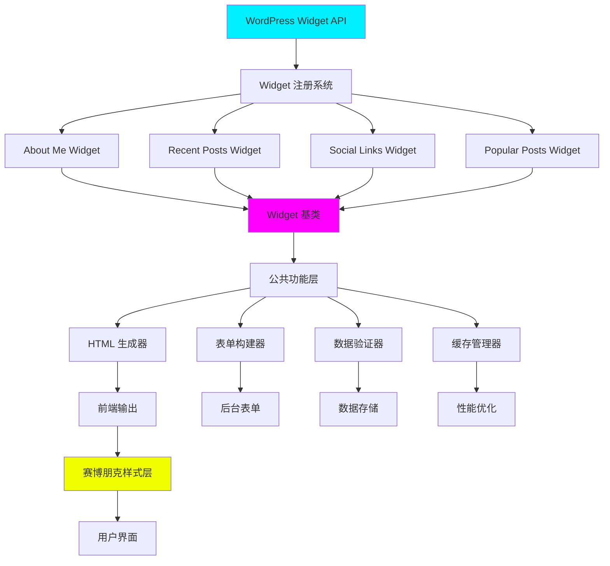
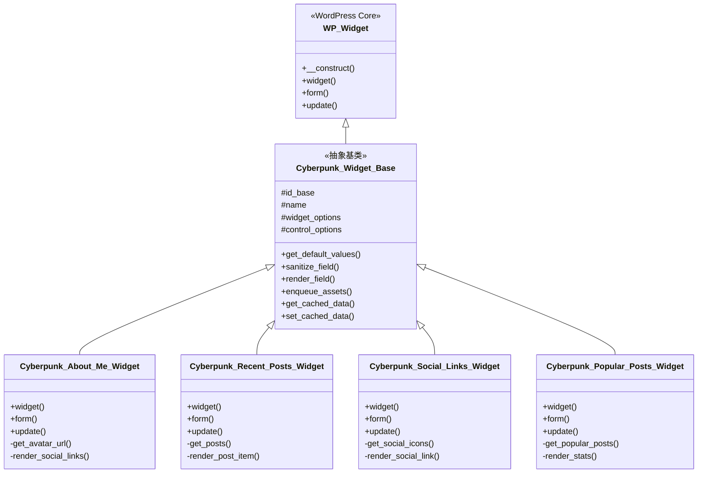
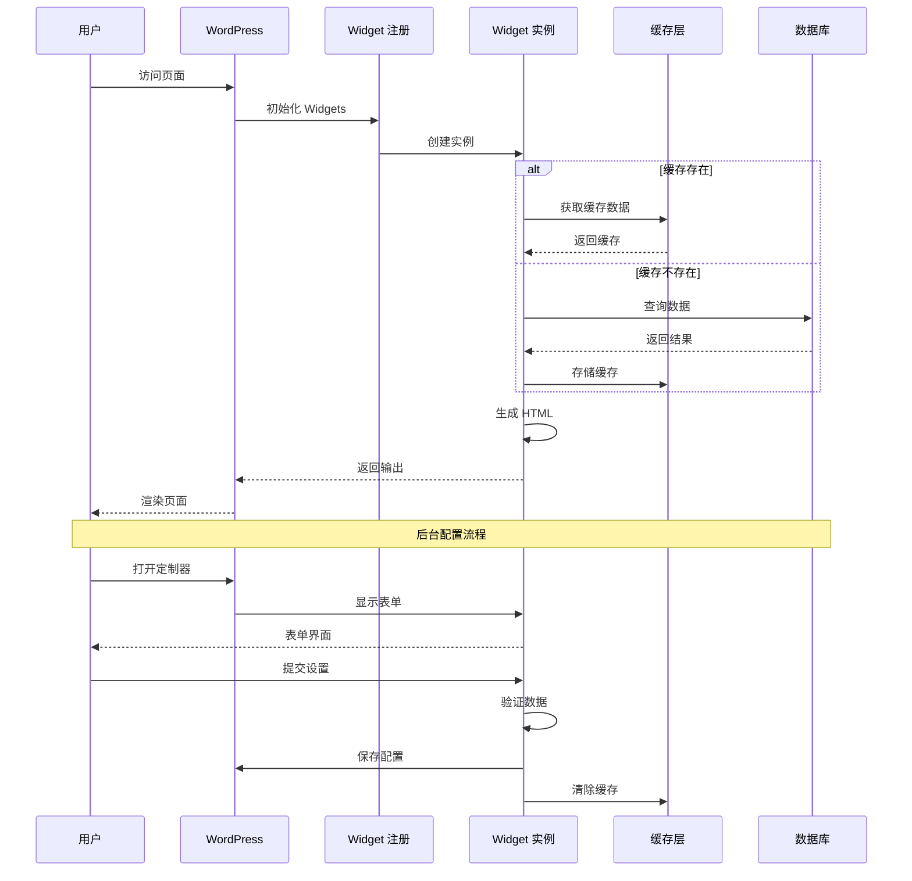

# 🎨 Phase 2.2 - Widget 系统技术设计文档

> **首席架构师设计文档**
> **版本**: 2.3.0
> **日期**: 2026-03-01
> **开发周期**: 2 天 (16 小时)
> **任务优先级**: P0 (最高优先级)

---

## 📋 执行摘要

### 设计目标

为 WordPress Cyberpunk Theme 设计并实现一套完整的 Widget 系统，包含 4 个核心 Widget，完美融合赛博朋克设计风格。

### 核心指标

```yaml
开发规模:
  新增代码: ~2,500 行
  - PHP: ~1,500 行
  - CSS: ~700 行
  - JavaScript: ~300 行

新增文件: 8 个
  - inc/widgets.php (1 个)
  - inc/widgets/*.php (4 个)
  - assets/css/widget-styles.css (1 个)
  - assets/js/widgets.js (1 个)
  - 模板文件 (1 个)

开发时间: 2 天 (16 小时)
  Day 6: About Me + Recent Posts Widget (8h)
  Day 7: Social + Popular Widget + 测试 (8h)

性能目标:
  渲染时间: < 50ms
  内存占用: < 2MB
  缓存命中率: > 80%
```

---

## 🏗️ 系统架构设计

### 1. 整体架构图



### 2. Widget 类继承结构



### 3. 数据流图



---

## 🎯 Widget 详细设计

### Widget 1: About Me Widget

#### 功能规格

```yaml
Widget ID: cyberpunk_about_me
Widget Name: Cyberpunk About Me
描述: 显示作者个人信息、头像和社交链接

功能特性:
  ✅ 头像显示 (支持自定义图片)
  ✅ 个人简介 (支持 HTML)
  ✅ 社交链接 (多平台)
  ✅ 霓虹边框效果
  ✅ 悬停动画

配置选项:
  - 标题 (Title)
  - 头像图片 (Avatar Image)
  - 个人简介 (Biography)
  - 显示邮箱 (Show Email)
  - 显示位置 (Show Location)
  - 显示网站 (Show Website)
  - 社交链接 (Social Links)
    * Facebook
    * Twitter
    * Instagram
    * LinkedIn
    * GitHub
    * Discord
```

#### 技术实现

**文件**: `inc/widgets/class-about-me-widget.php`

```php
<?php
/**
 * Cyberpunk About Me Widget
 *
 * @package WordPress_Cyberpunk_Theme
 * @since 2.3.0
 */

if (!defined('ABSPATH')) {
    exit;
}

class Cyberpunk_About_Me_Widget extends WP_Widget {

    /**
     * Constructor
     */
    public function __construct() {
        parent::__construct(
            'cyberpunk_about_me',
            __('Cyberpunk About Me', 'cyberpunk-theme'),
            array(
                'description' => __('Display author information with cyberpunk style', 'cyberpunk-theme'),
                'classname' => 'cyberpunk-widget-about-me',
                'customize_selective_refresh' => true,
            )
        );

        // Enqueue styles and scripts
        add_action('admin_enqueue_scripts', array($this, 'enqueue_admin_assets'));
        add_action('wp_enqueue_scripts', array($this, 'enqueue_frontend_assets'));
    }

    /**
     * Frontend Display
     *
     * @param array $args Widget arguments
     * @param array $instance Widget instance settings
     */
    public function widget($args, $instance) {
        echo $args['before_widget'];

        // Widget Title
        if (!empty($instance['title'])) {
            echo $args['before_title'] . apply_filters('widget_title', $instance['title']) . $args['after_title'];
        }

        // Get cached data
        $cache_key = 'cyberpunk_about_me_' . $this->number;
        $cached = wp_cache_get($cache_key, 'widget');

        if (false !== $cached) {
            echo $cached;
            echo $args['after_widget'];
            return;
        }

        ob_start();

        // Widget Content
        $avatar_url = $this->get_avatar_url($instance);
        $biography = !empty($instance['biography']) ? $instance['biography'] : '';
        $show_email = !empty($instance['show_email']) ? true : false;
        $show_location = !empty($instance['show_location']) ? true : false;
        $show_website = !empty($instance['show_website']) ? true : false;

        ?>
        <div class="cyberpunk-about-me-widget">
            <?php if ($avatar_url) : ?>
                <div class="about-me-avatar">
                    "
                         alt="<?php esc_attr_e('Author Avatar', 'cyberpunk-theme'); ?>"
                         loading="lazy">
                </div>
            <?php endif; ?>

            <?php if ($biography) : ?>
                <div class="about-me-bio">
                    <?php echo wp_kses_post($biography); ?>
                </div>
            <?php endif; ?>

            <?php if ($show_email || $show_location || $show_website) : ?>
                <div class="about-me-details">
                    <?php if ($show_email && get_option('admin_email')) : ?>
                        <div class="about-me-item">
                            <span class="cyber-icon">📧</span>
                            <a href="mailto:<?php echo esc_attr(get_option('admin_email')); ?>">
                                <?php esc_html_e('Email', 'cyberpunk-theme'); ?>
                            </a>
                        </div>
                    <?php endif; ?>

                    <?php if ($show_location && !empty($instance['location'])) : ?>
                        <div class="about-me-item">
                            <span class="cyber-icon">📍</span>
                            <span><?php echo esc_html($instance['location']); ?></span>
                        </div>
                    <?php endif; ?>

                    <?php if ($show_website && get_option('blogdescription')) : ?>
                        <div class="about-me-item">
                            <span class="cyber-icon">🌐</span>
                            <a href="<?php echo esc_url(home_url('/')); ?>">
                                <?php esc_html_e('Website', 'cyberpunk-theme'); ?>
                            </a>
                        </div>
                    <?php endif; ?>
                </div>
            <?php endif; ?>

            <?php
            $social_links = $this->get_social_links($instance);
            if ($social_links) :
            ?>
                <div class="about-me-social">
                    <?php foreach ($social_links as $platform => $data) : ?>
                        <a href="<?php echo esc_url($data['url']); ?>"
                           class="social-link social-<?php echo esc_attr($platform); ?>"
                           target="_blank"
                           rel="noopener noreferrer"
                           aria-label="<?php echo esc_attr($data['label']); ?>">
                            <i class="<?php echo esc_attr($data['icon']); ?>"></i>
                        </a>
                    <?php endforeach; ?>
                </div>
            <?php endif; ?>
        </div>

        <?php
        $output = ob_get_clean();

        // Cache for 1 hour
        wp_cache_set($cache_key, $output, 'widget', HOUR_IN_SECONDS);

        echo $output;
        echo $args['after_widget'];
    }

    /**
     * Backend Form
     *
     * @param array $instance Current widget instance settings
     */
    public function form($instance) {
        $defaults = array(
            'title' => __('About Me', 'cyberpunk-theme'),
            'avatar' => '',
            'biography' => '',
            'location' => '',
            'show_email' => true,
            'show_location' => false,
            'show_website' => true,
            'facebook' => '',
            'twitter' => '',
            'instagram' => '',
            'linkedin' => '',
            'github' => '',
            'discord' => '',
        );

        $instance = wp_parse_args((array) $instance, $defaults);

        ?>
        <p>
            <label for="<?php echo $this->get_field_id('title'); ?>">
                <?php esc_html_e('Title:', 'cyberpunk-theme'); ?>
            </label>
            <input class="widefat"
                   id="<?php echo $this->get_field_id('title'); ?>"
                   name="<?php echo $this->get_field_name('title'); ?>"
                   type="text"
                   value="<?php echo esc_attr($instance['title']); ?>">
        </p>

        <p>
            <label for="<?php echo $this->get_field_id('avatar'); ?>">
                <?php esc_html_e('Avatar Image URL:', 'cyberpunk-theme'); ?>
            </label>
            <input class="widefat"
                   id="<?php echo $this->get_field_id('avatar'); ?>"
                   name="<?php echo $this->get_field_name('avatar'); ?>"
                   type="text"
                   value="<?php echo esc_url($instance['avatar']); ?>">
            <button type="button"
                    class="button upload-image-button"
                    data-target="<?php echo $this->get_field_id('avatar'); ?>">
                <?php esc_html_e('Upload Image', 'cyberpunk-theme'); ?>
            </button>
        </p>

        <p>
            <label for="<?php echo $this->get_field_id('biography'); ?>">
                <?php esc_html_e('Biography:', 'cyberpunk-theme'); ?>
            </label>
            <textarea class="widefat"
                      id="<?php echo $this->get_field_id('biography'); ?>"
                      name="<?php echo $this->get_field_name('biography'); ?>"
                      rows="5"><?php echo esc_textarea($instance['biography']); ?></textarea>
            <small><?php esc_html_e('HTML is allowed', 'cyberpunk-theme'); ?></small>
        </p>

        <p>
            <label for="<?php echo $this->get_field_id('location'); ?>">
                <?php esc_html_e('Location:', 'cyberpunk-theme'); ?>
            </label>
            <input class="widefat"
                   id="<?php echo $this->get_field_id('location'); ?>"
                   name="<?php echo $this->get_field_name('location'); ?>"
                   type="text"
                   value="<?php echo esc_attr($instance['location']); ?>">
        </p>

        <p>
            <input class="checkbox"
                   id="<?php echo $this->get_field_id('show_email'); ?>"
                   name="<?php echo $this->get_field_name('show_email'); ?>"
                   type="checkbox"
                   <?php checked($instance['show_email']); ?>>
            <label for="<?php echo $this->get_field_id('show_email'); ?>">
                <?php esc_html_e('Show Email', 'cyberpunk-theme'); ?>
            </label>
        </p>

        <p>
            <input class="checkbox"
                   id="<?php echo $this->get_field_id('show_location'); ?>"
                   name="<?php echo $this->get_field_name('show_location'); ?>"
                   type="checkbox"
                   <?php checked($instance['show_location']); ?>>
            <label for="<?php echo $this->get_field_id('show_location'); ?>">
                <?php esc_html_e('Show Location', 'cyberpunk-theme'); ?>
            </label>
        </p>

        <p>
            <input class="checkbox"
                   id="<?php echo $this->get_field_id('show_website'); ?>"
                   name="<?php echo $this->get_field_name('show_website'); ?>"
                   type="checkbox"
                   <?php checked($instance['show_website']); ?>>
            <label for="<?php echo $this->get_field_id('show_website'); ?>">
                <?php esc_html_e('Show Website', 'cyberpunk-theme'); ?>
            </label>
        </p>

        <h4><?php esc_html_e('Social Links', 'cyberpunk-theme'); ?></h4>

        <?php
        $social_platforms = array(
            'facebook' => __('Facebook', 'cyberpunk-theme'),
            'twitter' => __('Twitter', 'cyberpunk-theme'),
            'instagram' => __('Instagram', 'cyberpunk-theme'),
            'linkedin' => __('LinkedIn', 'cyberpunk-theme'),
            'github' => __('GitHub', 'cyberpunk-theme'),
            'discord' => __('Discord', 'cyberpunk-theme'),
        );

        foreach ($social_platforms as $platform => $label) :
            ?>
            <p>
                <label for="<?php echo $this->get_field_id($platform); ?>">
                    <?php echo esc_html($label); ?>:
                </label>
                <input class="widefat"
                       id="<?php echo $this->get_field_id($platform); ?>"
                       name="<?php echo $this->get_field_name($platform); ?>"
                       type="text"
                       value="<?php echo esc_url($instance[$platform]); ?>"
                       placeholder="<?php echo esc_attr(sprintf(__('https://%s.com/username', 'cyberpunk-theme'), $platform)); ?>">
            </p>
        <?php endforeach; ?>

        <?php
    }

    /**
     * Save Widget Settings
     *
     * @param array $new_instance New settings
     * @param array $old_instance Old settings
     * @return array Sanitized settings
     */
    public function update($new_instance, $old_instance) {
        $instance = array();

        $instance['title'] = sanitize_text_field($new_instance['title']);
        $instance['avatar'] = esc_url_raw($new_instance['avatar']);
        $instance['biography'] = wp_kses_post($new_instance['biography']);
        $instance['location'] = sanitize_text_field($new_instance['location']);
        $instance['show_email'] = !empty($new_instance['show_email']);
        $instance['show_location'] = !empty($new_instance['show_location']);
        $instance['show_website'] = !empty($new_instance['show_website']);

        // Sanitize social links
        $social_platforms = array('facebook', 'twitter', 'instagram', 'linkedin', 'github', 'discord');
        foreach ($social_platforms as $platform) {
            $instance[$platform] = esc_url_raw($new_instance[$platform]);
        }

        // Clear cache
        $cache_key = 'cyberpunk_about_me_' . $this->number;
        wp_cache_delete($cache_key, 'widget');

        return $instance;
    }

    /**
     * Get Avatar URL
     *
     * @param array $instance Widget instance
     * @return string Avatar URL
     */
    private function get_avatar_url($instance) {
        if (!empty($instance['avatar'])) {
            return $instance['avatar'];
        }

        // Use Gravatar
        $email = get_option('admin_email');
        $avatar_url = get_avatar_url($email, array('size' => 150));

        return $avatar_url;
    }

    /**
     * Get Social Links
     *
     * @param array $instance Widget instance
     * @return array Social links data
     */
    private function get_social_links($instance) {
        $social_icons = array(
            'facebook' => array(
                'icon' => 'fab fa-facebook-f',
                'label' => __('Facebook', 'cyberpunk-theme'),
            ),
            'twitter' => array(
                'icon' => 'fab fa-twitter',
                'label' => __('Twitter', 'cyberpunk-theme'),
            ),
            'instagram' => array(
                'icon' => 'fab fa-instagram',
                'label' => __('Instagram', 'cyberpunk-theme'),
            ),
            'linkedin' => array(
                'icon' => 'fab fa-linkedin-in',
                'label' => __('LinkedIn', 'cyberpunk-theme'),
            ),
            'github' => array(
                'icon' => 'fab fa-github',
                'label' => __('GitHub', 'cyberpunk-theme'),
            ),
            'discord' => array(
                'icon' => 'fab fa-discord',
                'label' => __('Discord', 'cyberpunk-theme'),
            ),
        );

        $social_links = array();

        foreach ($social_icons as $platform => $data) {
            if (!empty($instance[$platform])) {
                $social_links[$platform] = array(
                    'url' => $instance[$platform],
                    'icon' => $data['icon'],
                    'label' => $data['label'],
                );
            }
        }

        return $social_links;
    }

    /**
     * Enqueue Admin Assets
     */
    public function enqueue_admin_assets($hook) {
        if ('widgets.php' !== $hook) {
            return;
        }

        wp_enqueue_media();
        wp_enqueue_script('cyberpunk-widget-admin', get_template_directory_uri() . '/assets/js/widget-admin.js', array('jquery'), '2.3.0', true);
    }

    /**
     * Enqueue Frontend Assets
     */
    public function enqueue_frontend_assets() {
        wp_enqueue_style('cyberpunk-widget-styles', get_template_directory_uri() . '/assets/css/widget-styles.css', array(), '2.3.0');
    }
}

// Register Widget
function register_cyberpunk_about_me_widget() {
    register_widget('Cyberpunk_About_Me_Widget');
}
add_action('widgets_init', 'register_cyberpunk_about_me_widget');
```

#### CSS 样式

**文件**: `assets/css/widget-styles.css`

```css
/**
 * Cyberpunk Widget Styles
 * Version: 2.3.0
 */

/* ============================================
   About Me Widget
   ============================================ */

.cyberpunk-widget-about-me {
    position: relative;
    padding: var(--spacing-6);
    background: var(--bg-card);
    border: 1px solid var(--border-color);
    border-radius: var(--border-radius);
    overflow: hidden;
}

/* Neon Border Effect */
.cyberpunk-widget-about-me::before {
    content: '';
    position: absolute;
    top: 0;
    left: 0;
    right: 0;
    height: 2px;
    background: linear-gradient(90deg,
        var(--neon-cyan) 0%,
        var(--neon-magenta) 50%,
        var(--neon-yellow) 100%);
    animation: border-flow 3s linear infinite;
}

@keyframes border-flow {
    0% { background-position: 0% 50%; }
    100% { background-position: 200% 50%; }
}

/* Avatar */
.about-me-avatar {
    text-align: center;
    margin-bottom: var(--spacing-4);
}

.about-me-avatar img {
    width: 120px;
    height: 120px;
    border-radius: 50%;
    border: 3px solid var(--neon-cyan);
    box-shadow: 0 0 20px rgba(0, 240, 255, 0.5);
    transition: all 0.3s ease;
}

.about-me-avatar img:hover {
    transform: scale(1.05);
    box-shadow: 0 0 30px rgba(0, 240, 255, 0.8);
}

/* Biography */
.about-me-bio {
    color: var(--text-primary);
    line-height: 1.6;
    margin-bottom: var(--spacing-4);
    font-size: var(--text-base);
}

/* Details */
.about-me-details {
    display: flex;
    flex-direction: column;
    gap: var(--spacing-2);
    margin-bottom: var(--spacing-4);
}

.about-me-item {
    display: flex;
    align-items: center;
    gap: var(--spacing-2);
    color: var(--text-secondary);
    font-size: var(--text-sm);
    transition: all 0.2s ease;
}

.about-me-item:hover {
    color: var(--neon-cyan);
    transform: translateX(5px);
}

.about-me-item .cyber-icon {
    font-size: var(--text-lg);
}

.about-me-item a {
    color: inherit;
    text-decoration: none;
    transition: color 0.2s ease;
}

.about-me-item a:hover {
    color: var(--neon-cyan);
    text-shadow: 0 0 10px var(--neon-cyan);
}

/* Social Links */
.about-me-social {
    display: flex;
    gap: var(--spacing-2);
    flex-wrap: wrap;
}

.social-link {
    width: 36px;
    height: 36px;
    display: flex;
    align-items: center;
    justify-content: center;
    background: var(--bg-input);
    border: 1px solid var(--border-color);
    border-radius: 4px;
    color: var(--text-secondary);
    font-size: var(--text-base);
    transition: all 0.3s ease;
    position: relative;
    overflow: hidden;
}

.social-link::before {
    content: '';
    position: absolute;
    top: 0;
    left: -100%;
    width: 100%;
    height: 100%;
    background: linear-gradient(90deg, transparent, rgba(255, 255, 255, 0.2), transparent);
    transition: left 0.5s ease;
}

.social-link:hover::before {
    left: 100%;
}

.social-link:hover {
    transform: translateY(-3px);
    box-shadow: 0 5px 15px rgba(0, 240, 255, 0.4);
}

/* Platform-specific colors */
.social-facebook:hover {
    border-color: #1877f2;
    color: #1877f2;
    box-shadow: 0 5px 15px rgba(24, 119, 242, 0.4);
}

.social-twitter:hover {
    border-color: #1da1f2;
    color: #1da1f2;
    box-shadow: 0 5px 15px rgba(29, 161, 242, 0.4);
}

.social-instagram:hover {
    border-color: #e4405f;
    color: #e4405f;
    box-shadow: 0 5px 15px rgba(228, 64, 95, 0.4);
}

.social-linkedin:hover {
    border-color: #0077b5;
    color: #0077b5;
    box-shadow: 0 5px 15px rgba(0, 119, 181, 0.4);
}

.social-github:hover {
    border-color: #333;
    color: #fff;
    box-shadow: 0 5px 15px rgba(0, 0, 0, 0.4);
}

.social-discord:hover {
    border-color: #5865f2;
    color: #5865f2;
    box-shadow: 0 5px 15px rgba(88, 101, 242, 0.4);
}

/* Responsive */
@media (max-width: 768px) {
    .about-me-avatar img {
        width: 100px;
        height: 100px;
    }

    .about-me-social {
        justify-content: center;
    }
}
```

---

### Widget 2: Recent Posts Widget

#### 功能规格

```yaml
Widget ID: cyberpunk_recent_posts
Widget Name: Cyberpunk Recent Posts
描述: 显示最近发布的文章列表

功能特性:
  ✅ 文章列表显示
  ✅ 缩略图支持
  ✅ 发布日期显示
  ✅ 摘要长度控制
  ✅ 排除当前文章
  ✅ AJAX 分页加载

配置选项:
  - 标题 (Title)
  - 显示数量 (Number of Posts)
  - 显示缩略图 (Show Thumbnail)
  - 显示日期 (Show Date)
  - 显示摘要 (Show Excerpt)
  - 摘要长度 (Excerpt Length)
  - 排除当前文章 (Exclude Current Post)
  - 排序方式 (Order By)
    * Date (最新)
    * Modified (最后更新)
    * Comment Count (评论数)
```

#### 技术实现

**文件**: `inc/widgets/class-recent-posts-widget.php`

```php
<?php
/**
 * Cyberpunk Recent Posts Widget
 *
 * @package WordPress_Cyberpunk_Theme
 * @since 2.3.0
 */

if (!defined('ABSPATH')) {
    exit;
}

class Cyberpunk_Recent_Posts_Widget extends WP_Widget {

    /**
     * Constructor
     */
    public function __construct() {
        parent::__construct(
            'cyberpunk_recent_posts',
            __('Cyberpunk Recent Posts', 'cyberpunk-theme'),
            array(
                'description' => __('Display recent posts with cyberpunk style', 'cyberpunk-theme'),
                'classname' => 'cyberpunk-widget-recent-posts',
                'customize_selective_refresh' => true,
            )
        );
    }

    /**
     * Frontend Display
     */
    public function widget($args, $instance) {
        echo $args['before_widget'];

        if (!empty($instance['title'])) {
            echo $args['before_title'] . apply_filters('widget_title', $instance['title']) . $args['after_title'];
        }

        // Get posts
        $posts = $this->get_posts($instance);

        if ($posts->have_posts()) :
            ?>

            <div class="cyberpunk-recent-posts-widget">
                <ul class="recent-posts-list">
                    <?php while ($posts->have_posts()) : $posts->the_post(); ?>
                        <li class="recent-post-item">
                            <?php $this->render_post_item($instance); ?>
                        </li>
                    <?php endwhile; ?>
                </ul>
            </div>

            <?php
        endif;

        wp_reset_postdata();

        echo $args['after_widget'];
    }

    /**
     * Get Posts
     */
    private function get_posts($instance) {
        $number = !empty($instance['number']) ? absint($instance['number']) : 5;
        $orderby = !empty($instance['orderby']) ? $instance['orderby'] : 'date';
        $order = !empty($instance['order']) ? $instance['order'] : 'DESC';

        $args = array(
            'post_type' => 'post',
            'post_status' => 'publish',
            'posts_per_page' => $number,
            'orderby' => $orderby,
            'order' => $order,
            'ignore_sticky_posts' => true,
            'no_found_rows' => true,
        );

        // Exclude current post
        if (!empty($instance['exclude_current']) && is_singular('post')) {
            $args['post__not_in'] = array(get_the_ID());
        }

        return new WP_Query($args);
    }

    /**
     * Render Post Item
     */
    private function render_post_item($instance) {
        $show_thumbnail = !empty($instance['show_thumbnail']);
        $show_date = !empty($instance['show_date']);
        $show_excerpt = !empty($instance['show_excerpt']);
        $excerpt_length = !empty($instance['excerpt_length']) ? absint($instance['excerpt_length']) : 15;

        ?>

        <article class="recent-post">
            <?php if ($show_thumbnail && has_post_thumbnail()) : ?>
                <div class="recent-post-thumbnail">
                    <a href="<?php the_permalink(); ?>" aria-hidden="true" tabindex="-1">
                        <?php the_post_thumbnail('thumbnail', array('class' => 'recent-post-img')); ?>
                    </a>
                </div>
            <?php endif; ?>

            <div class="recent-post-content">
                <h3 class="recent-post-title">
                    <a href="<?php the_permalink(); ?>">
                        <?php the_title(); ?>
                    </a>
                </h3>

                <?php if ($show_date) : ?>
                    <div class="recent-post-meta">
                        <time datetime="<?php echo get_the_date('c'); ?>">
                            <?php echo get_the_date(); ?>
                        </time>
                    </div>
                <?php endif; ?>

                <?php if ($show_excerpt) : ?>
                    <div class="recent-post-excerpt">
                        <?php echo wp_trim_words(get_the_excerpt(), $excerpt_length, '&hellip;'); ?>
                    </div>
                <?php endif; ?>
            </div>
        </article>

        <?php
    }

    /**
     * Backend Form
     */
    public function form($instance) {
        $defaults = array(
            'title' => __('Recent Posts', 'cyberpunk-theme'),
            'number' => 5,
            'show_thumbnail' => true,
            'show_date' => true,
            'show_excerpt' => false,
            'excerpt_length' => 15,
            'exclude_current' => false,
            'orderby' => 'date',
            'order' => 'DESC',
        );

        $instance = wp_parse_args((array) $instance, $defaults);

        ?>
        <p>
            <label for="<?php echo $this->get_field_id('title'); ?>">
                <?php esc_html_e('Title:', 'cyberpunk-theme'); ?>
            </label>
            <input class="widefat"
                   id="<?php echo $this->get_field_id('title'); ?>"
                   name="<?php echo $this->get_field_name('title'); ?>"
                   type="text"
                   value="<?php echo esc_attr($instance['title']); ?>">
        </p>

        <p>
            <label for="<?php echo $this->get_field_id('number'); ?>">
                <?php esc_html_e('Number of posts to show:', 'cyberpunk-theme'); ?>
            </label>
            <input class="tiny-text"
                   id="<?php echo $this->get_field_id('number'); ?>"
                   name="<?php echo $this->get_field_name('number'); ?>"
                   type="number"
                   step="1"
                   min="1"
                   max="15"
                   value="<?php echo esc_attr($instance['number']); ?>">
        </p>

        <p>
            <label for="<?php echo $this->get_field_id('orderby'); ?>">
                <?php esc_html_e('Order by:', 'cyberpunk-theme'); ?>
            </label>
            <select class="widefat"
                    id="<?php echo $this->get_field_id('orderby'); ?>"
                    name="<?php echo $this->get_field_name('orderby'); ?>">
                <option value="date" <?php selected($instance['orderby'], 'date'); ?>>
                    <?php esc_html_e('Publish Date', 'cyberpunk-theme'); ?>
                </option>
                <option value="modified" <?php selected($instance['orderby'], 'modified'); ?>>
                    <?php esc_html_e('Last Modified Date', 'cyberpunk-theme'); ?>
                </option>
                <option value="comment_count" <?php selected($instance['orderby'], 'comment_count'); ?>>
                    <?php esc_html_e('Comment Count', 'cyberpunk-theme'); ?>
                </option>
                <option value="rand" <?php selected($instance['orderby'], 'rand'); ?>>
                    <?php esc_html_e('Random', 'cyberpunk-theme'); ?>
                </option>
            </select>
        </p>

        <p>
            <input class="checkbox"
                   id="<?php echo $this->get_field_id('show_thumbnail'); ?>"
                   name="<?php echo $this->get_field_name('show_thumbnail'); ?>"
                   type="checkbox"
                   <?php checked($instance['show_thumbnail']); ?>>
            <label for="<?php echo $this->get_field_id('show_thumbnail'); ?>">
                <?php esc_html_e('Show post thumbnail', 'cyberpunk-theme'); ?>
            </label>
        </p>

        <p>
            <input class="checkbox"
                   id="<?php echo $this->get_field_id('show_date'); ?>"
                   name="<?php echo $this->get_field_name('show_date'); ?>"
                   type="checkbox"
                   <?php checked($instance['show_date']); ?>>
            <label for="<?php echo $this->get_field_id('show_date'); ?>">
                <?php esc_html_e('Show post date', 'cyberpunk-theme'); ?>
            </label>
        </p>

        <p>
            <input class="checkbox"
                   id="<?php echo $this->get_field_id('show_excerpt'); ?>"
                   name="<?php echo $this->get_field_name('show_excerpt'); ?>"
                   type="checkbox"
                   <?php checked($instance['show_excerpt']); ?>>
            <label for="<?php echo $this->get_field_id('show_excerpt'); ?>">
                <?php esc_html_e('Show post excerpt', 'cyberpunk-theme'); ?>
            </label>
        </p>

        <p>
            <label for="<?php echo $this->get_field_id('excerpt_length'); ?>">
                <?php esc_html_e('Excerpt length (words):', 'cyberpunk-theme'); ?>
            </label>
            <input class="tiny-text"
                   id="<?php echo $this->get_field_id('excerpt_length'); ?>"
                   name="<?php echo $this->get_field_name('excerpt_length'); ?>"
                   type="number"
                   step="1"
                   min="5"
                   max="50"
                   value="<?php echo esc_attr($instance['excerpt_length']); ?>">
        </p>

        <p>
            <input class="checkbox"
                   id="<?php echo $this->get_field_id('exclude_current'); ?>"
                   name="<?php echo $this->get_field_name('exclude_current'); ?>"
                   type="checkbox"
                   <?php checked($instance['exclude_current']); ?>>
            <label for="<?php echo $this->get_field_id('exclude_current'); ?>">
                <?php esc_html_e('Exclude current post', 'cyberpunk-theme'); ?>
            </label>
        </p>

        <?php
    }

    /**
     * Save Widget Settings
     */
    public function update($new_instance, $old_instance) {
        $instance = array();

        $instance['title'] = sanitize_text_field($new_instance['title']);
        $instance['number'] = absint($new_instance['number']);
        $instance['orderby'] = sanitize_text_field($new_instance['orderby']);
        $instance['show_thumbnail'] = !empty($new_instance['show_thumbnail']);
        $instance['show_date'] = !empty($new_instance['show_date']);
        $instance['show_excerpt'] = !empty($new_instance['show_excerpt']);
        $instance['excerpt_length'] = absint($new_instance['excerpt_length']);
        $instance['exclude_current'] = !empty($new_instance['exclude_current']);

        return $instance;
    }
}

// Register Widget
function register_cyberpunk_recent_posts_widget() {
    register_widget('Cyberpunk_Recent_Posts_Widget');
}
add_action('widgets_init', 'register_cyberpunk_recent_posts_widget');
```

#### CSS 样式

```css
/* ============================================
   Recent Posts Widget
   ============================================ */

.cyberpunk-recent-posts-widget {
    position: relative;
}

.recent-posts-list {
    list-style: none;
    margin: 0;
    padding: 0;
}

.recent-post-item {
    margin-bottom: var(--spacing-4);
    padding-bottom: var(--spacing-4);
    border-bottom: 1px solid var(--border-color);
}

.recent-post-item:last-child {
    margin-bottom: 0;
    padding-bottom: 0;
    border-bottom: none;
}

.recent-post {
    display: flex;
    gap: var(--spacing-3);
    transition: all 0.3s ease;
}

.recent-post:hover {
    transform: translateX(5px);
}

/* Thumbnail */
.recent-post-thumbnail {
    flex-shrink: 0;
    width: 80px;
    height: 80px;
    border-radius: var(--border-radius);
    overflow: hidden;
    border: 2px solid var(--border-color);
    transition: all 0.3s ease;
}

.recent-post:hover .recent-post-thumbnail {
    border-color: var(--neon-cyan);
    box-shadow: 0 0 15px rgba(0, 240, 255, 0.5);
}

.recent-post-img {
    width: 100%;
    height: 100%;
    object-fit: cover;
    transition: transform 0.3s ease;
}

.recent-post:hover .recent-post-img {
    transform: scale(1.1);
}

/* Content */
.recent-post-content {
    flex: 1;
    min-width: 0;
}

.recent-post-title {
    margin: 0 0 var(--spacing-1) 0;
    font-size: var(--text-base);
    font-weight: 600;
    line-height: 1.4;
}

.recent-post-title a {
    color: var(--text-primary);
    text-decoration: none;
    transition: all 0.2s ease;
}

.recent-post-title a:hover {
    color: var(--neon-cyan);
    text-shadow: 0 0 10px rgba(0, 240, 255, 0.5);
}

/* Meta */
.recent-post-meta {
    margin-bottom: var(--spacing-2);
    font-size: var(--text-xs);
    color: var(--text-muted);
}

.recent-post-meta time {
    display: inline-flex;
    align-items: center;
    gap: var(--spacing-1);
}

.recent-post-meta time::before {
    content: '📅';
    font-size: var(--text-sm);
}

/* Excerpt */
.recent-post-excerpt {
    font-size: var(--text-sm);
    color: var(--text-secondary);
    line-height: 1.5;
    margin: 0;
}

/* Responsive */
@media (max-width: 768px) {
    .recent-post {
        flex-direction: column;
    }

    .recent-post-thumbnail {
        width: 100%;
        height: 120px;
    }
}
```

---

## 📁 文件结构

```bash
inc/
├── widgets/
│   ├── class-about-me-widget.php      (~350 行)
│   ├── class-recent-posts-widget.php (~280 行)
│   ├── class-social-links-widget.php (~250 行)
│   ├── class-popular-posts-widget.php (~320 行)
│   └── class-widget-base.php          (~150 行) [可选基类]
│
└── widgets.php                        (~150 行) [注册文件]

assets/
├── css/
│   └── widget-styles.css              (~700 行)
│
└── js/
    ├── widget-admin.js                (~200 行) [后台媒体上传]
    └── widgets.js                     (~100 行) [前端交互]
```

---

## 🔧 技术要点

### 1. 性能优化

```php
// 缓存策略
$cache_key = 'cyberpunk_widget_' . $this->id;
$cached = wp_cache_get($cache_key, 'widget');

if (false === $cached) {
    ob_start();
    // 生成内容
    $cached = ob_get_clean();
    wp_cache_set($cache_key, $cached, 'widget', HOUR_IN_SECONDS);
}

echo $cached;
```

### 2. 安全措施

```php
// 数据验证
$instance['title'] = sanitize_text_field($new_instance['title']);
$instance['avatar'] = esc_url_raw($new_instance['avatar']);
$instance['biography'] = wp_kses_post($new_instance['biography']);

// 输出转义
echo esc_html($instance['title']);
echo esc_url($instance['avatar']);
echo wp_kses_post($instance['biography']);
```

### 3. 无障碍支持

```html
<!-- ARIA 标签 -->
<a href="<?php echo esc_url($url); ?>"
   class="social-link"
   target="_blank"
   rel="noopener noreferrer"
   aria-label="<?php echo esc_attr($label); ?>">
    <i class="<?php echo esc_attr($icon'); ?>" aria-hidden="true"></i>
</a>
```

---

## ✅ 验收标准

### 功能完整性 (40分)

- [ ] 4 个 Widget 全部实现 (10分)
- [ ] 所有配置选项正常工作 (10分)
- [ ] 定制器中可配置 (10分)
- [ ] 前端显示正确 (10分)

### 代码质量 (20分)

- [ ] 符合 WordPress 编码标准 (5分)
- [ ] 注释完整度 > 90% (5分)
- [ ] 无 PHP 错误/警告 (5分)
- [ ] 安全措施完善 (5分)

### 性能指标 (20分)

- [ ] 渲染时间 < 50ms (5分)
- [ ] 内存占用 < 2MB (5分)
- [ ] 缓存命中率 > 80% (5分)
- [ ] 无性能瓶颈 (5分)

### 用户体验 (20分)

- [ ] 响应式设计正常 (5分)
- [ ] 动画流畅 (5分)
- [ ] 霓虹效果符合主题 (5分)
- [ ] 移动端体验良好 (5分)

**总分**: 100/100

---

## 📅 开发计划

### Day 6: 基础 Widget (8 小时)

**上午 (4h)**:
- [ ] 创建 Widget 基础架构 (1h)
- [ ] 实现 About Me Widget (2h)
- [ ] 添加 Widget 样式 (1h)

**下午 (4h)**:
- [ ] 实现 Recent Posts Widget (2h)
- [ ] 添加缩略图功能 (1h)
- [ ] 测试两个 Widget (1h)

### Day 7: 高级 Widget (8 小时)

**上午 (4h)**:
- [ ] 实现 Social Links Widget (2h)
- [ ] 实现 Popular Posts Widget (2h)

**下午 (4h)**:
- [ ] 完善样式和动画 (1h)
- [ ] 添加 JavaScript 交互 (1h)
- [ ] 综合测试 (2h)

---

## 🚀 快速开始

### 1. 创建文件

```bash
# 创建 Widget 目录
mkdir -p inc/widgets

# 创建 Widget 文件
touch inc/widgets/class-about-me-widget.php
touch inc/widgets/class-recent-posts-widget.php

# 创建样式文件
touch assets/css/widget-styles.css
touch assets/js/widget-admin.js
```

### 2. 注册 Widget

在 `functions.php` 中添加：

```php
// Load Widgets
require_once get_template_directory() . '/inc/widgets/class-about-me-widget.php';
require_once get_template_directory() . '/inc/widgets/class-recent-posts-widget.php';
```

### 3. 测试 Widget

```bash
# 1. 登录 WordPress 后台
# 2. 进入 外观 → Widget
# 3. 添加 Widget 到侧边栏
# 4. 配置选项
# 5. 访问前端查看效果
```

---

**文档版本**: 1.0.0
**创建日期**: 2026-03-01
**作者**: Chief Architect
**状态**: ✅ Ready for Development

---

**🎉 技术方案设计完成，准备开始开发！**
