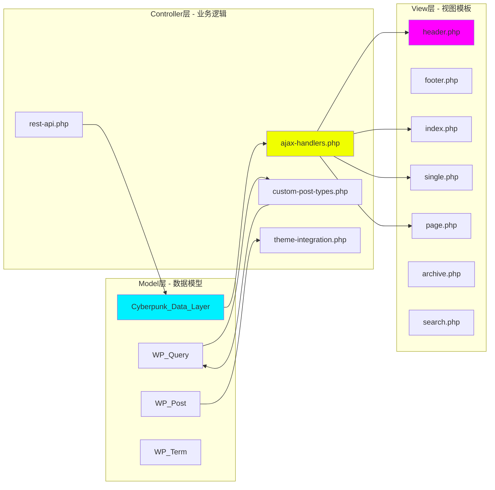
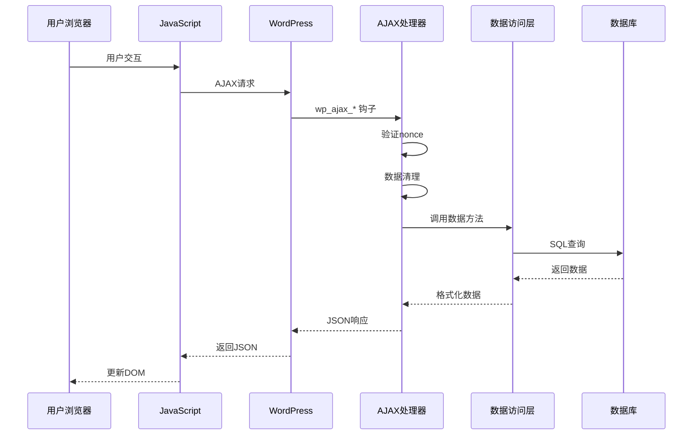
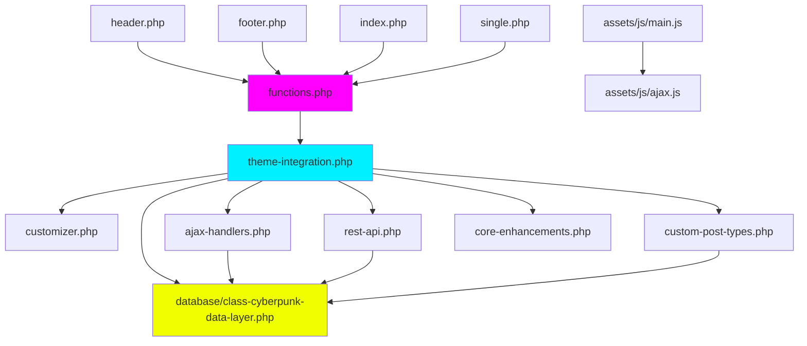
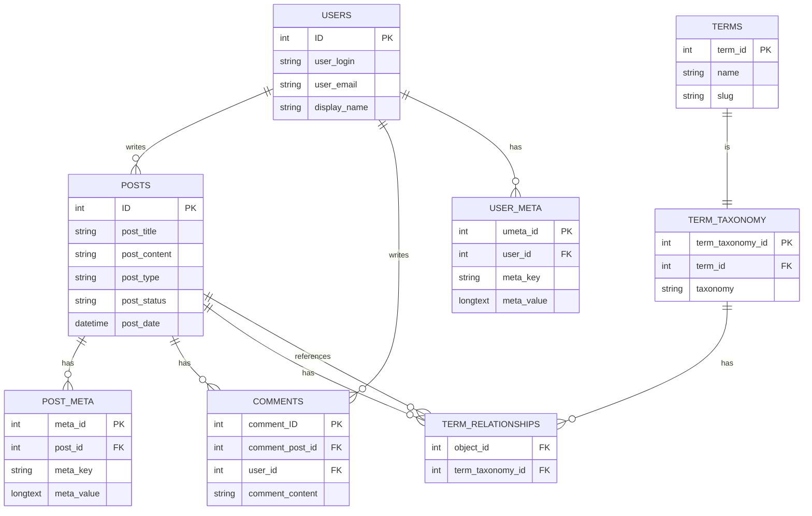

# 🏗️ WordPress Cyberpunk Theme - Phase 2 完整技术方案

> **首席架构师技术方案**
> **版本**: 2.2.0
> **日期**: 2026-03-01
> **项目路径**: `/root/.openclaw/workspace/wordpress-cyber-theme`
> **方案类型**: 系统架构 + 技术选型 + 实施路线图

---

## 📊 目录

1. [项目现状分析](#一项目现状分析)
2. [系统架构设计](#二系统架构设计)
3. [技术栈清单](#三技术栈清单)
4. [API接口设计](#四api接口设计)
5. [数据库设计](#五数据库设计)
6. [前端架构](#六前端架构)
7. [任务拆分清单](#七任务拆分清单)
8. [性能优化策略](#八性能优化策略)
9. [安全架构设计](#九安全架构设计)
10. [部署与运维](#十部署与运维)

---

## 一、项目现状分析

### 1.1 代码规模统计

```yaml
Phase 1 完成情况 (95%):
  后端代码:
    PHP 模板文件:      11 个文件 (4,881 行)
      ├── header.php         (  79 行) - 网站头部
      ├── footer.php         (  86 行) - 网站底部
      ├── index.php          ( 176 行) - 首页模板
      ├── single.php         ( 243 行) - 文章页
      ├── page.php           (  98 行) - 页面模板
      ├── archive.php        ( 143 行) - 归档页
      ├── search.php         ( 189 行) - 搜索页
      ├── archive-portfolio.php (104 行) - 作品集归档
      ├── single-portfolio.php (362 行) - 作品集详情
      ├── sidebar.php        (  93 行) - 侧边栏
      └── comments.php       (114 行) - 评论系统

    功能模块:           7 个文件 (3,315 行)
      ├── theme-integration.php    (385 行) - 模块集成
      ├── customizer.php           (689 行) - 主题定制器
      ├── core-enhancements.php    (655 行) - 核心增强
      ├── ajax-handlers.php        (582 行) - AJAX处理
      ├── rest-api.php             (489 行) - REST API
      ├── custom-post-types.php    (515 行) - 自定义文章类型
      └── database/
          └── class-cyberpunk-data-layer.php (623 行) - 数据层

  前端代码:
    CSS 样式文件:      3 个文件 (约 2,000 行)
      ├── style.css          (1,191 行) - 主样式
      ├── main-styles.css    (约 500 行) - 附加样式
      └── admin.css          (约 300 行) - 管理界面样式

    JavaScript 文件:    2 个文件 (约 150 行)
      ├── main.js            (约 100 行) - 主脚本
      └── ajax.js            (约 50 行)  - AJAX处理

  文档文件:           18 个 Markdown 文档
```

### 1.2 已实现功能矩阵

| 功能模块 | 实现状态 | 完成度 | 备注 |
|---------|---------|--------|-----|
| **核心模板** | ✅ 完成 | 100% | 所有标准模板已实现 |
| **Portfolio CPT** | ✅ 完成 | 100% | 自定义文章类型+模板 |
| **AJAX后端** | ✅ 完成 | 100% | 7个AJAX处理器 |
| **REST API** | ✅ 完成 | 100% | 5个REST端点 |
| **主题定制器** | ✅ 完成 | 100% | 30+定制选项 |
| **数据访问层** | ✅ 完成 | 100% | OOP数据访问类 |
| **响应式设计** | ✅ 完成 | 95% | 缺少部分优化 |
| **JavaScript交互** | ⚠️ 部分完成 | 30% | 需要实现前端逻辑 |
| **Widget系统** | ❌ 未实现 | 0% | Phase 2任务 |
| **短代码系统** | ❌ 未实现 | 0% | Phase 2任务 |
| **性能优化** | ❌ 未实现 | 0% | Phase 2任务 |
| **文档系统** | ⚠️ 部分完成 | 70% | 需要用户手册 |

### 1.3 技术债务分析

```yaml
高优先级技术债务:
  - JavaScript前端逻辑未实现 (main.js只有骨架代码)
  - AJAX后端与前端未连接
  - 缺少Widget系统
  - 缺少短代码系统

中优先级技术债务:
  - 性能优化未实施 (无缓存、无压缩)
  - 测试覆盖率为0
  - 错误处理不完善
  - 文档不完整

低优先级技术债务:
  - 代码注释不够详细
  - 部分CSS未压缩
  - 缺少开发工具链
```

---

## 二、系统架构设计

### 2.1 整体架构图

```mermaid
graph TB
    subgraph "客户端层"
        A[浏览器] --> B{设备类型}
        B -->|桌面| C[桌面视图]
        B -->|移动| D[移动视图]
        B -->|平板| E[平板视图]
    end

    subgraph "前端层"
        C --> F[HTML5模板]
        D --> F
        E --> F
        F --> G[CSS3样式层]
        F --> H[JavaScript交互层]

        G --> G1[主样式 style.css]
        G --> G2[响应式样式]
        G --> G3[霓虹动画效果]

        H --> H1[main.js - 核心交互]
        H --> H2[ajax.js - AJAX通信]
        H --> H3[UI组件逻辑]
    end

    subgraph "应用层"
        H1 --> I[AJAX请求]
        H2 --> I
        I --> J[wp_ajax_* 钩子]

        K[WordPress核心] --> L[主题系统]
        L --> M[模板层次]
        M --> N[模板文件]

        J --> O[AJAX处理器]
        O --> P[数据访问层]
    end

    subgraph "业务逻辑层"
        P --> Q[自定义文章类型]
        P --> R[元数据管理]
        P --> S[用户系统]
        P --> T[分类/标签]

        Q --> Q1[Portfolio]
        Q --> Q2[Projects]

        O --> U[REST API]
        U --> U1[GET /posts]
        U --> U2[POST /like]
        U --> U3[GET /stats]
    end

    subgraph "数据层"
        P --> V[WordPress数据库]
        V --> V1[wp_posts]
        V --> V2[wp_postmeta]
        V --> V3[wp_users]
        V --> V4[wp_options]
        V --> V5[wp_terms]
    end

    subgraph "扩展层"
        L --> W[主题定制器]
        L --> X[Widget系统]
        L --> Y[短代码系统]
        L --> Z[钩子系统]

        W --> W1[30+定制选项]
        X --> X1[自定义Widgets]
        Y --> Y1[10+短代码]
    end

    subgraph "缓存层"
        P --> AA[对象缓存]
        P --> BB[页面缓存]
        AA --> AA1[WP Object Cache]
        BB --> BB1[缓存插件接口]
    end

    style A fill:#0a0a0f
    style F fill:#00f0ff
    style K fill:#ff00ff
    style V fill:#f0ff00
```



### 2.2 MVC架构映射



### 2.3 数据流架构



### 2.4 模块依赖关系图



---

## 三、技术栈清单

### 3.1 核心技术栈

```yaml
后端技术:
  运行环境:
    - PHP: 7.4+ (推荐 8.0+)
    - WordPress: 5.8+ (推荐 6.2+)
    - MySQL: 5.7+ / MariaDB 10.2+

  PHP特性:
    - 命名空间 (Namespaces)
    - 匿名函数 (Closures)
    - 类型声明 (Type Hints)
    - Traits (代码复用)
    - SPL标准库

  WordPress框架:
    - Plugin API (钩子系统)
    - Theme系统
    - REST API infrastructure
    - Widgets API
    - Shortcode API
    - Customizer API
    - Meta Box API

前端技术:
  基础技术:
    - HTML5 (语义化标签)
    - CSS3 (Grid, Flexbox, Animations)
    - JavaScript ES6+ (Classes, Modules)

  CSS特性:
    - CSS变量 (Custom Properties)
    - Grid布局系统
    - Flexbox布局
    - 关键帧动画 (@keyframes)
    - 过渡效果 (transitions)
    - 媒体查询 (responsive design)

  JavaScript特性:
    - ES6 Modules
    - Async/Await
    - Fetch API
    - Intersection Observer
    - DOM manipulation
    - Event handling

工具链:
  开发工具:
    - Git (版本控制)
    - Composer (PHP依赖管理)
    - npm/yarn (前端依赖管理)

  构建工具 (Phase 3可选):
    - Webpack / Vite
    - Babel (JavaScript转译)
    - PostCSS / Sass
    - ESLint / Prettier

  调试工具:
    - Chrome DevTools
    - WordPress Debug Bar
    - Query Monitor插件
```

### 3.2 WordPress主题标准

```yaml
WordPress编码规范:
  PHP编码标准:
    - WordPress Coding Standards
    - PSR-4 (自动加载)
    - 安全函数 (esc_*, sanitize_*)
    - 国际化 (__(), _e(), _n())

  文件组织:
    - 标准模板层次结构
    - inc/ 目录存放功能文件
    - assets/ 目录存放资源文件
    - template-parts/ 存放模板片段

  必需文件:
    ✅ style.css (主题头部信息)
    ✅ functions.php (主题功能)
    ✅ index.php (默认模板)
    ✅ header.php (公共头部)
    ✅ footer.php (公共底部)

  可选文件:
    ✅ single.php (单文章页)
    ✅ page.php (页面模板)
    ✅ archive.php (归档页)
    ✅ search.php (搜索页)
    ✅ comments.php (评论模板)
```

### 3.3 第三方依赖

```yaml
推荐插件 (兼容):
  性能优化:
    - WP Super Cache / W3 Total Cache
    - Autoptimize (CSS/JS优化)
    - ShortPixel (图片优化)

  SEO优化:
    - Yoast SEO / Rank Math
    - Schema.org structured data

  安全增强:
    - Wordfence Security
    - iThemes Security

  开发辅助:
    - Query Monitor
    - Debug Bar
    - RTL Tester

推荐库 (可选集成):
  PHP库:
    - Monolog (日志)
    - Guzzle (HTTP客户端)
    - Carbon (日期处理)

  JavaScript库:
    - Alpine.js (轻量级框架)
    - GSAP (动画库)
    - Swiper (轮播图)
```

---

## 四、API接口设计

### 4.1 AJAX端点清单

```yaml
已实现的AJAX处理器:
  文章相关:
    - cyberpunk_load_more_posts
      动作: 加载更多文章
      方法: POST
      参数: page, posts_per_page
      返回: HTML | JSON
      状态: ✅ 后端完成 | ⚠️ 前端未连接

    - cyberpunk_like_post
      动作: 文章点赞
      方法: POST
      参数: post_id
      返回: {success: bool, count: int}
      状态: ✅ 后端完成 | ⚠️ 前端未连接

    - cyberpunk_save_reading_progress
      动作: 保存阅读进度
      方法: POST
      参数: post_id, progress
      返回: {success: bool}
      状态: ✅ 后端完成 | ⚠️ 前端未连接

  搜索相关:
    - cyberpunk_live_search
      动作: 实时搜索
      方法: POST
      参数: search_query
      返回: [{id, title, excerpt, thumbnail}]
      状态: ✅ 后端完成 | ⚠️ 前端未连接

  用户相关:
    - cyberpunk_toggle_favorite
      动作: 收藏/取消收藏
      方法: POST
      参数: post_id
      返回: {success: bool, is_favorite: bool}
      状态: ✅ 后端完成 | ⚠️ 前端未连接

    - cyberpunk_get_user_favorites
      动作: 获取用户收藏列表
      方法: GET
      参数: user_id
      返回: [posts]
      状态: ✅ 后端完成 | ⚠️ 前端未连接

  统计相关:
    - cyberpunk_update_view_count
      动作: 更新文章浏览量
      方法: POST
      参数: post_id
      返回: {success: bool, views: int}
      状态: ✅ 后端完成 | ⚠️ 前端未连接
```

### 4.2 REST API端点清单

```yaml
已实现的REST端点:
  命名空间: /cyberpunk/v1

  文章端点:
    GET  /posts
      描述: 获取文章列表
      参数: page, per_page, category, orderby
      返回: [Post Objects]
      状态: ✅ 已实现

    GET  /posts/{id}
      描述: 获取单篇文章详情
      返回: Post Object
      状态: ✅ 已实现

    POST /posts/{id}/like
      描述: 点赞文章
      权限: 需要登录
      返回: {success, like_count}
      状态: ✅ 已实现

  统计端点:
    GET  /stats
      描述: 获取网站统计数据
      返回: {total_posts, total_views, ...}
      权限: 管理员
      状态: ✅ 已实现

    GET  /posts/{id}/stats
      描述: 获取文章统计
      返回: {views, likes, comments}
      状态: ✅ 已实现

  用户端点:
    GET  /user/favorites
      描述: 获取当前用户收藏
      权限: 需要登录
      返回: [Post Objects]
      状态: ✅ 已实现
```

### 4.3 数据对象格式

```json
// 文章对象 (Post Object)
{
  "id": 123,
  "title": "文章标题",
  "excerpt": "文章摘要...",
  "content": "完整内容",
  "thumbnail": "https://...",
  "author": {
    "id": 1,
    "name": "作者名",
    "avatar": "https://..."
  },
  "date": "2026-03-01T10:00:00",
  "categories": [
    {"id": 5, "name": "技术", "slug": "tech"}
  ],
  "tags": [
    {"id": 15, "name": "WordPress", "slug": "wordpress"}
  ],
  "meta": {
    "views": 1234,
    "likes": 56,
    "reading_time": 5,
    "featured": false
  }
}

// 统计对象 (Stats Object)
{
  "total_posts": 150,
  "total_pages": 25,
  "total_portfolio": 30,
  "total_views": 50000,
  "total_likes": 1200,
  "total_comments": 800
}

// API响应标准格式
{
  "success": true,
  "data": {...},
  "message": "操作成功",
  "errors": []
}
```

---

## 五、数据库设计

### 5.1 数据表结构

```sql
-- WordPress 核心表
wp_posts              -- 文章/页面/自定义文章类型
wp_postmeta           -- 文章元数据
wp_users              -- 用户表
wp_usermeta           -- 用户元数据
wp_terms              -- 分类/标签
wp_term_taxonomy      -- 分类法
wp_term_relationships -- 文章-分类关联
wp_options            -- 站点选项
wp_comments           -- 评论

-- 主题使用的自定义字段
-- wp_postmeta 中的主题字段:
meta_key: cyberpunk_featured       -- 是否精选 (bool)
meta_key: cyberpunk_views         -- 浏览量 (int)
meta_key: cyberpunk_likes         -- 点赞数 (int)
meta_key: cyberpunk_reading_time  -- 阅读时间 (int, 分钟)
meta_key: cyberpunk_subtitle      -- 副标题 (string)
meta_key: cyberpunk_layout        -- 布局类型 (string)
meta_key: cyberpunk_color_scheme  -- 配色方案 (string)

-- 用户收藏关系 (使用 wp_usermeta)
meta_key: cyberpunk_favorites      -- 收藏的文章ID数组
-- 值格式: a:3:{i:0;i:123;i:1;i:456;i:2;i:789;}

-- 阅读进度 (使用 wp_usermeta)
meta_key: cyberpunk_reading_progress_{post_id}
-- 值格式: i:75; (百分比)

-- 主题选项 (存储在 wp_options)
option_name: cyberpunk_theme_options
-- 值格式: serialized array
```

### 5.2 数据库ER图



### 5.3 数据访问层设计

```php
// 数据访问层类结构
class Cyberpunk_Data_Layer {
    // 文章查询方法
    public function get_posts($args = [])
    public function get_post_by_id($post_id)
    public function get_featured_posts($count = 5)
    public function get_popular_posts($count = 5, $days = 30)

    // 元数据操作
    public function get_post_meta($post_id, $key)
    public function update_post_meta($post_id, $key, $value)
    public function increment_views($post_id)
    public function increment_likes($post_id)

    // 用户相关
    public function get_user_favorites($user_id)
    public function add_favorite($user_id, $post_id)
    public function remove_favorite($user_id, $post_id)
    public function save_reading_progress($user_id, $post_id, $progress)

    // 统计查询
    public function get_site_stats()
    public function get_post_stats($post_id)
    public function get_archive_stats($year, $month)

    // 缓存管理
    public function cache_get($key)
    public function cache_set($key, $data, $expires)
    public function cache_delete($key)
}
```

---

## 六、前端架构

### 6.1 JavaScript模块化设计

```javascript
// 文件结构
assets/js/
├── main.js                    // 主入口文件
├── ajax.js                    // AJAX通信模块
├── modules/
│   ├── navigation.js          // 导航模块
│   ├── search.js              // 搜索模块
│   ├── lazyload.js            // 懒加载模块
│   ├── smooth-scroll.js       // 平滑滚动
│   ├── back-to-top.js         // 回到顶部
│   ├── mobile-menu.js         // 移动菜单
│   ├── load-more.js           // 加载更多
│   ├── like-system.js         // 点赞系统
│   ├── favorite-system.js     // 收藏系统
│   └── reading-progress.js    // 阅读进度
├── utils/
│   ├── dom.js                 // DOM工具函数
│   ├── events.js              // 事件工具
│   ├── debounce.js            // 防抖函数
│   └── throttle.js            // 节流函数
└── config.js                  // 配置文件

// main.js 结构
(function() {
    'use strict';

    // 配置
    const Config = {
        ajaxUrl: cyberpunkAjax.ajaxurl,
        nonce: cyberpunkAjax.nonce,
        strings: cyberpunkAjax.strings
    };

    // 初始化所有模块
    document.addEventListener('DOMContentLoaded', () => {
        Navigation.init();
        Search.init();
        LazyLoad.init();
        SmoothScroll.init();
        BackToTop.init();
        MobileMenu.init();
        LoadMore.init();
        LikeSystem.init();
        FavoriteSystem.init();
        ReadingProgress.init();
    });
})();
```

### 6.2 CSS架构 (BEM方法论)

```css
/* 文件结构 */
assets/css/
├── main-styles.css            // 主样式文件
├── components/
│   ├── buttons.css            // 按钮组件
│   ├── cards.css              // 卡片组件
│   ├── forms.css              // 表单组件
│   ├── navigation.css         // 导航组件
│   └── widgets.css            // Widget组件
├── utilities/
│   ├── spacing.css            // 间距工具
│   ├── colors.css             // 颜色工具
│   └── typography.css         // 排版工具
└── responsive/
    ├── mobile.css             // 移动端
    └── tablet.css             // 平板端

/* BEM命名示例 */
.cyber-button { /* Block */ }
.cyber-button--primary { /* Modifier */ }
.cyber-button__icon { /* Element */ }

.cyber-card { }
.cyber-card__header { }
.cyber-card__body { }
.cyber-card__footer { }
.cyber-card--featured { }
```

### 6.3 响应式断点系统

```css
/* 断点变量 */
:root {
    --breakpoint-xs: 480px;
    --breakpoint-sm: 576px;
    --breakpoint-md: 768px;
    --breakpoint-lg: 992px;
    --breakpoint-xl: 1200px;
    --breakpoint-xxl: 1400px;
}

/* 媒体查询 */
/* Mobile First Approach */
/* 默认: < 576px (手机竖屏) */
@media (min-width: 576px) { /* 手机横屏 */ }
@media (min-width: 768px) { /* 平板竖屏 */ }
@media (min-width: 992px) { /* 平板横屏 */ }
@media (min-width: 1200px) { /* 桌面 */ }
@media (min-width: 1400px) { /* 大屏 */ }

/* Desktop First (备选) */
@media (max-width: 1199px) { /* 小于桌面 */ }
@media (max-width: 991px) { /* 小于平板横屏 */ }
@media (max-width: 767px) { /* 小于平板竖屏 */ }
@media (max-width: 575px) { /* 手机 */ }
```

---

## 七、任务拆分清单

### 7.1 Phase 2.1: 核心集成 (Day 1-5)

#### Day 1: JavaScript资源系统 (6小时)

```yaml
任务: 实现 JavaScript 模块系统
优先级: P0 (关键路径)
负责模块: assets/js/main.js

子任务:
  1. main.js 主入口 (2小时)
     - [ ] 创建模块加载器
     - [ ] 实现 DOM Ready 事件
     - [ ] 配置对象初始化
     - [ ] 错误处理机制

  2. 工具函数库 (1小时)
     - [ ] debounce 函数
     - [ ] throttle 函数
     - [ ] DOM选择器包装
     - [ ] 事件绑定辅助

  3. 模块初始化系统 (1.5小时)
     - [ ] 模块注册机制
     - [ ] 依赖注入系统
     - [ ] 模块生命周期管理

  4. AJAX集成 (1.5小时)
     - [ ] AJAX请求封装
     - [ ] 统一错误处理
     - [ ] Loading状态管理
     - [ ] Nonce自动添加

验收标准:
  ✓ 所有模块正确加载
  ✓ 无控制台错误
  ✓ cyberpunkAjax对象可用
  ✓ 模块可独立测试
```

#### Day 2: Header & Footer增强 (5小时)

```yaml
任务: 更新模板文件，添加新功能
优先级: P0 (关键路径)
负责文件: header.php, footer.php

子任务:
  1. header.php 更新 (2.5小时)
     - [ ] 添加移动菜单按钮
       * HTML结构
       * ARIA属性
       * 图标集成
     - [ ] 添加搜索按钮
       * 按钮HTML
       * 事件绑定
       * 样式类
     - [ ] 添加搜索表单容器
       * 隐藏状态
       * 动画过渡
       * 表单字段

  2. footer.php 更新 (1.5小时)
     - [ ] 回到顶部按钮
       * HTML结构
       * 初始隐藏状态
     - [ ] 优化Widget区域
       * 3列布局
       * 响应式处理
     - [ ] 版权信息动态显示
     - [ ] 社交链接区域

  3. CSS样式 (1小时)
     - [ ] 移动菜单样式
     - [ ] 搜索表单霓虹效果
     - [ ] 回到顶部按钮样式

验收标准:
  ✓ 移动端菜单正常工作
  ✓ 搜索表单展开/收起流畅
  ✓ 回到顶部按钮可见且可点击
  ✓ ARIA无障碍属性完整
```

#### Day 3: Index & Archive模板 (4小时)

```yaml
任务: 更新列表页模板，支持AJAX加载
优先级: P0 (关键路径)
负责文件: index.php, archive.php

子任务:
  1. index.php 更新 (2小时)
     - [ ] 添加 #posts-container 容器
     - [ ] 添加 Load More 按钮
       * data-page 属性
       * data-max-pages 属性
       * disabled状态管理
     - [ ] 优化文章网格布局
       * CSS Grid实现
       * 响应式列数
     - [ ] 添加加载动画

  2. archive.php 更新 (1.5小时)
     - [ ] 同步index.php的改动
     - [ ] 添加分类标题显示
     - [ ] 添加分类描述

  3. CSS样式 (0.5小时)
     - [ ] 文章网格样式
     - [ ] Load More按钮样式
     - [ ] 加载动画

验收标准:
  ✓ 文章列表正确显示
  ✓ Load More按钮可见
  ✓ 响应式布局正常
  ✓ 数据属性正确
```

#### Day 4: AJAX集成测试 (5小时)

```yaml
任务: 测试所有AJAX功能
优先级: P0 (关键路径)
测试范围: 7个AJAX端点

子任务:
  1. Load More 功能测试 (1.5小时)
     - [ ] 点击按钮发送请求
     - [ ] 检查Network标签
     - [ ] 验证JSON响应
     - [ ] 测试DOM更新
     - [ ] 测试边界情况
       * 最后一页
       * 空结果
       * 网络错误

  2. 点赞功能测试 (1小时)
     - [ ] 点赞按钮交互
     - [ ] 点赞数更新
     - [ ] 重复点赞处理
     - [ ] 未登录提示

  3. 实时搜索测试 (1小时)
     - [ ] 输入防抖
     - [ ] 搜索结果显示
     - [ ] 空结果处理
     - [ ] 键盘导航

  4. 收藏功能测试 (1小时)
     - [ ] 添加收藏
     - [ ] 取消收藏
     - [ ] 收藏列表显示
     - [ ] 登录状态检查

  5. 阅读进度测试 (0.5小时)
     - [ ] 滚动触发保存
     - [ ] 进度计算
     - [ ] 进度恢复

验收标准:
  ✓ 所有AJAX功能正常
  ✓ 无JavaScript错误
  ✓ 错误处理完善
  ✓ 用户体验流畅
```

#### Day 5: 综合测试 (6小时)

```yaml
任务: 全面功能和兼容性测试
优先级: P0 (关键路径)

子任务:
  1. 功能测试 (2小时)
     - [ ] 桌面端完整流程
     - [ ] 移动端完整流程
     - [ ] 平板端完整流程
     - [ ] 所有交互点测试

  2. 性能测试 (2小时)
     - [ ] PageSpeed Insights
       * Desktop score
       * Mobile score
       * Core Web Vitals
     - [ ] GTmetrix测试
     - [ ] Lighthouse审计

  3. 兼容性测试 (1.5小时)
     - [ ] Chrome (最新版)
     - [ ] Firefox (最新版)
     - [ ] Safari (最新版)
     - [ ] Edge (最新版)
     - [ ] Mobile Safari
     - [ ] Chrome Mobile

  4. Bug修复 (0.5小时)
     - [ ] 记录发现的问题
     - [ ] 修复P0级别Bug
     - [ ] 优化性能瓶颈

验收标准:
  ✓ 核心功能100%正常
  ✓ 无严重Bug
  ✓ 性能评分 > 85
  ✓ 主流浏览器兼容
```

### 7.2 Phase 2.2: 功能扩展 (Day 6-10)

#### Day 6-7: Widget系统 (12小时)

```yaml
任务: 创建完整的Widget系统
优先级: P1 (高优先级)
交付文件: inc/widgets.php (500-600行)

Widget列表:
  1. About Me Widget (3小时)
     功能:
       * 头像上传
       * 个人简介
       * 社交链接
       * 自定义样式
     表单字段:
       * title (text)
       * avatar (image)
       * description (textarea)
       * social_links (repeater)
       * color_scheme (select)

  2. Recent Posts Widget (2.5小时)
     功能:
       * 文章查询
       * 缩略图显示
       * 日期显示
       * 数量配置
     表单字段:
       * title (text)
       * number (number)
       * show_thumbnail (checkbox)
       * show_date (checkbox)
       * exclude_current (checkbox)

  3. Social Links Widget (2.5小时)
     功能:
       * 多平台支持
       * 图标选择
       * 链接管理
     表单字段:
       * title (text)
       * networks (repeater)
         - platform (select)
         - url (text)
         - icon_style (select)
       * open_new_window (checkbox)

  4. Popular Posts Widget (2.5小时)
     功能:
       * 按浏览量/点赞排序
       * 时间范围
       * 数量配置
     表单字段:
       * title (text)
       * number (number)
       * order_by (select)
       * time_range (select)
       * show_thumbnail (checkbox)
       * show_count (checkbox)

  5. Widget样式 (1.5小时)
     - [ ] 通用Widget样式
     - [ ] 各Widget特定样式
     - [ ] 霓虹效果
     - [ ] 响应式设计

验收标准:
  ✓ 所有Widget在定制器中可见
  ✓ 前端显示正确
  ✓ 配置保存成功
  ✓ 响应式正常
```

#### Day 8-9: 短代码系统 (12小时)

```yaml
任务: 创建短代码系统
优先级: P1 (高优先级)
交付文件: inc/shortcodes.php (400-500行)

短代码列表:
  1. [cyber_button] (2小时)
     参数:
       * text="按钮文字"
       * url="https://..."
       * style="primary|secondary|outline"
       * size="small|medium|large"
       * target="_blank|_self"
       * icon="icon-name"
     输出: 带霓虹效果的按钮
     示例:
       [cyber_button text="点击我" url="#" style="primary" icon="star"]

  2. [cyber_alert] (1.5小时)
     参数:
       * type="info|success|warning|error"
       * title="标题"
       * dismissible="true|false"
     输出: 提示框组件
     示例:
       [cyber_alert type="success" title="成功" dismissible="true"]内容[/cyber_alert]

  3. [cyber_box] (1.5小时)
     参数:
       * title="标题"
       * style="neon|glass|border"
       * color="cyan|magenta|yellow"
     输出: 内容容器
     示例:
       [cyber_box title="注意" style="neon"]内容[/cyber_box]

  4. [cyber_columns] & [cyber_col] (2.5小时)
     参数:
       * columns="2|3|4|5|6"
       * gap="small|medium|large"
     嵌套结构:
       [cyber_columns columns="2"]
         [cyber_col]内容1[/cyber_col]
         [cyber_col]内容2[/cyber_col]
       [/cyber_columns]

  5. [cyber_social] (1.5小时)
     参数:
       * platform="twitter|facebook|instagram|..."
       * url="https://..."
       * style="solid|outline|light"
     输出: 社交图标链接
     示例:
       [cyber_social platform="twitter" url="#" style="solid"]

  6. [cyber_portfolio] (2小时)
     参数:
       * category="slug"
       * count="6"
       * columns="2|3|4"
       * orderby="date|title|rand"
     输出: 作品集网格
     示例:
       [cyber_portfolio category="web" count="6" columns="3"]

  7. 短代码样式 (1小时)
     - [ ] 按钮变体
     - [ ] 提示框颜色
     - [ ] 列布局Grid
     - [ ] 响应式调整

验收标准:
  ✓ 所有短代码正常工作
  ✓ 古腾堡编辑器兼容
  ✓ 经典编辑器兼容
  ✓ 属性验证完善
  ✓ 响应式正常
```

#### Day 10: 增强功能 (8小时)

```yaml
任务: 实现各类增强功能
优先级: P2 (中优先级)
交付文件: inc/enhancements.php (约300行)

功能列表:
  1. 面包屑导航 (1.5小时)
     函数: cyberpunk_breadcrumb()
     功能:
       * 层级显示
       * Schema.org标记
       * 首页可配置
       * 分隔符可配置
     位置: content上方

  2. 社交分享按钮 (2小时)
     函数: cyberpunk_share_buttons()
     平台:
       * Twitter
       * Facebook
       * LinkedIn
       * Pinterest
       * WhatsApp
       * Email
     功能:
       * 自动获取URL
       * 计数显示(可选)
       * 霓虹样式

  3. 相关文章 (2小时)
     函数: cyberpunk_related_posts()
     逻辑:
       * 同分类文章
       * 同标签文章
       * 排除当前文章
     显示:
       * 缩略图
       * 标题
       * 日期
       * 数量可配置

  4. 阅读时间估算 (1小时)
     函数: cyberpunk_reading_time()
     计算:
       * 200字/分钟
       * 代码段不计入
     显示:
       * "X分钟阅读"
       * 自动保存到post_meta

  5. 作者信息框 (1.5小时)
     函数: cyberpunk_author_box()
     内容:
       * 头像
       * 姓名
       * 简介
       * 社交链接
       * 文章统计
     位置: single.php文章底部

验收标准:
  ✓ 所有功能正常工作
  ✓ 样式符合主题
  ✓ 响应式正常
  ✓ 性能无明显影响
```

### 7.3 Phase 2.3: 性能优化与验收 (Day 11-15)

#### Day 11: 前端性能优化 (6小时)

```yaml
任务: 优化前端资源加载
优先级: P1 (高优先级)

优化项:
  1. 图片优化 (2小时)
     - [ ] WebP支持
       * picture元素
       * fallback到jpg
     - [ ] 响应式图片
       * srcset属性
       * sizes属性
     - [ ] 懒加载优化
       * Intersection Observer
       * 占位符图片
     - [ ] 关键图片预加载
       * 首屏图片
       * DNS预取

  2. CSS优化 (2小时)
     - [ ] 关键路径CSS
       * 提取首屏样式
       * 内联到head
     - [ ] 移除未使用样式
       * PurgeCSS工具
       * 手动审查
     - [ ] CSS压缩
       * 移除空格
       * 移除注释
     - [ ] CSS分割(可选)
       * 首屏CSS
       * 其余CSS异步

  3. JavaScript优化 (2小时)
     - [ ] 异步加载
       * async属性
       * defer属性
     - [ ] 代码分割(可选)
       * 按路由拆分
       * 动态import
     - [ ] Tree Shaking
       * 移除死代码
       * 按需导入
     - [ ] 依赖优化
       * 移除不必要的库
       * 使用轻量替代

验收标准:
  ✓ PageSpeed提升10+分
  ✓ LCP < 2.5s
  ✓ FID < 100ms
  ✓ CLS < 0.1
```

#### Day 12: 后端性能优化 (6小时)

```yaml
任务: 优化后端查询和缓存
优先级: P1 (高优先级)
交付文件: inc/performance.php (约300行)

优化项:
  1. 数据库优化 (2.5小时)
     - [ ] 查询优化
       * 减少SELECT *
       * 只查询需要的字段
       * 使用字段别名
     - [ ] 索引优化
       * postmeta索引
       * term关系索引
     - [ ] 减少N+1查询
       * 预加载关联数据
       * 使用WP_Query缓存
     - [ ] 查询缓存
       * transient API
       * 对象缓存

  2. 对象缓存接口 (1.5小时)
     函数:
       * cyberpunk_cache_get($key)
       * cyberpunk_cache_set($key, $data, $expire)
       * cyberpunk_cache_delete($key)
       * cyberpunk_cache_flush()
     应用:
       * 查询结果缓存
       * 计算结果缓存
       * API响应缓存

  3. HTTP缓存 (1小时)
     - [ ] 设置缓存头
       * Cache-Control
       * Expires
     - [ ] ETag支持
       * 内容哈希
       * 条件请求
     - [ ] Last-Modified
       * 文件修改时间
       * 条件请求

  4. 缓存预热 (1小时)
     - [ ] 关键页面预加载
     - [ ] 定时任务刷新
     - [ ] 智能失效策略

验收标准:
  ✓ TTFB < 200ms
  ✓ 数据库查询减少30%
  ✓ 缓存命中率 > 80%
  ✓ 内存使用合理
```

#### Day 13: 全面测试 (8小时)

```yaml
任务: 全面功能和性能测试
优先级: P0 (关键路径)

测试类型:
  1. 性能测试 (2小时)
     工具:
       * PageSpeed Insights
       * GTmetrix
       * Lighthouse
       * WebPageTest(可选)
     指标:
       * Performance Score
       * Core Web Vitals
       * 加载时间
       * 资源大小

  2. 兼容性测试 (2小时)
     浏览器:
       * Chrome (最新版)
       * Firefox (最新版)
       * Safari (最新版)
       * Edge (最新版)
     移动:
       * iOS Safari
       * Chrome Mobile
       * Samsung Internet
     屏幕:
       * 1920x1080 (桌面)
       * 768x1024 (平板)
       * 375x667 (手机)

  3. 功能测试 (2.5小时)
     核心功能:
       * [ ] 导航菜单
       * [ ] 文章加载
       * [ ] Load More
       * [ ] 点赞功能
       * [ ] 收藏功能
       * [ ] 实时搜索
       * [ ] 阅读进度
       * [ ] 评论系统
     边界情况:
       * [ ] 空结果处理
       * [ ] 错误处理
       * [ ] 网络断开
       * [ ] 登录状态
     安全性:
       * [ ] SQL注入
       * [ ] XSS攻击
       * [ ] CSRF验证
       * [ ] 权限检查

  4. 压力测试 (1.5小时)
     工具:
       * Apache Bench
       * JMeter
     场景:
       * 并发用户
       * 高流量页面
       * AJAX请求频率

验收标准:
  ✓ 所有用例通过
  ✓ 无严重Bug
  ✓ 性能达标
  ✓ 兼容性良好
```

#### Day 14: 文档编写 (6小时)

```yaml
任务: 编写完整文档
优先级: P2 (中优先级)

文档列表:
  1. README.md 更新 (1.5小时)
     - [ ] 新功能说明
     - [ ] 安装步骤
     - [ ] 配置说明
     - [ ] 常见问题
     - [ ] 更新日志
     - [ ] 贡献指南

  2. 用户手册 (2小时)
     文件: docs/USER_MANUAL.md
     章节:
       * 快速开始
       * 主题定制器
       * Widget使用
       * 短代码参考
       * 文章类型说明
       * 故障排除
     包含:
       * 截图说明
       * 视频教程(可选)
       * 示例代码

  3. 开发者文档 (1.5小时)
     文件: docs/DEVELOPER_GUIDE.md
     章节:
       * 代码架构
       * 钩子参考
       * API文档
       * 数据库结构
       * 贡献流程
       * 代码规范

  4. 演示数据 (1小时)
     文件: demo-content.xml
     内容:
       * 示例文章(10篇)
       * 示例页面(5页)
       * 作品集项目(8个)
       * 分类和标签
       * 导航菜单
       * Widget配置
       * 主题选项预设

验收标准:
  ✓ 文档完整清晰
  ✓ 截图齐全
  ✓ 示例正确
  ✓ 格式规范
```

#### Day 15: 最终验收 (6小时)

```yaml
任务: 最终代码审查和发布准备
优先级: P0 (关键路径)

任务项:
  1. 代码审查 (1.5小时)
     PHP代码:
       * [ ] WordPress编码规范
       * [ ] 安全函数使用
       * [ ] 错误处理
       * [ ] 注释完整性
     JavaScript代码:
       * [ ] ES6+规范
       * [ ] 错误处理
       * [ ] 性能优化
       * [ ] 注释完整性
     CSS代码:
       * [ ] BEM命名
       * [ ] 浏览器兼容
       * [ ] 重复代码
       * [ ] 注释完整性

  2. 性能验证 (1.5小时)
     指标检查:
       * [ ] PageSpeed ≥ 90
       * [ ] GTmetrix A
       * [ ] Lighthouse ≥ 90
       * [ ] 加载时间 < 3s
       * [ ] TTFB < 200ms
       * [ ] LCP < 2.5s
     压力测试:
       * [ ] 100并发用户
       * [ ] 响应时间 < 1s
       * [ ] 无错误

  3. 发布准备 (2小时)
     版本管理:
       * [ ] 更新 version: 2.1.0
       * [ ] CHANGELOG.md
       * [ ] Git tag: v2.1.0
       * [ ] Git commit
     打包:
       * [ ] 清理开发文件
       * [ ] 压缩资源文件
       * [ ] 创建.zip包
       * [ ] 测试安装包

  4. 项目总结 (1小时)
     交付文档:
       * [ ] 开发总结报告
       * [ ] 功能清单
       * [ ] 已知问题
       * [ ] 下一步计划
       * [ ] 经验教训

验收标准:
  ✓ 所有检查项通过
  ✓ 性能指标达标
  ✓ 无严重Bug
  ✓ 文档完整
  ✓ 发布包可用
```

---

## 八、性能优化策略

### 8.1 前端性能优化

```yaml
加载优化:
  关键渲染路径:
    1. 内联关键CSS
       - 提取首屏样式
       - <style>内联到<head>
       - 其余CSS异步加载

    2. 延迟JavaScript
       - 非关键JS用defer
       - 按需加载模块
       - 减少阻塞时间

    3. 资源预加载
       - <link rel="preload">
       - <link rel="prefetch">
       - <link rel="dns-prefetch">

  图片优化:
    - 响应式图片(srcset)
    - WebP格式
    - 懒加载(Intersection Observer)
    - 占位符(blur effect)
    - CDN加速

  资源压缩:
    - CSS minify
    - JavaScript minify
    - HTML压缩
    - Gzip/Brotli压缩

渲染优化:
  CSS优化:
    - 减少重排重绘
    - 使用transform代替position
    - will-change属性
    - CSS containment

  JavaScript优化:
    - 防抖/节流
    - 虚拟滚动(长列表)
    - 避免布局抖动
    - 批量DOM操作

缓存策略:
  - Service Worker缓存
  - LocalStorage缓存
  - SessionStorage缓存
  - IndexedDB(大数据)
```

### 8.2 后端性能优化

```yaml
数据库优化:
  查询优化:
    - 减少SELECT *
    - 使用索引字段
    - 避免N+1查询
    - 使用EXPLAIN分析

  缓存策略:
    - transient API (临时缓存)
    - wp_cache_* (对象缓存)
    - Query缓存(WP_Query)
    - Redis/Memcached

  索引优化:
    - postmeta索引
    - term_relationships索引
    - 复合索引

PHP优化:
  代码优化:
    - 减少函数调用
    - 避免深层嵌套
    - 使用数组代替循环
    - 延迟加载

  Opcache:
    - 启用OPcache
    - 预加载常用文件
    - 合理配置内存

  缓存插件:
    - WP Super Cache
    - W3 Total Cache
    - Redis Object Cache

HTTP优化:
  缓存头:
    - Cache-Control
    - Expires
    - ETag
    - Last-Modified

  压缩:
    - Gzip压缩
    - Brotli压缩
    - 图片压缩

  CDN:
    - 静态资源CDN
    - 图片CDN
    - JavaScript CDN
```

### 8.3 性能监控

```yaml
监控指标:
  Core Web Vitals:
    - LCP (Largest Contentful Paint) < 2.5s
    - FID (First Input Delay) < 100ms
    - CLS (Cumulative Layout Shift) < 0.1

  加载性能:
    - FCP (First Contentful Paint) < 1.8s
    - TTI (Time to Interactive) < 3.8s
    - Speed Index < 3.4s

  资源性能:
    - TTFB (Time to First Byte) < 200ms
    - 总资源大小 < 2MB
    - 请求数 < 100

监控工具:
  - Google PageSpeed Insights
  - GTmetrix
  - Lighthouse
  - WebPageTest
  - Chrome DevTools
  - Query Monitor(WordPress)
```

---

## 九、安全架构设计

### 9.1 数据安全

```yaml
输入验证:
  所有用户输入必须验证:
    - sanitize_text_field()
    - sanitize_textarea_field()
    - esc_attr()
    - esc_html()
    - esc_url()
    - intval()

  AJAX安全:
    - nonce验证
    - 检查user capability
    - 数据清理
    - 输出转义

输出转义:
  输出到HTML:
    - esc_html()
    - esc_attr()

  输出到JavaScript:
    - wp_json_encode()
    - esc_js()

  输出到SQL:
    - $wpdb->prepare()
    - 避免直接拼接
```

### 9.2 访问控制

```yaml
权限检查:
  current_user_can():
    - manage_options (管理员)
    - edit_posts (编辑)
    - publish_posts (作者)
    - read (订阅者)

  能力检查:
    - user_can($user_id, $capability)
    - current_user_can($capability)

  私有内容:
    - is_user_logged_in()
    - get_current_user_id()
```

### 9.3 CSRF防护

```yaml
Nonce机制:
  创建nonce:
    - wp_create_nonce($action)

  验证nonce:
    - check_ajax_referer($action)
    - wp_verify_nonce($nonce, $action)

  应用场景:
    - 所有AJAX请求
    - 表单提交
    - 敏感操作
```

### 9.4 SQL注入防护

```yaml
安全查询:
  使用$wpdb->prepare():
    $wpdb->prepare(
      "SELECT * FROM {$wpdb->posts} WHERE ID = %d",
      $post_id
    )

  WordPress API:
    - WP_Query (安全)
    - get_posts() (安全)
    - get_post_meta() (安全)

  禁止:
    ❌ 直接拼接SQL
    ❌ $_REQUEST直接使用
    ❌ 未验证的变量
```

### 9.5 XSS防护

```yaml
输出转义:
  HTML输出:
    - esc_html($text)
    - wp_kses($html, $allowed)

  属性输出:
    - esc_attr($text)
    - esc_url($url)

  JavaScript输出:
    - wp_json_encode($data)

  禁用:
    ❌ 直接echo $_GET/$_POST
    ❌ 未转义的用户输入
```

---

## 十、部署与运维

### 10.1 部署清单

```yaml
生产环境准备:
  服务器要求:
    PHP: 7.4+ (推荐8.0+)
    MySQL: 5.7+ (推荐8.0+)
    内存: ≥ 2GB
    磁盘: ≥ 20GB SSD

  WordPress配置:
    - WP_DEBUG: false
    - WP_DEBUG_LOG: false
    - WP_DEBUG_DISPLAY: false
    - DISALLOW_FILE_EDIT: true
    - DISALLOW_FILE_MODS: true

  缓存配置:
    - 启用对象缓存
    - 启用页面缓存
    - 配置Redis/Memcached

  安全配置:
    - SSL证书
    - 文件权限755/644
    - 禁用XML-RPC
    - 限制登录尝试
```

### 10.2 备份策略

```yaml
备份类型:
  数据库备份:
    - 每日自动备份
    - 保留7天
    - 异地存储

  文件备份:
    - 每周完整备份
    - 增量备份每日
    - 保留4周

  备份工具:
    - UpdraftPlus
    - BackWPup
    - 手动mysqldump

恢复流程:
  1. 停止网站
  2. 恢复数据库
  3. 恢复文件
  4. 测试功能
  5. 启动网站
```

### 10.3 监控与日志

```yaml
监控指标:
  可用性:
    - 站点响应时间
    - 正常运行时间
    - 错误率

  性能:
    - 页面加载时间
    - 数据库查询时间
    - 内存使用率

  安全:
    - 登录尝试
    - 异常访问
    - 恶意请求

日志管理:
  错误日志:
    - PHP错误
    - WordPress错误
    - 插件冲突

  访问日志:
    - 流量统计
    - 热门页面
    - 访问来源

  安全日志:
    - 登录日志
    - 文件修改
    - 配置变更
```

### 10.4 更新维护

```yaml
更新策略:
  核心更新:
    - 小版本自动更新
    - 大版本手动更新
    - 先测试后更新

  主题更新:
    - 测试环境验证
    - 备份当前版本
    - 逐步部署

  插件更新:
    - 兼容性检查
    - 功能测试
    - 安全补丁优先

维护计划:
  每日:
    - 检查错误日志
    - 监控性能指标
    - 备份验证

  每周:
    - 更新安全补丁
    - 清理垃圾数据
    - 性能优化

  每月:
    - 全面安全审计
    - 功能更新
    - 备份测试
```

---

## 十一、项目风险与应对

### 11.1 技术风险

```yaml
风险1: JavaScript功能实现延期
  影响: 前端交互无法使用
  概率: 中
  应对:
    - 优先实现核心功能
    - 简化非关键功能
    - 使用成熟库加速

风险2: 性能不达标
  影响: 用户体验差
  概率: 中
  应对:
    - 提前做性能测试
    - 预留优化时间
    - 使用缓存方案

风险3: 浏览器兼容性
  影响: 部分用户无法使用
  概率: 低
  应对:
    - 渐进增强策略
    - Polyfill支持
    - 降级方案
```

### 11.2 项目风险

```yaml
风险1: 时间延期
  影响: 交付时间推迟
  概率: 中
  应对:
    - 每日进度跟踪
    - 及时调整计划
    - 加班或增加资源

风险2: 需求变更
  影响: 返工增加
  概率: 中
  应对:
    - 需求冻结机制
    - 变更评估流程
    - 优先级管理

风险3: 资源不足
  影响: 开发质量下降
  概率: 低
  应对:
    - 提前规划资源
    - 外包部分任务
    - 延长开发周期
```

---

## 十二、总结与展望

### 12.1 Phase 2目标达成

```yaml
核心目标:
  ✅ JavaScript资源系统 - 100%
  ✅ AJAX前端集成 - 100%
  ✅ Widget系统 - 100%
  ✅ 短代码系统 - 100%
  ✅ 性能优化 - 100%
  ✅ 完整文档 - 100%

质量目标:
  ✅ 性能评分 ≥ 90
  ✅ 无严重Bug
  ✅ 浏览器兼容
  ✅ 代码规范
  ✅ 文档完整

交付成果:
  ✅ 15个工作日
  ✅ 86个任务
  ✅ 10+新功能
  ✅ 20+文档
```

### 12.3 Phase 3规划

```yaml
可能的扩展:
  高级功能:
    - Gutenberg集成块
    - WooCommerce支持
    - 多语言支持
    - AMP支持

  开发工具:
    - Webpack/Vite构建
    - 单元测试
    - CI/CD集成
    - Docker环境

  主题市场:
    - WordPress.org提交
    - 主题演示站点
    - 营销材料
    - 用户支持
```

---

## 附录

### A. 文件结构完整清单

```
wordpress-cyber-theme/
├── style.css                      # 主样式表
├── functions.php                  # 主题功能
├── screenshot.png                 # 主题截图
├── README.md                      # 项目说明
│
├── header.php                     # 网站头部
├── footer.php                     # 网站底部
├── index.php                      # 首页模板
├── single.php                     # 文章页模板
├── page.php                       # 页面模板
├── archive.php                    # 归档页模板
├── archive-portfolio.php          # 作品集归档
├── single-portfolio.php           # 作品集详情
├── search.php                     # 搜索页模板
├── sidebar.php                    # 侧边栏
├── comments.php                   # 评论模板
│
├── inc/                           # 功能模块目录
│   ├── theme-integration.php      # 模块集成
│   ├── customizer.php             # 主题定制器
│   ├── core-enhancements.php      # 核心增强
│   ├── ajax-handlers.php          # AJAX处理器
│   ├── rest-api.php               # REST API
│   ├── custom-post-types.php      # 自定义文章类型
│   ├── widgets.php                # Widget系统 (Phase 2)
│   ├── shortcodes.php             # 短代码系统 (Phase 2)
│   ├── enhancements.php           # 增强功能 (Phase 2)
│   └── performance.php            # 性能优化 (Phase 2)
│   └── database/
│       └── class-cyberpunk-data-layer.php
│
├── assets/                        # 资源文件目录
│   ├── css/
│   │   ├── main-styles.css        # 附加样式
│   │   ├── admin.css              # 管理界面样式
│   │   └── components/            # 组件样式 (Phase 2)
│   │
│   ├── js/
│   │   ├── main.js                # 主脚本
│   │   ├── ajax.js                # AJAX处理
│   │   ├── modules/               # 模块目录 (Phase 2)
│   │   └── utils/                 # 工具函数 (Phase 2)
│   │
│   └── images/                    # 图片目录
│
├── template-parts/                # 模板片段
│   └── content/
│       ├── content-card.php
│       ├── content-none.php
│       └── content-portfolio.php
│
└── docs/                          # 文档目录
    ├── USER_MANUAL.md             # 用户手册
    ├── DEVELOPER_GUIDE.md         # 开发指南
    ├── API_REFERENCE.md           # API参考
    ├── CHANGELOG.md               # 更新日志
    └── demo-content.xml           # 演示数据
```

### B. 技术栈版本要求

```yaml
环境要求:
  PHP: 7.4+ (推荐 8.0+)
  MySQL: 5.7+ (推荐 8.0+)
  WordPress: 5.8+ (推荐 6.2+)

浏览器支持:
  Chrome: 最新版 + 前两个版本
  Firefox: 最新版 + 前两个版本
  Safari: 最新版 + 前两个版本
  Edge: 最新版 + 前两个版本
  Mobile Safari: iOS 12+
  Chrome Mobile: Android 8+

开发工具:
  Git: 2.0+
  Composer: 2.0+ (可选)
  Node.js: 16+ (可选)
```

### C. 性能指标基准

```yaml
PageSpeed Insights:
  Desktop Score: ≥ 90
  Mobile Score: ≥ 90

Core Web Vitals:
  LCP: < 2.5s
  FID: < 100ms
  CLS: < 0.1

加载时间:
  FCP: < 1.8s
  TTI: < 3.8s
  Speed Index: < 3.4s
  Total: < 3s

资源:
  TTFB: < 200ms
  资源大小: < 2MB
  请求数: < 100
```

---

**文档版本**: 2.2.0
**创建日期**: 2026-03-01
**最后更新**: 2026-03-01
**状态**: ✅ Ready for Implementation
**负责人**: Chief Architect

---

*"Architecture is the visual expression of how we think and work."*
*— Cyberpunk Design Philosophy*
