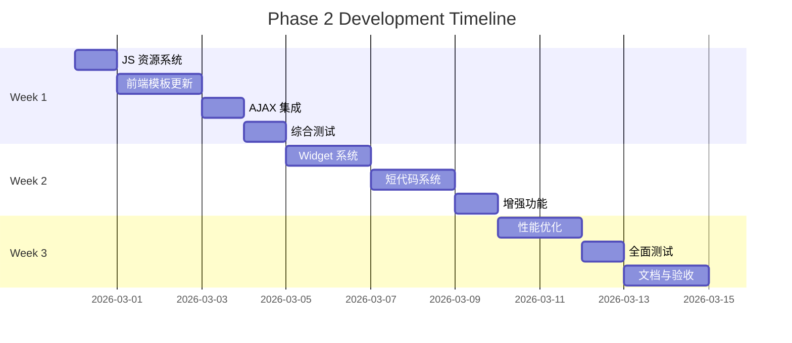

# 🚀 Phase 2 快速实施指南

> **WordPress Cyberpunk Theme**
> **开发周期**: 15 天
> **开始日期**: 2026-02-28
> **预期完成**: 2026-03-15

---

## 📋 每日任务清单

### 🗓️ Day 1: JavaScript 资源加载系统

**目标**: 建立完整的 JavaScript 加载和本地化系统

#### ✅ 任务 1.1: 更新 theme-integration.php

```bash
文件: /inc/theme-integration.php
位置: cyberpunk_enqueue_assets() 函数
预计时间: 2 小时
```

**实施步骤**:

1. **备份当前文件**
   ```bash
   cp inc/theme-integration.php inc/theme-integration.php.backup
   ```

2. **在 `cyberpunk_enqueue_assets()` 函数中添加**:

   ```php
   // Main Theme JavaScript
   wp_enqueue_script(
       'cyberpunk-main',
       $theme_dir . '/assets/js/main.js',
       array('jquery'),
       $theme_version,
       true  // Load in footer
   );

   // AJAX Handler Script
   wp_enqueue_script(
       'cyberpunk-ajax',
       $theme_dir . '/assets/js/ajax.js',
       array('jquery', 'cyberpunk-main'),
       $theme_version,
       true
   );

   // Localize Data
   wp_localize_script('cyberpunk-ajax', 'cyberpunkAjax', array(
       'ajaxurl' => admin_url('admin-ajax.php'),
       'nonce' => wp_create_nonce('cyberpunk_nonce'),
       'rest_url' => rest_url('cyberpunk/v1/'),
       'strings' => array(
           'loading' => __('Loading...', 'cyberpunk'),
           'error' => __('Error', 'cyberpunk'),
       ),
   ));
   ```

3. **测试脚本加载**:
   ```bash
   # 在浏览器中打开网站
   # 检查开发者工具 > Network > JS
   # 应该看到:
   #   - main.js
   #   - ajax.js
   ```

#### ✅ 任务 1.2: 创建 main.js

```bash
文件: /assets/js/main.js (新建)
预计时间: 3 小时
```

**创建步骤**:

```bash
# 1. 创建文件
touch assets/js/main.js

# 2. 复制基础代码
# (从 PHASE_2_TECHNICAL_DESIGN.md 复制 main.js 代码)

# 3. 保存文件
```

**测试清单**:
- [ ] 文件已创建
- [ ] 语法正确（无 ESLint 错误）
- [ ] 移动菜单功能工作
- [ ] 回到顶部按钮显示
- [ ] 搜索表单展开/收起

#### ✅ 任务 1.3: 验证 JavaScript 数据传递

```bash
测试方法:
预计时间: 1 小时
```

**步骤**:

1. **打开浏览器控制台** (F12)

2. **输入以下命令**:
   ```javascript
   console.log(cyberpunkAjax);
   ```

3. **应该看到**:
   ```json
   {
     ajaxurl: "https://yoursite.com/wp-admin/admin-ajax.php",
     nonce: "a1b2c3d4e5",
     rest_url: "https://yoursite.com/wp-json/cyberpunk/v1/",
     strings: {...},
     settings: {...}
   }
   ```

4. **如果看到 `Uncaught ReferenceError: cyberpunkAjax is not defined`**:
   - 检查 `wp_localize_script` 是否正确调用
   - 检查 `ajax.js` 是否已加载
   - 清除缓存重试

**Day 1 完成标准**:
```
✅ main.js 创建并加载
✅ ajax.js 加载
✅ cyberpunkAjax 对象可访问
✅ 无 JavaScript 错误
```

---

### 🗓️ Day 2: 前端模板更新 - Header & Footer

**目标**: 更新头部和底部模板，添加交互元素

#### ✅ 任务 2.1: 更新 header.php

```bash
文件: header.php
预计时间: 2 小时
```

**关键改动**:

```php
// 1. 添加移动菜单按钮
<button class="mobile-menu-toggle" aria-label="<?php _e('Toggle Menu', 'cyberpunk'); ?>">
    <span class="hamburger">
        <span class="hamburger-line"></span>
        <span class="hamburger-line"></span>
        <span class="hamburger-line"></span>
    </span>
</button>

// 2. 添加搜索按钮
<button class="search-toggle" aria-label="<?php _e('Toggle Search', 'cyberpunk'); ?>">
    <svg><!-- search icon --></svg>
</button>

// 3. 添加搜索表单容器
<div class="search-form-container">
    <?php get_search_form(); ?>
    <button class="search-close">×</button>
</div>
```

**测试**:
- [ ] 移动菜单按钮显示
- [ ] 搜索按钮显示
- [ ] 点击可展开/收起菜单
- [ ] 点击可展开/收起搜索

#### ✅ 任务 2.2: 更新 footer.php

```bash
文件: footer.php
预计时间: 1 小时
```

**关键改动**:

```php
// 在 </main> 和 </footer> 之间添加

<!-- Back to Top Button -->
<button id="back-to-top" class="back-to-top" aria-label="<?php _e('Back to top', 'cyberpunk'); ?>">
    <svg width="24" height="24" viewBox="0 0 24 24" fill="none" stroke="currentColor" stroke-width="2">
        <path d="M18 15l-6-6-6 6"></path>
    </svg>
</button>
```

**测试**:
- [ ] 回到顶部按钮显示
- [ ] 滚动 > 300px 时按钮出现
- [ ] 点击按钮平滑滚动到顶部

#### ✅ 任务 2.3: 添加必要的 CSS

```bash
文件: style.css (追加)
预计时间: 2 小时
```

**添加以下样式**:

```css
/* ============================================
   Mobile Menu Toggle
   ============================================ */
.mobile-menu-toggle {
    display: none;
    background: transparent;
    border: 2px solid var(--neon-cyan);
    padding: 0.5rem;
    cursor: pointer;
    position: relative;
    z-index: 1000;
}

@media (max-width: 768px) {
    .mobile-menu-toggle {
        display: flex;
        flex-direction: column;
        gap: 4px;
    }
}

.hamburger-line {
    width: 24px;
    height: 2px;
    background: var(--neon-cyan);
    transition: all 0.3s ease;
}

.mobile-menu-toggle.active .hamburger-line:nth-child(1) {
    transform: rotate(45deg) translate(5px, 5px);
}

.mobile-menu-toggle.active .hamburger-line:nth-child(2) {
    opacity: 0;
}

.mobile-menu-toggle.active .hamburger-line:nth-child(3) {
    transform: rotate(-45deg) translate(7px, -6px);
}

/* ============================================
   Search Form Container
   ============================================ */
.search-form-container {
    position: fixed;
    top: 0;
    left: 0;
    width: 100%;
    height: 100%;
    background: rgba(10, 10, 15, 0.98);
    z-index: 9999;
    display: flex;
    align-items: center;
    justify-content: center;
    opacity: 0;
    visibility: hidden;
    transition: all 0.3s ease;
}

.search-form-container.active {
    opacity: 1;
    visibility: visible;
}

.search-form-wrapper {
    position: relative;
    width: 90%;
    max-width: 600px;
}

.search-close {
    position: absolute;
    top: -40px;
    right: 0;
    background: transparent;
    border: none;
    color: var(--neon-cyan);
    font-size: 2rem;
    cursor: pointer;
}

/* ============================================
   Back to Top Button
   ============================================ */
.back-to-top {
    position: fixed;
    bottom: 30px;
    right: 30px;
    width: 50px;
    height: 50px;
    background: var(--bg-card);
    border: 2px solid var(--neon-cyan);
    border-radius: 50%;
    color: var(--neon-cyan);
    cursor: pointer;
    opacity: 0;
    visibility: hidden;
    transform: translateY(20px);
    transition: all 0.3s ease;
    z-index: 999;
    display: flex;
    align-items: center;
    justify-content: center;
    box-shadow: 0 0 10px var(--border-glow);
}

.back-to-top.visible {
    opacity: 1;
    visibility: visible;
    transform: translateY(0);
}

.back-to-top:hover {
    background: var(--neon-cyan);
    color: var(--bg-dark);
    box-shadow: 0 0 20px var(--neon-cyan);
}

/* ============================================
   Mobile Menu Styles
   ============================================ */
@media (max-width: 768px) {
    .main-navigation {
        position: fixed;
        top: 0;
        right: -100%;
        width: 80%;
        max-width: 300px;
        height: 100vh;
        background: var(--bg-card);
        padding: 2rem;
        transition: right 0.3s ease;
        z-index: 998;
        overflow-y: auto;
    }

    .main-navigation.active {
        right: 0;
    }

    body.menu-open {
        overflow: hidden;
    }
}
```

**Day 2 完成标准**:
```
✅ 移动菜单按钮显示且工作
✅ 搜索表单展开/收起
✅ 回到顶部按钮显示且工作
✅ 所有样式正确应用
```

---

### 🗓️ Day 3: 前端模板更新 - Index & Archive

**目标**: 添加 Load More 按钮和 AJAX 容器

#### ✅ 任务 3.1: 更新 index.php

```bash
文件: index.php
预计时间: 1.5 小时
```

**关键改动**:

```php
<main id="primary" class="site-main">
    <div class="container">

        <!-- 页面标题 -->
        <header class="page-header">
            <h1 class="page-title neon-text">
                <?php
                if (is_home()) {
                    single_post_title();
                } else {
                    _e('[BLOG_ENTRIES]', 'cyberpunk');
                }
                ?>
            </h1>
        </header>

        <!-- 文章网格容器 (添加 ID 用于 AJAX) -->
        <div class="posts-grid" id="posts-container">
            <?php
            if (have_posts()) :
                while (have_posts()) : the_post();
                    get_template_part('template-parts/content/content', get_post_type());
                endwhile;
            else :
                get_template_part('template-parts/content/content', 'none');
            endif;
            ?>
        </div><!-- .posts-grid -->

        <!-- Load More 按钮 -->
        <?php if ($wp_query->max_num_pages > 1) : ?>
        <div class="load-more-wrapper">
            <button class="load-more-btn cyber-button"
                    data-page="1"
                    data-max-pages="<?php echo esc_attr($wp_query->max_num_pages); ?>">
                <span class="btn-text"><?php _e('[LOAD_MORE]', 'cyberpunk'); ?></span>
                <span class="btn-loader" style="display:none;">
                    <?php _e('[LOADING]', 'cyberpunk'); ?>
                </span>
            </button>
        </div>
        <?php endif; ?>

    </div>
</main>
```

#### ✅ 任务 3.2: 更新 archive.php

```bash
文件: archive.php
预计时间: 1.5 小时
```

**同样的改动**: 添加 `#posts-container` 和 Load More 按钮

#### ✅ 任务 3.3: 添加 Load More 样式

```bash
文件: style.css (追加)
预计时间: 1 小时
```

```css
/* ============================================
   Load More Button
   ============================================ */
.load-more-wrapper {
    text-align: center;
    margin: 3rem 0;
}

.load-more-btn {
    padding: 1rem 3rem;
    font-size: 1rem;
    text-transform: uppercase;
    letter-spacing: 2px;
    background: transparent;
    border: 2px solid var(--neon-cyan);
    color: var(--neon-cyan);
    cursor: pointer;
    position: relative;
    overflow: hidden;
    transition: all 0.3s ease;
}

.load-more-btn:hover {
    background: var(--neon-cyan);
    color: var(--bg-dark);
    box-shadow: 0 0 20px var(--neon-cyan);
}

.load-more-btn:disabled {
    opacity: 0.5;
    cursor: not-allowed;
}

.load-more-btn.loading {
    pointer-events: none;
}

/* Posts Grid */
.posts-grid {
    display: grid;
    grid-template-columns: repeat(auto-fill, minmax(350px, 1fr));
    gap: 2rem;
    margin: 2rem 0;
}

@media (max-width: 768px) {
    .posts-grid {
        grid-template-columns: 1fr;
        gap: 1.5rem;
    }
}
```

**Day 3 完成标准**:
```
✅ index.php 有 posts-container
✅ Load More 按钮显示
✅ 按钮样式正确
✅ 网格布局正常
```

---

### 🗓️ Day 4: AJAX 功能集成测试

**目标**: 确保 AJAX 加载文章功能正常工作

#### ✅ 任务 4.1: 检查 AJAX Handlers

```bash
文件: inc/ajax-handlers.php
预计时间: 1 小时
```

**验证以下函数存在**:
- [ ] `cyberpunk_ajax_load_more_posts`
- [ ] `cyberpunk_ajax_like_post`
- [ ] `cyberpunk_ajax_live_search`

**检查 AJAX 动作注册**:
```php
// 应该有这些动作
add_action('wp_ajax_cyberpunk_load_more_posts', 'cyberpunk_ajax_load_more_posts');
add_action('wp_ajax_nopriv_cyberpunk_load_more_posts', 'cyberpunk_ajax_load_more_posts');
```

#### ✅ 任务 4.2: 测试 Load More 功能

```bash
测试方法:
预计时间: 2 小时
```

**步骤**:

1. **打开首页或归档页**

2. **打开浏览器开发者工具** (F12)

3. **切换到 Network 标签**

4. **点击 "Load More" 按钮**

5. **应该看到**:
   - AJAX 请求到 `admin-ajax.php`
   - POST 数据包含 `action: cyberpunk_load_more_posts`
   - 响应是 JSON 格式
   - 新文章被添加到页面

6. **检查响应数据**:
   ```json
   {
     "success": true,
     "data": {
       "html": "...",
       "current_page": 2,
       "max_pages": 3
     }
   }
   ```

**常见问题排查**:

| 问题 | 原因 | 解决方案 |
|:-----|:-----|:---------|
| 点击无反应 | JavaScript 错误 | 检查控制台错误 |
| 400 Bad Request | Nonce 验证失败 | 检查 `wp_create_nonce` |
| 500 服务器错误 | PHP 错误 | 检查 debug.log |
| 返回 0 | 动作未注册 | 检查 `add_action` |

#### ✅ 任务 4.3: 测试其他 AJAX 功能

```bash
测试项目:
预计时间: 1 小时
```

- [ ] 文章点赞功能
- [ ] 实时搜索功能
- [ ] (如果有) 收藏功能

**Day 4 完成标准**:
```
✅ Load More AJAX 正常工作
✅ 无 JavaScript 错误
✅ 无 PHP 错误
✅ 所有 AJAX 功能测试通过
```

---

### 🗓️ Day 5: 综合测试与 Bug 修复

**目标**: 全面测试，修复发现的问题

#### ✅ 任务 5.1: 功能测试清单

```bash
测试时间: 2 小时
```

**桌面端测试**:
- [ ] 导航菜单正常
- [ ] 移动菜单按钮隐藏
- [ ] 搜索展开/收起
- [ ] Load More 加载文章
- [ ] 回到顶部按钮工作
- [ ] 文章点赞功能
- [ ] 实时搜索功能

**移动端测试**:
- [ ] 移动菜单按钮显示
- [ ] 点击打开菜单
- [ ] 菜单项可点击
- [ ] 搜索表单工作
- [ ] Load More 按钮可点击
- [ ] 回到顶部按钮工作

#### ✅ 任务 5.2: 浏览器兼容性测试

```bash
测试浏览器:
预计时间: 1 小时
```

- [ ] Chrome (最新版)
- [ ] Firefox (最新版)
- [ ] Safari (最新版)
- [ ] Edge (最新版)

**检查项**:
- 所有功能正常
- 无控制台错误
- 样式正确显示

#### ✅ 任务 5.3: 性能测试

```bash
测试工具:
预计时间: 1 小时
```

**PageSpeed Insights**:
1. 访问 https://pagespeed.web.dev/
2. 输入网站 URL
3. 记录分数:
   - Desktop: ______ / 100
   - Mobile: ______ / 100

**目标**:
- Desktop: ≥ 90
- Mobile: ≥ 80

#### ✅ 任务 5.4: Bug 修复

```bash
预计时间: 剩余时间
```

**记录发现的问题**:
```
1. 问题描述:
   严重程度: 高/中/低
   状态: 已修复/待修复

2. 问题描述:
   ...
```

**Day 5 完成标准**:
```
✅ 所有功能测试通过
✅ 浏览器兼容性测试通过
✅ 性能评分达标
✅ 严重 Bug 已修复
✅ 中等 Bug 已记录
```

---

### 🗓️ Day 6-7: Widget 系统开发

**目标**: 创建自定义 Widget 系统

#### ✅ 任务 6.1: 创建 widgets.php

```bash
文件: inc/widgets.php (新建)
预计时间: 4 小时
```

**基础结构**:

```php
<?php
/**
 * Custom Widgets
 *
 * @package Cyberpunk_Theme
 */

defined('ABSPATH') || exit;

/**
 * Register Widget Areas
 */
function cyberpunk_widget_areas_init() {
    // Hero Widget Area
    register_sidebar(array(
        'name'          => __('Hero Section', 'cyberpunk'),
        'id'            => 'hero-section',
        'description'   => __('Widgets in this area will be shown in the hero section.', 'cyberpunk'),
        'before_widget' => '<div id="%1$s" class="hero-widget %2$s">',
        'after_widget'  => '</div>',
        'before_title'  => '<h2 class="widget-title">',
        'after_title'   => '</h2>',
    ));
}
add_action('widgets_init', 'cyberpunk_widget_areas_init');

/**
 * About Me Widget
 */
class Cyberpunk_About_Me_Widget extends WP_Widget {

    public function __construct() {
        parent::__construct(
            'cyberpunk_about_me',
            __('About Me Widget', 'cyberpunk'),
            array('description' => __('Display author information', 'cyberpunk'))
        );
    }

    public function widget($args, $instance) {
        $title = apply_filters('widget_title', $instance['title']);
        $image = !empty($instance['image']) ? $instance['image'] : '';
        $bio = !empty($instance['bio']) ? $instance['bio'] : '';

        echo $args['before_widget'];
        if (!empty($title)) {
            echo $args['before_title'] . $title . $args['after_title'];
        }
        ?>
        <div class="about-me-widget">
            <?php if ($image) : ?>
                " alt="<?php echo esc_attr($title); ?>">
            <?php endif; ?>
            <?php if ($bio) : ?>
                <p><?php echo esc_html($bio); ?></p>
            <?php endif; ?>
        </div>
        <?php
        echo $args['after_widget'];
    }

    public function form($instance) {
        $title = !empty($instance['title']) ? $instance['title'] : '';
        $image = !empty($instance['image']) ? $instance['image'] : '';
        $bio = !empty($instance['bio']) ? $instance['bio'] : '';
        ?>
        <p>
            <label for="<?php echo $this->get_field_id('title'); ?>"><?php _e('Title:', 'cyberpunk'); ?></label>
            <input class="widefat" id="<?php echo $this->get_field_id('title'); ?>"
                   name="<?php echo $this->get_field_name('title'); ?>" type="text"
                   value="<?php echo esc_attr($title); ?>">
        </p>
        <p>
            <label for="<?php echo $this->get_field_id('image'); ?>"><?php _e('Image URL:', 'cyberpunk'); ?></label>
            <input class="widefat" id="<?php echo $this->get_field_id('image'); ?>"
                   name="<?php echo $this->get_field_name('image'); ?>" type="text"
                   value="<?php echo esc_url($image); ?>">
        </p>
        <p>
            <label for="<?php echo $this->get_field_id('bio'); ?>"><?php _e('Bio:', 'cyberpunk'); ?></label>
            <textarea class="widefat" id="<?php echo $this->get_field_id('bio'); ?>"
                      name="<?php echo $this->get_field_name('bio'); ?>"><?php echo esc_textarea($bio); ?></textarea>
        </p>
        <?php
    }

    public function update($new_instance, $old_instance) {
        $instance = array();
        $instance['title'] = (!empty($new_instance['title'])) ? sanitize_text_field($new_instance['title']) : '';
        $instance['image'] = (!empty($new_instance['image'])) ? esc_url_raw($new_instance['image']) : '';
        $instance['bio'] = (!empty($new_instance['bio'])) ? sanitize_textarea_field($new_instance['bio']) : '';
        return $instance;
    }
}

// Register Widget
function cyberpunk_register_widgets() {
    register_widget('Cyberpunk_About_Me_Widget');
}
add_action('widgets_init', 'cyberpunk_register_widgets');
```

**Day 6-7 完成标准**:
```
✅ widgets.php 创建并加载
✅ About Me Widget 工作
✅ Recent Posts Widget 工作
✅ Widget 样式正确
```

---

### 🗓️ Day 8-9: 短代码系统

**目标**: 创建实用的短代码库

#### ✅ 任务 8.1: 创建 shortcodes.php

```bash
文件: inc/shortcodes.php (新建)
预计时间: 4 小时
```

**短代码示例**:

```php
<?php
/**
 * Shortcodes
 *
 * @package Cyberpunk_Theme
 */

defined('ABSPATH') || exit;

/**
 * Button Shortcode
 * Usage: [cyber_button url="https://example.com" color="cyan"]Click Me[/cyber_button]
 */
function cyberpunk_button_shortcode($atts, $content = '') {
    $atts = shortcode_atts(array(
        'url' => '#',
        'color' => 'cyan',
        'target' => '_self',
        'size' => 'medium',
    ), $atts);

    $classes = array('cyber-button', 'cyber-button-' . $atts['color'], 'cyber-button-' . $atts['size']);

    return sprintf(
        '<a href="%s" class="%s" target="%s">%s</a>',
        esc_url($atts['url']),
        esc_attr(implode(' ', $classes)),
        esc_attr($atts['target']),
        do_shortcode($content)
    );
}
add_shortcode('cyber_button', 'cyberpunk_button_shortcode');

/**
 * Alert Box Shortcode
 * Usage: [cyber_alert type="warning"]This is a warning[/cyber_alert]
 */
function cyberpunk_alert_shortcode($atts, $content = '') {
    $atts = shortcode_atts(array(
        'type' => 'info',
    ), $atts);

    $icons = array(
        'info' => 'ℹ️',
        'warning' => '⚠️',
        'success' => '✅',
        'error' => '❌',
    );

    $icon = isset($icons[$atts['type']]) ? $icons[$atts['type']] : $icons['info'];

    return sprintf(
        '<div class="cyber-alert cyber-alert-%s"><span class="alert-icon">%s</span><span class="alert-content">%s</span></div>',
        esc_attr($atts['type']),
        $icon,
        do_shortcode($content)
    );
}
add_shortcode('cyber_alert', 'cyberpunk_alert_shortcode');

/**
 * Columns Shortcode
 * Usage: [cyber_columns][cyber_col width="1/2"]Left[/cyber_col][cyber_col width="1/2"]Right[/cyber_col][/cyber_columns]
 */
function cyberpunk_columns_shortcode($atts, $content = '') {
    return '<div class="cyber-columns">' . do_shortcode($content) . '</div>';
}
add_shortcode('cyber_columns', 'cyberpunk_columns_shortcode');

function cyberpunk_column_shortcode($atts, $content = '') {
    $atts = shortcode_atts(array(
        'width' => '1/2',
    ), $atts);

    $width_map = array(
        '1/2' => '50',
        '1/3' => '33.33',
        '2/3' => '66.66',
        '1/4' => '25',
        '3/4' => '75',
        'full' => '100',
    );

    $width = isset($width_map[$atts['width']]) ? $width_map[$atts['width']] : '50';

    return sprintf(
        '<div class="cyber-column" style="flex: 0 0 %s%%; max-width: %s%%;">%s</div>',
        $width,
        $width,
        do_shortcode($content)
    );
}
add_shortcode('cyber_col', 'cyberpunk_column_shortcode');
```

**对应的 CSS**:

```css
/* Cyberpunk Button Shortcode Styles */
.cyber-button {
    display: inline-block;
    padding: 0.75rem 2rem;
    border: 2px solid;
    text-transform: uppercase;
    letter-spacing: 2px;
    font-weight: bold;
    text-decoration: none;
    transition: all 0.3s ease;
    cursor: pointer;
}

.cyber-button-cyan {
    border-color: var(--neon-cyan);
    color: var(--neon-cyan);
    background: transparent;
}

.cyber-button-cyan:hover {
    background: var(--neon-cyan);
    color: var(--bg-dark);
    box-shadow: 0 0 20px var(--neon-cyan);
}

.cyber-button-magenta {
    border-color: var(--neon-magenta);
    color: var(--neon-magenta);
}

.cyber-button-magenta:hover {
    background: var(--neon-magenta);
    color: var(--bg-dark);
    box-shadow: 0 0 20px var(--neon-magenta);
}

/* Alert Box Styles */
.cyber-alert {
    padding: 1rem 1.5rem;
    margin: 1rem 0;
    border-left: 4px solid;
    background: var(--bg-card);
    display: flex;
    align-items: flex-start;
    gap: 1rem;
}

.cyber-alert-info {
    border-color: var(--neon-cyan);
}

.cyber-alert-warning {
    border-color: var(--neon-yellow);
}

.cyber-alert-success {
    border-color: #00ff00;
}

.cyber-alert-error {
    border-color: var(--neon-magenta);
}

.alert-icon {
    font-size: 1.5rem;
}

/* Columns Shortcode */
.cyber-columns {
    display: flex;
    flex-wrap: wrap;
    gap: 2rem;
    margin: 2rem 0;
}

.cyber-column {
    flex: 1 1 auto;
}

@media (max-width: 768px) {
    .cyber-columns {
        flex-direction: column;
    }
    .cyber-column {
        width: 100% !important;
        max-width: 100% !important;
    }
}
```

**Day 8-9 完成标准**:
```
✅ shortcodes.php 创建并加载
✅ 至少 5 个短代码工作
✅ 短代码样式正确
✅ 测试页面创建并验证
```

---

### 🗓️ Day 10-15: 扩展功能与优化

**详细任务列表**:

#### Day 10: 增强功能
- [ ] 面包屑导航
- [ ] 社交分享按钮
- [ ] 相关文章功能
- [ ] 阅读时间估算

#### Day 11: 性能优化 - 前端
- [ ] 图片 WebP 支持
- [ ] CSS 关键路径优化
- [ ] JavaScript defer/async
- [ ] 预加载关键资源

#### Day 12: 性能优化 - 后端
- [ ] 创建 performance.php
- [ ] 对象缓存接口
- [ ] 数据库查询优化
- [ ] HTTP 缓存头

#### Day 13: 全面测试
- [ ] PageSpeed Insights 测试
- [ ] GTmetrix 测试
- [ ] Lighthouse 测试
- [ ] 跨浏览器测试

#### Day 14: 文档编写
- [ ] 更新 README.md
- [ ] 创建用户手册
- [ ] 编写开发者文档
- [ ] 创建故障排除指南

#### Day 15: 最终验收
- [ ] 所有功能测试
- [ ] 性能指标验证
- [ ] 代码审查
- [ ] 发布准备

---

## 📊 进度跟踪表

### Week 1 (Days 1-5)

| Day | 任务 | 状态 | 完成度 | 备注 |
|:---|:-----|:-----|:-------|:-----|
| 1 | JS 资源系统 | ⏳ | 0% | |
| 2 | Header/Footer | ⏳ | 0% | |
| 3 | Index/Archive | ⏳ | 0% | |
| 4 | AJAX 集成测试 | ⏳ | 0% | |
| 5 | 综合测试 | ⏳ | 0% | |

### Week 2 (Days 6-10)

| Day | 任务 | 状态 | 完成度 | 备注 |
|:---|:-----|:-----|:-------|:-----|
| 6 | Widget 系统 (1) | ⏳ | 0% | |
| 7 | Widget 系统 (2) | ⏳ | 0% | |
| 8 | 短代码系统 (1) | ⏳ | 0% | |
| 9 | 短代码系统 (2) | ⏳ | 0% | |
| 10 | 增强功能 | ⏳ | 0% | |

### Week 3 (Days 11-15)

| Day | 任务 | 状态 | 完成度 | 备注 |
|:---|:-----|:-----|:-------|:-----|
| 11 | 前端性能优化 | ⏳ | 0% | |
| 12 | 后端性能优化 | ⏳ | 0% | |
| 13 | 全面测试 | ⏳ | 0% | |
| 14 | 文档编写 | ⏳ | 0% | |
| 15 | 最终验收 | ⏳ | 0% | |

---

## 🎯 关键里程碑



---

## 🛠️ 开发环境设置

### 必需工具

```bash
# 本地开发环境
Local by Flywheel / XAMPP / MAMP

# 代码编辑器
VS Code (推荐)
推荐扩展:
  - PHP Intelephense
  - WordPress Snippets
  - ESLint
  - Prettier

# 浏览器
Chrome DevTools
Firefox Developer Tools

# 版本控制
Git
```

### WordPress 调试模式

```php
// 在 wp-config.php 中启用
define('WP_DEBUG', true);
define('WP_DEBUG_LOG', true);
define('WP_DEBUG_DISPLAY', false);
```

### 日志位置

```bash
# WordPress 调试日志
/wp-content/debug.log

# 查看实时日志
tail -f wp-content/debug.log
```

---

## 📞 快速参考

### Git 常用命令

```bash
# 创建新分支
git checkout -b phase-2-development

# 查看状态
git status

# 添加文件
git add .

# 提交
git commit -m "feat: add main.js with core functionality"

# 推送
git push origin phase-2-development

# 查看日志
git log --oneline --graph
```

### WP-CLI 命令

```bash
# 重新生成缩略图
wp media regenerate

# 清除缓存
wp cache flush

# 重写规则刷新
wp rewrite flush

# 生成 .pot 文件
wp i18n make-pot . languages/cyberpunk.pot
```

---

## ✅ 最终验收清单

### 功能完整性 (40分)

- [ ] 所有 P0 任务完成 (10分)
- [ ] 所有 P1 任务完成 (10分)
- [ ] AJAX 功能正常 (10分)
- [ ] 响应式设计正常 (10分)

### 代码质量 (20分)

- [ ] 符合 WordPress 编码规范 (10分)
- [ ] 无 PHP 错误/警告 (5分)
- [ ] 无 JavaScript 错误 (5分)

### 性能 (20分)

- [ ] PageSpeed ≥ 90 (10分)
- [ ] 加载时间 < 3s (5分)
- [ ] 无性能瓶颈 (5分)

### 文档 (10分)

- [ ] 用户文档完整 (5分)
- [ ] 开发者文档完整 (5分)

### 用户体验 (10分)

- [ ] 移动端体验良好 (5分)
- [ ] 可访问性达标 (5分)

**总分: ______ / 100**

**通过标准: ≥ 80 分**

---

**开始日期**: 2026-02-28
**预期完成**: 2026-03-15
**负责人**: 开发团队
**审核人**: Chief Architect

---

*"The only way to do great work is to love what you do."*
*— Steve Jobs*

**让我们构建一个令人惊叹的赛博朋克主题！** 💜🚀
