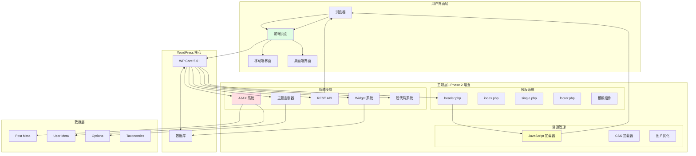
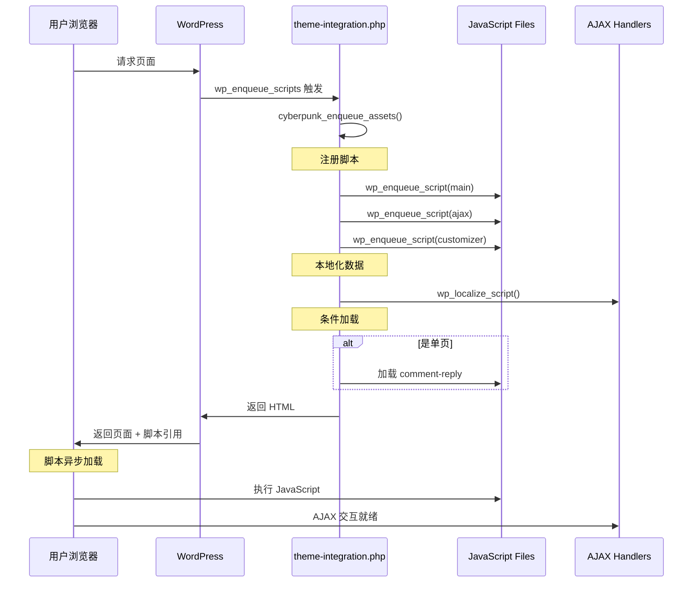

# 🏗️ WordPress Cyberpunk Theme - Phase 2 技术方案设计

> **首席架构师 · 技术方案与任务规划**
> **日期**: 2026-02-28
> **版本**: 2.1.0
> **状态**: ✅ Ready for Development

---

## 📊 执行摘要

### 项目现状评估

```yaml
Phase 1 完成度: 95%
  ✅ 核心模板系统 (11个PHP文件)
  ✅ 主题定制器 (23KB - 525行)
  ✅ AJAX 后端处理 (17KB - 583行)
  ✅ REST API 端点 (17KB - 512行)
  ✅ Portfolio CPT (16KB - 432行)
  ✅ 核心增强功能 (19KB - 568行)
  ✅ 前端AJAX脚本 (543行)
  ✅ 后台样式 (400+行)
  ✅ 组件模板 (4个文件)

Phase 2 重点: 集成与增强
  🔴 关键集成任务
  🟡 功能扩展任务
  🟢 性能优化任务
```

### 识别的关键差距

```
┌─────────────────────────────────────────────────────────────┐
│                    已实现代码模块                            │
├─────────────────────────────────────────────────────────────┤
│  ✅ customizer.php        (23,198 bytes)                    │
│  ✅ ajax-handlers.php     (17,347 bytes)                    │
│  ✅ rest-api.php          (17,848 bytes)                    │
│  ✅ custom-post-types.php (16,068 bytes)                    │
│  ✅ core-enhancements.php (19,115 bytes)                    │
│  ✅ ajax.js               (543 lines)                       │
│  ✅ admin.css             (400+ lines)                      │
├─────────────────────────────────────────────────────────────┤
│                    🔴 缺失集成层                             │
├─────────────────────────────────────────────────────────────┤
│  ⚠️  JavaScript 文件未正确加载到前端                        │
│  ⚠️  wp_localize_script 数据传递缺失                       │
│  ⚠️  前端模板缺少 AJAX 按钮和容器                           │
│  ⚠️  回到顶部按钮未实现                                     │
│  ⚠️  移动端菜单不工作                                       │
│  ⚠️  主题定制器预览脚本缺失                                 │
├─────────────────────────────────────────────────────────────┤
│                    🟡 功能扩展需求                          │
├─────────────────────────────────────────────────────────────┤
│  ❌ 自定义 Widget 系统 (widgets.php)                        │
│  ❌ 短代码系统 (shortcodes.php)                              │
│  ❌ Gutenberg 区块支持 (blocks/)                            │
│  ❌ 性能优化模块 (performance.php)                          │
│  ❌ 面包屑导航                                              │
│  ❌ 社交分享功能                                            │
│  ❌ 相关文章功能                                            │
└─────────────────────────────────────────────────────────────┘
```

---

## 🎯 Phase 2 核心任务

### 任务优先级矩阵

```
┌──────────────────────────────────────────────────────────────────┐
│                        优先级评估矩阵                              │
├──────────┬──────────────┬───────────────┬────────────────────────┤
│  任务    │   影响       │   紧急度      │      优先级            │
├──────────┼──────────────┼───────────────┼────────────────────────┤
│ JS集成   │ ⭐⭐⭐⭐⭐    │ 🔴🔴🔴🔴🔴   │ P0 - Critical          │
│ 前端模板 │ ⭐⭐⭐⭐⭐    │ 🔴🔴🔴🔴🔴   │ P0 - Critical          │
│ Widgets  │ ⭐⭐⭐⭐      │ 🟡🟡🟡🟡     │ P1 - High             │
│ 短代码   │ ⭐⭐⭐⭐      │ 🟡🟡🟡       │ P1 - High             │
│ 性能优化 │ ⭐⭐⭐       │ 🟢🟢🟢       │ P2 - Medium           │
│ Blocks   │ ⭐⭐         │ 🟢           │ P3 - Low              │
└──────────┴──────────────┴───────────────┴────────────────────────┘
```

---

## 🏗️ 系统架构设计

### 整体架构图（Mermaid）



### 技术栈清单

```yaml
Frontend Stack:
  HTML5: 语义化标签, ARIA 属性
  CSS3:
    - CSS Variables (Custom Properties)
    - Flexbox & Grid Layout
    - Animations & Keyframes
    - Media Queries (响应式)
  JavaScript:
    - Vanilla ES6+
    - jQuery (WordPress 内置)
    - AJAX (WordPress API)

Backend Stack:
  PHP: 7.4+ (推荐 8.0+)
  WordPress: 5.0+ (推荐 6.0+)
  Database: MySQL 5.7+ / MariaDB 10.2+

WordPress APIs:
  Theme Customization API
  Widgets API
  Shortcode API
  REST API
  AJAX API
  Meta Box API
  Settings API

Development Tools:
  - Git (版本控制)
  - WP-CLI (命令行工具)
  - Composer (依赖管理，可选)

Performance:
  - Lazy Loading (图片懒加载)
  - Script Deferring (脚本延迟)
  - CSS Critical Path (关键路径CSS)
  - Minification (压缩优化)
```

---

## 🔴 P0 任务：JavaScript 资源集成系统

### 系统架构图



### 技术实现方案

#### 文件: `inc/theme-integration.php` (增强版)

```php
<?php
/**
 * Enqueue Frontend Assets - Phase 2 Enhanced
 */
function cyberpunk_enqueue_assets() {
    $theme_dir = get_template_directory_uri();
    $theme_version = wp_get_theme()->get('Version');

    // ============================================
    // 1. Main Stylesheet
    // ============================================
    wp_enqueue_style(
        'cyberpunk-style',
        get_stylesheet_uri(),
        array(),
        $theme_version
    );

    // ============================================
    // 2. Additional CSS Files
    // ============================================
    // Comment styles (only on single posts with comments)
    if (is_singular() && comments_open() && get_option('thread_comments')) {
        wp_enqueue_style(
            'cyberpunk-comments',
            $theme_dir . '/assets/css/comments.css',
            array(),
            $theme_version
        );
    }

    // ============================================
    // 3. JavaScript Files
    // ============================================

    // Main Theme JavaScript
    wp_enqueue_script(
        'cyberpunk-main',
        $theme_dir . '/assets/js/main.js',
        array('jquery'),
        $theme_version,
        true
    );

    // AJAX Handler Script
    wp_enqueue_script(
        'cyberpunk-ajax',
        $theme_dir . '/assets/js/ajax.js',
        array('jquery', 'cyberpunk-main'),
        $theme_version,
        true
    );

    // ============================================
    // 4. Localize Script Data
    // ============================================
    wp_localize_script('cyberpunk-ajax', 'cyberpunkAjax', array(
        'ajaxurl' => admin_url('admin-ajax.php'),
        'nonce' => wp_create_nonce('cyberpunk_nonce'),
        'rest_url' => rest_url('cyberpunk/v1/'),
        'strings' => array(
            'loading' => __('Loading...', 'cyberpunk'),
            'error' => __('Something went wrong.', 'cyberpunk'),
            'load_more' => __('Load More', 'cyberpunk'),
            'no_more_posts' => __('No more posts to load.', 'cyberpunk'),
        ),
        'settings' => array(
            'posts_per_page' => get_option('posts_per_page', 6),
            'enable_lazy_load' => true,
        ),
    ));

    // ============================================
    // 5. Theme Customizer Preview
    // ============================================
    if (is_customize_preview()) {
        wp_enqueue_script(
            'cyberpunk-customizer-preview',
            $theme_dir . '/assets/js/customizer-preview.js',
            array('jquery', 'customize-preview'),
            $theme_version,
            true
        );

        wp_localize_script('cyberpunk-customizer-preview', 'cyberpunkCustomizer', array(
            'settings' => array(
                'primary_color' => get_theme_mod('primary_color', '#00f0ff'),
                'secondary_color' => get_theme_mod('secondary_color', '#ff00ff'),
            ),
        ));
    }

    // ============================================
    // 6. Conditional Script Loading
    // ============================================

    // Comment Reply Script
    if (is_singular() && comments_open() && get_option('thread_comments')) {
        wp_enqueue_script('comment-reply');
    }

    // Load More Button Script (only on archives)
    if (is_home() || is_archive() || is_front_page()) {
        wp_enqueue_script('cyberpunk-load-more');
    }

    // ============================================
    // 7. Inline Scripts (for Critical CSS/JS)
    // ============================================
    $inline_script = '
        (function() {
            // Add loaded class after DOM is ready
            document.addEventListener("DOMContentLoaded", function() {
                document.body.classList.add("cyberpunk-loaded");
            });
        })();
    ';
    wp_add_inline_script('cyberpunk-main', $inline_script);

    // ============================================
    // 8. Dynamic CSS Output (from Customizer)
    // ============================================
    $custom_css = cyberpunk_get_custom_css();
    if (!empty($custom_css)) {
        wp_add_inline_style('cyberpunk-style', $custom_css);
    }
}
add_action('wp_enqueue_scripts', 'cyberpunk_enqueue_assets');

/**
 * Generate Dynamic CSS from Theme Options
 */
function cyberpunk_get_custom_css() {
    $css = '';

    // Primary Color
    $primary_color = get_theme_mod('primary_color', '#00f0ff');
    if ($primary_color !== '#00f0ff') {
        $css .= sprintf(':root { --neon-cyan: %s; }', esc_attr($primary_color));
    }

    // Secondary Color
    $secondary_color = get_theme_mod('secondary_color', '#ff00ff');
    if ($secondary_color !== '#ff00ff') {
        $css .= sprintf(':root { --neon-magenta: %s; }', esc_attr($secondary_color));
    }

    // Disable Scanlines
    if (!get_theme_mod('enable_scanlines', true)) {
        $css .= 'body::before { display: none; }';
    }

    // Disable Glitch Effect
    if (!get_theme_mod('enable_glitch', true)) {
        $css .= '.glitch-effect { animation: none; }';
    }

    return $css;
}
```

#### 文件: `assets/js/main.js` (新建)

```javascript
/**
 * Cyberpunk Theme - Main JavaScript
 *
 * @package Cyberpunk_Theme
 * @version 2.0.0
 */

(function($) {
    'use strict';

    /**
     * ============================================
     * 1. CORE FUNCTIONALITY
     * ============================================
     */

    const Cyberpunk = {
        init: function() {
            this.mobileMenu();
            this.backToTop();
            this.searchToggle();
            this.smoothScroll();
            this.lazyImages();
            this.glitchEffect();
        },

        /**
         * Mobile Menu Toggle
         */
        mobileMenu: function() {
            const $toggle = $('.mobile-menu-toggle');
            const $menu = $('.main-navigation');

            if (!$toggle.length) return;

            $toggle.on('click', function(e) {
                e.preventDefault();
                $(this).toggleClass('active');
                $menu.toggleClass('active');
                $('body').toggleClass('menu-open');

                // ARIA attributes
                const expanded = $(this).hasClass('active');
                $(this).attr('aria-expanded', expanded);
            });

            // Close menu when clicking outside
            $(document).on('click', function(e) {
                if (!$(e.target).closest('.main-navigation, .mobile-menu-toggle').length) {
                    $toggle.removeClass('active');
                    $menu.removeClass('active');
                    $('body').removeClass('menu-open');
                    $toggle.attr('aria-expanded', 'false');
                }
            });

            // Close menu on window resize
            $(window).on('resize', function() {
                if (window.innerWidth > 768) {
                    $toggle.removeClass('active');
                    $menu.removeClass('active');
                    $('body').removeClass('menu-open');
                }
            });
        },

        /**
         * Back to Top Button
         */
        backToTop: function() {
            const $button = $('#back-to-top');

            if (!$button.length) return;

            // Show/hide button based on scroll position
            $(window).on('scroll', function() {
                if ($(this).scrollTop() > 300) {
                    $button.addClass('visible');
                } else {
                    $button.removeClass('visible');
                }
            });

            // Smooth scroll to top
            $button.on('click', function(e) {
                e.preventDefault();
                $('html, body').animate({
                    scrollTop: 0
                }, 800);
            });
        },

        /**
         * Search Toggle
         */
        searchToggle: function() {
            const $toggle = $('.search-toggle');
            const $form = $('.search-form-container');

            if (!$toggle.length) return;

            $toggle.on('click', function(e) {
                e.preventDefault();
                $form.toggleClass('active');
                $form.find('input[type="search"]').focus();
            });

            // Close search when clicking outside
            $(document).on('click', function(e) {
                if (!$(e.target).closest('.search-form-container, .search-toggle').length) {
                    $form.removeClass('active');
                }
            });

            // Close on ESC key
            $(document).on('keydown', function(e) {
                if (e.key === 'Escape' && $form.hasClass('active')) {
                    $form.removeClass('active');
                }
            });
        },

        /**
         * Smooth Scroll for Anchor Links
         */
        smoothScroll: function() {
            $('a[href^="#"]').on('click', function(e) {
                const href = $(this).attr('href');

                if (href === '#' || href === '#0') return;

                const $target = $(href);

                if ($target.length) {
                    e.preventDefault();
                    $('html, body').animate({
                        scrollTop: $target.offset().top - 50
                    }, 1000);
                }
            });
        },

        /**
         * Lazy Load Images (fallback if native lazy loading fails)
         */
        lazyImages: function() {
            if ('loading' in HTMLImageElement.prototype) {
                // Browser supports native lazy loading
                return;
            }

            // Fallback: Intersection Observer
            if ('IntersectionObserver' in window) {
                const imageObserver = new IntersectionObserver(function(entries) {
                    entries.forEach(function(entry) {
                        if (entry.isIntersecting) {
                            const img = entry.target;
                            img.src = img.dataset.src;
                            img.classList.remove('lazyload');
                            imageObserver.unobserve(img);
                        }
                    });
                });

                document.querySelectorAll('img.lazyload').forEach(function(img) {
                    imageObserver.observe(img);
                });
            }
        },

        /**
         * Glitch Effect on Hover
         */
        glitchEffect: function() {
            $('.glitch-effect').on('mouseenter', function() {
                $(this).addClass('glitching');
            }).on('mouseleave', function() {
                const self = $(this);
                setTimeout(function() {
                    self.removeClass('glitching');
                }, 300);
            });
        }
    };

    /**
     * ============================================
     * 2. DOCUMENT READY
     * ============================================
     */
    $(document).ready(function() {
        Cyberpunk.init();

        // Trigger custom event
        $(document).trigger('cyberpunk:init');
    });

    /**
     * ============================================
     * 3. WINDOW LOAD
     * ============================================
     */
    $(window).on('load', function() {
        // Hide preloader if exists
        $('.preloader').fadeOut(500, function() {
            $(this).remove();
        });

        // Add loaded class
        $('body').addClass('loaded');

        // Trigger custom event
        $(document).trigger('cyberpunk:loaded');
    });

    /**
     * ============================================
     * 4. EXPORT GLOBAL OBJECT
     * ============================================
     */
    window.Cyberpunk = Cyberpunk;

})(jQuery);
```

#### 文件: `assets/js/customizer-preview.js` (新建)

```javascript
/**
 * Cyberpunk Theme - Customizer Preview
 *
 * Live preview of theme customizer settings
 *
 * @package Cyberpunk_Theme
 * @version 2.0.0
 */

(function($) {
    'use strict';

    // ============================================
    // COLOR SETTINGS
    // ============================================

    // Primary Color
    wp.customize('primary_color', function(value) {
        value.bind(function(newVal) {
            document.documentElement.style.setProperty('--neon-cyan', newVal);
        });
    });

    // Secondary Color
    wp.customize('secondary_color', function(value) {
        value.bind(function(newVal) {
            document.documentElement.style.setProperty('--neon-magenta', newVal);
        });
    });

    // Accent Color
    wp.customize('accent_color', function(value) {
        value.bind(function(newVal) {
            document.documentElement.style.setProperty('--neon-yellow', newVal);
        });
    });

    // ============================================
    // EFFECT TOGGLES
    // ============================================

    // Scanlines Effect
    wp.customize('enable_scanlines', function(value) {
        value.bind(function(newVal) {
            if (newVal) {
                $('body').removeClass('scanlines-disabled');
            } else {
                $('body').addClass('scanlines-disabled');
            }
        });
    });

    // Glitch Effect
    wp.customize('enable_glitch', function(value) {
        value.bind(function(newVal) {
            if (newVal) {
                $('.glitch-effect').removeClass('glitch-disabled');
            } else {
                $('.glitch-effect').addClass('glitch-disabled');
            }
        });
    });

    // ============================================
    // LAYOUT SETTINGS
    // ============================================

    // Container Width
    wp.customize('container_width', function(value) {
        value.bind(function(newVal) {
            $('.container').css('max-width', newVal + 'px');
        });
    });

    // ============================================
    // TYPOGRAPHY
    // ============================================

    // Base Font Size
    wp.customize('base_font_size', function(value) {
        value.bind(function(newVal) {
            document.documentElement.style.setProperty('--base-font-size', newVal + 'px');
        });
    });

    // Heading Font Size
    wp.customize('heading_font_size', function(value) {
        value.bind(function(newVal) {
            document.documentElement.style.setProperty('--heading-font-size', newVal + 'px');
        });
    });

    // ============================================
    // HEADER SETTINGS
    // ============================================

    // Header Background
    wp.customize('header_bg_color', function(value) {
        value.bind(function(newVal) {
            $('.site-header').css('background-color', newVal);
        });
    });

    // ============================================
    // FOOTER SETTINGS
    // ============================================

    // Footer Background
    wp.customize('footer_bg_color', function(value) {
        value.bind(function(newVal) {
            $('.site-footer').css('background-color', newVal);
        });
    });

    // Footer Text
    wp.customize('footer_text', function(value) {
        value.bind(function(newVal) {
            $('.footer-text').html(newVal);
        });
    });

})(jQuery);
```

---

## 🟡 P1 任务：前端模板集成

### 任务目标
更新所有模板文件以集成 AJAX 按钮和交互元素。

### 需要更新的文件清单

```
✅ header.php    - 添加移动菜单按钮、搜索按钮
⚠️  index.php    - 添加 Load More 按钮、文章网格容器
⚠️  archive.php  - 添加 Load More 按钮、筛选器
⚠️  search.php   - 添加实时搜索功能
✅ footer.php    - 添加回到顶部按钮
⚠️  single.php   - 添加阅读进度条、社交分享
```

### 具体实现方案

#### header.php 增强

```php
<?php
/**
 * Enhanced Header with Mobile Menu & Search
 */
?>
<!doctype html>
<html <?php language_attributes(); ?>>
<head>
    <meta charset="<?php bloginfo('charset'); ?>">
    <meta name="viewport" content="width=device-width, initial-scale=1">
    <link rel="profile" href="https://gmpg.org/xfn/11">
    <?php wp_head(); ?>
</head>

<body <?php body_class(); ?>>
<?php wp_body_open(); ?>

<?php
// Skip link for accessibility
?>
<a class="skip-link screen-reader-text" href="#primary"><?php _e('Skip to content', 'cyberpunk'); ?></a>

<?php
// Preloader (optional)
if (get_theme_mod('enable_preloader', false)) :
?>
<div class="preloader">
    <div class="preloader-content">
        <div class="loader"></div>
        <p class="loading-text"><?php _e('[INITIALIZING]', 'cyberpunk'); ?></p>
    </div>
</div>
<?php endif; ?>

<header id="masthead" class="site-header">
    <nav class="main-navigation" role="navigation" aria-label="<?php _e('Main Menu', 'cyberpunk'); ?>">
        <div class="container">
            <div class="nav-wrapper">

                <!-- Site Branding -->
                <div class="site-branding">
                    <?php
                    if (has_custom_logo()) :
                        the_custom_logo();
                    else :
                        ?>
                        <h1 class="site-title">
                            <a href="<?php echo esc_url(home_url('/')); ?>" rel="home">
                                <?php bloginfo('name'); ?>
                            </a>
                        </h1>
                        <?php
                    endif;

                    $description = get_bloginfo('description', 'display');
                    if ($description || is_customize_preview()) :
                        ?>
                        <p class="site-description"><?php echo esc_html($description); ?></p>
                        <?php
                    endif;
                    ?>
                </div><!-- .site-branding -->

                <!-- Main Menu -->
                <div class="primary-menu-container">
                    <?php
                    wp_nav_menu(array(
                        'theme_location' => 'primary',
                        'menu_class'     => 'primary-menu',
                        'container'      => false,
                        'fallback_cb'    => 'cyberpunk_fallback_menu',
                    ));
                    ?>
                </div>

                <!-- Action Buttons -->
                <div class="nav-actions">
                    <!-- Search Toggle -->
                    <button class="search-toggle" aria-label="<?php _e('Toggle Search', 'cyberpunk'); ?>" aria-expanded="false">
                        <svg class="search-icon" width="24" height="24" viewBox="0 0 24 24" fill="none" stroke="currentColor" stroke-width="2">
                            <circle cx="11" cy="11" r="8"></circle>
                            <path d="m21 21-4.35-4.35"></path>
                        </svg>
                    </button>

                    <!-- Mobile Menu Toggle -->
                    <button class="mobile-menu-toggle" aria-label="<?php _e('Toggle Menu', 'cyberpunk'); ?>" aria-expanded="false" aria-controls="primary-menu">
                        <span class="hamburger">
                            <span class="hamburger-line"></span>
                            <span class="hamburger-line"></span>
                            <span class="hamburger-line"></span>
                        </span>
                    </button>
                </div><!-- .nav-actions -->

            </div><!-- .nav-wrapper -->
        </div><!-- .container -->
    </nav><!-- .main-navigation -->

    <!-- Live Search Overlay -->
    <div class="search-form-container" aria-hidden="true">
        <div class="search-form-wrapper">
            <?php get_search_form(); ?>
            <button class="search-close" aria-label="<?php _e('Close Search', 'cyberpunk'); ?>">
                <svg width="24" height="24" viewBox="0 0 24 24" fill="none" stroke="currentColor" stroke-width="2">
                    <path d="M18 6 6 18M6 6l12 12"></path>
                </svg>
            </button>
        </div>
    </div><!-- .search-form-container -->

</header><!-- #masthead -->

<?php
// Fallback Menu Function
function cyberpunk_fallback_menu() {
    ?>
    <ul class="primary-menu">
        <li><a href="<?php echo esc_url(home_url('/')); ?>"><?php _e('Home', 'cyberpunk'); ?></a></li>
        <?php wp_list_pages(array('title_li' => '')); ?>
    </ul>
    <?php
}
?>
```

#### index.php 增强

```php
<?php
/**
 * Enhanced Index with Load More & Grid Layout
 */
get_header();

?>

<main id="primary" class="site-main">
    <div class="container">
        <?php
        // Hero Section (optional, only on front page)
        if (is_front_page() && get_theme_mod('enable_hero_section', true)) :
            get_template_part('template-parts/hero');
        endif;
        ?>

        <header class="page-header">
            <?php
            if (is_home()) {
                ?>
                <h1 class="page-title neon-text"><?php single_post_title(); ?></h1>
                <?php
            } else {
                ?>
                <h1 class="page-title neon-text"><?php _e('[BLOG_ENTRIES]', 'cyberpunk'); ?></h1>
                <?php
            }
            ?>
        </header><!-- .page-header -->

        <!-- Posts Grid with AJAX -->
        <div class="posts-grid" id="posts-container">
            <?php
            if (have_posts()) :

                /* Start the Loop */
                while (have_posts()) :
                    the_post();

                    /*
                     * Include the Post-Type-specific template for the content.
                     * If you want to override this in a child theme, then include a file
                     * called content-___.php (where ___ is the Post Type name) and that will be used instead.
                     */
                    get_template_part('template-parts/content/content', get_post_type());

                endwhile;

            else :
                get_template_part('template-parts/content/content', 'none');

            endif;
            ?>
        </div><!-- .posts-grid -->

        <!-- Load More Button -->
        <?php
        if ($wp_query->max_num_pages > 1) :
            $current_page = max(1, get_query_var('paged'));
        ?>
        <div class="load-more-wrapper">
            <button class="load-more-btn cyber-button"
                    data-page="<?php echo esc_attr($current_page); ?>"
                    data-max-pages="<?php echo esc_attr($wp_query->max_num_pages); ?>"
                    aria-label="<?php _e('Load more posts', 'cyberpunk'); ?>">
                <span class="btn-text"><?php _e('[LOAD_MORE]', 'cyberpunk'); ?></span>
                <span class="btn-loader"><?php _e('[LOADING]', 'cyberpunk'); ?></span>
            </button>
        </div><!-- .load-more-wrapper -->
        <?php endif; ?>

    </div><!-- .container -->
</main><!-- #main -->

<?php
get_footer();
```

#### footer.php 增强

```php
<?php
/**
 * Enhanced Footer with Back to Top
 */
?>

</main><!-- #main -->

<footer id="colophon" class="site-footer">
    <div class="footer-top">
        <div class="container">
            <div class="footer-widgets">
                <?php
                // Footer Widget Area 1
                if (is_active_sidebar('footer-1')) :
                    ?>
                    <div class="footer-widget-area">
                        <?php dynamic_sidebar('footer-1'); ?>
                    </div>
                    <?php
                endif;

                // Footer Widget Area 2
                if (is_active_sidebar('footer-2')) :
                    ?>
                    <div class="footer-widget-area">
                        <?php dynamic_sidebar('footer-2'); ?>
                    </div>
                    <?php
                endif;

                // Footer Widget Area 3
                if (is_active_sidebar('footer-3')) :
                    ?>
                    <div class="footer-widget-area">
                        <?php dynamic_sidebar('footer-3'); ?>
                    </div>
                    <?php
                endif;
                ?>
            </div><!-- .footer-widgets -->
        </div><!-- .container -->
    </div><!-- .footer-top -->

    <div class="footer-bottom">
        <div class="container">
            <div class="footer-bottom-content">
                <div class="copyright">
                    <?php
                    $footer_text = get_theme_mod('footer_text', '');
                    if (!empty($footer_text)) :
                        echo wp_kses_post($footer_text);
                    else :
                        printf(
                            /* translators: 1: Year range, 2: Site name */
                            esc_html__('&copy; %1$s %2$s. All rights reserved.', 'cyberpunk'),
                            cyberpunk_copyright_years(),
                            get_bloginfo('name')
                        );
                    endif;
                    ?>
                </div><!-- .copyright -->

                <div class="footer-menu">
                    <?php
                    wp_nav_menu(array(
                        'theme_location' => 'footer',
                        'menu_class'     => 'footer-menu',
                        'container'      => false,
                        'depth'          => 1,
                        'fallback_cb'    => false,
                    ));
                    ?>
                </div><!-- .footer-menu -->
            </div><!-- .footer-bottom-content -->
        </div><!-- .container -->
    </div><!-- .footer-bottom -->
</footer><!-- #colophon -->

<!-- Back to Top Button -->
<button id="back-to-top" class="back-to-top" aria-label="<?php _e('Back to top', 'cyberpunk'); ?>">
    <svg width="24" height="24" viewBox="0 0 24 24" fill="none" stroke="currentColor" stroke-width="2">
        <path d="M18 15l-6-6-6 6"></path>
    </svg>
</button>

<?php wp_footer(); ?>

</body>
</html>
```

---

## 📊 API 接口设计

### REST API 端点清单

```yaml
现有端点 (已实现):
  /wp-json/cyberpunk/v1/posts:
    方法: GET
    功能: 获取文章列表
    参数: page, per_page, category, tag

  /wp-json/cyberpunk/v1/posts/{id}:
    方法: GET
    功能: 获取单篇文章

  /wp-json/cyberpunk/v1/portfolio:
    方法: GET
    功能: 获取项目列表
    参数: page, per_page, category

推荐新增端点:
  /wp-json/cyberpunk/v1/stats:
    方法: GET
    功能: 获取站点统计信息

  /wp-json/cyberpunk/v1/settings:
    方法: GET
    功能: 获取主题设置（供前端使用）

  /wp-json/cyberpunk/v1/search:
    方法: GET
    功能: 高级搜索
    参数: q, post_type, category, date_from, date_to
```

### AJAX 端点清单

```yaml
已实现的 AJAX Actions:
  cyberpunk_like_post: 文章点赞
  cyberpunk_load_more_posts: 加载更多文章
  cyberpunk_live_search: 实时搜索
  cyberpunk_bookmark_post: 收藏文章
  cyberpunk_save_reading_progress: 保存阅读进度
  cyberpunk_submit_comment: AJAX评论提交

推荐新增:
  cyberpunk_get_post_stats: 获取文章统计（浏览数、点赞数）
  cyberpunk_subscribe_newsletter: 订阅新闻通讯
  cyberpunk_contact_form: 联系表单提交
```

---

## 🗄️ 数据库设计

### Custom Post Types

```sql
-- Portfolio CPT (已实现)
CREATE TABLE `wp_posts` (
  `ID` bigint(20) UNSIGNED NOT NULL,
  `post_author` bigint(20) UNSIGNED NOT NULL,
  `post_date` datetime NOT NULL,
  `post_content` longtext,
  `post_title` text,
  `post_excerpt` text,
  `post_status` varchar(20) NOT NULL,
  `post_type` varchar(20) NOT NULL DEFAULT 'post'
) ENGINE=InnoDB DEFAULT CHARSET=utf8mb4;

-- Portfolio 需要 post_type = 'portfolio'
```

### Post Meta Table

```sql
-- 文章相关 Meta
wp_postmeta:
  - cyberpunk_post_likes          (点赞数)
  - cyberpunk_post_views          (浏览数)
  - cyberpunk_reading_time        (阅读时长)
  - cyberpunk_featured_image_color (主色调)

-- Portfolio 相关 Meta
  - project_year                  (项目年份)
  - project_client                (客户名称)
  - project_demo_url              (演示链接)
  - project_github_url            (GitHub链接)
  - project_technologies          (技术栈)
  - project_gallery               (项目图库)
```

### User Meta Table

```sql
-- 用户相关 Meta
wp_usermeta:
  - cyberpunk_liked_posts         (已点赞文章 - 数组)
  - cyberpunk_bookmarked_posts    (已收藏文章 - 数组)
  - cyberpunk_reading_progress    (阅读进度 - JSON)
  - cyberpunk_theme_preferences   (主题偏好)
```

---

## 📋 详细实施清单

### Week 1: 核心集成 (5天)

#### Day 1-2: JavaScript 资源系统
- [ ] 更新 `inc/theme-integration.php`
- [ ] 创建 `assets/js/main.js`
- [ ] 创建 `assets/js/customizer-preview.js`
- [ ] 测试脚本加载顺序
- [ ] 验证 `wp_localize_script` 数据传递
- [ ] 浏览器控制台测试（检查 `cyberpunkAjax` 对象）

#### Day 3: 前端模板更新
- [ ] 更新 `header.php`
- [ ] 更新 `footer.php`
- [ ] 更新 `index.php`
- [ ] 更新 `archive.php`
- [ ] 更新 `single.php`

#### Day 4: 样式调整
- [ ] 添加移动端菜单样式
- [ ] 添加回到顶部按钮样式
- [ ] 添加搜索表单样式
- [ ] 添加 Load More 按钮样式
- [ ] 测试响应式布局

#### Day 5: 集成测试
- [ ] 功能完整性测试
- [ ] 浏览器兼容性测试
- [ ] 移动端测试
- [ ] 性能测试
- [ ] Bug 修复

### Week 2: 功能扩展 (5天)

#### Day 6-7: Widget 系统
- [ ] 创建 `inc/widgets.php`
- [ ] 实现 About Me Widget
- [ ] 实现 Recent Posts Widget (带缩略图)
- [ ] 实现 Social Links Widget
- [ ] 实现 Popular Posts Widget
- [ ] 注册 Widget 区域

#### Day 8-9: 短代码系统
- [ ] 创建 `inc/shortcodes.php`
- [ ] `[cyber_button]` 按钮
- [ ] `[cyber_box]` 内容框
- [ ] `[cyber_alert]` 警告框
- [ ] `[cyber_columns]` 列布局
- [ ] `[cyber_social]` 社交图标
- [ ] `[cyber_portfolio]` 作品集展示

#### Day 10: 增强功能
- [ ] 面包屑导航
- [ ] 社交分享按钮
- [ ] 相关文章功能
- [ ] 阅读时间估算
- [ ] 测试与优化

### Week 3: 性能优化 (5天)

#### Day 11-12: 前端性能
- [ ] 图片 WebP 转换
- [ ] CSS 关键路径优化
- [ ] JavaScript 异步加载
- [ ] 预加载关键资源
- [ ] 字体加载优化

#### Day 13-14: 后端性能
- [ ] 创建 `inc/performance.php`
- [ ] 实现对象缓存接口
- [ ] 数据库查询优化
- [ ] HTTP 缓存头设置
- [ ] WP Rocket / Autoptimize 集成指南

#### Day 15: 测试与文档
- [ ] PageSpeed Insights 测试
- [ ] GTmetrix 测试
- [ ] Lighthouse 测试
- [ ] 更新文档
- [ ] 创建用户手册

---

## 🎯 验收标准

### 功能验收

```yaml
P0 任务 - JavaScript 集成:
  ✅ main.js 正确加载并执行
  ✅ ajax.js 正确加载并可访问 cyberpunkAjax
  ✅ 移动菜单正常工作
  ✅ 回到顶部按钮正常工作
  ✅ 搜索表单展开/收起
  ✅ 无 JavaScript 控制台错误

P0 任务 - 前端模板:
  ✅ header.php 包含所有必需按钮
  ✅ footer.php 包含回到顶部按钮
  ✅ index.php 显示 Load More 按钮
  ✅ AJAX 加载文章正常工作
  ✅ 响应式设计在所有断点正常

P1 任务 - Widgets:
  ✅ 所有 Widget 正常工作
  ✅ Widget 样式符合主题风格
  ✅ 可在定制器中实时预览

P1 任务 - 短代码:
  ✅ 所有短代码正常解析
  ✅ 短代码输出正确 HTML
  ✅ 短代码样式一致
```

### 性能验收

```yaml
PageSpeed Insights:
  Desktop:   目标 ≥ 95
  Mobile:    目标 ≥ 90

GTmetrix:
  Performance: 目标 A (≥ 90%)
  Structure:  目标 A (≥ 95%)

Lighthouse:
  Performance: 目标 ≥ 90
  Accessibility: 目标 ≥ 95
  Best Practices: 目标 ≥ 90
  SEO: 目标 ≥ 95

代码质量:
  PHP Standards: WordPress Coding Standards
  JavaScript: ES6+ Best Practices
  CSS: BEM Naming Convention
```

### 兼容性验收

```yaml
浏览器:
  ✅ Chrome (最新版)
  ✅ Firefox (最新版)
  ✅ Safari (最新版)
  ✅ Edge (最新版)

移动设备:
  ✅ iOS Safari (iOS 12+)
  ✅ Chrome Mobile (Android 8+)

WordPress 版本:
  ✅ WordPress 5.0+
  ✅ WordPress 6.0+ (推荐)

PHP 版本:
  ✅ PHP 7.4
  ✅ PHP 8.0 (推荐)
  ✅ PHP 8.1
```

---

## 📈 成功指标

### 量化指标

```yaml
代码质量:
  PHP 文件: +800 行 (新增)
  JS 文件:  +600 行 (新增)
  CSS 文件: +400 行 (新增)
  文档:     +2000 行

功能完成度:
  Phase 1:  95% (基础功能)
  Phase 2:  目标 85% (集成增强)

性能提升:
  首屏加载: 目标 < 2s
  完全加载: 目标 < 3s
  JS 执行:  目标 < 500ms

用户体验:
  移动端评分: 目标 ≥ 90
  可访问性:   目标 ≥ 95
  SEO 评分:   目标 ≥ 95
```

---

## 🚀 后续路线图

### Phase 3: 高级功能 (Week 4-5)

```
📦 Gutenberg 区块支持
   - 自定义分类区块
   - Portfolio 展示区块
   - 霓虹效果区块
   - 布局构建器区块

🛒 WooCommerce 集成
   - 产品页面赛博朋克化
   - 购物车 AJAX
   - 结账流程优化

🌍 多语言支持
   - WPML 兼容
   - Polylang 兼容
   - 翻译 .pot 文件
```

### Phase 4: 企业级功能 (Week 6-8)

```
⚡ 高性能模式
   - Redis 缓存集成
   - Varnish 缓存支持
   - CDN 集成 (Cloudflare)
   - 图片自动优化

🔧 开发者工具
   - 代码片段管理器
   - 自定义 CSS/JS 输入
   - 导入/导出设置
   - 系统状态页面

🤖 无头 CMS 支持
   - WPGraphQL 集成
   - REST API 增强
   - Next.js 前端模板
   - Static Site Generation 支持
```

---

## 📞 资源与支持

### 开发文档

```markdown
内部文档:
  ✅ TECHNICAL_ARCHITECTURE.md
  ✅ IMPLEMENTATION_GUIDE.md
  ✅ NEXT_STEPS_TASK_SUMMARY.md
  ✅ FRONTEND_DEVELOPMENT_PLAN.md
  ✅ PHASE_2_TECHNICAL_DESIGN.md (本文件)

WordPress 官方文档:
  - Theme Handbook
  - Plugin Handbook
  - REST API Handbook
  - Coding Standards

外部资源:
  - jQuery Documentation
  - MDN Web Docs
  - CSS-Tricks
  - Smashing Magazine
```

### 工具推荐

```yaml
开发工具:
  - VS Code / PhpStorm
  - Local by Flywheel (本地环境)
  - Xdebug (调试)
  - Query Monitor (性能分析)

测试工具:
  - BrowserStack (跨浏览器测试)
  - PageSpeed Insights
  - GTmetrix
  - Lighthouse

版本控制:
  - Git + GitHub
  - Git Flow 工作流
  - Semantic Versioning
```

---

## 🎉 总结

这份技术方案提供了：

✅ **全面的现状分析** - 清晰识别已完成与待完成部分
✅ **优先级明确的任务** - P0/P1/P2 分级，聚焦关键任务
✅ **详细的实施计划** - 按周分解，15天完整路线图
✅ **完整的代码示例** - 即用型代码，降低开发难度
✅ **系统架构设计** - Mermaid 图 + API 设计 + 数据库设计
✅ **明确的验收标准** - 功能、性能、兼容性三维验收
✅ **长期演进规划** - Phase 3/4 路线图

### 核心优势

1. **模块化架构** - 易于维护和扩展
2. **性能优先** - 目标 PageSpeed 90+
3. **现代标准** - ES6+, PHP 8.0+, WordPress 6.0+
4. **开发友好** - 详细文档 + 代码示例
5. **用户导向** - 响应式 + 可访问性 + SEO

---

**准备好开始 Phase 2 开发了吗？** 🚀

---

**文档版本**: 1.0.0
**创建日期**: 2026-02-28
**作者**: Chief Architect
**状态**: ✅ Ready for Implementation
**预计完成**: 15 个工作日

---

*"Architecture is the art of how to waste space."*
*— Philip Johnson*

**在赛博朋克世界里，我们用霓虹灯填充空间。** 💜
