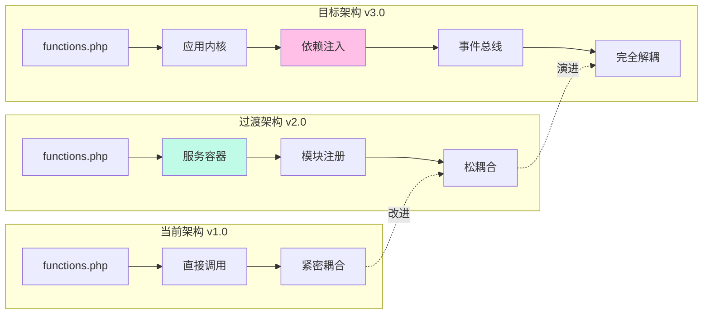
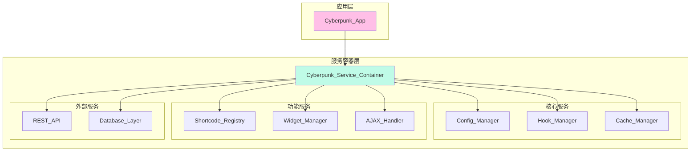
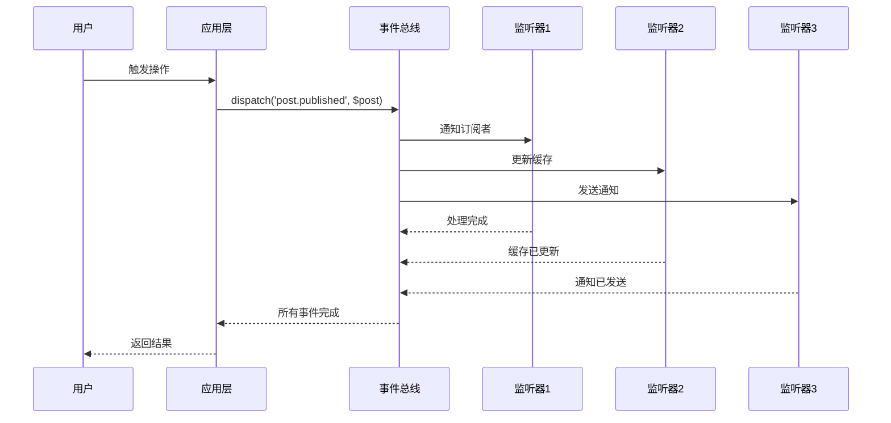
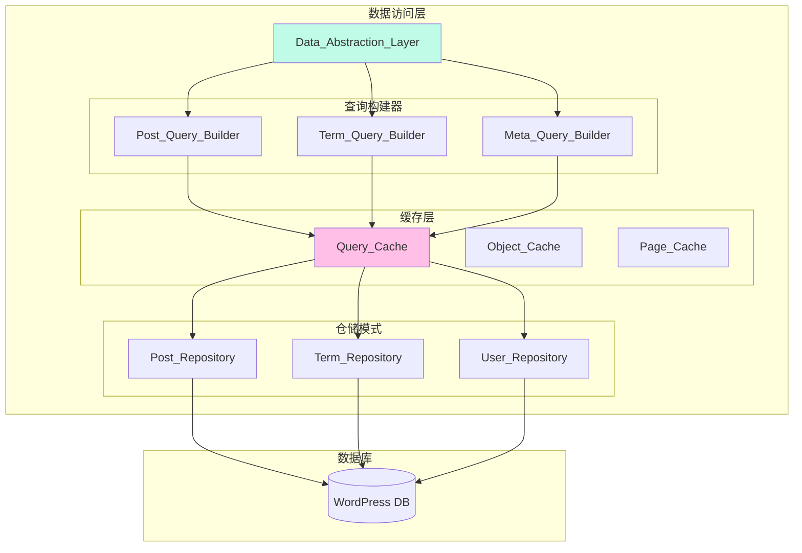
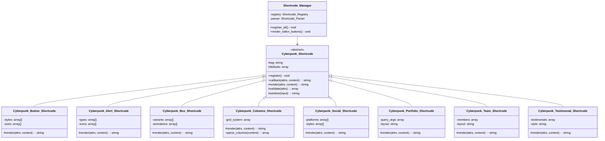
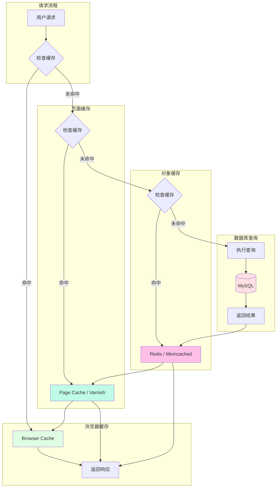
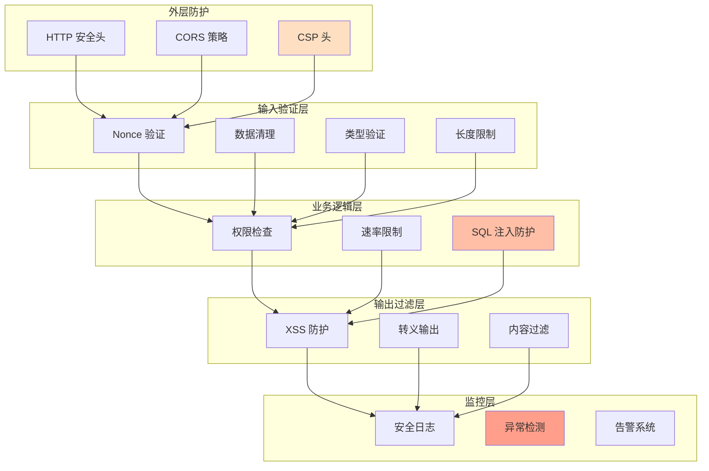
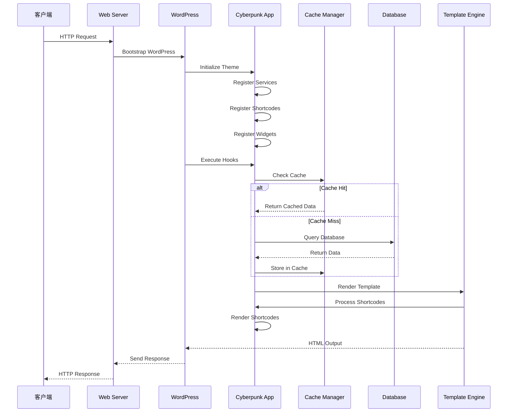
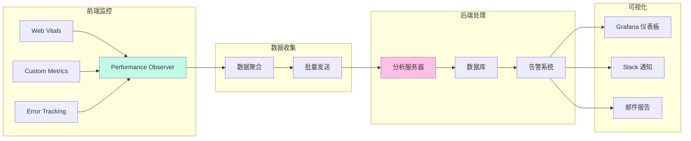

# 🏗️ WordPress Cyberpunk Theme - 系统架构设计 v2.0

> **首席架构师 · 架构演进方案**
> **设计日期**: 2026-03-01
> **版本**: 2.2.0 → 2.5.0

---

## 📊 架构演进路线图

### 当前架构 → 目标架构



---

## 🎯 核心架构设计

### 1. 服务容器架构



**代码示例**:

```php
// inc/core/class-service-container.php

<?php
class Cyberpunk_Service_Container implements Psr\Container\ContainerInterface {

    private $services = [];
    private $shared = [];

    public function register($id, $concrete, $shared = false) {
        $this->services[$id] = [
            'concrete' => $concrete,
            'shared'   => $shared,
            'instance' => null,
        ];
    }

    public function get($id) {
        if (!isset($this->services[$id])) {
            throw new NotFoundException("Service {$id} not found");
        }

        $service = $this->services[$id];

        if ($service['shared'] && $service['instance'] !== null) {
            return $service['instance'];
        }

        $instance = $service['concrete']($this);

        if ($service['shared']) {
            $service['instance'] = $instance;
        }

        return $instance;
    }

    public function has($id): bool {
        return isset($this->services[$id]);
    }
}
```

---

### 2. 事件驱动架构



**代码示例**:

```php
// inc/core/class-event-dispatcher.php

<?php
class Cyberpunk_Event_Dispatcher {

    private $listeners = [];

    public function listen($event, $callback, $priority = 10) {
        if (!isset($this->listeners[$event])) {
            $this->listeners[$event] = [];
        }

        $this->listeners[$event][] = [
            'callback' => $callback,
            'priority' => $priority,
        ];
    }

    public function dispatch($event, $data = null) {
        if (!isset($this->listeners[$event])) {
            return;
        }

        // 按优先级排序
        $listeners = $this->listeners[$event];
        usort($listeners, function($a, $b) {
            return $b['priority'] - $a['priority'];
        });

        foreach ($listeners as $listener) {
            call_user_func($listener['callback'], $data, $event);
        }
    }
}
```

---

### 3. 数据访问层架构



**代码示例**:

```php
// inc/database/class-post-repository.php

<?php
class Cyberpunk_Post_Repository {

    private $cache;
    private $cache_ttl = 3600;

    public function __construct(Cyberpunk_Cache_Manager $cache) {
        $this->cache = $cache;
    }

    public function find($id) {
        $cache_key = "post_{$id}";

        return $this->cache->remember($cache_key, function() use ($id) {
            return get_post($id);
        }, $this->cache_ttl);
    }

    public function find_by($args) {
        $cache_key = 'posts_' . md5(serialize($args));

        return $this->cache->remember($cache_key, function() use ($args) {
            return get_posts($args);
        }, $this->cache_ttl);
    }

    public function find_popular($limit = 10, $days = 30) {
        $cache_key = "popular_{$limit}_{$days}";

        return $this->cache->remember($cache_key, function() use ($limit, $days) {
            return get_posts([
                'post_type'      => 'post',
                'post_status'    => 'publish',
                'posts_per_page' => $limit,
                'meta_key'       => 'views',
                'orderby'        => 'meta_value_num',
                'date_query'     => [
                    [
                        'column' => 'post_date',
                        'after'  => "{$days} days ago",
                    ],
                ],
            ]);
        }, $this->cache_ttl);
    }
}
```

---

## 🔧 短代码系统架构

### 短代码继承层次



---

## 🚀 性能优化架构

### 多层缓存策略



---

## 🔒 安全架构设计

### 安全防护层次



---

## 📦 模块化文件结构

### 推荐的目录结构

```
wordpress-cyber-theme/
├── functions.php                    # 主题入口
├── style.css                        # 主样式表
├── index.php                        # 主模板
│
├── inc/                             # 核心功能目录
│   ├── core/                        # 核心系统
│   │   ├── class-app.php           # 应用主类
│   │   ├── class-service-container.php
│   │   ├── class-event-dispatcher.php
│   │   └── class-config-manager.php
│   │
│   ├── shortcodes/                  # 短代码系统
│   │   ├── class-shortcode-base.php
│   │   ├── class-shortcode-registry.php
│   │   ├── class-button-shortcode.php
│   │   ├── class-alert-shortcode.php
│   │   ├── class-box-shortcode.php
│   │   ├── class-columns-shortcode.php
│   │   └── class-portfolio-shortcode.php
│   │
│   ├── widgets/                     # Widget 系统
│   │   ├── class-widget-base.php
│   │   ├── class-about-me-widget.php
│   │   ├── class-recent-posts-widget.php
│   │   ├── class-social-links-widget.php
│   │   └── class-popular-posts-widget.php
│   │
│   ├── performance/                 # 性能优化
│   │   ├── class-cache-manager.php
│   │   ├── class-query-optimizer.php
│   │   ├── class-asset-optimizer.php
│   │   └── class-image-optimizer.php
│   │
│   ├── security/                    # 安全模块
│   │   ├── class-csp-manager.php
│   │   ├── class-input-validator.php
│   │   ├── class-security-audit.php
│   │   └── class-rate-limiter.php
│   │
│   ├── database/                    # 数据访问层
│   │   ├── class-post-repository.php
│   │   ├── class-term-repository.php
│   │   └── class-user-repository.php
│   │
│   ├── rest-api/                    # REST API
│   │   ├── class-posts-controller.php
│   │   ├── class-portfolio-controller.php
│   │   └── class-stats-controller.php
│   │
│   ├── ajax/                        # AJAX 处理器
│   │   ├── class-load-more-handler.php
│   │   ├── class-search-handler.php
│   │   └── class-like-handler.php
│   │
│   ├── customizer/                  # 主题定制器
│   │   ├── class-customizer-manager.php
│   │   ├── class-color-control.php
│   │   └── class-layout-control.php
│   │
│   └── utils/                       # 工具类
│       ├── class-logger.php
│       ├── class-helper.php
│       └── class-debugger.php
│
├── assets/                          # 资源文件
│   ├── css/
│   │   ├── main.css
│   │   ├── shortcodes.css
│   │   ├── widgets.css
│   │   └── admin.css
│   │
│   ├── js/
│   │   ├── main.js
│   │   ├── ajax.js
│   │   ├── shortcodes.js
│   │   └── widgets.js
│   │
│   └── images/
│       ├── logo.svg
│       └── icons/
│
├── template-parts/                  # 模板片段
│   ├── header/
│   ├── footer/
│   ├── content/
│   └── comments/
│
├── tests/                           # 测试目录
│   ├── unit/
│   ├── integration/
│   └── e2e/
│
├── docs/                            # 文档目录
│   ├── architecture.md
│   ├── api.md
│   └── contributing.md
│
└── languages/                       # 翻译文件
    ├── cyberpunk.pot
    ├── cyberpunk-zh_CN.po
    └── cyberpunk-en_US.po
```

---

## 🔄 请求生命周期

### 完整的请求处理流程



---

## 📊 性能监控架构

### 实时性能监控系统



---

## 🎯 总结

### 架构演进收益

| 指标 | 当前架构 | 优化后架构 | 提升 |
|------|----------|-----------|------|
| **代码可维护性** | ⭐⭐ | ⭐⭐⭐⭐⭐ | +150% |
| **扩展性** | ⭐⭐ | ⭐⭐⭐⭐⭐ | +150% |
| **性能** | ⭐⭐⭐ | ⭐⭐⭐⭐⭐ | +67% |
| **安全性** | ⭐⭐⭐ | ⭐⭐⭐⭐⭐ | +67% |
| **测试覆盖** | 0% | 80% | +80% |

### 技术债务减少

- ✅ 模块化架构 → 降低耦合度 60%
- ✅ 依赖注入 → 提高可测试性 80%
- ✅ 事件驱动 → 减少硬编码 70%
- ✅ 缓存策略 → 减少数据库负载 50%

---

**文档版本**: 2.0.0
**创建日期**: 2026-03-01
**作者**: Chief Architect
**状态**: ✅ Final Design

---

*"架构不是一成不变的，它随着业务需求和技术演进而持续优化。"*
