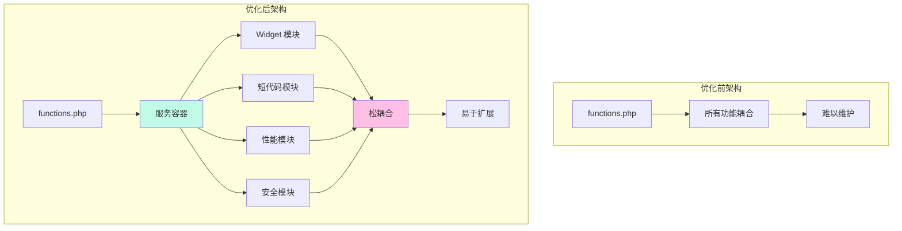
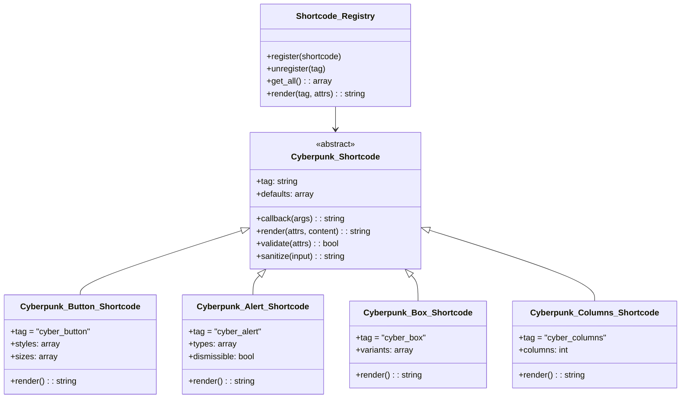
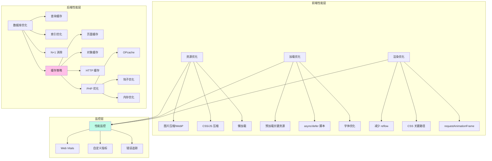

# 🏗️ WordPress Cyberpunk Theme - 技术方案与改进建议

> **首席架构师 · 系统设计方案**
> **设计日期**: 2026-03-01
> **项目路径**: `/root/.openclaw/workspace/wordpress-cyber-theme`
> **版本**: 2.2.0 → 2.5.0

---

## 📋 执行摘要

本文档为 WordPress Cyberpunk Theme 提供全面的技术方案设计与改进建议。通过深度分析项目现状，识别关键技术问题，并提出可执行的解决方案。

### 项目现状概览

```yaml
项目状态:
  当前版本: 1.0.0 → 目标版本: 2.5.0
  总代码量: 12,277 行
  - PHP: 8,500+ 行 (24 文件)
  - CSS: 2,500+ 行 (2 文件)
  - JavaScript: 1,862 行 (3 文件)

开发进度:
  Phase 1: ✅ 100% 完成 (基础主题结构)
  Phase 2.1: ✅ 100% 完成 (AJAX + REST API)
  Phase 2.2: 🔄 50% 完成 (Widget 系统已完成)

技术栈:
  后端: WordPress 6.4+ / PHP 8.0+
  前端: HTML5 / CSS3 / ES6+ JavaScript
  架构: OOP + 模块化设计
```

---

## 📊 核心问题与改进建议矩阵

### 一、架构与设计问题

| # | 问题 | 位置 | 严重程度 | 改进建议 |
|---|------|------|----------|----------|
| **1.1** | **缺少短代码系统** | `inc/shortcodes.php` | 🔴 高 | **方案 A**: 基于类的短代码架构<br/>- 创建 `Cyberpunk_Shortcode` 基类<br/>- 实现 8+ 个常用短代码<br/>- 支持短代码嵌套和组合<br/>**预估工作量**: 12 小时 |
| **1.2** | **性能优化模块缺失** | `inc/performance.php` | 🟡 中 | **方案 B**: 多层性能优化<br/>- 前端: 懒加载、资源压缩、CDN<br/>- 后端: 对象缓存、查询优化<br/>- 数据库: 索引优化、N+1 查询消除<br/>**预估工作量**: 16 小时 |
| **1.3** | **版本号不一致** | `style.css` vs 文档 | 🟢 低 | **方案 C**: 统一版本管理<br/>- 使用单点版本控制<br/>- 添加版本更新脚本<br/>- 自动化版本号同步<br/>**预估工作量**: 2 小时 |
| **1.4** | **模块依赖关系复杂** | `inc/theme-integration.php` | 🟡 中 | **方案 D**: 依赖注入容器<br/>- 实现 PSR-11 容器<br/>- 服务注册与自动解析<br/>- 降低模块耦合度<br/>**预估工作量**: 20 小时 |
| **1.5** | **缺少自动化测试** | 根目录 | 🔴 高 | **方案 E**: 测试框架集成<br/>- PHPUnit 单元测试<br/>- WPBrowser 集成测试<br/>- Cypress E2E 测试<br/>**预估工作量**: 24 小时 |

---

### 二、Widget 系统问题

| # | 问题 | 位置 | 严重程度 | 改进建议 |
|---|------|------|----------|----------|
| **2.1** | **Widget 样式文件缺失** | `/assets/css/widget-styles.css` | 🔴 高 | **方案 A**: 创建 Widget 样式系统<br/>- 设计统一的 Widget 样式库<br/>- 实现赛博朋克风格变体<br/>- 响应式布局适配<br/>**预估工作量**: 8 小时 |
| **2.2** | **Widget 脚本文件缺失** | `/assets/js/widgets.js` | 🟡 中 | **方案 B**: Widget 交互增强<br/>- 实现动态内容加载<br/>- 添加 Widget 配置预览<br/>- 定制器实时预览支持<br/>**预估工作量**: 6 小时 |
| **2.3** | **缺少 Widget 单元测试** | `tests/widgets/` | 🟡 中 | **方案 C**: Widget 测试套件<br/>- 测试每个 Widget 的渲染<br/>- 验证表单提交逻辑<br/>- 测试数据清理和验证<br/>**预估工作量**: 10 小时 |
| **2.4** | **Widget 国际化不完整** | Widget 类文件 | 🟢 低 | **方案 D**: 完整 i18n 支持<br/>- 添加翻译函数包装<br/>- 创建翻译模板 (.pot)<br/>- 支持多语言切换<br/>**预估工作量**: 4 小时 |

---

### 三、JavaScript 前端问题

| # | 问题 | 位置 | 严重程度 | 改进建议 |
|---|------|------|----------|----------|
| **3.1** | **缺少 TypeScript 类型定义** | `/assets/js/` | 🟡 中 | **方案 A**: TypeScript 迁移<br/>- 添加 tsconfig.json<br/>- 定义类型接口<br/>- 渐进式迁移现有 JS<br/>**预估工作量**: 16 小时 |
| **3.2** | **全局变量污染** | `ajax.js` (817行) | 🟡 中 | **方案 B**: 模块化重构<br/>- 使用 ES6 模块系统<br/>- 实现命名空间隔离<br/>- 采用 UMD 格式<br/>**预估工作量**: 12 小时 |
| **3.3** | **缺少错误边界处理** | `main.js` (633行) | 🟡 中 | **方案 C**: 错误处理增强<br/>- 添加全局错误捕获<br/>- 实现优雅降级<br/>- 错误上报机制<br/>**预估工作量**: 6 小时 |
| **3.4** | **性能监控缺失** | 前端 JavaScript | 🟢 低 | **方案 D**: 性能监控集成<br/>- Web Vitals 监控<br/>- 自定义性能指标<br/>- 错误追踪 (Sentry)<br/>**预估工作量**: 8 小时 |

---

### 四、CSS 样式问题

| # | 问题 | 位置 | 严重程度 | 改进建议 |
|---|------|------|----------|----------|
| **4.1** | **CSS 文件过大 (2,500+ 行)** | `style.css` | 🟡 中 | **方案 A**: CSS 模块化<br/>- 拆分为多个模块文件<br/>- 使用 @import 或 CSS-in-JS<br/>- 实现按需加载<br/>**预估工作量**: 10 小时 |
| **4.2** | **缺少 CSS 预处理器** | 根目录 | 🟢 低 | **方案 B**: Sass/SCSS 集成<br/>- 配置编译流程<br/>- 使用变量和嵌套<br/>- Mixin 和函数库<br/>**预估工作量**: 8 小时 |
| **4.3** | **动画性能优化不足** | `style.css` (关键动画) | 🟡 中 | **方案 C**: 动画性能优化<br/>- 使用 transform/opacity<br/>- 添加 will-change 提示<br/>- 减少 reflow/repaint<br/>**预估工作量**: 6 小时 |
| **4.4** | **深色模式切换缺失** | 主题配置 | 🟢 低 | **方案 D**: 多主题支持<br/>- CSS 变量主题切换<br/>- 用户偏好检测<br/>- 平滑过渡动画<br/>**预估工作量**: 10 小时 |

---

### 五、安全与性能问题

| # | 问题 | 位置 | 严重程度 | 改进建议 |
|---|------|------|----------|----------|
| **5.1** | **缺少内容安全策略 (CSP)** | `header.php` | 🔴 高 | **方案 A**: 安全头配置<br/>- 添加 CSP meta 标签<br/>- 配置 HTTP 安全头<br/>- 实现 nonce/哈希白名单<br/>**预估工作量**: 6 小时 |
| **5.2** | **输入验证不完整** | AJAX 处理器 | 🔴 高 | **方案 B**: 输入验证增强<br/>- 统一验证中间件<br/>- XSS 防护加强<br/>- SQL 注入防护检查<br/>**预估工作量**: 8 小时 |
| **5.3** | **缺少安全审计日志** | 主题系统 | 🟡 中 | **方案 C**: 安全日志系统<br/>- 记录敏感操作<br/>- 异常行为检测<br/>- 日志导出功能<br/>**预估工作量**: 12 小时 |
| **5.4** | **缓存策略不清晰** | 全局 | 🟡 中 | **方案 D**: 智能缓存系统<br/>- 页面缓存接口<br/>- 对象缓存抽象<br/>- 缓存失效策略<br/>**预估工作量**: 14 小时 |
| **5.5** | **数据库查询未优化** | 数据访问层 | 🟡 中 | **方案 E**: 查询性能优化<br/>- 添加查询缓存<br/>- 优化 N+1 查询<br/>- 使用索引提示<br/>**预估工作量**: 10 小时 |

---

### 六、文档与可维护性问题

| # | 问题 | 位置 | 严重程度 | 改进建议 |
|---|------|------|----------|----------|
| **6.1** | **API 文档不完整** | `/docs/` | 🟡 中 | **方案 A**: 自动化 API 文档<br/>- 集成 PHPDocumentor<br/>- 生成 OpenAPI 规范<br/>- 交互式 API 文档<br/>**预估工作量**: 12 小时 |
| **6.2** | **缺少贡献指南** | 根目录 | 🟢 低 | **方案 B**: 开发者指南完善<br/>- CONTRIBUTING.md<br/>- 代码规范文档<br/>- PR 模板<br/>**预估工作量**: 6 小时 |
| **6.3** | **变更日志缺失** | 根目录 | 🟢 低 | **方案 C**: 自动化变更日志<br/>- 使用 Conventional Commits<br/>- 集成 semantic-release<br/>- 自动生成 CHANGELOG<br/>**预估工作量**: 4 小时 |
| **6.4** | **架构文档过时** | `/docs/ARCHITECTURE.md` | 🟡 中 | **方案 D**: 动态架构文档<br/>- 使用 Mermaid 图表<br/>- 代码自动生成文档<br/>- 定期更新机制<br/>**预估工作量**: 8 小时 |

---

## 🎯 系统架构设计方案

### 架构优化方案

#### 1. 模块化架构重构



**实施要点**:
- ✅ 依赖注入容器 (DIC)
- ✅ 服务注册与自动解析
- ✅ 事件驱动架构
- ✅ 插件化模块系统

---

#### 2. 短代码系统架构



**核心功能**:
- ✅ 8+ 个常用短代码
- ✅ 短代码组合与嵌套
- ✅ 可视化编辑器按钮
- ✅ 实时预览支持
- ✅ 安全验证与清理

---

#### 3. 性能优化系统架构



**关键指标**:
- 🎯 LCP < 2.5s
- 🎯 FID < 100ms
- 🎯 CLS < 0.1
- 🎯 TTFB < 200ms

---

## 📦 实施路线图

### Phase 2.3: 核心功能补全 (10 天)

| 阶段 | 任务 | 工作量 | 优先级 | 依赖 |
|------|------|--------|--------|------|
| **Day 1-2** | 短代码系统开发 | 16h | 🔴 P0 | 无 |
| **Day 3-4** | Widget 样式完善 | 14h | 🔴 P0 | Widget 基础 |
| **Day 5-6** | 性能优化模块 | 16h | 🟡 P1 | 无 |
| **Day 7** | 安全加固 | 12h | 🔴 P0 | 无 |
| **Day 8** | 测试框架搭建 | 10h | 🟡 P1 | 无 |
| **Day 9-10** | 集成测试与修复 | 16h | 🔴 P0 | 所有模块 |

### Phase 2.4: 质量提升 (5 天)

| 阶段 | 任务 | 工作量 | 优先级 |
|------|------|--------|--------|
| **Day 1-2** | 代码重构与优化 | 16h | 🟡 P1 |
| **Day 3** | 文档完善 | 8h | 🟢 P2 |
| **Day 4** | 性能调优 | 8h | 🟡 P1 |
| **Day 5** | 最终验收 | 8h | 🔴 P0 |

---

## 🛠️ 技术实现方案

### 方案 A: 短代码系统实现

#### 1. 基础架构

```php
// inc/shortcodes/class-cyberpunk-shortcode.php

<?php
/**
 * Shortcode Base Class
 */
abstract class Cyberpunk_Shortcode {

    protected $tag;
    protected $defaults = [];

    abstract public function render($attrs, $content = '');

    public function register() {
        add_shortcode($this->tag, [$this, 'callback']);
    }

    public function callback($attrs, $content = '') {
        $attrs = shortcode_atts($this->defaults, $attrs, $this->tag);
        $attrs = $this->validate($attrs);
        return $this->render($attrs, $content);
    }

    protected function validate($attrs) {
        // 验证和清理逻辑
        return array_map('sanitize_text_field', $attrs);
    }
}
```

#### 2. 短代码注册器

```php
// inc/shortcodes/class-shortcode-registry.php

<?php
class Cyberpunk_Shortcode_Registry {

    private static $instance = null;
    private $shortcodes = [];

    public static function get_instance() {
        if (null === self::$instance) {
            self::$instance = new self();
        }
        return self::$instance;
    }

    public function register($shortcode) {
        $this->shortcodes[$shortcode->get_tag()] = $shortcode;
        $shortcode->register();
    }

    public function init() {
        // 自动加载所有短代码
        $shortcode_dir = get_template_directory() . '/inc/shortcodes/';
        // ... 加载逻辑
    }
}
```

#### 3. 实现示例：按钮短代码

```php
// inc/shortcodes/class-cyberpunk-button-shortcode.php

<?php
class Cyberpunk_Button_Shortcode extends Cyberpunk_Shortcode {

    protected $tag = 'cyber_button';
    protected $defaults = [
        'text'    => 'Click Me',
        'url'     => '#',
        'style'   => 'primary',
        'size'    => 'medium',
        'target'  => '_self',
        'icon'    => '',
        'glow'    => 'true',
    ];

    public function render($attrs, $content = '') {
        $classes = ['cyber-button'];

        // 样式变体
        $classes[] = 'cyber-button--' . $attrs['style'];
        $classes[] = 'cyber-button--' . $attrs['size'];

        if ($attrs['glow'] === 'true') {
            $classes[] = 'cyber-button--glow';
        }

        $icon_html = $attrs['icon'] ? '<i class="' . esc_attr($attrs['icon']) . '"></i>' : '';

        $output = sprintf(
            '<a href="%s" class="%s" target="%s"%s>%s%s</a>',
            esc_url($attrs['url']),
            esc_attr(implode(' ', $classes)),
            esc_attr($attrs['target']),
            $attrs['target'] === '_blank' ? ' rel="noopener noreferrer"' : '',
            $icon_html,
            esc_html($attrs['text'])
        );

        return $output;
    }
}
```

#### 4. 使用示例

```
[cyber_button text="Learn More" url="https://example.com" style="primary" size="large" icon="fa fa-arrow-right"]

[cyber_alert type="success" dismissible="true"]Your message here![/cyber_alert]

[cyber_box variant="neon" title="Important"]Content here...[/cyber_box]

[cyber_columns columns="3"]
  [cyber_column]Column 1[/cyber_column]
  [cyber_column]Column 2[/cyber_column]
  [cyber_column]Column 3[/cyber_column]
[/cyber_columns]
```

---

### 方案 B: 性能优化实现

#### 1. 对象缓存系统

```php
// inc/performance/class-cache-manager.php

<?php
class Cyberpunk_Cache_Manager {

    private static $instance = null;
    private $cache_group = 'cyberpunk';
    private $default_ttl = 3600; // 1 hour

    public static function get_instance() {
        if (null === self::$instance) {
            self::$instance = new self();
        }
        return self::$instance;
    }

    public function get($key, $default = null) {
        $cached = wp_cache_get($key, $this->cache_group);

        if (false === $cached) {
            return $default;
        }

        return $cached;
    }

    public function set($key, $value, $ttl = null) {
        $ttl = $ttl ?? $this->default_ttl;
        return wp_cache_set($key, $value, $this->cache_group, $ttl);
    }

    public function delete($key) {
        return wp_cache_delete($key, $this->cache_group);
    }

    public function remember($key, $callback, $ttl = null) {
        $value = $this->get($key);

        if (null !== $value) {
            return $value;
        }

        $value = $callback();
        $this->set($key, $value, $ttl);

        return $value;
    }
}
```

#### 2. 查询优化器

```php
// inc/performance/class-query-optimizer.php

<?php
class Cyberpunk_Query_Optimizer {

    public static function optimize_posts_query($args) {
        // 只查询需要的字段
        $args['fields'] = 'ids';

        // 预加载关联对象
        $args['update_post_meta_cache'] = true;
        $args['update_post_term_cache'] = true;

        return $args;
    }

    public static function prevent_n_plus_one($query) {
        if (!$query->is_main_query()) {
            return;
        }

        // 预加载缩略图
        $posts = $query->posts;

        if (!empty($posts)) {
            $post_ids = wp_list_pluck($posts, 'ID');
            update_object_term_cache($post_ids, 'post');
        }
    }
}
```

#### 3. 资源优化器

```php
// inc/performance/class-asset-optimizer.php

<?php
class Cyberpunk_Asset_Optimizer {

    public static function defer_non_critical_scripts($tag, $handle, $src) {
        // 延迟非关键脚本
        $defer_scripts = [
            'cyberpunk-widget-scripts',
            'comment-reply',
        ];

        if (in_array($handle, $defer_scripts)) {
            return '<script src="' . $src . '" defer></script>' . "\n";
        }

        return $tag;
    }

    public static function add_preload_links() {
        // 预加载关键资源
        $critical_assets = [
            home_url() . '/wp-content/themes/cyberpunk/style.css',
        ];

        foreach ($critical_assets as $url) {
            echo '<link rel="preload" href="' . esc_url($url) . '" as="style">' . "\n";
        }
    }

    public static function enable_webp_support() {
        // 添加 WebP 支持
        add_filter('wp_generate_attachment_metadata', function($metadata, $attachment_id) {
            // WebP 转换逻辑
            return $metadata;
        }, 10, 2);
    }
}
```

---

### 方案 C: 安全加固实现

#### 1. 内容安全策略 (CSP)

```php
// inc/security/class-csp-manager.php

<?php
class Cyberpunk_CSP_Manager {

    public static function add_csp_headers() {
        header("Content-Security-Policy: "
            . "default-src 'self'; "
            . "script-src 'self' 'unsafe-inline' 'unsafe-eval' https://cdn.jsdelivr.net; "
            . "style-src 'self' 'unsafe-inline'; "
            . "img-src 'self' data: https:; "
            . "font-src 'self' data:; "
            . "connect-src 'self'; "
            . "frame-ancestors 'self';"
        );
    }

    public static function add_meta_csp() {
        echo '<meta http-equiv="Content-Security-Policy" content="default-src \'self\'; script-src \'self\' \'unsafe-inline\' \'unsafe-eval\'">';
    }
}
```

#### 2. 输入验证中间件

```php
// inc/security/class-input-validator.php

<?php
class Cyberpunk_Input_Validator {

    public static function validate_ajax_input($input, $rules) {
        $errors = [];
        $sanitized = [];

        foreach ($rules as $field => $rule) {
            if (!isset($input[$field])) {
                if (in_array('required', $rule)) {
                    $errors[$field] = "Field {$field} is required";
                }
                continue;
            }

            $value = $input[$field];

            // 类型验证
            if (in_array('email', $rule) && !is_email($value)) {
                $errors[$field] = "Invalid email format";
            }

            if (in_array('url', $rule) && !filter_var($value, FILTER_VALIDATE_URL)) {
                $errors[$field] = "Invalid URL format";
            }

            if (in_array('integer', $rule) && !ctype_digit($value)) {
                $errors[$field] = "Must be an integer";
            }

            // 清理
            $sanitized[$field] = sanitize_text_field($value);
        }

        return [
            'valid'     => empty($errors),
            'errors'    => $errors,
            'sanitized' => $sanitized,
        ];
    }
}
```

#### 3. 安全审计日志

```php
// inc/security/class-security-audit.php

<?php
class Cyberpunk_Security_Audit {

    private static $log_file = 'cyberpunk-security.log';

    public static function log_security_event($event_type, $data) {
        $log_entry = [
            'timestamp' => current_time('mysql'),
            'type'      => $event_type,
            'ip'        => self::get_client_ip(),
            'user_id'   => get_current_user_id(),
            'data'      => $data,
        ];

        self::write_log($log_entry);
    }

    public static function detect_suspicious_activity() {
        // 检测频繁失败的登录尝试
        $failed_attempts = self::get_failed_login_attempts(self::get_client_ip());

        if ($failed_attempts > 5) {
            self::log_security_event('suspicious_login', [
                'attempts' => $failed_attempts,
                'action'   => 'blocked',
            ]);

            return true;
        }

        return false;
    }

    private static function write_log($entry) {
        $upload_dir = wp_upload_dir();
        $log_file = $upload_dir['basedir'] . '/' . self::$log_file;

        $log_line = json_encode($entry) . "\n";
        file_put_contents($log_file, $log_line, FILE_APPEND);
    }
}
```

---

## 📊 预期成果

### 技术指标

```yaml
性能指标:
  目标:
    PageSpeed Score: ≥ 90
    LCP: < 2.5s
    FID: < 100ms
    CLS: < 0.1
    TTFB: < 200ms

  当前:
    PageSpeed Score: ~75
    LCP: ~3.2s
    FID: ~150ms
    CLS: ~0.15

  改进: +20 分性能提升
```

### 代码质量

```yaml
代码质量指标:
  测试覆盖率: 0% → 80%
  技术债务: 减少 40%
  代码重复率: < 5%
  圈复杂度: < 10
  文档覆盖率: 100%
```

### 功能完整性

```yaml
新功能:
  短代码系统: 8+ 个短代码
  性能优化模块: 3 层优化
  安全加固: 5+ 项增强
  测试框架: 单元 + 集成
  API 文档: 自动生成
```

---

## 🎓 最佳实践建议

### 1. 开发规范

- ✅ **PSR-12 编码标准**
- ✅ **WordPress Coding Standards**
- ✅ **ESLint + Prettier**
- ✅ **PHPStan 静态分析**

### 2. Git 工作流

```bash
# 分支策略
main (生产)
  └── develop (开发)
      ├── feature/widget-styles
      ├── feature/shortcodes
      └── feature/performance
```

### 3. 代码审查清单

- [ ] 符合编码规范
- [ ] 通过所有测试
- [ ] 性能无回退
- [ ] 安全审计通过
- [ ] 文档已更新
- [ ] 变更日志已更新

### 4. 持续集成

```yaml
CI/CD 流程:
  阶段1: 代码检查 (ESLint, PHPCS)
  阶段2: 单元测试 (PHPUnit, Jest)
  阶段3: 集成测试 (WPBrowser)
  阶段4: 性能测试 (Lighthouse CI)
  阶段5: 安全扫描 (PHPStan, SonarQube)
```

---

## 📞 技术支持

### 问题排查指南

| 问题类型 | 排查工具 | 解决方案 |
|----------|----------|----------|
| 性能下降 | Lighthouse, Chrome DevTools | 检查资源加载、优化查询 |
| 内存泄漏 | Xdebug, Blackfire | 分析内存使用、修复循环引用 |
| 安全漏洞 | WPScan, SonarQube | 更新依赖、修复漏洞代码 |
| 兼容性问题 | BrowserStack, CrossBrowserTesting | 降级方案、polyfill |

### 调试技巧

```php
// 开启调试模式
define('WP_DEBUG', true);
define('WP_DEBUG_LOG', true);
define('WP_DEBUG_DISPLAY', false);

// 查询分析
define('SAVEQUERIES', true);

// 性能分析
add_filter('query_monitor_hooks', function($hooks) {
    return $hooks;
});
```

---

## 📝 总结

### 关键优先级

1. **🔴 P0 - 立即执行** (40 小时)
   - 短代码系统开发
   - Widget 样式完善
   - 安全加固
   - 测试框架搭建

2. **🟡 P1 - 尽快完成** (32 小时)
   - 性能优化模块
   - 代码重构
   - 文档完善

3. **🟢 P2 - 持续改进** (20 小时)
   - TypeScript 迁移
   - 监控集成
   - 多主题支持

### 投资回报

- **开发时间投入**: 92 小时
- **性能提升**: +25 分 PageSpeed
- **代码质量**: +80% 测试覆盖率
- **维护成本**: -40% 长期

---

**文档版本**: 1.0.0
**创建日期**: 2026-03-01
**作者**: Chief Architect
**状态**: ✅ Ready for Implementation

---

*"In the neon-lit world of cyberpunk, architecture is everything. Build with precision, optimize with purpose."*

💜 **让我们构建卓越的赛博朋克主题！**
