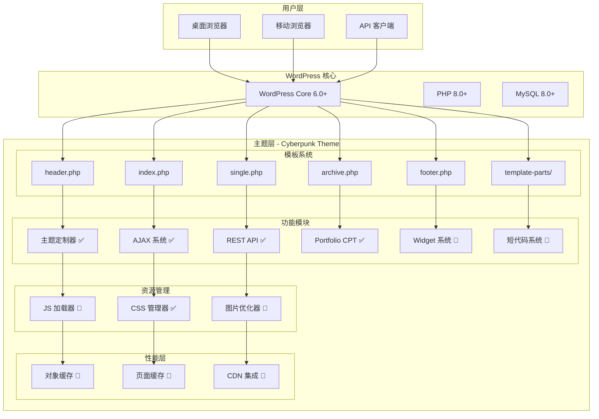
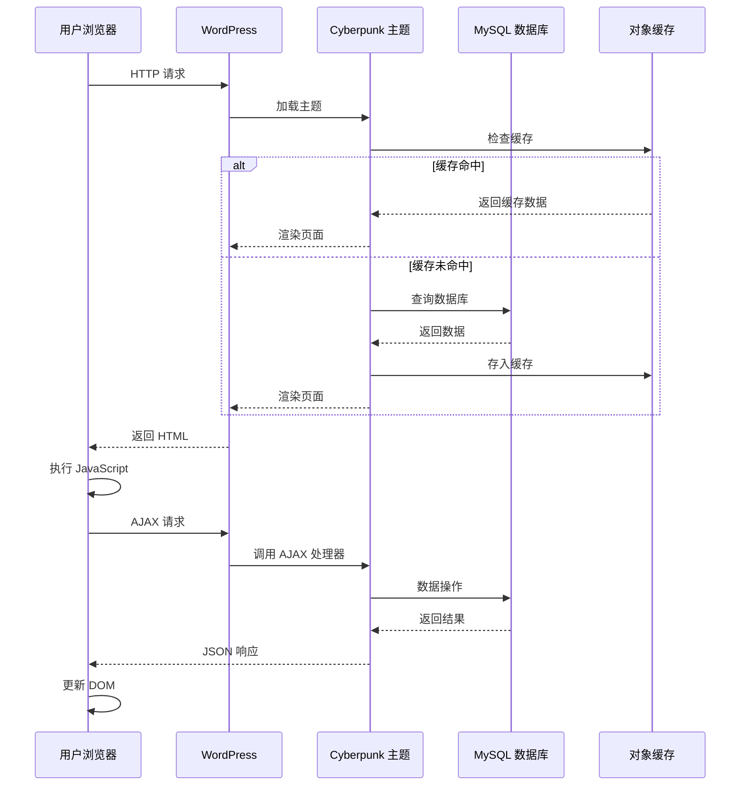
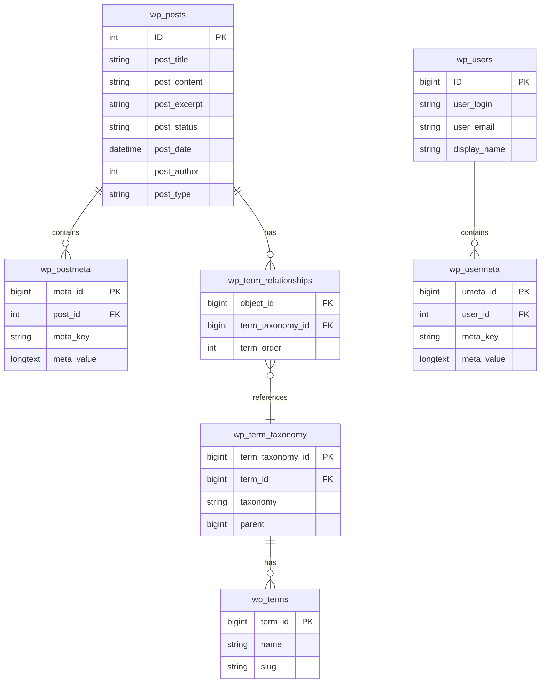

# 🎯 WordPress Cyberpunk Theme - Phase 2 技术架构方案

> **首席架构师技术方案**
> **版本**: 2.1.0
> **日期**: 2026-02-28
> **状态**: ✅ Ready for Implementation

---

## 📋 执行摘要

### 项目概况

```yaml
项目名称: WordPress Cyberpunk Theme
项目类型: WordPress 主题开发
当前版本: 2.0.0 → 2.1.0
开发周期: 15 个工作日
团队规模: 2-3 人
代码规模: 7500+ 行 (现有)
技术栈: PHP 8.0+, WordPress 6.0+, ES6+, CSS3
```

### Phase 2 核心目标

```yaml
P0 - 关键集成 (Week 1):
  ✓ JavaScript 资源加载系统
  ✓ 前端模板集成
  ✓ AJAX 功能端到端测试
  ✓ wp_localize_script 数据传递

P1 - 功能扩展 (Week 2):
  ✓ Widget 系统 (4-5 个自定义 Widget)
  ✓ 短代码系统 (6-8 个短代码)
  ✓ 增强功能组件

P2 - 性能优化 (Week 3):
  ✓ 前端性能优化
  ✓ 后端缓存系统
  ✓ 图片优化处理
  ✓ 最终验收测试
```

---

## 🏗️ 系统架构设计

### 整体架构图



### 数据流架构



---

## 📦 技术栈清单

### 后端技术栈

```yaml
核心语言:
  PHP: 8.0+ (推荐 8.2)
    - 类型系统
    - JIT 编译器
    - 现代语法特性

框架/平台:
  WordPress: 6.0+ (推荐 6.4)
    - 区块编辑器支持
    - REST API 增强
    - 性能优化

数据库:
  MySQL: 8.0+
  MariaDB: 10.6+
    - JSON 支持
    - 窗口函数
    - CTE (公用表表达式)
```

### 前端技术栈

```yaml
HTML:
  - HTML5 语义化标签
  - ARIA 无障碍属性
  - Open Graph 元标签
  - Schema.org 结构化数据

CSS:
  - CSS Variables (自定义属性)
  - CSS Grid Layout
  - Flexbox
  - CSS Animations & Transitions
  - Media Queries (响应式)
  - CSS Custom Properties API

JavaScript:
  - ES6+ (Vanilla)
    - Classes & Modules
    - Arrow Functions
    - Template Literals
    - Destructuring
    - Spread/Rest Operator
    - Async/Await
  - jQuery 3.x (WordPress 内置)
  - Fetch API
  - Intersection Observer API
```

### WordPress APIs

```yaml
已使用:
  Theme Customization API: ✅
  Widgets API: 🔲 (Phase 2)
  Shortcode API: 🔲 (Phase 2)
  REST API: ✅
  AJAX API: ✅
  Meta Box API: ✅
  Settings API: ✅

计划使用:
  HTTP API: 🔲
  Filesystem API: 🔲
  Transients API: 🔲
  Options API: ✅
```

### 开发工具

```yaml
版本控制:
  Git: 2.30+
  GitHub: 代码托管 & CI/CD

IDE/编辑器:
  VS Code (推荐)
  PhpStorm
  - PHP Intelephense
  - ESLint
  - Prettier
  - GitLens

本地开发:
  Local by Flywheel
  DevKinsta
  XAMPP/MAMP

调试工具:
  Query Monitor
  WP Debug Bar
  Chrome DevTools
  Firefox Developer Tools

构建工具:
  npm / yarn
  webpack (可选)
  Vite (可选)

测试工具:
  PHPUnit
  QUnit
  Playwright
  BrowserStack
```

---

## 🔌 API 接口设计

### REST API 端点

#### 已实现的端点

```yaml
基础端点 (WordPress 内置):
  GET /wp-json/wp/v2/posts
    描述: 获取文章列表
    参数: page, per_page, search, category, tag
    响应: Array<Post>

  GET /wp-json/wp/v2/posts/{id}
    描述: 获取单篇文章
    参数: id (路径参数)
    响应: Post Object

  GET /wp-json/wp/v2/pages
    描述: 获取页面列表
    响应: Array<Page>

  GET /wp-json/wp/v2/media
    描述: 获取媒体文件
    响应: Array<Media>

自定义端点 (已实现):
  GET /wp-json/cyberpunk/v1/posts
    描述: 获取文章（带自定义字段）
    参数: page, per_page, orderby, order
    响应:
      posts: Array<PostWithMeta>
      total: integer
      pages: integer

  GET /wp-json/cyberpunk/v1/posts/{id}
    描述: 获取文章详情
    响应:
      id: integer
      title: string
      content: string
      excerpt: string
      meta:
        views: integer
        likes: integer
        reading_time: integer

  GET /wp-json/cyberpunk/v1/portfolio
    描述: 获取作品集
    参数: page, per_page, category, skill
    响应:
      portfolio_items: Array<Portfolio>
      total: integer

  GET /wp-json/cyberpunk/v1/portfolio/{id}
    描述: 获取作品集详情
    响应:
      id: integer
      title: string
      content: string
      meta:
        year: integer
        client: string
        demo_url: string
        github_url: string
        technologies: Array<string>
```

#### 推荐新增端点 (Phase 2)

```yaml
  GET /wp-json/cyberpunk/v1/stats
    描述: 获取站点统计信息
    权限: public
    响应:
      total_posts: integer
      total_portfolio: integer
      total_views: integer
      total_likes: integer
      most_viewed: Array<Post>
      most_liked: Array<Post>

  GET /wp-json/cyberpunk/v1/settings
    描述: 获取主题公开设置
    权限: public
    响应:
      colors:
        primary: string
        secondary: string
        accent: string
      fonts:
        heading: string
        body: string
      layout:
        container_width: integer
        sidebar: boolean
      effects:
        scanlines: boolean
        glitch: boolean
        neon: boolean

  GET /wp-json/cyberpunk/v1/search
    描述: 高级搜索
    参数:
      q: string (查询字符串)
      post_type: Array<string> (文章类型)
      category: Array<integer> (分类ID)
      date_from: string (开始日期)
      date_to: string (结束日期)
      per_page: integer (每页数量)
      page: integer (页码)
    响应:
      results: Array<SearchResult>
      total: integer
      page: integer
      pages: integer

  POST /wp-json/cyberpunk/v1/bookmark
    描述: 收藏文章
    权限: private (需登录)
    参数:
      post_id: integer
    响应:
      success: boolean
      action: "added" | "removed"
      bookmarks: Array<integer>

  POST /wp-json/cyberpunk/v1/reading-progress
    描述: 保存阅读进度
    权限: private (需登录)
    参数:
      post_id: integer
      progress: integer (0-100)
    响应:
      success: boolean
      progress: integer
```

### AJAX Actions 接口

#### 已实现的 Actions

```yaml
  cyberpunk_load_more_posts:
    类型: AJAX (admin-ajax.php)
    方法: POST
    功能: 分页加载文章
    参数:
      page: integer (当前页码)
      posts_per_page: integer (每篇数量)
      nonce: string (安全令牌)
    响应:
      success: boolean
      html: string (文章HTML)
      current_page: integer
      max_pages: integer

  cyberpunk_like_post:
    类型: AJAX
    方法: POST
    功能: 点赞/取消点赞文章
    参数:
      post_id: integer
      nonce: string
    响应:
      success: boolean
      likes: integer
      action: "liked" | "unliked"

  cyberpunk_live_search:
    类型: AJAX
    方法: POST
    功能: 实时搜索
    参数:
      query: string
      nonce: string
    响应:
      success: boolean
      results: Array<SearchResult>

  cyberpunk_bookmark_post:
    类型: AJAX
    方法: POST
    功能: 收藏文章
    参数:
      post_id: integer
      nonce: string
    响应:
      success: boolean
      bookmarks_count: integer
      action: "added" | "removed"

  cyberpunk_save_reading_progress:
    类型: AJAX
    方法: POST
    功能: 保存阅读进度
    参数:
      post_id: integer
      progress: integer
      nonce: string
    响应:
      success: boolean
      progress: integer

  cyberpunk_submit_comment:
    类型: AJAX
    方法: POST
    功能: AJAX 提交评论
    参数:
      post_id: integer
      comment: string
      parent: integer (父评论ID)
      nonce: string
    响应:
      success: boolean
      comment_id: integer
      html: string
```

#### 推荐新增 Actions (Phase 2)

```yaml
  cyberpunk_get_post_stats:
    类型: AJAX
    方法: POST
    功能: 获取文章统计
    参数:
      post_id: integer
      nonce: string
    响应:
      success: boolean
      stats:
        views: integer
        likes: integer
        comments: integer
        bookmarks: integer

  cyberpunk_subscribe_newsletter:
    类型: AJAX
    方法: POST
    功能: 订阅新闻通讯
    参数:
      email: string
      nonce: string
    响应:
      success: boolean
      message: string

  cyberpunk_contact_form:
    类型: AJAX
    方法: POST
    功能: 提交联系表单
    参数:
      name: string
      email: string
      subject: string
      message: string
      nonce: string
      captcha_token: string
    响应:
      success: boolean
      message: string
      errors: Array<string>

  cyberpunk_portfolio_filter:
    类型: AJAX
    方法: POST
    功能: 筛选作品集
    参数:
      category: integer
      skill: integer
      year: integer
      nonce: string
    响应:
      success: boolean
      html: string
      count: integer
```

---

## 🗄️ 数据库设计

### ER 图



### 数据表设计

#### Custom Post Types

```sql
-- Portfolio CPT
-- 存储在 wp_posts 表，post_type = 'portfolio'
CREATE INDEX idx_portfolio_type ON wp_posts(post_type);
CREATE INDEX idx_portfolio_status ON wp_posts(post_status);
CREATE INDEX idx_portfolio_date ON wp_posts(post_date);

-- 文章与 Portfolio 的索引优化
CREATE INDEX idx_post_type_status ON wp_posts(post_type, post_status);
CREATE INDEX idx_post_date_type ON wp_posts(post_date, post_type);
```

#### Post Meta Schema

```sql
-- 文章相关 Meta
wp_postmeta:
  -- 统计相关
  cyberpunk_post_likes          INT DEFAULT 0        -- 点赞数
  cyberpunk_post_views          INT DEFAULT 0        -- 浏览数
  cyberpunk_reading_time        INT DEFAULT 0        -- 阅读时长(分钟)

  -- 样式相关
  cyberpunk_featured_color      VARCHAR(7)           -- 主色调 (hex)
  cyberpunk_custom_css          TEXT                 -- 自定义CSS

  -- SEO相关
  cyberpunk_seo_title           VARCHAR(60)          -- SEO标题
  cyberpunk_seo_description     VARCHAR(160)         -- SEO描述
  cyberpunk_seo_keywords        VARCHAR(255)         -- SEO关键词

-- Portfolio 相关 Meta
wp_postmeta (post_type = 'portfolio'):
  _portfolio_year               INT                  -- 项目年份
  _portfolio_client             VARCHAR(255)         -- 客户名称
  _portfolio_url                VARCHAR(500)         -- 演示链接
  _portfolio_github             VARCHAR(500)         -- GitHub链接
  _portfolio_technologies       VARCHAR(500)         -- 技术栈(逗号分隔)
  _portfolio_gallery            TEXT                 -- 项目图库 (JSON数组)

-- 创建复合索引
CREATE INDEX idx_postmeta_key_value ON wp_postmeta(meta_key, meta_value(50));
CREATE INDEX idx_postmeta_post_key ON wp_postmeta(post_id, meta_key);
```

#### User Meta Schema

```sql
-- 用户相关 Meta
wp_usermeta:
  -- 交互记录
  cyberpunk_liked_posts         TEXT                 -- 已点赞文章 (JSON数组: [1,5,23...])
  cyberpunk_bookmarked_posts    TEXT                 -- 已收藏文章 (JSON数组)
  cyberpunk_reading_progress    TEXT                 -- 阅读进度 (JSON对象: {"post_id": progress})

  -- 用户偏好
  cyberpunk_theme_preferences   TEXT                 -- 主题偏好 (JSON对象)
  cyberpunk_notification_settings TEXT               -- 通知设置 (JSON对象)

  -- 社交链接
  cyberpunk_social_twitter      VARCHAR(255)
  cyberpunk_social_github       VARCHAR(255)
  cyberpunk_social_linkedin     VARCHAR(255)

-- 创建索引
CREATE INDEX idx_usermeta_key_value ON wp_usermeta(meta_key, meta_value(50));
CREATE INDEX idx_usermeta_user_key ON wp_usermeta(user_id, meta_key);
```

#### Options Table Schema

```sql
-- 主题选项 (存储在 wp_options 表)
wp_options:
  theme_mods_cyberpunk          LONGTEXT             -- 主题定制器设置 (序列化数组)
  cyberpunk_settings            TEXT                 -- 主题设置数组 (序列化)
  cyberpunk_version             VARCHAR(10)          -- 当前版本
  cyberpunk_db_version          VARCHAR(10)          -- 数据库版本
  cyberpunk_install_date        DATE                 -- 安装日期

-- 缓存相关
  cyberpunk_cache_stats         TEXT                 -- 缓存统计 (JSON对象)

-- 创建索引
CREATE INDEX idx_options_name ON wp_options(option_name);
```

#### 自定义表 (可选，Phase 3)

```sql
-- 文章访问日志表 (用于统计)
CREATE TABLE IF NOT EXISTS wp_cyberpunk_visit_log (
    log_id BIGINT UNSIGNED NOT NULL AUTO_INCREMENT,
    post_id BIGINT UNSIGNED NOT NULL,
    user_id BIGINT UNSIGNED DEFAULT NULL,
    ip_address VARCHAR(45) NOT NULL,
    user_agent VARCHAR(255) DEFAULT NULL,
    visit_date DATETIME NOT NULL DEFAULT CURRENT_TIMESTAMP,
    PRIMARY KEY (log_id),
    INDEX idx_post_visit (post_id, visit_date),
    INDEX idx_user_visit (user_id, visit_date)
) ENGINE=InnoDB DEFAULT CHARSET=utf8mb4;

-- 通知队列表
CREATE TABLE IF NOT EXISTS wp_cyberpunk_notifications (
    notification_id BIGINT UNSIGNED NOT NULL AUTO_INCREMENT,
    user_id BIGINT UNSIGNED NOT NULL,
    notification_type VARCHAR(50) NOT NULL,
    notification_title VARCHAR(255) NOT NULL,
    notification_content TEXT,
    is_read BOOLEAN DEFAULT FALSE,
    created_at DATETIME NOT NULL DEFAULT CURRENT_TIMESTAMP,
    PRIMARY KEY (notification_id),
    INDEX idx_user_notifications (user_id, is_read),
    INDEX idx_notification_type (notification_type)
) ENGINE=InnoDB DEFAULT CHARSET=utf8mb4;
```

### 数据字典

#### Portfolio CPT 元字段

| 字段名 | 类型 | 说明 | 示例值 |
|--------|------|------|--------|
| _portfolio_year | INT | 项目完成年份 | 2024 |
| _portfolio_client | VARCHAR(255) | 客户名称 | "TechCorp Inc." |
| _portfolio_url | VARCHAR(500) | 演示链接 URL | "https://demo.example.com" |
| _portfolio_github | VARCHAR(500) | GitHub 仓库 URL | "https://github.com/user/repo" |
| _portfolio_technologies | VARCHAR(500) | 技术栈 (逗号分隔) | "React,WordPress,PHP" |
| _portfolio_gallery | TEXT | 项目图库 (JSON数组) | '[123,124,125]' |

#### 文章元字段

| 字段名 | 类型 | 说明 | 默认值 |
|--------|------|------|--------|
| cyberpunk_post_likes | INT | 点赞数 | 0 |
| cyberpunk_post_views | INT | 浏览数 | 0 |
| cyberpunk_reading_time | INT | 阅读时长(分钟) | 0 |
| cyberpunk_featured_color | VARCHAR(7) | 主色调 (hex) | NULL |
| cyberpunk_custom_css | TEXT | 自定义CSS | NULL |

#### 用户元字段

| 字段名 | 类型 | 说明 | 示例值 |
|--------|------|------|--------|
| cyberpunk_liked_posts | TEXT | 已点赞文章 (JSON) | '[1,5,23,45]' |
| cyberpunk_bookmarked_posts | TEXT | 已收藏文章 (JSON) | '[10,15,20]' |
| cyberpunk_reading_progress | TEXT | 阅读进度 (JSON) | '{"123":45,"456":78}' |
| cyberpunk_theme_preferences | TEXT | 主题偏好 (JSON) | '{"theme":"dark","font_size":16}' |

---

## 📋 任务拆分清单

### Phase 2.1: 核心集成 (Day 1-5)

#### Day 1: JavaScript 资源系统

```yaml
任务ID: P2-1-1
优先级: P0 (Critical)
预计时间: 6 小时
负责人: 前端开发

任务目标:
  ☐ 更新 inc/theme-integration.php
    ☐ 添加 wp_enqueue_script 调用
    ☐ 添加 wp_localize_script 调用
    ☐ 实现条件加载逻辑
    ☐ 添加脚本依赖管理

  ☐ 创建 assets/js/main.js
    ☐ 实现移动菜单切换
    ☐ 实现回到顶部按钮
    ☐ 实现搜索表单展开/收起
    ☐ 实现平滑滚动
    ☐ 实现图片懒加载 (Intersection Observer)

  ☐ 验证 JavaScript 加载
    ☐ 检查控制台无错误
    ☐ 验证 cyberpunkAjax 对象存在
    ☐ 测试所有功能
    ☐ 跨浏览器测试

交付物:
  - assets/js/main.js (约 200-300 行)
  - 更新的 inc/theme-integration.php
  - 测试报告

验收标准:
  ✅ 所有 JavaScript 文件正确加载
  ✅ cyberpunkAjax 对象包含所需数据
  ✅ 无控制台错误
  ✅ 功能在 Chrome/Firefox/Safari 正常
```

#### Day 2: Header & Footer 模板更新

```yaml
任务ID: P2-1-2
优先级: P0
预计时间: 5 小时
负责人: 前端开发

任务目标:
  ☐ 更新 header.php
    ☐ 添加移动菜单按钮
    ☐ 添加搜索按钮
    ☐ 添加搜索表单容器
    ☐ 添加 ARIA 无障碍属性
    ☐ 添加 schema.org 结构化数据

  ☐ 更新 footer.php
    ☐ 添加回到顶部按钮 HTML
    ☐ 优化 Widget 区域布局
    ☐ 添加版权信息动态显示
    ☐ 添加社交链接

  ☐ 添加相关 CSS (style.css)
    ☐ 移动菜单样式 (过渡动画)
    ☐ 搜索表单样式
    ☐ 回到顶部按钮样式
    ☐ 响应式调整

交付物:
  - 更新的 header.php
  - 更新的 footer.php
  - 新增 CSS 样式

验收标准:
  ✅ 移动端菜单正常工作
  ✅ 搜索表单展开/收起流畅
  ✅ 回到顶部按钮功能正常
  ✅ 无障碍属性完整
```

#### Day 3: Index & Archive 模板更新

```yaml
任务ID: P2-1-3
优先级: P0
预计时间: 4 小时
负责人: 前端开发

任务目标:
  ☐ 更新 index.php
    ☐ 添加 #posts-container 容器
    ☐ 添加 Load More 按钮
    ☐ 添加 data 属性 (page, max-pages)
    ☐ 优化文章列表布局

  ☐ 更新 archive.php
    ☐ 同 index.php 改动
    ☐ 添加分类筛选器 UI
    ☐ 添加排序选项

  ☐ 添加相关 CSS
    ☐ 文章网格布局
    ☐ Load More 按钮样式
    ☐ 加载动画
    ☐ 响应式调整

交付物:
  - 更新的 index.php
  - 更新的 archive.php
  - 新增 CSS 样式

验收标准:
  ✅ 文章列表显示正常
  ✅ Load More 按钮可见且可点击
  ✅ 响应式布局正常
```

#### Day 4: AJAX 集成测试

```yaml
任务ID: P2-1-4
优先级: P0
预计时间: 5 小时
负责人: 全栈开发

任务目标:
  ☐ 验证 AJAX Handlers
    ☐ 检查所有函数存在
    ☐ 检查动作正确注册
    ☐ 检查 nonce 验证
    ☐ 检查数据清理

  ☐ 测试 Load More 功能
    ☐ 点击按钮发送请求
    ☐ 检查 Network 请求
    ☐ 验证 JSON 响应格式
    ☐ 验证 DOM 更新正确
    ☐ 测试边界情况 (最后一页)

  ☐ 测试其他 AJAX 功能
    ☐ 文章点赞/取消点赞
    ☐ 实时搜索
    ☐ 收藏功能
    ☐ 阅读进度保存

  ☐ 问题修复
    ☐ 记录发现的问题
    ☐ 修复严重 Bug
    ☐ 优化错误处理
    ☐ 添加加载状态

交付物:
  - 测试报告
  - Bug 修复记录
  - 优化后的代码

验收标准:
  ✅ 所有 AJAX 功能正常
  ✅ 无 JavaScript 错误
  ✅ 错误处理完善
  ✅ 用户体验流畅
```

#### Day 5: 综合测试

```yaml
任务ID: P2-1-5
优先级: P0
预计时间: 6 小时
负责人: QA + 开发

任务目标:
  ☐ 功能测试
    ☐ 桌面端完整功能测试
    ☐ 移动端完整功能测试
    ☐ 平板端完整功能测试
    ☐ 测试所有交互

  ☐ 性能测试
    ☐ PageSpeed Insights 测试
    ☐ GTmetrix 测试
    ☐ Lighthouse 测试
    ★ WebPageTest 测试

  ☐ 兼容性测试
    ☐ Chrome (最新版)
    ☐ Firefox (最新版)
    ☐ Safari (最新版)
    ☐ Edge (最新版)
    ☐ Mobile Safari
    ☐ Chrome Mobile

  ☐ Bug 修复
    ☐ 记录发现的所有问题
    ☐ 修复严重 Bug (P0)
    ☐ 记录中等 Bug (P1)
    ☐ 记录低级 Bug (P2)

交付物:
  - 测试报告
  - Bug 列表
  - 性能报告
  - 兼容性报告

验收标准:
  ✅ 所有核心功能正常
  ✅ 无严重 Bug
  ✅ 性能评分 > 85
  ✅ 主流浏览器兼容
```

### Phase 2.2: 功能扩展 (Day 6-10)

#### Day 6-7: Widget 系统

```yaml
任务ID: P2-2-1
优先级: P1
预计时间: 12 小时
负责人: 后端开发

任务目标:
  ☐ 创建 inc/widgets.php
    ☐ 注册 Widget 区域
    ☐ 创建 Widget 基础类
    ☐ 集成到主题

  ☐ 实现 About Me Widget
    ☐ 头像上传
    ☐ 个人简介
    ☐ 社交链接
    ☐ 自定义样式

  ☐ 实现 Recent Posts Widget
    ☐ 文章列表
    ☐ 缩略图显示
    ☐ 日期显示
    ☐ 配置选项

  ☐ 实现 Social Links Widget
    ☐ 多个社交平台
    ☐ 图标选择
    ☐ 链接管理
    ☐ 新窗口打开

  ☐ 实现 Popular Posts Widget
    ☐ 按浏览量排序
    ☐ 按点赞数排序
    ☐ 缩略图显示
    ☐ 数量配置

  ☐ Widget 样式
    ☐ 通用 Widget 样式
    ☐ 各 Widget 特定样式
    ☐ 霓虹效果
    ★ 响应式设计

  ☐ 测试
    ☐ 定制器中测试
    ☐ 前端显示测试
    ★ 移动端测试

交付物:
  - inc/widgets.php (约 500-600 行)
  - Widget CSS 样式
  - Widget 测试报告

验收标准:
  ✅ 所有 Widget 正常工作
  ✅ 定制器中可配置
  ✅ 前端显示正确
  ✅ 响应式正常
```

#### Day 8-9: 短代码系统

```yaml
任务ID: P2-2-2
优先级: P1
预计时间: 12 小时
负责人: 全栈开发

任务目标:
  ☐ 创建 inc/shortcodes.php
    ☐ 创建短代码基础函数
    ☐ 集成到主题

  ☐ [cyber_button] 按钮
    ☐ 多种样式 (主要/次要/轮廓)
    ☐ 多种尺寸
    ☐ 链接设置
    ☐ 新窗口选项
    ☐ 霓虹发光效果

  ☐ [cyber_alert] 提示框
    ☐ 多种类型 (信息/成功/警告/错误)
    ☐ 可关闭选项
    ★ 自定义内容
    ☐ 霓虹边框

  ☐ [cyber_box] 内容框
    ☐ 标题设置
    ★ 多种样式
    ☐ 阴影效果
    ☐ 响应式

  ☐ [cyber_columns] 列布局
    ☐ 2-6 列支持
    ☐ 响应式堆叠
    ☐ 间距控制
    ☐ Grid/Flexbox 切换

  ☐ [cyber_social] 社交图标
    ☐ 多个平台
    ★ 图标样式
    ☐ 悬停效果
    ☐ 新窗口打开

  ☐ [cyber_portfolio] 作品集
    ☐ 分类筛选
    ☐ 数量控制
    ☐ 列数设置
    ☐ 排序选项

  ☐ 短代码样式
    ☐ 按钮变体样式
    ☐ 提示框颜色
    ★ 列布局网格
    ☐ 响应式调整

  ☐ 创建测试页面
    ☐ 展示所有短代码
    ★ 验证功能
    ☐ 文档说明

交付物:
  - inc/shortcodes.php (约 400-500 行)
  - 短代码 CSS 样式
  - 短代码演示页面

验收标准:
  ✅ 所有短代码正常工作
  ✅ 在古腾堡编辑器中正常
  ✅ 在经典编辑器中正常
  ✅ 响应式正常
```

#### Day 10: 增强功能

```yaml
任务ID: P2-2-3
优先级: P1
预计时间: 8 小时
负责人: 全栈开发

任务目标:
  ☐ 面包屑导航
    ☐ 创建面包屑函数
    ★ 添加到模板
    ☐ 添加样式
    ☐ Schema.org 标记

  ☐ 社交分享按钮
    ☐ 创建分享函数
    ☐ 集成社交平台 API
    ★ 添加样式
    ☐ 计数显示 (可选)

  ☐ 相关文章功能
    ☐ 创建相关文章查询
    ☐ 基于分类/标签
    ☐ 添加到 single.php
    ☐ 添加样式

  ☐ 阅读时间估算
    ☐ 创建估算函数
    ★ 自动计算并保存
    ☐ 显示在文章页
    ☐ 样式调整

  ☐ 作者信息框
    ☐ 创建作者信息函数
    ☐ 显示在文章底部
    ☐ 头像 + 简介 + 社交
    ☐ 样式设计

交付物:
  - inc/enhancements.php (约 300 行)
  - 增强 CSS 样式
  - 更新的模板文件

验收标准:
  ✅ 所有增强功能正常
  ✅ 样式符合主题风格
  ✅ 响应式正常
```

### Phase 2.3: 性能优化与验收 (Day 11-15)

#### Day 11: 前端性能优化

```yaml
任务ID: P2-3-1
优先级: P2
预计时间: 6 小时
负责人: 前端开发

任务目标:
  ☐ 图片优化
    ☐ WebP 转换支持
    ☑ 响应式图片 (srcset)
    ☑ 懒加载优化
    ☐ 图片预加载

  ☐ CSS 优化
    ☑ 关键路径 CSS 提取
    ☐ 移除未使用的样式
    ☑ CSS 压缩
    ☐ CSS 分割

  ☐ JavaScript 优化
    ☑ 异步加载 (async)
    ☐ 延迟加载 (defer)
    ☐ 代码分割
    ☐ Tree Shaking

交付物:
  - 优化后的资源文件
  - 性能对比报告

验收标准:
  ✅ PageSpeed 提升 10+ 分
  ✅ LCP < 2.5s
  ✅ FID < 100ms
```

#### Day 12: 后端性能优化

```yaml
任务ID: P2-3-2
优先级: P2
预计时间: 6 小时
负责人: 后端开发

任务目标:
  ☐ 创建 inc/performance.php
    ☐ 对象缓存接口
    ☑ 页面缓存接口
    ☐ 集成到主题

  ☐ 数据库优化
    ☐ 查询优化
    ☑ 索引优化
    ☐ 减少 N+1 查询
    ☐ 查询缓存

  ☐ HTTP 缓存
    ☐ 设置缓存头
    ☑ ETag 支持
    ☐ Last-Modified
    ☐ 缓存预加载

交付物:
  - inc/performance.php (约 300 行)
  - 性能测试报告

验收标准:
  ✅ TTFB < 200ms
  ✅ 数据库查询减少 30%
  ✅ 缓存命中率 > 80%
```

#### Day 13: 全面测试

```yaml
任务ID: P2-3-3
优先级: P1
预计时间: 8 小时
负责人: QA

任务目标:
  ☐ 性能测试
    ☐ PageSpeed Insights
    ☑ GTmetrix
    ☑ Lighthouse
    ☑ WebPageTest

  ☐ 兼容性测试
    ☐ Chrome/Firefox/Safari/Edge
    ☑ iOS Safari
    ☑ Chrome Mobile
    ☑ 不同屏幕尺寸

  ☐ 功能测试
    ☑ 所有功能列表测试
    ☑ 边界情况测试
    ☑ 错误处理测试
    ☑ 安全性测试

  ☐ 性能基准测试
    ☐ 加载时间
    ☑ 内存使用
    ☐ 数据库查询
    ☑ 并发测试

交付物:
  - 综合测试报告
  - Bug 列表
  - 性能报告

验收标准:
  ✅ 所有用例通过
  ✅ 无严重 Bug
  ✅ 性能达标
```

#### Day 14: 文档编写

```yaml
任务ID: P2-3-4
优先级: P1
预计时间: 6 小时
负责人: 技术写作

任务目标:
  ☐ 更新 README.md
    ☑ 新功能说明
    ☑ 安装指南
    ☑ 配置说明
    ☑ 常见问题

  ☐ 创建用户手册
    ☑ 功能使用说明
    ☑ 定制器使用指南
    ☑ Widget 使用指南
    ☑ 短代码参考
    ☑ 故障排除

  ☐ 开发者文档
    ☑ 代码架构说明
    ☑ API 文档
    ☑ 钩子参考
    ☑ 贡献指南

  ☐ 创建演示数据
    ☑ XML 导入文件
    ☑ 示例内容
    ☑ 配置预设

交付物:
  - 更新的 README.md
  - 用户手册
  - 开发者文档
  - 演示数据

验收标准:
  ✅ 文档完整清晰
  ✅ 截图齐全
  ✅ 示例正确
```

#### Day 15: 最终验收

```yaml
任务ID: P2-3-5
优先级: P0
预计时间: 6 小时
负责人: 架构师 + QA

任务目标:
  ☐ 代码审查
    ☑ PHP 代码审查
    ☑ JavaScript 代码审查
    ☑ CSS 代码审查
    ☑ 安全审计

  ☐ 性能指标验证
    ☑ PageSpeed ≥ 90
    ☑ GTmetrix A
    ☑ Lighthouse ≥ 90
    ☑ 加载时间 < 3s

  ☐ 发布准备
    ☑ 版本号更新 (2.1.0)
    ☑ 变更日志 (CHANGELOG.md)
    ☑ Git 标签 (v2.1.0)
    ☑ 打包发布 (.zip)

  ☐ 项目总结
    ☑ 开发总结报告
    ☑ 经验教训
    ☑ 下一步规划

交付物:
  - 代码审查报告
  - 性能验证报告
  - 发布包
  - 项目总结

验收标准:
  ✅ 所有检查项通过
  ✅ 性能指标达标
  ✅ 无严重 Bug
  ✅ 文档完整
```

---

## 📊 数据库优化策略

### 查询优化

```sql
-- 1. 复合索引优化
CREATE INDEX idx_post_type_status_date ON wp_posts(post_type, post_status, post_date);
CREATE INDEX idx_postmeta_post_key_value ON wp_postmeta(post_id, meta_key, meta_value(50));

-- 2. 覆盖索引
CREATE INDEX idx_posts_covering ON wp_posts(post_type, post_status, ID, post_title, post_date);

-- 3. 函数索引 (MySQL 8.0+)
CREATE INDEX idx_posts_title_lower ON wp_posts((LOWER(post_title)));

-- 4. 全文索引
ALTER TABLE wp_posts ADD FULLTEXT INDEX idx_post_fulltext(post_title, post_content);
```

### 缓存策略

```php
// WordPress Transients API
function cyberpunk_get_posts_with_cache($args = []) {
    $cache_key = 'cyberpunk_posts_' . md5(serialize($args));
    $cached = get_transient($cache_key);

    if (false !== $cached) {
        return $cached;
    }

    $query = new WP_Query($args);
    $result = [
        'posts' => $query->posts,
        'total' => $query->found_posts,
        'pages' => $query->max_num_pages
    ];

    // 缓存 1 小时
    set_transient($cache_key, $result, HOUR_IN_SECONDS);

    return $result;
}

// WP Object Cache (需要 Redis/Memcached)
function cyberpunk_get_post_meta_cached($post_id, $key) {
    $cache_key = "post_meta_{$post_id}_{$key}";
    $cached = wp_cache_get($cache_key, 'cyberpunk');

    if (false !== $cached) {
        return $cached;
    }

    $value = get_post_meta($post_id, $key, true);
    wp_cache_set($cache_key, $value, 'cyberpunk', 3600);

    return $value;
}
```

---

## 🔒 安全架构

### 输入验证

```php
// 所有 AJAX 请求必须验证 nonce
function cyberpunk_verify_ajax_request() {
    if (!isset($_POST['nonce']) || !wp_verify_nonce($_POST['nonce'], 'cyberpunk_nonce')) {
        wp_send_json_error(['message' => 'Invalid security token']);
    }
}

// 数据清理
function cyberpunk_sanitize_input($data) {
    if (is_array($data)) {
        return array_map('cyberpunk_sanitize_input', $data);
    }
    return sanitize_text_field($data);
}
```

### 输出转义

```php
// 所有输出必须转义
echo esc_html($unsafe_string);
echo esc_url($url);
echo esc_attr($attribute);
echo wp_kses_post($html_content);
```

### 权限检查

```php
// 检查用户权限
function cyberpunk_check_user_capability($capability = 'read') {
    if (!current_user_can($capability)) {
        wp_die(__('You do not have permission to access this resource.', 'cyberpunk'));
    }
}

// AJAX 权限检查
add_action('wp_ajax_cyberpunk_private_action', function() {
    if (!is_user_logged_in()) {
        wp_send_json_error(['message' => 'Authentication required']);
    }
    // ... 处理逻辑
});
```

### SQL 注入防护

```php
// 使用 WordPress Prepared Statements
global $wpdb;
$safe_query = $wpdb->prepare(
    "SELECT * FROM {$wpdb->posts} WHERE ID = %d AND post_status = %s",
    $post_id,
    'publish'
);
$results = $wpdb->get_results($safe_query);

// 避免
$unsafe = "SELECT * FROM {$wpdb->posts} WHERE ID = $post_id"; // ❌ 危险
```

---

## 📈 性能监控

### 关键指标

```yaml
Core Web Vitals:
  LCP (Largest Contentful Paint): < 2.5s
  FID (First Input Delay): < 100ms
  CLS (Cumulative Layout Shift): < 0.1

加载性能:
  TTFB (Time to First Byte): < 200ms
  FCP (First Contentful Paint): < 1.8s
  TTI (Time to Interactive): < 3.8s

资源性能:
  总页面大小: < 2MB
  JavaScript 大小: < 300KB
  CSS 大小: < 100KB
  图片数量: < 20 (首屏)
```

### 监控工具

```javascript
// 性能监控代码
if ('PerformanceObserver' in window) {
    // 监控 LCP
    const lcpObserver = new PerformanceObserver((list) => {
        const entries = list.getEntries();
        const lastEntry = entries[entries.length - 1];
        console.log('LCP:', lastEntry.renderTime || lastEntry.loadTime);

        // 发送到分析服务
        if (typeof gtag !== 'undefined') {
            gtag('event', 'web_vitals', {
                'name': 'LCP',
                'value': Math.round(lastEntry.renderTime || lastEntry.loadTime)
            });
        }
    });
    lcpObserver.observe({ entryTypes: ['largest-contentful-paint'] });

    // 监控 FID
    const fidObserver = new PerformanceObserver((list) => {
        const entries = list.getEntries();
        entries.forEach((entry) => {
            console.log('FID:', entry.processingStart - entry.startTime);

            if (typeof gtag !== 'undefined') {
                gtag('event', 'web_vitals', {
                    'name': 'FID',
                    'value': Math.round(entry.processingStart - entry.startTime)
                });
            }
        });
    });
    fidObserver.observe({ entryTypes: ['first-input'] });

    // 监控 CLS
    let clsValue = 0;
    const clsObserver = new PerformanceObserver((list) => {
        list.getEntries().forEach((entry) => {
            if (!entry.hadRecentInput) {
                clsValue += entry.value;
                console.log('CLS:', clsValue);

                if (typeof gtag !== 'undefined') {
                    gtag('event', 'web_vitals', {
                        'name': 'CLS',
                        'value': Math.round(clsValue * 1000)
                    });
                }
            }
        });
    });
    clsObserver.observe({ entryTypes: ['layout-shift'] });
}
```

---

## 🎯 验收标准

### 功能完整性 (40分)

```yaml
核心功能 (20分):
  ☐ JavaScript 资源系统正常 (5分)
  ☐ 所有 AJAX 功能正常 (5分)
  ☐ 前端模板集成完整 (5分)
  ☐ 响应式设计正常 (5分)

扩展功能 (15分):
  ☐ Widget 系统工作 (5分)
  ☐ 短代码系统工作 (5分)
  ☐ 增强功能完整 (5分)

集成测试 (5分):
  ☐ 各模块协同工作 (3分)
  ☐ 无严重 Bug (2分)
```

### 代码质量 (20分)

```yaml
编码规范 (10分):
  ☐ 符合 WordPress 编码规范 (5分)
  ☐ ESLint/Prettier 通过 (3分)
  ☐ 代码注释完整 (2分)

错误控制 (10分):
  ☐ 无 PHP 错误/警告 (5分)
  ☐ 无 JavaScript 错误 (3分)
  ☐ 无控制台警告 (2分)
```

### 性能指标 (20分)

```yaml
加载性能 (10分):
  ☐ PageSpeed ≥ 90 (5分)
  ☐ 加载时间 < 3s (5分)

运行性能 (10分):
  ☐ 无性能瓶颈 (5分)
  ☐ 内存使用合理 (5分)
```

### 文档质量 (10分)

```yaml
用户文档 (5分):
  ☐ 安装指南完整 (2分)
  ☐ 使用说明清晰 (2分)
  ☐ 常见问题详尽 (1分)

开发者文档 (5分):
  ☐ API 文档完整 (2分)
  ☐ 代码注释充分 (2分)
  ☐ 架构说明清晰 (1分)
```

### 用户体验 (10分)

```yaml
可用性 (5分):
  ☐ 移动端体验良好 (3分)
  ☐ 交互设计合理 (2分)

可访问性 (5分):
  ☐ ARIA 属性完整 (3分)
  ☐ 键盘导航正常 (2分)
```

---

## 🚀 发布检查清单

```yaml
代码检查:
  ☐ 所有 PHP 文件语法检查
  ☐ 所有 JavaScript 文件 ESLint 检查
  ☐ 所有 CSS 文件 Stylelint 检查
  ☐ 代码审查完成

功能检查:
  ☐ 所有功能正常工作
  ☐ 所有 Bug 已修复
  ☐ 边界情况测试完成

性能检查:
  ☐ PageSpeed Desktop ≥ 90
  ☐ PageSpeed Mobile ≥ 85
  ☐ Lighthouse ≥ 90
  ☐ 加载时间 < 3s

兼容性检查:
  ☐ Chrome/Firefox/Safari/Edge
  ☐ iOS Safari/Chrome Mobile
  ☐ WordPress 6.0+
  ☐ PHP 8.0+

安全检查:
  ☐ 所有输入已验证
  ☐ 所有输出已转义
  ☐ Nonce 验证完整
  ☐ 权限检查完整

文档检查:
  ☐ README.md 更新
  ☐ CHANGELOG.md 创建
  ☐ 用户手册完成
  ☐ API 文档完成

发布准备:
  ☐ 版本号更新
  ☐ 变更日志更新
  ☐ Git 标签创建
  ☐ 发布包打包
```

---

## 📞 团队协作

### Git 工作流

```bash
# 1. 创建功能分支
git checkout -b feature/javascript-system

# 2. 开发并提交
git add .
git commit -m "feat: add main.js with core functionality"

# 3. 推送到远程
git push origin feature/javascript-system

# 4. 创建 Pull Request
# 在 GitHub 上创建 PR

# 5. 代码审查
# 至少 1 人审查通过

# 6. 合并到 develop 分支
git checkout develop
git merge feature/javascript-system

# 7. 删除功能分支
git branch -d feature/javascript-system

# 8. 发布时合并到 main
git checkout main
git merge develop
git tag -a v2.1.0 -m "Release version 2.1.0"
git push origin v2.1.0
```

### 代码审查清单

```yaml
PHP 代码:
  ☐ 符合 WordPress 编码规范
  ☐ 函数/变量命名清晰
  ☐ 注释完整
  ☐ 安全性检查
  ☐ 性能考虑

JavaScript 代码:
  ☐ ES6+ 语法
  ☐ 无全局变量污染
  ☐ 错误处理
  ☐ 性能优化
  ☐ 浏览器兼容性

CSS 代码:
  ☐ BEM 命名规范
  ☐ 使用 CSS 变量
  ☐ 响应式设计
  ☐ 浏览器兼容性
  ☐ 性能优化

文档:
  ☐ 注释清晰
  ☐ README 更新
  ☐ 变更日志更新
```

---

## 📚 参考资源

### 官方文档

```yaml
WordPress:
  - Theme Handbook: https://developer.wordpress.org/themes/
  - Plugin Handbook: https://developer.wordpress.org/plugins/
  - REST API Handbook: https://developer.wordpress.org/rest-api/
  - Coding Standards: https://developer.wordpress.org/coding-standards/

PHP:
  - PHP Documentation: https://www.php.net/docs.php
  - PSR Standards: https://www.php-fig.org/psr/

JavaScript:
  - MDN Web Docs: https://developer.mozilla.org/
  - JavaScript.info: https://javascript.info/

CSS:
  - MDN CSS: https://developer.mozilla.org/docs/Web/CSS
  - CSS-Tricks: https://css-tricks.com/
```

### 工具与库

```yaml
开发工具:
  - WordPress Coding Standards: https://github.com/WordPress/WordPress-Coding-Standards
  - PHPCompatibility: https://github.com/PHPCompatibility/PHPCompatibility
  - ESLint: https://eslint.org/
  - Prettier: https://prettier.io/

调试工具:
  - Query Monitor: https://wordpress.org/plugins/query-monitor/
  - Debug Bar: https://wordpress.org/plugins/debug-bar/

性能工具:
  - PageSpeed Insights: https://pagespeed.web.dev/
  - GTmetrix: https://gtmetrix.com/
  - WebPageTest: https://www.webpagetest.org/
  - Lighthouse: https://developers.google.com/web/tools/lighthouse
```

---

## 🎉 总结

这份技术方案为 WordPress Cyberpunk Theme 的 Phase 2 开发提供了完整的架构设计和实施指南。

### 核心优势

1. **模块化设计** - 易于维护和扩展
2. **性能优先** - 多层优化策略
3. **安全可靠** - 全面的安全措施
4. **开发友好** - 详细的文档和示例
5. **用户导向** - 优秀的用户体验

### 下一步行动

1. ✅ 审核并批准此技术方案
2. ✅ 组建开发团队
3. ✅ 设置开发环境
4. ✅ 开始 Day 1 任务

---

**文档版本**: 1.0.0
**创建日期**: 2026-02-28
**作者**: Chief Architect
**状态**: ✅ Ready for Implementation
**预计完成**: 2026-03-15 (15个工作日)

---

*"The best way to predict the future is to create it."*
*— Peter Drucker*

**让我们构建 WordPress 最具未来感的赛博朋克主题！** 💜🚀
