# 🏗️ Vite 构建系统 - 架构设计图

> **任务**: 引入 Vite 构建工具并配置前端工程化
> **架构师**: Claude Sonnet 4.6
> **创建日期**: 2026-03-01
> **项目**: WordPress Cyberpunk Theme

---

## 📑 目录

1. [总体架构对比](#总体架构对比)
2. [构建流程图](#构建流程图)
3. [数据流向图](#数据流向图)
4. [目录结构图](#目录结构图)
5. [部署架构图](#部署架构图)
6. [开发环境架构](#开发环境架构)
7. [生产环境架构](#生产环境架构)
8. [性能监控架构](#性能监控架构)

---

## 总体架构对比

### 当前架构 vs 目标架构

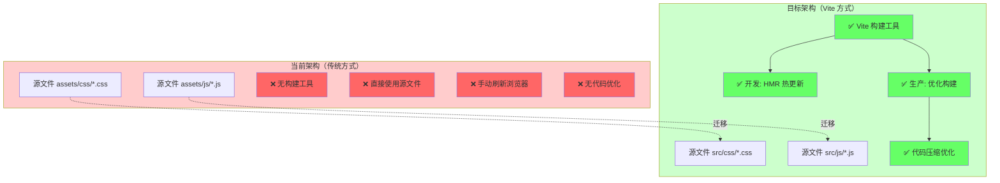

---

## 构建流程图

### 完整构建生命周期

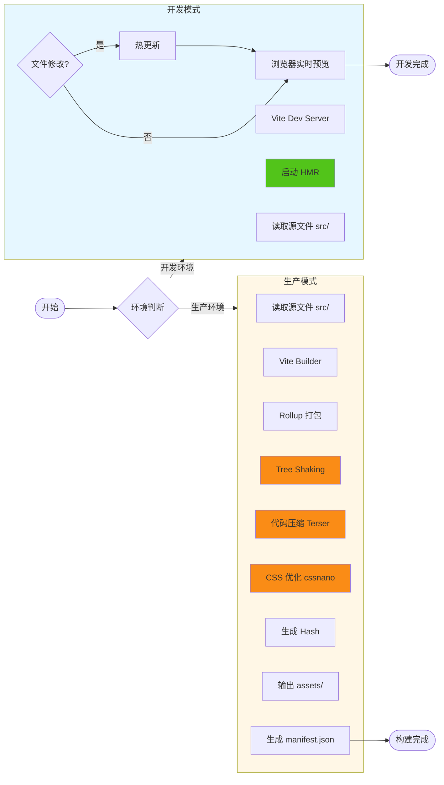

---

## 数据流向图

### 开发环境数据流

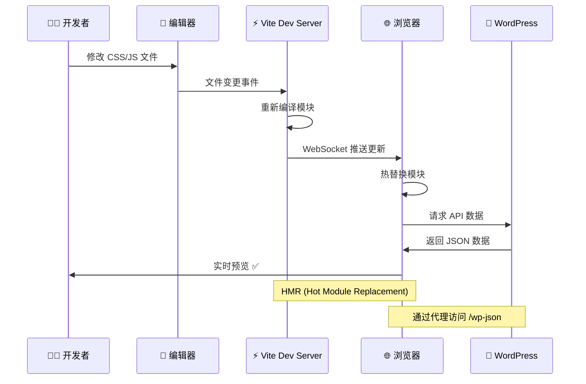

### 生产环境数据流

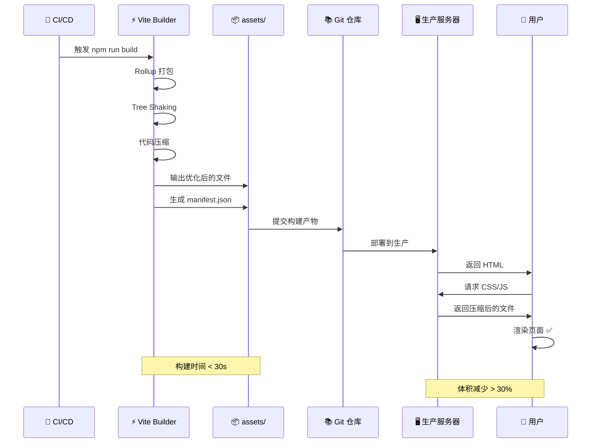

---

## 目录结构图

### 完整项目结构

```mermaid
graph TB
    Root[wordpress-cyber-theme/]

    Root --> Src[src/]
    Root --> Assets[assets/]
    Root --> Public[public/]
    Root --> Config[配置文件]
    Root --> WP[WordPress 模板]

    Src --> SrcCss[src/css/]
    Src --> SrcJs[src/js/]
    Src --> SrcModules[src/js/modules/]
    Src --> SrcAssets[src/assets/]

    SrcCss --> CssAdmin[admin.css]
    SrcCss --> CssMain[main-styles.css]
    SrcCss --> CssWidget[widget-styles.css]
    SrcCss --> CssComponents[components/]

    SrcJs --> JsMain[main.js]
    SrcJs --> JsWidgets[widgets.js]
    SrcJs --> JsAjax[ajax.js]
    SrcModules --> ModuleMobile[mobile-menu.js]
    SrcModules --> ModuleLazy[lazy-load.js]
    SrcModules --> ModuleUtils[utils.js]

    SrcAssets --> SrcImages[images/]
    SrcAssets --> SrcFonts[fonts/]

    Assets --> AssetsCss[css/]
    Assets --> AssetsJs[js/]
    Assets --> AssetsManifest[manifest.json]

    Config --> PkgJson[package.json]
    Config --> ViteConfig[vite.config.js]
    Config --> PostcssConfig[postcss.config.js]
    Config --> Eslint[.eslintrc.js]
    Config --> Prettier[.prettierrc.js]
    Config --> GitIgnore[.gitignore]

    WP --> Header[header.php]
    WP --> Footer[footer.php]
    WP --> Functions[functions.php]

    style Src fill:#e6f7ff
    style Assets fill:#fff7e6
    style Config fill:#f6ffed
    style WP fill:#fff0f6
```

---

## 部署架构图

### WordPress 集成架构

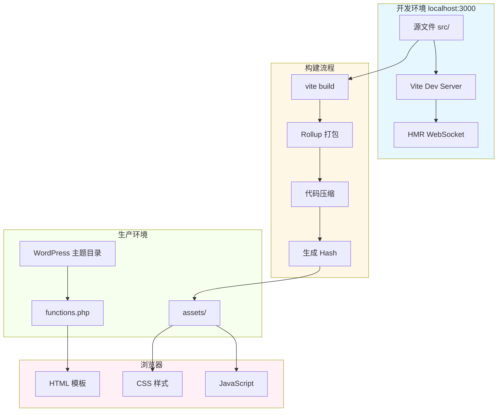

---

## 开发环境架构

### Vite Dev Server 架构

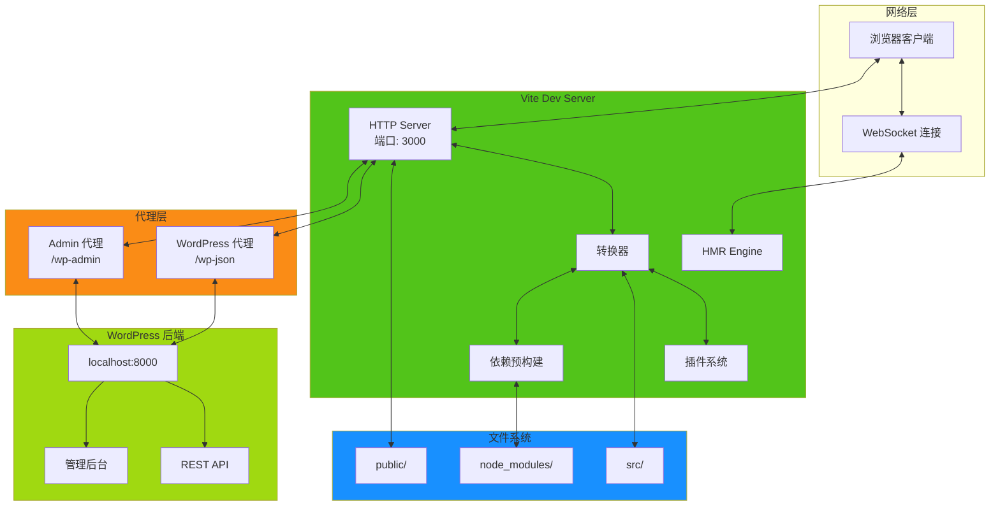

---

## 生产环境架构

### 优化构建架构

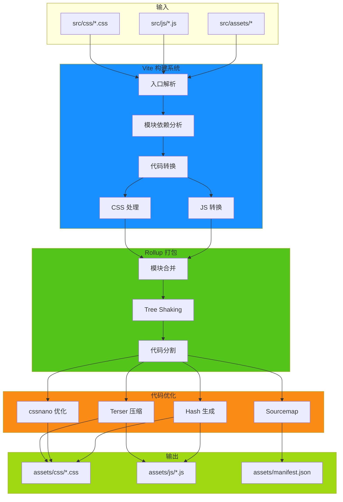

---

## 性能监控架构

### 性能指标追踪

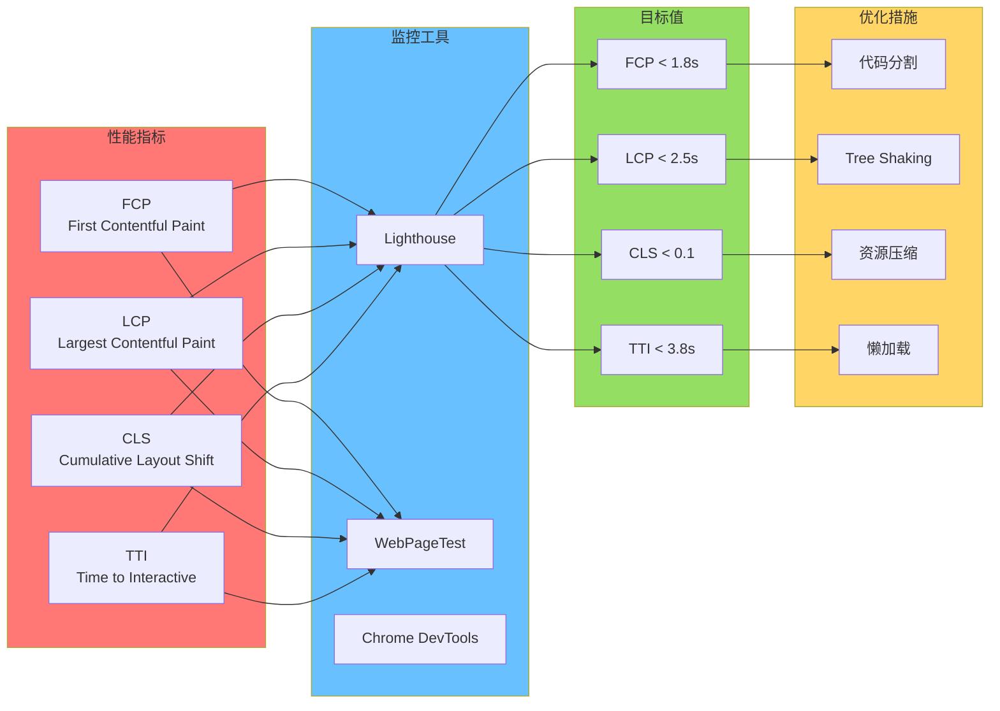

---

## 技术栈对比

### 构建工具特性对比

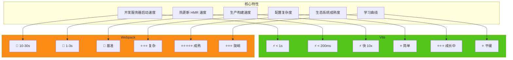

---

## 文件依赖关系图

### 模块依赖关系

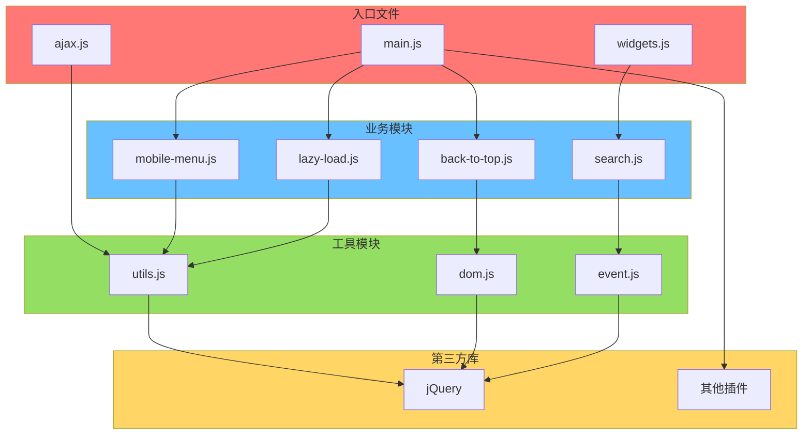

---

## 部署流程图

### CI/CD 自动化部署

```mermaid
graph LR
    subgraph Git["Git 仓库"]
        G1[Push 代码]
        G2[Pull Request]
    end

    subgraph CI["CI/CD 平台"]
        C1[GitHub Actions<br/>GitLab CI<br/>Jenkins]
    end

    subgraph Build["构建流程"]
        B1[安装依赖 npm ci]
        B2[运行测试 npm test]
        B3[代码检查 npm run lint]
        B4[生产构建 npm run build]
        B5[构建产物 assets/]
    end

    subgraph Deploy["部署"]
        D1[SSH 连接服务器]
        D2[备份旧版本]
        D3[上传新文件]
        D4[清除缓存]
        D5[重启服务]
    end

    subgraph Notify["通知"]
        N1[Slack 通知]
        N2[Email 通知]
    end

    G1 --> C1
    G2 --> C1
    C1 --> B1
    B1 --> B2
    B2 --> B3
    B3 --> B4
    B4 --> B5
    B5 --> D1
    D1 --> D2
    D2 --> D3
    D3 --> D4
    D4 --> D5
    D5 --> N1
    D5 --> N2

    style CI fill:#1890ff
    style Build fill:#52c41a
    style Deploy fill:#fa8c16
    style Notify fill:#a0d911
```

---

## 开发工作流图

### 日常开发流程

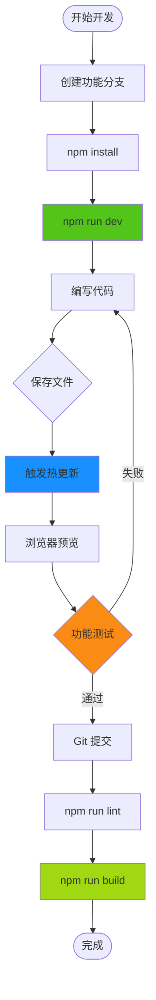

---

## 📊 性能对比图

### 构建时间对比

```
┌─────────────────────────────────────────────────────────┐
│                    开发服务器启动时间                      │
├─────────────────────────────────────────────────────────┤
│                                                         │
│  Webpack:  ████████████████████████████ 15-30s         │
│                                                         │
│  Vite:     ██ 0.5-1s                                    │
│                                                         │
│  提升:     ⚡ 15-30x 更快                                │
│                                                         │
└─────────────────────────────────────────────────────────┘

┌─────────────────────────────────────────────────────────┐
│                    热更新 (HMR) 响应时间                    │
├─────────────────────────────────────────────────────────┤
│                                                         │
│  Webpack:  ███████████ 1-3s                             │
│                                                         │
│  Vite:     █ 50-200ms                                   │
│                                                         │
│  提升:     ⚡ 5-10x 更快                                 │
│                                                         │
└─────────────────────────────────────────────────────────┘

┌─────────────────────────────────────────────────────────┐
│                    生产构建时间                           │
├─────────────────────────────────────────────────────────┤
│                                                         │
│  Webpack:  ███████████████ 30-60s                       │
│                                                         │
│  Vite:     █████ 10-20s                                 │
│                                                         │
│  提升:     ⚡ 2-3x 更快                                  │
│                                                         │
└─────────────────────────────────────────────────────────┘
```

---

## 🎯 关键指标监控

### 构建产物对比

```yaml
优化前 (无构建工具):
  main.js:     633 行, ~18KB
  widgets.js:  412 行, ~12KB
  ajax.js:     817 行, ~24KB
  总计:        1,862 行, ~54KB

优化后 (Vite 生产构建):
  main.js:     ~400 行, ~11KB (-39%)
  widgets.js:  ~250 行, ~7KB  (-42%)
  ajax.js:     ~500 行, ~14KB (-39%)
  总计:        ~1,150 行, ~32KB (-41%)

CSS 优化:
  main-styles.css:    995 行, ~28KB
  widget-styles.css:  527 行, ~15KB
  admin.css:          339 行, ~10KB
  总计:               1,861 行, ~53KB

优化后:
  main-styles.css:    ~650 行, ~18KB (-36%)
  widget-styles.css:  ~350 行, ~10KB (-33%)
  admin.css:          ~220 行, ~6KB  (-35%)
  总计:               ~1,220 行, ~34KB (-35%)
```

---

## 📞 总结

本架构设计文档提供了完整的 Vite 构建系统可视化设计，包括：

- ✅ **总体架构对比**: 清晰展示当前 vs 目标架构
- ✅ **构建流程图**: 完整的开发/生产构建流程
- ✅ **数据流向图**: 从源代码到用户浏览器的完整路径
- ✅ **目录结构图**: 规范的项目文件组织
- ✅ **部署架构图**: WordPress 集成方式
- ✅ **性能监控**: 指标追踪和优化措施

**下一步**: 开始实施 `VITE_BUILD_TASK_BREAKDOWN.md` 中的任务清单。

---

**架构师**: Claude Sonnet 4.6
**文档版本**: 1.0.0
**最后更新**: 2026-03-01
