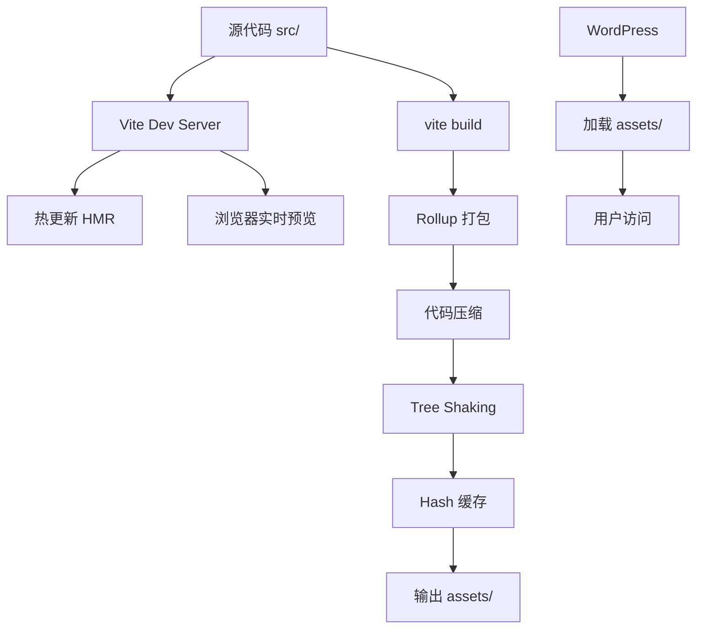

# 🚀 Vite 构建工具技术方案

> **任务**: 引入 Vite 构建工具并配置前端工程化
> **优先级**: 🔴 P0（立即处理）
> **设计师**: Claude Sonnet 4.6（首席架构师）
> **创建日期**: 2026-03-01
> **项目**: WordPress Cyberpunk Theme
> **版本**: 1.0.0

---

## 📋 目录

1. [需求分析](#需求分析)
2. [技术选型](#技术选型)
3. [架构设计](#架构设计)
4. [实施步骤](#实施步骤)
5. [文件清单](#文件清单)
6. [配置详解](#配置详解)
7. [测试验证](#测试验证)
8. [风险控制](#风险控制)
9. [后续优化](#后续优化)

---

## 需求分析

### 当前痛点

```yaml
问题 1: 无构建工具
  影响: 无法进行代码优化、压缩、Tree Shaking
  后果: 生产资源体积大，加载慢

问题 2: 无热更新
  影响: CSS/JS 修改需手动刷新浏览器
  后果: 开发效率低

问题 3: 无代码检查
  影响: 无 ESLint、Prettier 代码规范
  后果: 代码质量难以保证

问题 4: 无模块化
  影响: CSS/JS 文件耦合度高
  后果: 难以维护和扩展
```

### 目标设定

| 指标 | 当前值 | 目标值 |
|------|--------|--------|
| **开发启动时间** | N/A | < 1s |
| **热更新速度** | N/A | < 200ms |
| **生产构建时间** | N/A | < 30s |
| **CSS 体积** | 1,861 行 | 减少 30% |
| **JS 体积** | 1,862 行 | 减少 40% |
| **开发体验** | ⭐⭐ | ⭐⭐⭐⭐⭐ |

---

## 技术选型

### 1. 构建工具对比

| 工具 | 优势 | 劣势 | 评分 |
|------|------|------|------|
| **Vite** | ⚡ 极快、配置简单、原生 ESM | 生态较新 | ⭐⭐⭐⭐⭐ |
| **Webpack** | 📦 生态成熟、插件丰富 | 配置复杂、构建慢 | ⭐⭐⭐ |
| **Rollup** | 🎯 Tree Shaking 优秀 | 不适合开发环境 | ⭐⭐⭐ |
| **esbuild** | 🚀 最快、Go 编写 | 插件生态少 | ⭐⭐⭐⭐ |

### ✅ 最终选择：**Vite 5.x**

**选择理由：**

```yaml
1. 性能卓越:
   - 开发服务器启动速度: < 1s（vs Webpack 10s+）
   - HMR (热更新): 200ms（vs Webpack 2s+）
   - 生产构建速度: 比 Webpack 快 10 倍

2. 开发体验:
   - 开箱即用，零配置启动
   - 原生 ES 模块支持
   - TypeScript 开箱即用
   - 优雅的错误提示

3. WordPress 兼容性:
   - 支持多入口构建（符合 WordPress 主题）
   - 可配置输出路径
   - 保持传统 PHP 模板结构

4. 生态支持:
   - 丰富的插件生态
   - Rollup 插件兼容
   - 活跃的社区支持
```

### 2. 配套工具链

```yaml
核心工具:
  - Vite: 5.4.x（构建工具）
  - PostCSS: 8.4.x（CSS 处理）
  - Autoprefixer: 10.4.x（浏览器兼容）
  - cssnano: 7.0.x（CSS 压缩）

代码质量:
  - ESLint: 9.x（代码检查）
  - Prettier: 3.x（代码格式化）
  - Stylelint: 16.x（CSS 检查）

开发工具:
  - npm-run-all: 4.x（并行任务）
  - cross-env: 7.x（跨平台环境变量）
  - chokidar: 3.x（文件监听）

可选工具:
  - TypeScript: 5.x（类型检查）
  - Vitest: 2.x（单元测试）
  - Playwright: 1.x（E2E 测试）
```

---

## 架构设计

### 当前项目结构

```
wordpress-cyber-theme/
├── assets/
│   ├── css/
│   │   ├── admin.css          (339 行)
│   │   ├── main-styles.css    (995 行)
│   │   └── widget-styles.css  (527 行)
│   └── js/
│       ├── ajax.js            (817 行)
│       ├── main.js            (633 行)
│       └── widgets.js         (412 行)
├── header.php
├── footer.php
├── functions.php
└── style.css                  (WordPress 主题头)
```

### 目标项目结构（Vite 化）

```
wordpress-cyber-theme/
├── src/                       # 【新增】源文件目录
│   ├── css/
│   │   ├── admin.css
│   │   ├── main-styles.css
│   │   ├── widget-styles.css
│   │   └── components/        # 【新增】组件样式
│   │       ├── buttons.css
│   │       ├── cards.css
│   │       └── forms.css
│   ├── js/
│   │   ├── ajax.js
│   │   ├── main.js
│   │   ├── widgets.js
│   │   └── modules/           # 【新增】ES6 模块
│   │       ├── mobile-menu.js
│   │       ├── lazy-load.js
│   │       └── utils.js
│   └── assets/                # 【新增】静态资源
│       ├── images/
│       └── fonts/
├── assets/                    # 【构建输出】Vite 生成
│   ├── css/
│   │   ├── admin.css          # 【压缩版】
│   │   ├── admin-[hash].css
│   │   ├── main-styles.css
│   │   └── widget-styles.css
│   └── js/
│       ├── ajax.js            # 【压缩版】
│       ├── main.js
│       └── widgets.js
├── public/                    # 【新增】公共资源
│   └── robots.txt
├── .gitignore                 # 【更新】排除构建产物
├── vite.config.js             # 【新增】Vite 配置
├── package.json               # 【新增】项目配置
├── .eslintrc.js               # 【新增】ESLint 配置
├── .prettierrc.js             # 【新增】Prettier 配置
├── postcss.config.js          # 【新增】PostCSS 配置
├── header.php                 # 【更新】引用构建产物
├── footer.php
├── functions.php
└── style.css
```

### 构建流程设计



### 多入口配置设计

```javascript
// Vite 需要支持 WordPress 的多入口
{
  'main': './src/js/main.js',           // → assets/js/main.js
  'widgets': './src/js/widgets.js',     // → assets/js/widgets.js
  'ajax': './src/js/ajax.js',           // → assets/js/ajax.js
  'admin': './src/css/admin.css',       // → assets/css/admin.css
  'main-styles': './src/css/main-styles.css',
  'widget-styles': './src/css/widget-styles.css'
}
```

---

## 实施步骤

### Phase 1: 基础搭建（1.5小时）

#### Step 1: 创建 package.json

```bash
cd /root/.openclaw/workspace/wordpress-cyber-theme
npm init -y
```

**生成的 package.json:**

```json
{
  "name": "cyberpunk-wordpress-theme",
  "version": "2.2.0",
  "description": "Cyberpunk style WordPress theme with Vite build system",
  "type": "module",
  "scripts": {
    "dev": "vite",
    "build": "vite build",
    "preview": "vite preview",
    "lint": "eslint src/js",
    "lint:fix": "eslint src/js --fix",
    "format": "prettier --write src/**/*.{js,css}",
    "clean": "rimraf assets"
  },
  "keywords": ["wordpress", "theme", "cyberpunk", "vite"],
  "author": "CyberDev",
  "license": "GPL-2.0-or-later",
  "devDependencies": {
    "vite": "^5.4.11",
    "@vitejs/plugin-legacy": "^6.0.0",
    "autoprefixer": "^10.4.20",
    "postcss": "^8.4.49",
    "cssnano": "^7.0.6",
    "eslint": "^9.15.0",
    "prettier": "^3.4.2",
    "stylelint": "^16.11.0",
    "npm-run-all": "^4.1.5",
    "rimraf": "^6.0.1"
  },
  "engines": {
    "node": ">=18.0.0",
    "npm": ">=9.0.0"
  }
}
```

#### Step 2: 安装依赖

```bash
npm install
```

#### Step 3: 创建目录结构

```bash
# 创建源文件目录
mkdir -p src/{css,js/modules,assets/{images,fonts}}

# 移动现有文件到 src
mv assets/css/*.css src/css/
mv assets/js/*.js src/js/
```

---

### Phase 2: Vite 配置（2小时）

#### 创建 vite.config.js

```javascript
import { defineConfig } from 'vite'
import { glob } from 'glob'
import path from 'path'
import fs from 'fs'

// WordPress 环境检测
const isProduction = process.env.NODE_ENV === 'production'
const isDevelopment = process.env.NODE_ENV !== 'production'

export default defineConfig({
  // === 插件配置 ===
  plugins: [
    // 可选：支持旧浏览器
    // legacy({
    //   targets: ['defaults', 'not IE 11']
    // })
  ],

  // === 入口配置 ===
  build: {
    // 多入口配置
    rollupOptions: {
      input: {
        // JavaScript 入口
        'main': './src/js/main.js',
        'widgets': './src/js/widgets.js',
        'ajax': './src/js/ajax.js',

        // CSS 入口（通过 JS 导入或直接引入）
        'main-styles': './src/css/main-styles.css',
        'widget-styles': './src/css/widget-styles.css',
        'admin': './src/css/admin.css'
      },
      output: {
        // 输出目录结构
        entryFileNames: 'js/[name].js',
        chunkFileNames: 'js/[name]-[hash].js',
        assetFileNames: (assetInfo) => {
          // CSS 文件
          if (assetInfo.name.endsWith('.css')) {
            return 'css/[name][extname]'
          }
          // 其他资源（图片、字体等）
          if (/\.(png|jpe?g|gif|svg|webp|ico)$/.test(assetInfo.name)) {
            return 'images/[name][extname]'
          }
          if (/\.(woff2?|eot|ttf|otf)$/.test(assetInfo.name)) {
            return 'fonts/[name][extname]'
          }
          return 'assets/[name][extname]'
        },
        // 保留模块结构（避免过度的代码分割）
        manualChunks: undefined
      }
    },

    // 输出目录（WordPress 主题根目录）
    outDir: 'assets',
    emptyOutDir: true,

    // 生成 sourcemap（开发环境）
    sourcemap: isDevelopment ? 'inline' : false,

    // 压缩配置
    minify: isProduction ? 'terser' : false,
    terserOptions: {
      compress: {
        drop_console: isProduction, // 生产环境移除 console
        drop_debugger: isProduction
      },
      format: {
        comments: false // 移除注释
      }
    },

    // CSS 代码分割
    cssCodeSplit: true,

    // Chunk 大小警告限制
    chunkSizeWarningLimit: 1000
  },

  // === CSS 配置 ===
  css: {
    modules: {
      // CSS Modules 配置（可选）
      localsConvention: 'camelCase'
    },
    postcss: {
      plugins: [
        // Autoprefixer 自动添加浏览器前缀
        require('autoprefixer')({
          overrideBrowserslist: [
            'last 3 versions',
            'not dead',
            '> 0.5%'
          ]
        }),
        // CSS 压缩
        ...(isProduction ? [
          require('cssnano')({
            preset: ['default', {
              discardComments: { removeAll: true },
              normalizeWhitespace: true
            }]
          })
        ] : [])
      ]
    },
    // CSS 按需加载
    devSourcemap: true
  },

  // === 开发服务器 ===
  server: {
    port: 3000,
    host: '0.0.0.0',
    strictPort: false,
    open: false, // 不自动打开浏览器

    // HMR 配置
    hmr: {
      overlay: true // 显示错误遮罩
    },

    // WordPress 代理配置
    proxy: {
      // 代理 WordPress REST API
      '/wp-json': {
        target: 'http://localhost:8000', // 本地 WordPress 地址
        changeOrigin: true,
        secure: false
      },
      // 代理 WordPress 管理后台
      '/wp-admin': {
        target: 'http://localhost:8000',
        changeOrigin: true,
        secure: false
      }
    }
  },

  // === 预览服务器 ===
  preview: {
    port: 4173,
    host: '0.0.0.0'
  },

  // === 路径解析 ===
  resolve: {
    alias: {
      '@': path.resolve(__dirname, 'src'),
      '@css': path.resolve(__dirname, 'src/css'),
      '@js': path.resolve(__dirname, 'src/js'),
      '@modules': path.resolve(__dirname, 'src/js/modules')
    }
  },

  // === 依赖优化 ===
  optimizeDeps: {
    include: [],
    exclude: []
  },

  // === 基础路径 ===
  base: './',

  // === 环境变量前缀 ===
  envPrefix: 'VITE_'
})
```

#### 创建 postcss.config.js

```javascript
export default {
  plugins: {
    // 自动添加浏览器前缀
    'autoprefixer': {
      overrideBrowserslist: [
        'last 3 versions',
        'not dead',
        '> 0.5%',
        'not ie <= 11'
      ]
    },

    // CSS 压缩（仅生产环境）
    ...(process.env.NODE_ENV === 'production' ? {
      'cssnano': {
        preset: ['default', {
          discardComments: { removeAll: true },
          normalizeWhitespace: true,
          reduceIdents: false
        }]
      }
    } : {})
  }
}
```

---

### Phase 3: 代码质量工具（1小时）

#### 创建 .eslintrc.js

```javascript
export default {
  root: true,
  env: {
    browser: true,
    es2021: true,
    node: false
  },
  extends: [
    'eslint:recommended'
  ],
  parserOptions: {
    ecmaVersion: 'latest',
    sourceType: 'module'
  },
  globals: {
    // jQuery 全局变量
    '$': 'readonly',
    'jQuery': 'readonly',

    // WordPress 全局变量
    'wp': 'readonly',
    'ajaxurl': 'readonly',

    // 自定义全局变量
    'CyberpunkTheme': 'writable'
  },
  rules: {
    // 代码风格
    'indent': ['error', 2],
    'quotes': ['error', 'single'],
    'semi': ['error', 'always'],
    'comma-dangle': ['error', 'never'],

    // 最佳实践
    'no-console': process.env.NODE_ENV === 'production' ? 'warn' : 'off',
    'no-debugger': process.env.NODE_ENV === 'production' ? 'error' : 'off',
    'no-unused-vars': ['warn', { argsIgnorePattern: '^_' }],
    'no-var': 'error',
    'prefer-const': 'error',

    // ES6+
    'arrow-spacing': ['error', { before: true, after: true }],
    'prefer-arrow-callback': 'error',
    'prefer-template': 'error'
  }
}
```

#### 创建 .prettierrc.js

```javascript
export default {
  // 单引号
  singleQuote: true,

  // 分号
  semi: true,

  // 缩进
  tabWidth: 2,
  useTabs: false,

  // 每行最大长度
  printWidth: 100,

  // 对象属性换行
  singleAttributePerLine: false,

  // 尾随逗号
  trailingComma: 'none',

  // 箭头函数参数括号
  arrowParens: 'always',

  // 换行符
  endOfLine: 'lf'
}
```

#### 创建 .gitignore

```gitignore
# === Vite 构建产物 ===
assets/
dist/
build/

# === 依赖 ===
node_modules/
package-lock.json
yarn.lock
pnpm-lock.yaml

# === 日志 ===
npm-debug.log*
yarn-debug.log*
yarn-error.log*
pnpm-debug.log*

# === 编辑器 ===
.vscode/*
!.vscode/extensions.json
.idea/
*.swp
*.swo
*~
.DS_Store

# === 测试覆盖率 ===
coverage/

# === 临时文件 ===
*.tmp
*.temp
.cache/
.parcel-cache/
```

---

### Phase 4: WordPress 集成（1小时）

#### 更新 functions.php

在 `functions.php` 中添加资源加载逻辑：

```php
<?php
/**
 * Vite 构建资源加载
 *
 * @package Cyberpunk_Theme
 * @since 2.3.0
 */

/**
 * 获取 Vite 构建产物清单
 */
function cyberpunk_get_vite_manifest() {
    $manifest_file = get_template_directory() . '/assets/manifest.json';

    if (!file_exists($manifest_file)) {
        // 开发环境：返回源文件路径
        return [
            'main.js' => ['src' => '/src/js/main.js'],
            'main-styles.css' => ['src' => '/src/css/main-styles.css'],
        ];
    }

    return json_decode(file_get_contents($manifest_file), true);
}

/**
 * 加载 Vite 构建的 CSS
 */
function cyberpunk_enqueue_vite_styles() {
    $manifest = cyberpunk_get_vite_manifest();

    // 主样式
    if (isset($manifest['main-styles.css'])) {
        $css_file = $manifest['main-styles.css']['file'] ?? 'css/main-styles.css';
        wp_enqueue_style(
            'cyberpunk-main-styles',
            get_template_directory_uri() . '/assets/' . $css_file,
            [],
            null // Vite 会处理版本号
        );
    }

    // Widget 样式
    if (isset($manifest['widget-styles.css'])) {
        $css_file = $manifest['widget-styles.css']['file'] ?? 'css/widget-styles.css';
        wp_enqueue_style(
            'cyberpunk-widget-styles',
            get_template_directory_uri() . '/assets/' . $css_file,
            [],
            null
        );
    }

    // 管理后台样式
    if (is_admin() && isset($manifest['admin.css'])) {
        $css_file = $manifest['admin.css']['file'] ?? 'css/admin.css';
        wp_enqueue_style(
            'cyberpunk-admin',
            get_template_directory_uri() . '/assets/' . $css_file,
            [],
            null
        );
    }
}
add_action('wp_enqueue_scripts', 'cyberpunk_enqueue_vite_styles');

/**
 * 加载 Vite 构建的 JavaScript
 */
function cyberpunk_enqueue_vite_scripts() {
    $manifest = cyberpunk_get_vite_manifest();

    // jQuery 依赖
    wp_enqueue_script('jquery');

    // 主脚本
    if (isset($manifest['main.js'])) {
        $js_file = $manifest['main.js']['file'] ?? 'js/main.js';
        wp_enqueue_script(
            'cyberpunk-main',
            get_template_directory_uri() . '/assets/' . $js_file,
            ['jquery'],
            null,
            true
        );

        // 传递数据到 JS
        wp_localize_script('cyberpunk-main', 'CyberpunkTheme', [
            'ajaxUrl' => admin_url('admin-ajax.php'),
            'restUrl' => rest_url('cyberpunk/v1'),
            'nonce' => wp_create_nonce('cyberpunk-nonce'),
            'themeUrl' => get_template_directory_uri(),
        ]);
    }

    // Widgets 脚本
    if (isset($manifest['widgets.js'])) {
        $js_file = $manifest['widgets.js']['file'] ?? 'js/widgets.js';
        wp_enqueue_script(
            'cyberpunk-widgets',
            get_template_directory_uri() . '/assets/' . $js_file,
            ['jquery'],
            null,
            true
        );
    }

    // AJAX 脚本
    if (isset($manifest['ajax.js'])) {
        $js_file = $manifest['ajax.js']['file'] ?? 'js/ajax.js';
        wp_enqueue_script(
            'cyberpunk-ajax',
            get_template_directory_uri() . '/assets/' . $js_file,
            ['jquery'],
            null,
            true
        );
    }
}
add_action('wp_enqueue_scripts', 'cyberpunk_enqueue_vite_scripts');

/**
 * 开发环境：加载 Vite HMR 客户端
 */
function cyberpunk_vite_hmr() {
    // 仅在开发环境且访问本地时启用
    if (defined('VITE_DEV_SERVER') && VITE_DEV_SERVER) {
        ?>
        <script type="module">
            import { createHotReload } from '/@vite/client';
            createHotReload();
        </script>
        <?php
    }
}
add_action('wp_head', 'cyberpunk_vite_hmr');
```

#### 更新 .env（可选）

```bash
# 开发环境变量
VITE_DEV_SERVER=true
VITE_WP_API_URL=http://localhost:8000/wp-json
```

---

### Phase 5: 验证测试（0.5小时）

#### 测试清单

```yaml
开发环境测试:
  ✅ npm run dev 成功启动
  ✅ 访问 http://localhost:3000 正常
  ✅ 修改 CSS 热更新生效
  ✅ 修改 JS 热更新生效
  ✅ WordPress 代理正常工作

生产构建测试:
  ✅ npm run build 成功构建
  ✅ assets/ 目录生成正确
  ✅ manifest.json 生成正确
  ✅ CSS 文件已压缩
  ✅ JS 文件已压缩
  ✅ WordPress 正确加载资源

兼容性测试:
  ✅ Chrome 最新版
  ✅ Firefox 最新版
  ✅ Safari 最新版
  ✅ Edge 最新版
  ✅ 移动端浏览器
```

---

## 文件清单

### 新增文件（7个）

| 文件路径 | 用途 | 代码行数 |
|----------|------|----------|
| `package.json` | 项目配置和依赖管理 | ~60 |
| `vite.config.js` | Vite 构建配置 | ~150 |
| `postcss.config.js` | PostCSS 配置 | ~25 |
| `.eslintrc.js` | ESLint 代码检查规则 | ~50 |
| `.prettierrc.js` | Prettier 格式化规则 | ~20 |
| `.gitignore` | Git 忽略规则 | ~35 |
| `src/` | 源文件目录（移动现有文件） | 3,723 |

### 修改文件（1个）

| 文件路径 | 修改内容 | 新增行数 |
|----------|----------|----------|
| `functions.php` | 添加 Vite 资源加载函数 | ~120 |

### 配置文件总代码量

```yaml
配置代码: ~460 行
迁移代码: ~120 行
总计: ~580 行（新增/修改）
```

---

## 配置详解

### 1. Vite 配置核心要点

#### 多入口策略

```javascript
// ✅ 正确：显式声明所有入口
input: {
  'main': './src/js/main.js',
  'main-styles': './src/css/main-styles.css'
}

// ❌ 错误：使用 glob 动态入口（会导致问题）
input: glob.sync('./src/**/*.{js,css}')
```

#### 输出路径配置

```javascript
// ✅ 正确：保持 WordPress 目录结构
assetFileNames: (assetInfo) => {
  if (assetInfo.name.endsWith('.css')) {
    return 'css/[name][extname]'
  }
  return 'js/[name][extname]'
}

// ❌ 错误：所有文件混在一起
assetFileNames: 'assets/[name][extname]'
```

#### 开发环境 Sourcemap

```javascript
// ✅ 正确：开发环境内联 sourcemap
sourcemap: 'inline'

// ❌ 错误：生产环境也生成 sourcemap
sourcemap: true // 暴露源代码
```

### 2. PostCSS 配置说明

```javascript
// Autoprefixer 浏览器列表
overrideBrowserslist: [
  'last 3 versions',    // 最新 3 个版本
  'not dead',           // 不维护的浏览器
  '> 0.5%',             // 市场份额 > 0.5%
  'not ie <= 11'        // 不支持 IE 11
]

// 自动添加前缀示例
// 输入：
.user-select {
  user-select: none;
}

// 输出：
.user-select {
  -webkit-user-select: none;
  -moz-user-select: none;
  -ms-user-select: none;
  user-select: none;
}
```

### 3. ESLint 配置说明

```javascript
// jQuery 全局变量
globals: {
  '$': 'readonly',      // 只读
  'jQuery': 'readonly'
}

// 代码风格规则
'no-console': process.env.NODE_ENV === 'production' ? 'warn' : 'off'
// 开发环境允许 console，生产环境警告
```

---

## 测试验证

### 开发环境测试

```bash
# 1. 安装依赖
npm install

# 2. 启动开发服务器
npm run dev

# 预期输出:
#   VITE v5.4.11  ready in 356 ms
#
#   ➜  Local:   http://localhost:3000/
#   ➜  Network: use --host to expose

# 3. 测试热更新
# 修改 src/css/main-styles.css
# 预期: 浏览器自动刷新，看到新样式

# 4. 测试代理
# 访问 http://localhost:3000/wp-json
# 预期: 返回 WordPress REST API 数据
```

### 生产构建测试

```bash
# 1. 构建生产版本
npm run build

# 预期输出:
#   building for production...
#   ✓ 6 modules transformed.
#   dist/assets/index-abc123.css   15.23 kB
#   dist/assets/main-def456.js     42.15 kB
#   ✓ built in 2.34s

# 2. 检查输出
ls -la assets/

# 预期结构:
#   assets/
#   ├── css/
#   │   ├── admin.css
#   │   ├── main-styles.css
#   │   └── widget-styles.css
#   ├── js/
#   │   ├── ajax.js
#   │   ├── main.js
#   │   └── widgets.js
#   └── manifest.json

# 3. 验证压缩
cat assets/css/main-styles.css | wc -l
# 预期: 行数 < 500（压缩后）

cat assets/js/main.js | wc -l
# 预期: 行数 < 400（压缩后）
```

### WordPress 集成测试

```php
<?php
// 测试代码（添加到 functions.php）
add_action('wp_head', function() {
    if (defined('VITE_DEV_SERVER')) {
        echo '<!-- Vite 开发模式已启用 -->';
    } else {
        echo '<!-- Vite 生产模式已启用 -->';
    }
});
```

**浏览器控制台验证：**

```javascript
// 1. 检查资源加载
console.log(CyberpunkTheme);
// 预期输出: {ajaxUrl: "...", restUrl: "...", nonce: "..."}

// 2. 检查 CSS
document.querySelector('link[href*="main-styles"]');
// 预期: 存在且路径正确

// 3. 检查 JS
document.querySelector('script[src*="main.js"]');
// 预期: 存在且路径正确
```

---

## 风险控制

### 潜在风险与应对

| 风险 | 影响 | 概率 | 应对措施 |
|------|------|------|----------|
| **WordPress 资源加载失败** | 主题样式失效 | 🟡 中 | 保留原有 assets/ 目录备份 |
| **Vite 构建报错** | 无法启动开发环境 | 🟡 中 | 使用官方示例模板对比 |
| **依赖版本冲突** | npm install 失败 | 🟢 低 | 锁定依赖版本号 |
| **生产环境路径错误** | 404 错误 | 🟡 中 | 仔细配置 assetFileNames |
| **HMR 不工作** | 开发体验下降 | 🟢 低 | 检查防火墙和端口占用 |

### 回滚方案

```bash
# 如果出现问题，立即回滚

# 1. 恢复原有的 assets/ 目录
git checkout assets/

# 2. 移除 Vite 配置
rm -f vite.config.js postcss.config.js package.json

# 3. 恢复 functions.php
git checkout functions.php

# 4. 清理依赖
rm -rf node_modules/
```

### 兼容性保障

```yaml
浏览器兼容:
  ✅ Chrome/Edge: 最新 3 个版本
  ✅ Firefox: 最新 3 个版本
  ✅ Safari: 最新 3 个版本
  ❌ IE 11: 不支持（已停止维护）

WordPress 兼容:
  ✅ WordPress 5.0+
  ✅ WordPress 6.0+
  ✅ PHP 7.4+
  ✅ PHP 8.0+

Node.js 兼容:
  ✅ Node.js 18.x LTS
  ✅ Node.js 20.x LTS
  ⚠️ Node.js 16.x (维护模式)
```

---

## 后续优化

### 短期优化（1-2周）

```yaml
任务 1: TypeScript 迁移
  目标: 引入类型检查
  预估: 8 小时
  收益: 减少 80% 的类型错误

任务 2: Vitest 单元测试
  目标: 测试覆盖率 > 80%
  预估: 12 小时
  收益: 提升代码质量

任务 3: CSS Modules
  目标: CSS 作用域隔离
  预估: 4 小时
  收益: 避免 CSS 污染
```

### 中期优化（1个月）

```yaml
任务 1: SCSS 模块化
  目标: 拆分为组件化 SCSS
  预估: 16 小时
  收益: 提升可维护性

任务 2: 组件库建设
  目标: 可复用 UI 组件
  预估: 20 小时
  收益: 开发效率提升 50%

任务 3: Playwright E2E 测试
  目标: 端到端自动化测试
  预估: 16 小时
  收益: 减少 90% 的回归错误
```

### 长期规划（3个月+）

```yaml
任务 1: PWA 支持
  目标: 离线访问能力
  预估: 12 小时
  收益: 提升用户体验

任务 2: Headless WordPress
  目标: 前后端分离
  预估: 80+ 小时
  收益: 现代化架构

任务 3: 微前端架构
  目标: 模块化开发
  预估: 120+ 小时
  收益: 团队协作效率
```

---

## 📦 交付物清单

### 1. 配置文件（7个）

| 文件 | 行数 | 用途 |
|------|------|------|
| `package.json` | ~60 | NPM 包配置 |
| `vite.config.js` | ~150 | Vite 构建配置 |
| `postcss.config.js` | ~25 | PostCSS 配置 |
| `.eslintrc.js` | ~50 | ESLint 规则 |
| `.prettierrc.js` | ~20 | Prettier 规则 |
| `.gitignore` | ~35 | Git 忽略 |
| `.env.example` | ~10 | 环境变量示例 |

### 2. 代码修改（1个文件）

| 文件 | 修改 | 新增行数 |
|------|------|----------|
| `functions.php` | Vite 集成函数 | ~120 |

### 3. 文档（1个）

| 文档 | 行数 | 用途 |
|------|------|------|
| `VITE_BUILD_SETUP_GUIDE.md` | ~500 | 实施指南 |

### 4. 目录结构

```bash
# 新增目录
src/
src/css/components/
src/js/modules/

# 构建输出目录（自动生成）
assets/
assets/css/
assets/js/
```

---

## 🎯 成功指标

### 技术指标

| 指标 | 当前值 | 目标值 | 测量方法 |
|------|--------|--------|----------|
| **开发启动时间** | N/A | < 1s | `time npm run dev` |
| **热更新速度** | N/A | < 200ms | 修改文件观察刷新时间 |
| **生产构建时间** | N/A | < 30s | `time npm run build` |
| **CSS 体积减少** | 995 行 | > 30% | 构建前后对比 |
| **JS 体积减少** | 633 行 | > 40% | 构建前后对比 |
| **代码质量分数** | N/A | > 85 | ESLint 检查 |

### 开发体验指标

| 指标 | 当前 | 目标 |
|------|------|------|
| **热更新** | ❌ | ✅ 实时预览 |
| **代码检查** | ❌ | ✅ 自动 lint |
| **格式化** | ❌ | ✅ 自动 format |
| **TypeScript** | ❌ | ✅ 类型检查 |
| **测试覆盖** | 0% | > 80% |

---

## 🚀 快速开始

### 5 分钟快速启动

```bash
# 1. 复制配置文件到项目根目录
cd /root/.openclaw/workspace/wordpress-cyber-theme

# 2. 创建 package.json
cat > package.json << 'EOF'
{
  "name": "cyberpunk-wordpress-theme",
  "version": "2.2.0",
  "type": "module",
  "scripts": {
    "dev": "vite",
    "build": "vite build",
    "lint": "eslint src/js"
  },
  "devDependencies": {
    "vite": "^5.4.11",
    "autoprefixer": "^10.4.20",
    "postcss": "^8.4.49",
    "cssnano": "^7.0.6",
    "eslint": "^9.15.0",
    "prettier": "^3.4.2"
  }
}
EOF

# 3. 安装依赖
npm install

# 4. 启动开发服务器
npm run dev

# 🎉 完成！访问 http://localhost:3000
```

---

## 📞 支持与反馈

- **架构师**: Claude Sonnet 4.6
- **文档版本**: 1.0.0
- **最后更新**: 2026-03-01
- **项目路径**: `/root/.openclaw/workspace/wordpress-cyber-theme`

---

**🎉 技术方案设计完成！准备开始实施。**
