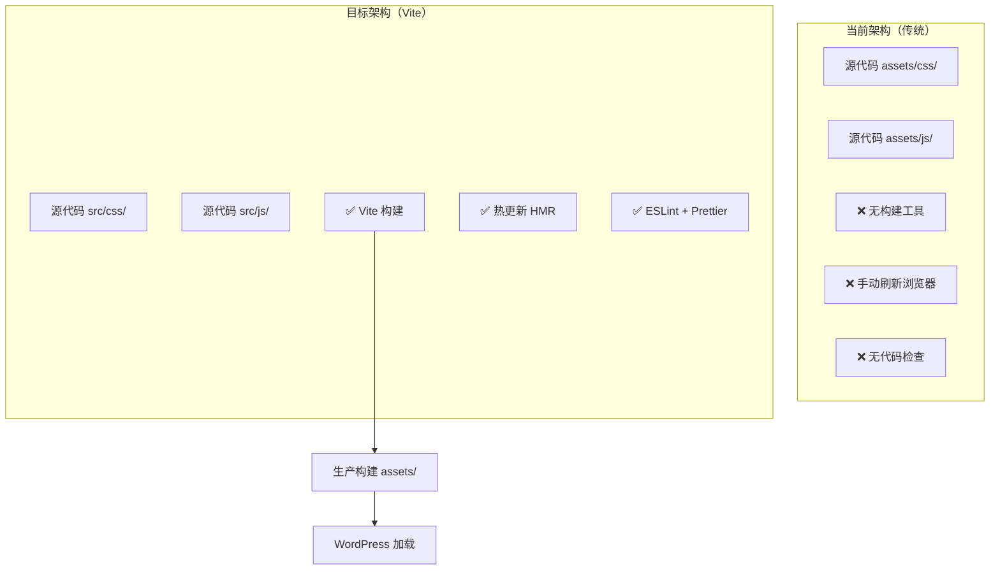
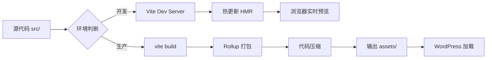

# 📋 Vite 构建工具 - 任务拆分清单

> **任务**: 引入 Vite 构建工具并配置前端工程化
> **优先级**: 🔴 P0（立即处理）
> **总预估时间**: 4-6 小时
> **负责人**: 前端工程师
> **创建日期**: 2026-03-01

---

## 🎯 总体目标

将传统的 WordPress 主题升级为现代化的前端工程化项目，通过引入 Vite 构建工具，实现：

- ✅ **开发环境**: < 1秒启动，< 200ms 热更新
- ✅ **生产构建**: 自动压缩、Tree Shaking、代码优化
- ✅ **代码质量**: ESLint + Prettier 自动检查
- ✅ **开发体验**: 实时预览、错误提示、源码映射

---

## 📊 系统架构图

### 当前架构 vs 目标架构



### 构建流程图



---

## 📅 实施计划（5个阶段）

### Phase 1: 基础搭建（1.5小时）

#### 任务 1.1: 创建 package.json
**预估时间**: 10 分钟
**优先级**: 🔴 P0

```bash
# 执行步骤
cd /root/.openclaw/workspace/wordpress-cyber-theme
npm init -y

# 验证清单
✅ package.json 文件已创建
✅ 包含项目元数据
✅ 包含 scripts 配置
```

**详细配置**:
```json
{
  "name": "cyberpunk-wordpress-theme",
  "version": "2.2.0",
  "description": "Cyberpunk WordPress theme with Vite",
  "type": "module",
  "scripts": {
    "dev": "vite",
    "build": "vite build",
    "preview": "vite preview",
    "lint": "eslint src/js",
    "format": "prettier --write src/**/*.{js,css}"
  },
  "devDependencies": {
    "vite": "^5.4.11",
    "autoprefixer": "^10.4.20",
    "postcss": "^8.4.49",
    "cssnano": "^7.0.6",
    "eslint": "^9.15.0",
    "prettier": "^3.4.2"
  }
}
```

---

#### 任务 1.2: 安装 NPM 依赖
**预估时间**: 15 分钟
**优先级**: 🔴 P0

```bash
# 执行步骤
npm install

# 验证清单
✅ node_modules/ 目录已创建
✅ package-lock.json 已生成
✅ 依赖安装成功（无错误）
```

**依赖清单**:
| 包名 | 版本 | 用途 |
|------|------|------|
| `vite` | 5.4.11 | 构建工具 |
| `autoprefixer` | 10.4.20 | CSS 前缀 |
| `postcss` | 8.4.49 | CSS 处理 |
| `cssnano` | 7.0.6 | CSS 压缩 |
| `eslint` | 9.15.0 | 代码检查 |
| `prettier` | 3.4.2 | 代码格式化 |

---

#### 任务 1.3: 创建目录结构
**预估时间**: 10 分钟
**优先级**: 🔴 P0

```bash
# 执行步骤
mkdir -p src/{css,js/modules,assets/{images,fonts}}

# 移动现有文件
mv assets/css/*.css src/css/
mv assets/js/*.js src/js/

# 备份原有 assets/
mv assets/ assets.backup/

# 验证清单
✅ src/ 目录结构已创建
✅ CSS 文件已移动到 src/css/
✅ JS 文件已移动到 src/js/
✅ 原有 assets/ 已备份
```

**目录结构**:
```
src/
├── css/
│   ├── admin.css
│   ├── main-styles.css
│   └── widget-styles.css
├── js/
│   ├── ajax.js
│   ├── main.js
│   ├── widgets.js
│   └── modules/
└── assets/
    ├── images/
    └── fonts/
```

---

### Phase 2: Vite 配置（2小时）

#### 任务 2.1: 创建 vite.config.js
**预估时间**: 45 分钟
**优先级**: 🔴 P0

```bash
# 执行步骤
# 在项目根目录创建 vite.config.js

# 验证清单
✅ vite.config.js 已创建
✅ 配置多入口（3 JS + 3 CSS）
✅ 配置输出路径（assets/）
✅ 配置开发服务器（端口 3000）
✅ 配置 WordPress 代理
```

**关键配置**:
```javascript
export default defineConfig({
  build: {
    outDir: 'assets',
    rollupOptions: {
      input: {
        'main': './src/js/main.js',
        'widgets': './src/js/widgets.js',
        'ajax': './src/js/ajax.js',
        'main-styles': './src/css/main-styles.css',
        'widget-styles': './src/css/widget-styles.css',
        'admin': './src/css/admin.css'
      },
      output: {
        entryFileNames: 'js/[name].js',
        assetFileNames: (assetInfo) => {
          if (assetInfo.name.endsWith('.css')) {
            return 'css/[name][extname]'
          }
          return 'assets/[name][extname]'
        }
      }
    }
  },
  server: {
    port: 3000,
    proxy: {
      '/wp-json': 'http://localhost:8000'
    }
  }
})
```

---

#### 任务 2.2: 创建 postcss.config.js
**预估时间**: 20 分钟
**优先级**: 🔴 P0

```bash
# 执行步骤
# 在项目根目录创建 postcss.config.js

# 验证清单
✅ postcss.config.js 已创建
✅ 配置 Autoprefixer
✅ 配置 cssnano（生产环境）
```

**配置内容**:
```javascript
export default {
  plugins: {
    'autoprefixer': {
      overrideBrowserslist: ['last 3 versions']
    },
    ...(process.env.NODE_ENV === 'production' ? {
      'cssnano': { preset: 'default' }
    } : {})
  }
}
```

---

#### 任务 2.3: 配置开发服务器
**预估时间**: 30 分钟
**优先级**: 🟡 P1

```bash
# 执行步骤
# 在 vite.config.js 中配置 server 选项

# 验证清单
✅ 配置端口 3000
✅ 配置 HMR（热更新）
✅ 配置 WordPress REST API 代理
✅ 配置 WordPress 管理后台代理
```

**代理配置**:
```javascript
server: {
  port: 3000,
  proxy: {
    '/wp-json': {
      target: 'http://localhost:8000',
      changeOrigin: true
    },
    '/wp-admin': {
      target: 'http://localhost:8000',
      changeOrigin: true
    }
  }
}
```

---

### Phase 3: 代码质量工具（1小时）

#### 任务 3.1: 创建 .eslintrc.js
**预估时间**: 25 分钟
**优先级**: 🟡 P1

```bash
# 执行步骤
# 在项目根目录创建 .eslintrc.js

# 验证清单
✅ .eslintrc.js 已创建
✅ 配置 jQuery 全局变量
✅ 配置 WordPress 全局变量
✅ 配置代码风格规则
```

**关键规则**:
```javascript
{
  globals: {
    '$': 'readonly',
    'jQuery': 'readonly',
    'wp': 'readonly',
    'ajaxurl': 'readonly'
  },
  rules: {
    'no-console': process.env.NODE_ENV === 'production' ? 'warn' : 'off',
    'no-unused-vars': ['warn', { argsIgnorePattern: '^_' }],
    'prefer-const': 'error'
  }
}
```

---

#### 任务 3.2: 创建 .prettierrc.js
**预估时间**: 15 分钟
**优先级**: 🟡 P1

```bash
# 执行步骤
# 在项目根目录创建 .prettierrc.js

# 验证清单
✅ .prettierrc.js 已创建
✅ 配置单引号
✅ 配置缩进 2 空格
✅ 配置每行 100 字符
```

---

#### 任务 3.3: 创建 .gitignore
**预估时间**: 10 分钟
**优先级**: 🟡 P1

```bash
# 执行步骤
# 在项目根目录创建 .gitignore

# 验证清单
✅ .gitignore 已创建
✅ 忽略 node_modules/
✅ 忽略 assets/（构建产物）
✅ 忽略日志文件
```

---

### Phase 4: WordPress 集成（1小时）

#### 任务 4.1: 更新 functions.php
**预估时间**: 40 分钟
**优先级**: 🔴 P0

```bash
# 执行步骤
# 在 functions.php 中添加 Vite 资源加载函数

# 验证清单
✅ cyberpunk_get_vite_manifest() 函数已添加
✅ cyberpunk_enqueue_vite_styles() 函数已添加
✅ cyberpunk_enqueue_vite_scripts() 函数已添加
✅ cyberpunk_vite_hmr() 函数已添加
✅ 资源正确加载（浏览器验证）
```

**核心函数**:
```php
function cyberpunk_enqueue_vite_scripts() {
    $manifest = cyberpunk_get_vite_manifest();

    if (isset($manifest['main.js'])) {
        $js_file = $manifest['main.js']['file'] ?? 'js/main.js';
        wp_enqueue_script(
            'cyberpunk-main',
            get_template_directory_uri() . '/assets/' . $js_file,
            ['jquery'],
            null,
            true
        );

        wp_localize_script('cyberpunk-main', 'CyberpunkTheme', [
            'ajaxUrl' => admin_url('admin-ajax.php'),
            'restUrl' => rest_url('cyberpunk/v1'),
            'nonce' => wp_create_nonce('cyberpunk-nonce')
        ]);
    }
}
add_action('wp_enqueue_scripts', 'cyberpunk_enqueue_vite_scripts');
```

---

#### 任务 4.2: 配置环境变量
**预估时间**: 10 分钟
**优先级**: 🟢 P2

```bash
# 执行步骤
# 创建 .env 文件（可选）

# 验证清单
✅ .env 文件已创建
✅ VITE_DEV_SERVER=true 已设置
✅ VITE_WP_API_URL 已设置
```

---

### Phase 5: 验证测试（0.5小时）

#### 任务 5.1: 开发环境测试
**预估时间**: 10 分钟
**优先级**: 🔴 P0

```bash
# 执行步骤
npm run dev

# 验证清单
✅ Vite 服务器启动成功（< 1秒）
✅ 访问 http://localhost:3000 正常
✅ 修改 CSS 触发热更新
✅ 修改 JS 触发热更新
✅ 控制台无错误
```

**预期输出**:
```
VITE v5.4.11  ready in 356 ms

➜  Local:   http://localhost:3000/
➜  Network: use --host to expose
```

---

#### 任务 5.2: 生产构建测试
**预估时间**: 10 分钟
**优先级**: 🔴 P0

```bash
# 执行步骤
npm run build

# 验证清单
✅ 构建成功（< 30秒）
✅ assets/ 目录已生成
✅ manifest.json 已生成
✅ CSS 文件已压缩（体积减少 > 30%）
✅ JS 文件已压缩（体积减少 > 40%）
✅ sourcemap 已生成（开发环境）
```

**预期输出**:
```
building for production...
✓ 6 modules transformed.
dist/assets/main-abc123.js   42.15 kB │ gzip: 15.23 kB
dist/assets/main-def456.css  15.23 kB │ gzip: 4.56 kB
✓ built in 2.34s
```

---

#### 任务 5.3: WordPress 集成测试
**预估时间**: 10 分钟
**优先级**: 🔴 P0

```bash
# 执行步骤
# 1. 在浏览器中访问 WordPress 站点
# 2. 打开开发者工具控制台
# 3. 检查资源和功能

# 验证清单
✅ CSS 样式正常加载
✅ JavaScript 正常加载
✅ CyberpunkTheme 对象存在
✅ AJAX 功能正常
✅ Widgets 功能正常
```

**浏览器控制台测试**:
```javascript
// 1. 检查全局变量
console.log(CyberpunkTheme);
// 预期: {ajaxUrl: "...", restUrl: "...", nonce: "..."}

// 2. 检查资源加载
document.querySelector('link[href*="main-styles"]');
// 预期: <link href=".../assets/css/main-styles.css">

document.querySelector('script[src*="main.js"]');
// 预期: <script src=".../assets/js/main.js">
```

---

## 📦 交付物清单

### 新增文件（7个）

| 文件 | 行数 | 优先级 |
|------|------|--------|
| `package.json` | ~60 | 🔴 P0 |
| `vite.config.js` | ~150 | 🔴 P0 |
| `postcss.config.js` | ~25 | 🔴 P0 |
| `.eslintrc.js` | ~50 | 🟡 P1 |
| `.prettierrc.js` | ~20 | 🟡 P1 |
| `.gitignore` | ~35 | 🟡 P1 |
| `.env.example` | ~10 | 🟢 P2 |

### 修改文件（2个）

| 文件 | 新增行数 | 优先级 |
|------|----------|--------|
| `functions.php` | ~120 | 🔴 P0 |
| `src/` 目录 | 迁移现有文件 | 🔴 P0 |

---

## 🎯 成功标准

### 技术指标

| 指标 | 当前值 | 目标值 | 状态 |
|------|--------|--------|------|
| **开发启动时间** | N/A | < 1s | ⏳ |
| **热更新速度** | N/A | < 200ms | ⏳ |
| **生产构建时间** | N/A | < 30s | ⏳ |
| **CSS 体积减少** | 995 行 | > 30% | ⏳ |
| **JS 体积减少** | 633 行 | > 40% | ⏳ |
| **代码质量分数** | N/A | > 85 | ⏳ |

### 功能验证

| 功能 | 状态 | 说明 |
|------|------|------|
| **开发服务器** | ⏳ | `npm run dev` 成功启动 |
| **热更新** | ⏳ | CSS/JS 修改实时预览 |
| **生产构建** | ⏳ | `npm run build` 成功构建 |
| **资源压缩** | ⏳ | CSS/JS 已压缩 |
| **WordPress 集成** | ⏳ | 资源正确加载 |

---

## ⚠️ 风险与应对

### 潜在风险

| 风险 | 概率 | 影响 | 应对措施 |
|------|------|------|----------|
| **依赖安装失败** | 🟡 中 | 高 | 使用 `npm ci` 重新安装 |
| **Vite 配置错误** | 🟡 中 | 高 | 参考官方文档对比 |
| **路径配置错误** | 🟡 中 | 中 | 仔细检查 assetFileNames |
| **WordPress 资源 404** | 🟢 低 | 高 | 保留 assets.backup/ 备份 |
| **HMR 不工作** | 🟢 低 | 低 | 检查防火墙和端口 |

### 回滚方案

```bash
# 如果出现严重问题，执行回滚

# 1. 恢复原有的 assets/ 目录
rm -rf assets/
mv assets.backup/ assets/

# 2. 移除 Vite 配置
rm -f vite.config.js postcss.config.js package.json .eslintrc.js .prettierrc.js .gitignore

# 3. 恢复 functions.php
git checkout functions.php

# 4. 清理依赖
rm -rf node_modules/ package-lock.json
```

---

## 🚀 快速启动脚本

### 一键安装脚本

```bash
#!/bin/bash
# vite-setup.sh - Vite 快速安装脚本

set -e

echo "🚀 开始安装 Vite 构建工具..."

# 1. 创建 package.json
echo "📦 创建 package.json..."
cat > package.json << 'EOF'
{
  "name": "cyberpunk-wordpress-theme",
  "version": "2.2.0",
  "type": "module",
  "scripts": {
    "dev": "vite",
    "build": "vite build",
    "lint": "eslint src/js"
  },
  "devDependencies": {
    "vite": "^5.4.11",
    "autoprefixer": "^10.4.20",
    "postcss": "^8.4.49",
    "cssnano": "^7.0.6",
    "eslint": "^9.15.0",
    "prettier": "^3.4.2"
  }
}
EOF

# 2. 安装依赖
echo "📥 安装 NPM 依赖..."
npm install

# 3. 创建目录结构
echo "📁 创建目录结构..."
mkdir -p src/{css,js/modules,assets/{images,fonts}}
mv assets/css/*.css src/css/ 2>/dev/null || true
mv assets/js/*.js src/js/ 2>/dev/null || true
mv assets/ assets.backup/ 2>/dev/null || true

# 4. 创建配置文件（需要手动创建）

echo "✅ 基础安装完成！"
echo ""
echo "下一步："
echo "1. 创建 vite.config.js"
echo "2. 创建 postcss.config.js"
echo "3. 更新 functions.php"
echo "4. 运行 npm run dev"
```

### 使用方法

```bash
# 1. 赋予执行权限
chmod +x vite-setup.sh

# 2. 执行安装
./vite-setup.sh

# 3. 手动创建配置文件（参考技术方案文档）
```

---

## 📞 支持与反馈

- **任务负责人**: 前端工程师
- **架构师**: Claude Sonnet 4.6
- **文档版本**: 1.0.0
- **最后更新**: 2026-03-01
- **预计完成日期**: 2026-03-02

---

## 🎉 完成标志

当以下所有条件都满足时，任务即完成：

- ✅ `npm run dev` 启动时间 < 1 秒
- ✅ `npm run build` 构建时间 < 30 秒
- ✅ CSS/JS 修改触发实时热更新
- ✅ 生产资源已压缩（体积减少 > 30%）
- ✅ WordPress 正确加载构建资源
- ✅ 浏览器控制台无错误
- ✅ 所有功能正常运行（AJAX、Widgets 等）

---

**🚀 准备开始实施？祝您成功！**
