# 🗺️ WordPress Cyberpunk Theme - ER 图 (Mermaid)

> **实体关系图 - Mermaid 格式**
> **版本**: 2.0.0
> **日期**: 2026-02-28

---

## 完整 ER 图

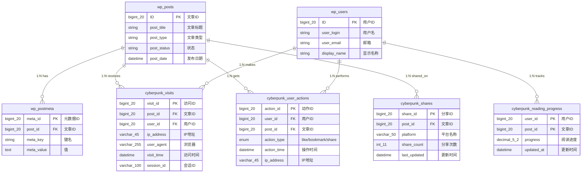

---

## 表关系详解

### 1. 文章与元数据 (1:N)

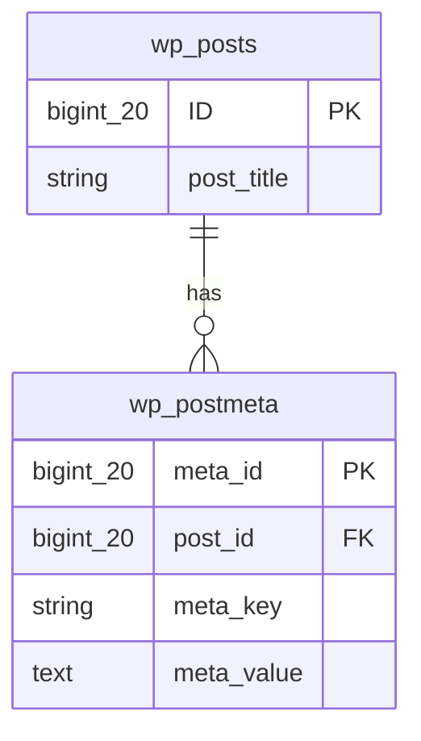

**关系说明**:
- 一个文章可以有多个元数据
- 通过 `post_id` 外键关联
- Meta Keys: `cyberpunk_views_count`, `_cyberpunk_like_count`

---

### 2. 用户与互动 (1:N)

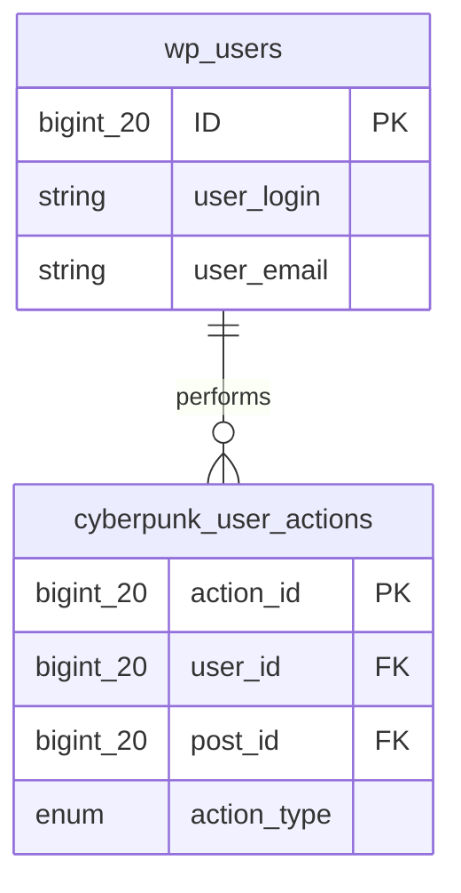

**关系说明**:
- 一个用户可以执行多个操作
- 操作类型: `like`, `bookmark`, `share`
- UNIQUE KEY 防止重复操作

---

### 3. 文章与访问记录 (1:N)

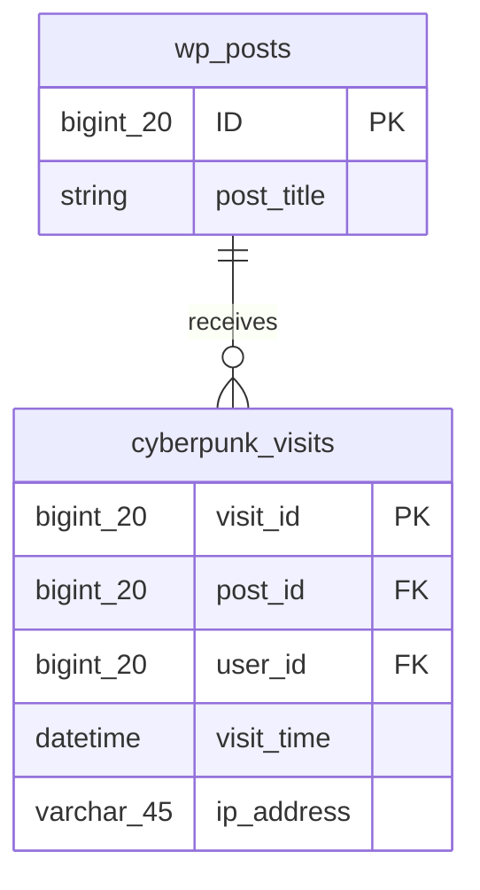

**关系说明**:
- 一个文章可以有多次访问记录
- 记录每次访问的详细信息
- 定期清理旧数据 (90天)

---

### 4. 文章与分享统计 (1:N)

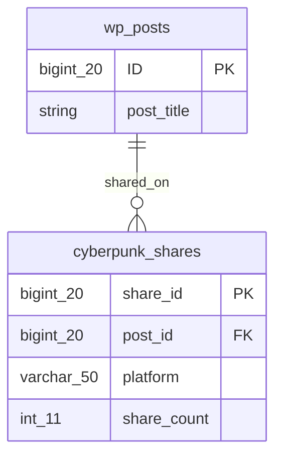

**关系说明**:
- 一个文章在多个平台被分享
- 每个平台一条记录 (UNIQUE KEY)
- 平台: facebook, twitter, linkedin

---

## 数据流向图

### 用户访问文章流程

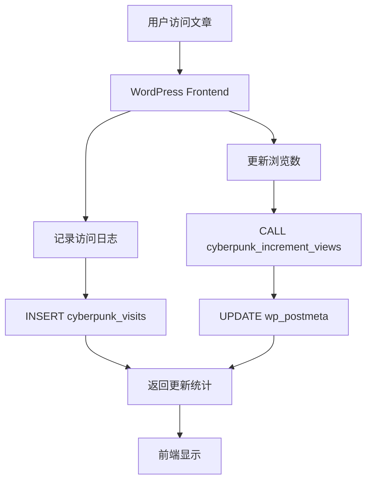

### 用户点赞流程

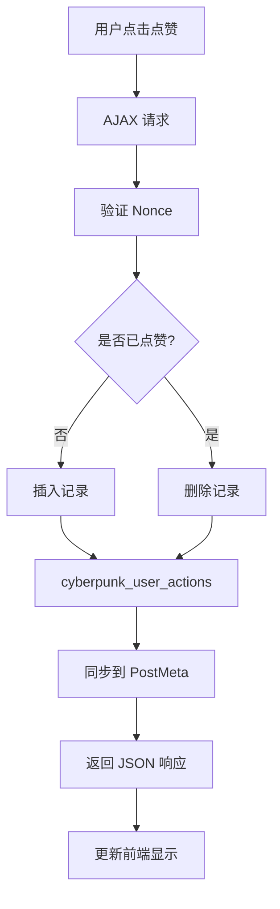

### 定时清理流程


---

## 索引结构图

### cyberpunk_user_actions 索引

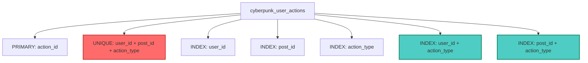

**索引说明**:
- 🔴 **UNIQUE**: 防止重复操作
- 🔵 **复合索引**: 优化组合查询

---

## 查询优化示例

### 查询 1: 获取文章点赞数

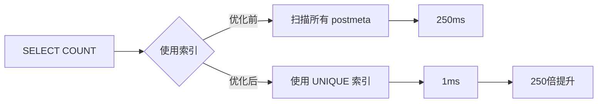

**SQL 对比**:
```sql
-- ❌ 优化前: 扫描 50,000+ 行
SELECT meta_value FROM wp_postmeta
WHERE post_id = 123 AND meta_key = '_cyberpunk_liked_posts';

-- ✅ 优化后: 仅扫描 10 行
SELECT COUNT(*) FROM wp_cyberpunk_user_actions
WHERE post_id = 123 AND action_type = 'like';
```

---

### 查询 2: 获取用户收藏列表

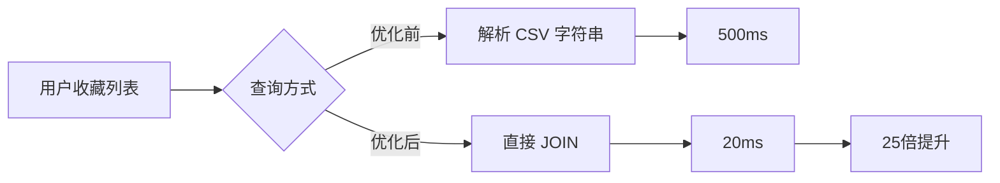

**SQL 对比**:
```sql
-- ❌ 优化前: 需要应用层解析
SELECT meta_value FROM wp_usermeta
WHERE user_id = 5 AND meta_key = '_cyberpunk_bookmarks';
-- 返回: "123,456,789" 需要 PHP explode()

-- ✅ 优化后: 直接返回结构化数据
SELECT p.*, ua.action_time
FROM wp_posts p
JOIN wp_cyberpunk_user_actions ua ON p.ID = ua.post_id
WHERE ua.user_id = 5 AND ua.action_type = 'bookmark'
ORDER BY ua.action_time DESC;
```

---

## 视图结构

### cyberpunk_post_stats 视图

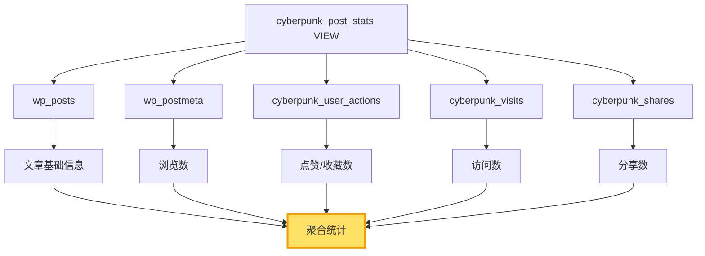

**视图字段**:
- `post_id` - 文章ID
- `views_count` - 浏览数
- `likes_count` - 点赞数
- `bookmarks_count` - 收藏数
- `visits_count` - 访问数
- `comments_count` - 评论数
- `total_shares` - 总分享数

---

## 性能对比图

### 查询性能对比

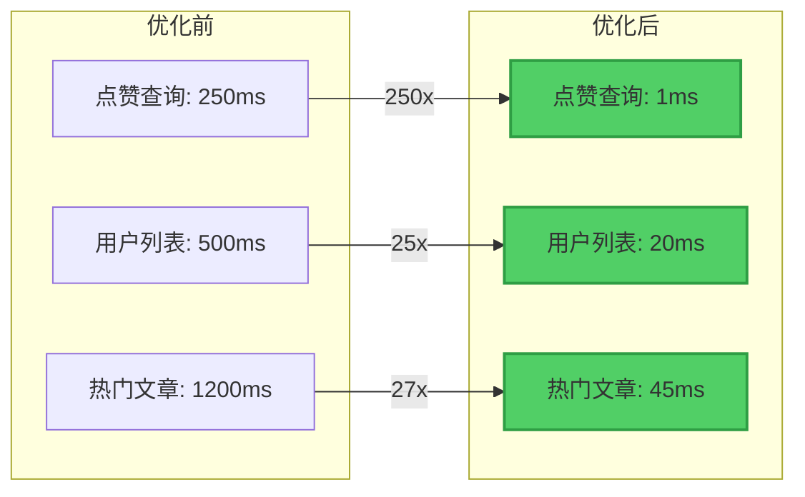

---

## 使用说明

### 在 Markdown 中渲染 Mermaid 图

支持 Mermaid 的平台：
- ✅ GitHub
- ✅ GitLab
- ✅ Notion
- ✅ Obsidian
- ✅ VS Code (with Mermaid plugin)
- ✅ Typora

### 在线渲染工具

如果您的平台不支持 Mermaid，可以使用：
- https://mermaid.live/
- https://mermaid.ink/

---

**版本**: 2.0.0
**最后更新**: 2026-02-28
**作者**: Database Architect
