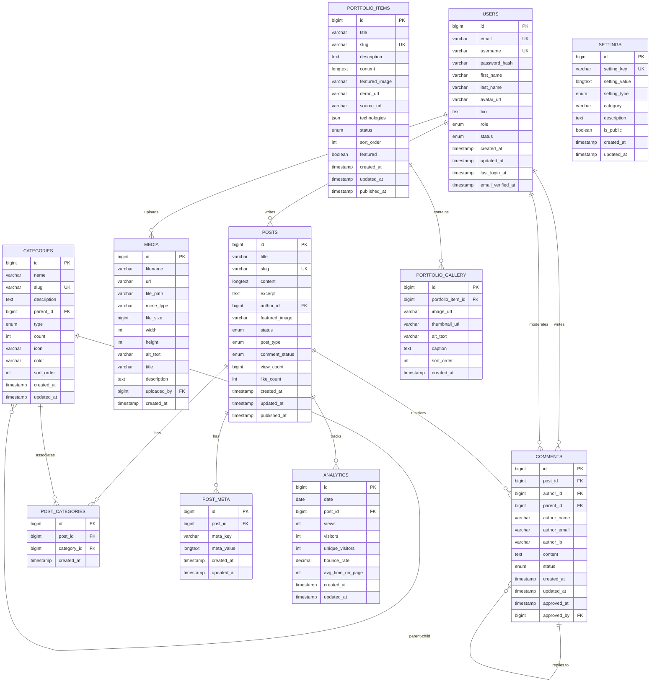

# CyberPress Platform - Entity Relationship Diagram

## Database ER Diagram

## Table Relationships

### Core Relationships

1. **Users → Posts** (One-to-Many)
   - One user can write many posts
   - Foreign Key: `posts.author_id → users.id`

2. **Users → Comments** (One-to-Many)
   - One user can write many comments
   - Foreign Key: `comments.author_id → users.id`

3. **Users → Media** (One-to-Many)
   - One user can upload many media files
   - Foreign Key: `media.uploaded_by → users.id`

4. **Posts → Comments** (One-to-Many)
   - One post can have many comments
   - Foreign Key: `comments.post_id → posts.id`

5. **Posts → Post_Categories** (One-to-Many)
   - One post can have many category associations
   - Foreign Key: `post_categories.post_id → posts.id`

6. **Categories → Post_Categories** (One-to-Many)
   - One category can be associated with many posts
   - Foreign Key: `post_categories.category_id → categories.id`

7. **Categories → Categories** (Self-Referencing)
   - One category can have many sub-categories
   - Foreign Key: `categories.parent_id → categories.id`

8. **Comments → Comments** (Self-Referencing)
   - One comment can have many replies
   - Foreign Key: `comments.parent_id → comments.id`

9. **Portfolio_Items → Portfolio_Gallery** (One-to-Many)
   - One portfolio item can have many gallery images
   - Foreign Key: `portfolio_gallery.portfolio_item_id → portfolio_items.id`

10. **Posts → Post_Meta** (One-to-Many)
    - One post can have many metadata entries
    - Foreign Key: `post_meta.post_id → posts.id`

11. **Posts → Analytics** (One-to-Many)
    - One post can have many analytics records
    - Foreign Key: `analytics.post_id → posts.id`

## Indexes

### Performance Indexes

| Table | Index | Type | Columns |
|-------|-------|------|---------|
| users | uk_email | UNIQUE | email |
| users | uk_username | UNIQUE | username |
| users | idx_role | INDEX | role |
| users | idx_status | INDEX | status |
| posts | uk_slug | UNIQUE | slug |
| posts | idx_author | INDEX | author_id |
| posts | idx_status | INDEX | status |
| posts | idx_post_type | INDEX | post_type |
| posts | idx_published_at | INDEX | published_at |
| posts | ft_search | FULLTEXT | title, content, excerpt |
| categories | uk_slug_type | UNIQUE | slug, type |
| post_categories | uk_post_category | UNIQUE | post_id, category_id |
| comments | idx_post_status_parent_created | INDEX | post_id, status, parent_id, created_at |
| analytics | uk_date_post | UNIQUE | date, post_id |

## Data Constraints

### Enums

**users.role**
- subscriber
- contributor
- author
- editor
- administrator

**users.status**
- active
- inactive
- suspended
- banned

**posts.status**
- draft
- pending
- publish
- private
- trash

**posts.post_type**
- post
- page
- portfolio

**comments.status**
- pending
- approved
- spam
- trash

## Views

### v_post_list
- Lists all posts with author information
- Includes category names and comment counts
- Optimized for blog listing pages

### v_popular_posts
- Lists published posts ordered by view count
- Includes author and comment data
- Limited to top 100 posts

### v_category_stats
- Shows category statistics
- Includes actual post counts
- Used for category navigation

## Stored Procedures

1. **sp_increment_post_views(post_id)**
   - Increments view count for a post
   - Updates daily analytics

2. **sp_update_category_counts()**
   - Recalculates post counts for all categories

3. **sp_cleanup_old_data(days_to_keep)**
   - Removes old trashed posts and comments
   - Scheduled maintenance task

## Triggers

1. **tr_post_published_update_category**
   - Fires when post status changes to 'publish'
   - Updates category post counts

2. **tr_category_added_update_count**
   - Fires when post-category association is created
   - Updates category post counts

## Scheduled Events

1. **evt_daily_update_counts**
   - Runs daily to update category counts
   - Ensures data consistency

2. **evt_weekly_cleanup**
   - Runs weekly to clean old data
   - Keeps database optimized
