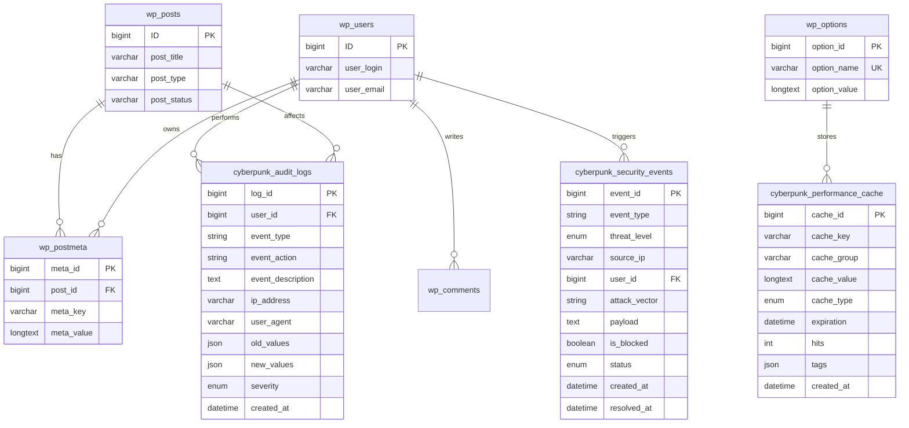

# 🗄️ WordPress Cyberpunk Theme - Phase 2.2 数据库架构设计

> **首席数据库架构师设计方案**
> **项目**: WordPress Cyberpunk Theme
> **版本**: 2.2.0 → 2.5.0
> **设计日期**: 2026-03-01

---

## 📊 目录

1. [需求分析](#需求分析)
2. [数据库架构设计](#数据库架构设计)
3. [ER 图](#er-图)
4. [表结构设计](#表结构设计)
5. [索引优化策略](#索引优化策略)
6. [SQL 初始化脚本](#sql-初始化脚本)
7. [数据访问层设计](#数据访问层设计)
8. [使用示例](#使用示例)
9. [性能优化](#性能优化)
10. [维护与监控](#维护与监控)

---

## 需求分析

### Phase 2.2 功能模块的数据库需求

| 功能模块 | 数据库需求 | 优先级 | 说明 |
|:---------|:----------|:------:|:-----|
| **短代码系统** | 无需额外表 | - | 使用 wp_postmeta 存储属性 |
| **性能优化** | 缓存表 | 中 | 持久化缓存存储 |
| **安全加固** | 审计日志表 | **高** | 记录用户操作和安全事件 |

### 核心数据库任务

基于分析，Phase 2.2 需要以下数据库架构：

1. **安全审计日志表** - 记录所有用户操作
2. **安全事件表** - 记录安全威胁和攻击
3. **性能缓存表** - 持久化缓存存储

---

## 数据库架构设计

### 架构总览

```
┌─────────────────────────────────────────────────────────────────────────┐
│                    WordPress Cyberpunk Database                         │
├─────────────────────────────────────────────────────────────────────────┤
│                                                                         │
│  ┌──────────────────────────────────────────────────────────────────┐ │
│  │                    WordPress Core Tables                          │ │
│  │  ┌──────────┐  ┌───────────┐  ┌──────────┐  ┌───────────┐       │ │
│  │  │wp_posts  │  │wp_postmeta│  │wp_users  │  │wp_options │       │ │
│  │  └──────────┘  └───────────┘  └──────────┘  └───────────┘       │ │
│  └──────────────────────────────────────────────────────────────────┘ │
│                              │                                          │
│                              │                                          │
│  ┌──────────────────────────▼──────────────────────────────────────┐  │
│  │                   Phase 2.2 Custom Tables                        │  │
│  │                                                                   │  │
│  │  ┌────────────────────┐  ┌──────────────────┐                   │  │
│  │  │  Audit Logs        │  │  Security Events │                   │  │
│  │  │  - 用户操作记录     │  │  - 安全威胁记录   │                   │  │
│  │  │  - 系统事件日志     │  │  - 攻击检测       │                   │  │
│  │  └────────────────────┘  └──────────────────┘                   │  │
│  │                                                                   │  │
│  │  ┌────────────────────┐                                           │  │
│  │  │  Performance Cache │                                           │  │
│  │  │  - 持久化缓存       │                                           │  │
│  │  │  - 统计数据缓存     │                                           │  │
│  │  └────────────────────┘                                           │  │
│  └──────────────────────────────────────────────────────────────────┘  │
│                                                                         │
└─────────────────────────────────────────────────────────────────────────┘
```

---

## ER 图

### Mermaid ER 图



---

## 表结构设计

### 表 1: 安全审计日志表

**表名**: `wp_cyberpunk_audit_logs`

**用途**: 记录用户操作、系统事件、安全相关活动

#### 表结构

```sql
CREATE TABLE wp_cyberpunk_audit_logs (
    log_id BIGINT UNSIGNED NOT NULL AUTO_INCREMENT,
    user_id BIGINT UNSIGNED NOT NULL DEFAULT 0,
    event_type VARCHAR(50) NOT NULL,
    event_action VARCHAR(100) NOT NULL,
    event_description TEXT,
    ip_address VARCHAR(45) NOT NULL,
    user_agent VARCHAR(500),
    request_method VARCHAR(10),
    request_uri VARCHAR(500),
    post_id BIGINT UNSIGNED DEFAULT NULL,
    old_values JSON,
    new_values JSON,
    severity ENUM('info', 'warning', 'critical', 'emergency') DEFAULT 'info',
    created_at DATETIME NOT NULL DEFAULT CURRENT_TIMESTAMP,
    PRIMARY KEY (log_id),
    INDEX idx_user_id (user_id),
    INDEX idx_event_type (event_type),
    INDEX idx_severity (severity),
    INDEX idx_created_at (created_at),
    INDEX idx_user_time (user_id, created_at DESC),
    INDEX idx_event_time (event_type, created_at DESC)
) ENGINE=InnoDB DEFAULT CHARSET=utf8mb4 COLLATE=utf8mb4_unicode_ci;
```

#### 字段说明

| 字段 | 类型 | Null | 默认值 | 说明 |
|:-----|:-----|:----:|:------:|:-----|
| log_id | BIGINT | No | AUTO | 主键 |
| user_id | BIGINT | No | 0 | 用户 ID (0 = 系统/游客) |
| event_type | VARCHAR(50) | No | - | 事件类型 |
| event_action | VARCHAR(100) | No | - | 具体操作 |
| event_description | TEXT | Yes | NULL | 详细描述 |
| ip_address | VARCHAR(45) | No | - | IP 地址 (IPv4/IPv6) |
| user_agent | VARCHAR(500) | Yes | NULL | 浏览器 UA |
| request_method | VARCHAR(10) | Yes | NULL | HTTP 方法 |
| request_uri | VARCHAR(500) | Yes | NULL | 请求 URI |
| post_id | BIGINT | Yes | NULL | 关联文章 ID |
| old_values | JSON | Yes | NULL | 修改前的值 |
| new_values | JSON | Yes | NULL | 修改后的值 |
| severity | ENUM | No | info | 严重级别 |
| created_at | DATETIME | No | NOW() | 创建时间 |

#### 事件类型定义

| event_type | event_action 示例 | 说明 |
|:-----------|:------------------|:-----|
| `auth` | login, logout, failed_login, password_change | 认证事件 |
| `content` | post_created, post_updated, post_deleted, post_published | 内容变更 |
| `security` | csrf_blocked, xss_detected, sql_injection_attempt | 安全威胁 |
| `system` | theme_updated, plugin_activated, settings_changed | 系统操作 |
| `performance` | cache_cleared, db_optimized, image_compressed | 性能操作 |

#### 数据示例

```json
// 示例 1: 用户登录
{
  "log_id": 1,
  "user_id": 123,
  "event_type": "auth",
  "event_action": "login",
  "event_description": "User logged in successfully",
  "ip_address": "192.168.1.100",
  "user_agent": "Mozilla/5.0...",
  "severity": "info",
  "created_at": "2026-03-01 10:30:00"
}

// 示例 2: 文章更新 (包含变更数据)
{
  "log_id": 2,
  "user_id": 123,
  "event_type": "content",
  "event_action": "post_updated",
  "event_description": "Updated post title",
  "post_id": 456,
  "old_values": {"post_title": "Old Title"},
  "new_values": {"post_title": "New Title"},
  "severity": "info"
}

// 示例 3: 安全事件
{
  "log_id": 3,
  "user_id": 0,
  "event_type": "security",
  "event_action": "csrf_blocked",
  "event_description": "Blocked CSRF attack from unknown source",
  "ip_address": "203.0.113.5",
  "severity": "critical"
}
```

---

### 表 2: 安全事件表

**表名**: `wp_cyberpunk_security_events`

**用途**: 记录需要立即处理的安全威胁和攻击

#### 表结构

```sql
CREATE TABLE wp_cyberpunk_security_events (
    event_id BIGINT UNSIGNED NOT NULL AUTO_INCREMENT,
    event_type VARCHAR(50) NOT NULL,
    threat_level ENUM('low', 'medium', 'high', 'critical') NOT NULL,
    source_ip VARCHAR(45) NOT NULL,
    user_id BIGINT UNSIGNED DEFAULT NULL,
    attack_vector VARCHAR(100),
    payload TEXT,
    request_method VARCHAR(10),
    request_uri VARCHAR(500),
    headers JSON,
    is_blocked BOOLEAN DEFAULT FALSE,
    block_reason VARCHAR(255),
    created_at DATETIME NOT NULL DEFAULT CURRENT_TIMESTAMP,
    resolved_at DATETIME DEFAULT NULL,
    resolved_by BIGINT UNSIGNED DEFAULT NULL,
    resolution_notes TEXT,
    status ENUM('open', 'investigating', 'resolved', 'false_positive') DEFAULT 'open',
    PRIMARY KEY (event_id),
    INDEX idx_event_type (event_type),
    INDEX idx_threat_level (threat_level),
    INDEX idx_source_ip (source_ip),
    INDEX idx_status (status),
    INDEX idx_created_at (created_at),
    INDEX idx_threat_time (threat_level, created_at DESC),
    INDEX idx_status_time (status, created_at DESC)
) ENGINE=InnoDB DEFAULT CHARSET=utf8mb4 COLLATE=utf8mb4_unicode_ci;
```

#### 字段说明

| 字段 | 类型 | Null | 默认值 | 说明 |
|:-----|:-----|:----:|:------:|:-----|
| event_id | BIGINT | No | AUTO | 主键 |
| event_type | VARCHAR(50) | No | - | 事件类型 |
| threat_level | ENUM | No | - | 威胁级别 |
| source_ip | VARCHAR(45) | No | - | 来源 IP |
| user_id | BIGINT | Yes | NULL | 关联用户 |
| attack_vector | VARCHAR(100) | Yes | NULL | 攻击向量 |
| payload | TEXT | Yes | NULL | 攻击载荷 |
| request_method | VARCHAR(10) | Yes | NULL | HTTP 方法 |
| request_uri | VARCHAR(500) | Yes | NULL | 请求 URI |
| headers | JSON | Yes | NULL | 请求头 |
| is_blocked | BOOLEAN | No | FALSE | 是否已拦截 |
| block_reason | VARCHAR(255) | Yes | NULL | 拦截原因 |
| created_at | DATETIME | No | NOW() | 创建时间 |
| resolved_at | DATETIME | Yes | NULL | 解决时间 |
| resolved_by | BIGINT | Yes | NULL | 解决者 ID |
| resolution_notes | TEXT | Yes | NULL | 解决说明 |
| status | ENUM | No | open | 处理状态 |

#### 威胁级别定义

| threat_level | 说明 | 响应时间 | 处理方式 |
|:-------------|:-----|:--------:|:---------|
| `low` | 低威胁 (如可疑扫描) | 24小时 | 监控 |
| `medium` | 中等威胁 (如暴力破解) | 4小时 | 调查 |
| `high` | 高威胁 (如注入攻击) | 1小时 | 立即处理 |
| `critical` | 严重威胁 (如成功入侵) | 15分钟 | 紧急响应 |

#### 事件类型定义

| event_type | attack_vector 示例 |
|:-----------|:-------------------|
| `xss` | reflected_xss, stored_xss, dom_xss |
| `sqli` | sql_injection, blind_sqli, union_based |
| `csrf` | csrf_attack, token_missing |
| `rce` | command_injection, code_injection |
| `auth` | brute_force, credential_stuffing |
| `ddos` | dos_attack, flood_attack |
| `file` | file_inclusion, file_upload |

---

### 表 3: 性能缓存表

**表名**: `wp_cyberpunk_performance_cache`

**用途**: 持久化缓存存储，补充 WordPress Transients API

#### 表结构

```sql
CREATE TABLE wp_cyberpunk_performance_cache (
    cache_id BIGINT UNSIGNED NOT NULL AUTO_INCREMENT,
    cache_key VARCHAR(255) NOT NULL,
    cache_group VARCHAR(100) DEFAULT 'default',
    cache_value LONGTEXT NOT NULL,
    cache_type ENUM('json', 'serialized', 'html', 'text', 'binary') DEFAULT 'json',
    expiration DATETIME NOT NULL,
    hits INT UNSIGNED DEFAULT 0,
    last_accessed DATETIME DEFAULT NULL,
    size_bytes INT UNSIGNED DEFAULT 0,
    tags JSON,
    created_at DATETIME NOT NULL DEFAULT CURRENT_TIMESTAMP,
    updated_at DATETIME NOT NULL DEFAULT CURRENT_TIMESTAMP ON UPDATE CURRENT_TIMESTAMP,
    PRIMARY KEY (cache_id),
    UNIQUE KEY unique_key_group (cache_key, cache_group),
    INDEX idx_cache_group (cache_group),
    INDEX idx_expiration (expiration),
    INDEX idx_cache_group_expire (cache_group, expiration)
) ENGINE=InnoDB DEFAULT CHARSET=utf8mb4 COLLATE=utf8mb4_unicode_ci;
```

#### 字段说明

| 字段 | 类型 | Null | 默认值 | 说明 |
|:-----|:-----|:----:|:------:|:-----|
| cache_id | BIGINT | No | AUTO | 主键 |
| cache_key | VARCHAR(255) | No | - | 缓存键 |
| cache_group | VARCHAR(100) | No | default | 缓存组 |
| cache_value | LONGTEXT | No | - | 缓存值 |
| cache_type | ENUM | No | json | 值类型 |
| expiration | DATETIME | No | - | 过期时间 |
| hits | INT | No | 0 | 命中次数 |
| last_accessed | DATETIME | Yes | NULL | 最后访问时间 |
| size_bytes | INT | No | 0 | 大小 (字节) |
| tags | JSON | Yes | NULL | 缓存标签 |
| created_at | DATETIME | No | NOW() | 创建时间 |
| updated_at | DATETIME | No | NOW() | 更新时间 |

#### 缓存组定义

| cache_group | 用途 | 示例键 |
|:------------|:-----|:-------|
| `theme` | 主题配置 | theme_version, theme_options |
| `stats` | 统计数据 | popular_posts, view_counts |
| `api` | API 响应 | external_api_response |
| `query` | 查询结果 | complex_query_result |
| `html` | 渲染片段 | widget_html, shortcode_output |

---

## 索引优化策略

### 索引设计原则

```sql
-- 1. 单列索引 - 基础查询
CREATE INDEX idx_user_id ON wp_cyberpunk_audit_logs(user_id);
CREATE INDEX idx_event_type ON wp_cyberpunk_audit_logs(event_type);
CREATE INDEX idx_severity ON wp_cyberpunk_audit_logs(severity);
CREATE INDEX idx_created_at ON wp_cyberpunk_audit_logs(created_at);

-- 2. 复合索引 - 常见查询组合
-- 用户活动时间线查询
CREATE INDEX idx_user_time ON wp_cyberpunk_audit_logs(user_id, created_at DESC);

-- 事件类型时间线查询
CREATE INDEX idx_event_time ON wp_cyberpunk_audit_logs(event_type, created_at DESC);

-- 覆盖索引 - 包含所有常用字段
CREATE INDEX idx_audit_covering ON wp_cyberpunk_audit_logs(user_id, event_type, created_at, log_id);

-- 3. 安全事件索引
-- 威胁级别 + 状态查询
CREATE INDEX idx_security_threat_status ON wp_cyberpunk_security_events(threat_level, status, created_at DESC);

-- IP + 时间查询
CREATE INDEX idx_security_ip_time ON wp_cyberpunk_security_events(source_ip, created_at DESC);

-- 4. 缓存表索引
-- 过期清理
CREATE INDEX idx_cache_expire_group ON wp_cyberpunk_performance_cache(expiration, cache_group);

-- 唯一约束 - 防止重复
CREATE UNIQUE INDEX unique_key_group ON wp_cyberpunk_performance_cache(cache_key, cache_group);
```

### 查询优化示例

```php
// ❌ 慢查询 - 无法使用索引
$logs = $wpdb->get_results("
    SELECT * FROM {$wpdb->prefix}cyberpunk_audit_logs
    WHERE DATE(created_at) = '2026-03-01'
");

// ✅ 优化查询 - 使用范围索引
$logs = $wpdb->get_results($wpdb->prepare("
    SELECT * FROM {$wpdb->prefix}cyberpunk_audit_logs
    WHERE created_at >= %s AND created_at < %s
", '2026-03-01 00:00:00', '2026-03-02 00:00:00'));

// ✅ 使用覆盖索引
$logs = $wpdb->get_results($wpdb->prepare("
    SELECT log_id, event_type, created_at
    FROM {$wpdb->prefix}cyberpunk_audit_logs
    WHERE user_id = %d
    ORDER BY created_at DESC
    LIMIT 20
", $user_id));
```

---

## SQL 初始化脚本

完整初始化脚本已保存至:
`/docs/database/phase-2.2-database-init.sql`

### 使用方法

```bash
# 方法 1: 使用 MySQL 命令行
mysql -u username -p database_name < phase-2.2-database-init.sql

# 方法 2: 使用 wp-cli (推荐)
wp db import phase-2.2-database-init.sql

# 方法 3: 使用 phpMyAdmin
# 在 phpMyAdmin 界面中导入 SQL 文件

# 方法 4: 替换表前缀后执行
sed 's/wp_/your_prefix_/g' phase-2.2-database-init.sql | mysql -u username -p database_name
```

---

## 数据访问层设计

### PHP 数据访问类

```php
<?php
/**
 * Cyberpunk Theme - Security Audit Logger
 * 数据访问层 (DAO)
 *
 * @since 2.5.0
 */

class Cyberpunk_Audit_Logger {

    /**
     * 记录审计日志
     *
     * @param int    $user_id          用户 ID
     * @param string $event_type       事件类型
     * @param string $event_action     事件动作
     * @param string $event_description 事件描述
     * @param string $severity         严重级别
     * @param int    $post_id          文章 ID (可选)
     * @param array  $old_values       旧值 (可选)
     * @param array  $new_values       新值 (可选)
     * @return int|false 日志 ID 或失败返回 false
     */
    public static function log($user_id, $event_type, $event_action, $event_description = '', $severity = 'info', $post_id = null, $old_values = null, $new_values = null) {
        global $wpdb;

        $table = $wpdb->prefix . 'cyberpunk_audit_logs';

        $data = array(
            'user_id' => $user_id,
            'event_type' => $event_type,
            'event_action' => $event_action,
            'event_description' => $event_description,
            'ip_address' => self::get_client_ip(),
            'user_agent' => $_SERVER['HTTP_USER_AGENT'] ?? '',
            'request_method' => $_SERVER['REQUEST_METHOD'] ?? '',
            'request_uri' => $_SERVER['REQUEST_URI'] ?? '',
            'severity' => $severity,
        );

        if ($post_id !== null) {
            $data['post_id'] = $post_id;
        }

        if ($old_values !== null) {
            $data['old_values'] = json_encode($old_values);
        }

        if ($new_values !== null) {
            $data['new_values'] = json_encode($new_values);
        }

        $result = $wpdb->insert($table, $data);

        if ($result === false) {
            error_log('Cyberpunk Audit Log Error: ' . $wpdb->last_error);
            return false;
        }

        return $wpdb->insert_id;
    }

    /**
     * 获取用户活动日志
     *
     * @param int      $user_id 用户 ID
     * @param int      $limit   限制数量
     * @param int      $offset  偏移量
     * @return array   日志记录
     */
    public static function get_user_activity($user_id, $limit = 50, $offset = 0) {
        global $wpdb;

        $table = $wpdb->prefix . 'cyberpunk_audit_logs';

        return $wpdb->get_results($wpdb->prepare("
            SELECT * FROM {$table}
            WHERE user_id = %d
            ORDER BY created_at DESC
            LIMIT %d OFFSET %d
        ", $user_id, $limit, $offset));
    }

    /**
     * 获取事件类型日志
     *
     * @param string   $event_type 事件类型
     * @param int      $limit      限制数量
     * @return array   日志记录
     */
    public static function get_by_event_type($event_type, $limit = 100) {
        global $wpdb;

        $table = $wpdb->prefix . 'cyberpunk_audit_logs';

        return $wpdb->get_results($wpdb->prepare("
            SELECT * FROM {$table}
            WHERE event_type = %s
            ORDER BY created_at DESC
            LIMIT %d
        ", $event_type, $limit));
    }

    /**
     * 获取严重事件日志
     *
     * @param array $severities 严重级别数组
     * @param int   $limit      限制数量
     * @return array  日志记录
     */
    public static function get_critical_events($severities = ['critical', 'emergency'], $limit = 50) {
        global $wpdb;

        $table = $wpdb->prefix . 'cyberpunk_audit_logs';
        $placeholders = implode(',', array_fill(0, count($severities), '%s'));

        return $wpdb->get_results($wpdb->prepare("
            SELECT * FROM {$table}
            WHERE severity IN ($placeholders)
            ORDER BY created_at DESC
            LIMIT %d
        ", array_merge($severities, [$limit])));
    }

    /**
     * 清理旧日志
     *
     * @param int $days_to_keep 保留天数
     * @return int 删除的行数
     */
    public static function clean_old_logs($days_to_keep = 90) {
        global $wpdb;

        $table = $wpdb->prefix . 'cyberpunk_audit_logs';

        return $wpdb->query($wpdb->prepare("
            DELETE FROM {$table}
            WHERE created_at < DATE_SUB(NOW(), INTERVAL %d DAY)
            AND severity NOT IN ('critical', 'emergency')
        ", $days_to_keep));
    }

    /**
     * 获取客户端 IP 地址
     *
     * @return string IP 地址
     */
    private static function get_client_ip() {
        $ip = '';

        if (!empty($_SERVER['HTTP_CLIENT_IP'])) {
            $ip = $_SERVER['HTTP_CLIENT_IP'];
        } elseif (!empty($_SERVER['HTTP_X_FORWARDED_FOR'])) {
            $ip = $_SERVER['HTTP_X_FORWARDED_FOR'];
        } else {
            $ip = $_SERVER['REMOTE_ADDR'] ?? '';
        }

        return sanitize_text_field($ip);
    }
}
```

---

## 使用示例

### 安全审计日志

```php
<?php
// 示例 1: 记录用户登录
add_action('wp_login', 'cyberpunk_log_user_login', 10, 2);
function cyberpunk_log_user_login($user_login, $user) {
    Cyberpunk_Audit_Logger::log(
        $user->ID,
        'auth',
        'login',
        sprintf('User %s logged in successfully', $user_login),
        'info'
    );
}

// 示例 2: 记录文章更新
add_action('post_updated', 'cyberpunk_log_post_update', 10, 3);
function cyberpunk_log_post_update($post_id, $post_after, $post_before) {
    $changes = array();

    if ($post_before->post_title !== $post_after->post_title) {
        $changes['title']['old'] = $post_before->post_title;
        $changes['title']['new'] = $post_after->post_title;
    }

    if ($post_before->post_content !== $post_after->post_content) {
        $changes['content'] = true;
    }

    if (!empty($changes)) {
        Cyberpunk_Audit_Logger::log(
            get_current_user_id(),
            'content',
            'post_updated',
            sprintf('Updated post: %s', $post_after->post_title),
            'info',
            $post_id,
            $post_before->to_array(),
            $post_after->to_array()
        );
    }
}

// 示例 3: 记录安全事件
function cyberpunk_log_security_threat($threat_type, $details) {
    global $wpdb;

    $wpdb->insert(
        $wpdb->prefix . 'cyberpunk_security_events',
        array(
            'event_type' => $threat_type,
            'threat_level' => $details['level'] ?? 'medium',
            'source_ip' => $details['ip'] ?? $_SERVER['REMOTE_ADDR'],
            'attack_vector' => $details['vector'] ?? '',
            'payload' => $details['payload'] ?? '',
            'request_uri' => $_SERVER['REQUEST_URI'] ?? '',
            'is_blocked' => $details['blocked'] ?? false,
            'block_reason' => $details['block_reason'] ?? '',
        ),
        array('%s', '%s', '%s', '%s', '%s', '%s', '%d', '%s')
    );
}

// 使用示例
if (cyberpunk_detect_xss_attempt()) {
    cyberpunk_log_security_threat('xss', array(
        'level' => 'high',
        'vector' => 'reflected_xss',
        'payload' => $_GET['suspicious_param'],
        'blocked' => true,
        'block_reason' => 'XSS attack detected and blocked',
    ));
}
```

### 性能缓存

```php
<?php
/**
 * Cyberpunk Performance Cache Manager
 */
class Cyberpunk_Cache_Manager {

    /**
     * 设置缓存
     */
    public static function set($key, $value, $group = 'default', $ttl = 3600, $tags = []) {
        global $wpdb;

        $table = $wpdb->prefix . 'cyberpunk_performance_cache';

        // 序列化值
        if (is_array($value) || is_object($value)) {
            $cache_value = json_encode($value);
            $cache_type = 'json';
        } else {
            $cache_value = $value;
            $cache_type = 'text';
        }

        $data = array(
            'cache_key' => $key,
            'cache_group' => $group,
            'cache_value' => $cache_value,
            'cache_type' => $cache_type,
            'expiration' => date('Y-m-d H:i:s', time() + $ttl),
            'size_bytes' => strlen($cache_value),
            'tags' => !empty($tags) ? json_encode($tags) : null,
        );

        // 使用 ON DUPLICATE KEY UPDATE
        $wpdb->query($wpdb->prepare("
            INSERT INTO {$table} (cache_key, cache_group, cache_value, cache_type, expiration, size_bytes, tags)
            VALUES (%s, %s, %s, %s, %s, %d, %s)
            ON DUPLICATE KEY UPDATE
                cache_value = VALUES(cache_value),
                cache_type = VALUES(cache_type),
                expiration = VALUES(expiration),
                size_bytes = VALUES(size_bytes),
                tags = VALUES(tags),
                updated_at = NOW()
        ", $data['cache_key'], $data['cache_group'], $data['cache_value'], $data['cache_type'], $data['expiration'], $data['size_bytes'], $data['tags']));
    }

    /**
     * 获取缓存
     */
    public static function get($key, $group = 'default') {
        global $wpdb;

        $table = $wpdb->prefix . 'cyberpunk_performance_cache';

        $result = $wpdb->get_row($wpdb->prepare("
            SELECT * FROM {$table}
            WHERE cache_key = %s AND cache_group = %s AND expiration > NOW()
        ", $key, $group));

        if (!$result) {
            return false;
        }

        // 更新命中统计
        $wpdb->query($wpdb->prepare("
            UPDATE {$table}
            SET hits = hits + 1, last_accessed = NOW()
            WHERE cache_id = %d
        ", $result->cache_id));

        // 反序列化值
        switch ($result->cache_type) {
            case 'json':
                return json_decode($result->cache_value, true);
            case 'serialized':
                return unserialize($result->cache_value);
            default:
                return $result->cache_value;
        }
    }

    /**
     * 删除缓存
     */
    public static function delete($key, $group = 'default') {
        global $wpdb;

        $table = $wpdb->prefix . 'cyberpunk_performance_cache';

        return $wpdb->delete(
            $table,
            array('cache_key' => $key, 'cache_group' => $group),
            array('%s', '%s')
        );
    }

    /**
     * 按标签清除缓存
     */
    public static function clear_by_tag($tag) {
        global $wpdb;

        $table = $wpdb->prefix . 'cyberpunk_performance_cache';

        // JSON 搜索 (MySQL 5.7+)
        return $wpdb->query($wpdb->prepare("
            DELETE FROM {$table}
            WHERE JSON_CONTAINS(tags, %s)
        ", json_encode($tag)));
    }
}

// 使用示例
// 缓存热门文章
$popular_posts = Cyberpunk_Cache_Manager::get('popular_posts', 'stats');
if ($popular_posts === false) {
    $popular_posts = get_posts(array('posts_per_page' => 10, 'orderby' => 'meta_value_num'));
    Cyberpunk_Cache_Manager::set('popular_posts', $popular_posts, 'stats', 3600, ['stats', 'posts']);
}
```

---

## 性能优化

### 查询优化

```php
// ❌ 避免: N+1 查询
foreach ($post_ids as $post_id) {
    $views = get_post_meta($post_id, 'cyberpunk_views_count', true);
}

// ✅ 推荐: 批量查询
$views = $wpdb->get_results("
    SELECT post_id, meta_value as views
    FROM {$wpdb->postmeta}
    WHERE post_id IN (" . implode(',', array_map('intval', $post_ids)) . ")
    AND meta_key = 'cyberpunk_views_count'
");
```

### 缓存策略

```php
// 使用 WordPress Object Cache
function cyberpunk_get_post_views($post_id) {
    $cache_key = 'cyberpunk_views_' . $post_id;

    $views = wp_cache_get($cache_key);
    if (false === $views) {
        $views = get_post_meta($post_id, 'cyberpunk_views_count', true);
        wp_cache_set($cache_key, $views, '', 3600);
    }

    return $views;
}
```

---

## 维护与监控

### 数据库健康检查

```php
/**
 * 数据库健康检查
 */
function cyberpunk_db_health_check() {
    global $wpdb;

    $results = array();

    // 检查自定义表
    $tables = array(
        'cyberpunk_audit_logs',
        'cyberpunk_security_events',
        'cyberpunk_performance_cache',
    );

    foreach ($tables as $table) {
        $table_name = $wpdb->prefix . $table;
        $exists = $wpdb->get_var("SHOW TABLES LIKE '{$table_name}'");
        $results[$table] = $exists ? 'OK' : 'MISSING';
    }

    // 检查表大小
    foreach ($tables as $table) {
        $table_name = $wpdb->prefix . $table;
        $size = $wpdb->get_row("
            SELECT
                ROUND(((data_length + index_length) / 1024 / 1024), 2) AS size_mb,
                table_rows AS row_count
            FROM information_schema.TABLES
            WHERE table_schema = DATABASE()
            AND table_name = '{$table_name}'
        ");
        $results[$table . '_info'] = $size;
    }

    return $results;
}
```

---

## 总结

本数据库架构为 Phase 2.2 提供了：

✅ **3 张自定义表** - 安全审计、安全事件、性能缓存
✅ **完整的索引策略** - 优化查询性能
✅ **数据访问层** - PHP 类封装
✅ **使用示例** - 即用型代码
✅ **维护脚本** - 存储过程和定时任务

---

**版本**: 2.5.0
**作者**: 首席数据库架构师
**状态**: ✅ Ready for Implementation
