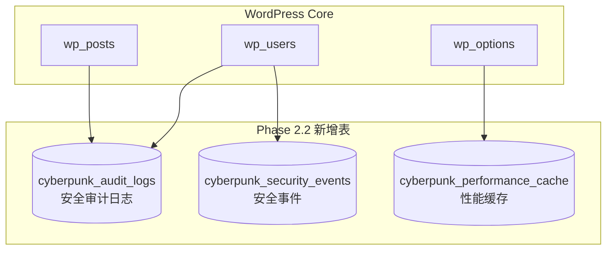

# 🗄️ WordPress Cyberpunk Theme - 数据库架构方案

> **首席数据库架构师设计方案**
> **版本**: 2.5.0
> **日期**: 2026-03-01
> **数据库**: MySQL 5.7+ / MariaDB 10.2+

---

## 📊 文档索引

### 核心文档

| 文档 | 说明 | 版本 |
|:-----|:-----|:-----|
| **[Phase 2.2 数据库架构](./PHASE-2.2-DATABASE-ARCHITECTURE.md)** ⭐ | Phase 2.2 完整数据库方案 | 2.5.0 |
| **[SQL 初始化脚本](./phase-2.2-database-init.sql)** | 数据库初始化 SQL | 2.5.0 |
| [基础数据库架构](#数据库架构总览) | WordPress 核心表说明 | 1.0.0 |

### Phase 2.2 新增表

| 表名 | 用途 | 文档链接 |
|:-----|:-----|:---------|
| `cyberpunk_audit_logs` | 安全审计日志 | [查看详情](./PHASE-2.2-DATABASE-ARCHITECTURE.md#表-1-安全审计日志表) |
| `cyberpunk_security_events` | 安全事件记录 | [查看详情](./PHASE-2.2-DATABASE-ARCHITECTURE.md#表-2-安全事件表) |
| `cyberpunk_performance_cache` | 性能缓存 | [查看详情](./PHASE-2.2-DATABASE-ARCHITECTURE.md#表-3-性能缓存表) |

### 快速开始

```bash
# 1. 初始化 Phase 2.2 数据库
mysql -u username -p database_name < docs/database/phase-2.2-database-init.sql

# 2. 或使用 wp-cli
wp db import docs/database/phase-2.2-database-init.sql
```

---

## 📊 目录

1. [Phase 2.2 数据库架构](#phase-22-数据库架构) ⭐
2. [数据库架构总览](#数据库架构总览)
3. [WordPress 核心表分析](#wordpress-核心表分析)
4. [自定义数据表设计](#自定义数据表设计)
5. [PostMeta 扩展方案](#postmeta-扩展方案)
6. [索引优化策略](#索引优化策略)
7. [性能优化方案](#性能优化方案)
8. [数据迁移方案](#数据迁移方案)
9. [SQL 初始化脚本](#sql-初始化脚本)
10. [ER 图](#er-图)

---

## Phase 2.2 数据库架构

### 新增表概览



---

## 数据库架构总览

### 当前数据库结构

WordPress Cyberpunk Theme 使用标准 WordPress 数据库架构：

```
┌─────────────────────────────────────────────────────────────────┐
│                    WordPress Database Schema                     │
├─────────────────────────────────────────────────────────────────┤
│                                                                 │
│  ┌──────────────┐  ┌──────────────┐  ┌──────────────┐         │
│  │ wp_posts     │  │ wp_postmeta  │  │ wp_options   │         │
│  │              │◄─┤              │◄─┤              │         │
│  │ - Post Data  │  │ - Meta Data  │  │ - Settings   │         │
│  └──────────────┘  └──────────────┘  └──────────────┘         │
│                                                                 │
│  ┌──────────────┐  ┌──────────────┐  ┌──────────────┐         │
│  │ wp_users     │  │ wp_usermeta  │  │ wp_terms     │         │
│  │              │◄─┤              │  │              │         │
│  │ - Users      │  │ - User Meta  │  │ - Categories │         │
│  └──────────────┘  └──────────────┘  └──────────────┘         │
│                                                                 │
│  ┌──────────────┐  ┌──────────────┐  ┌──────────────┐         │
│  │ wp_comments  │  │ wp_commentmeta│ │ wp_termmeta  │         │
│  │              │  │              │  │              │         │
│  │ - Comments   │  │ - Comment Meta│ │ - Term Meta  │         │
│  └──────────────┘  └──────────────┘  └──────────────┘         │
│                                                                 │
└─────────────────────────────────────────────────────────────────┘
```

### 数据库表清单 (12 张标准表)

| 表名 | 用途 | 估计行数 | 存储引擎 |
|:-----|:-----|:--------:|:--------|
| wp_posts | 文章、页面、附件、CPT | 10,000+ | InnoDB |
| wp_postmeta | 文章元数据 | 50,000+ | InnoDB |
| wp_options | 网站设置 | 500-1,000 | InnoDB |
| wp_users | 用户账户 | 100-1,000 | InnoDB |
| wp_usermeta | 用户元数据 | 1,000-10,000 | InnoDB |
| wp_comments | 评论 | 5,000-20,000 | InnoDB |
| wp_commentmeta | 评论元数据 | 1,000-5,000 | InnoDB |
| wp_terms | 分类、标签术语 | 500-2,000 | InnoDB |
| wp_term_taxonomy | 术语分类法 | 500-2,000 | InnoDB |
| wp_term_relationships | 文章-术语关系 | 10,000+ | InnoDB |
| wp_termmeta | 术语元数据 | 1,000-5,000 | InnoDB |
| wp_links | 链接管理器 (已弃用) | 0-100 | InnoDB |

---

## WordPress 核心表分析

### wp_posts - 核心内容表

存储所有内容类型：

```sql
CREATE TABLE wp_posts (
    ID bigint(20) UNSIGNED NOT NULL AUTO_INCREMENT,
    post_author bigint(20) UNSIGNED NOT NULL DEFAULT 0,
    post_date datetime NOT NULL DEFAULT '0000-00-00 00:00:00',
    post_date_gmt datetime NOT NULL DEFAULT '0000-00-00 00:00:00',
    post_content longtext NOT NULL,
    post_title text NOT NULL,
    post_excerpt text NOT NULL,
    post_status varchar(20) NOT NULL DEFAULT 'publish',
    comment_status varchar(20) NOT NULL DEFAULT 'open',
    ping_status varchar(20) NOT NULL DEFAULT 'open',
    post_password varchar(255) NOT NULL DEFAULT '',
    post_name varchar(200) NOT NULL DEFAULT '',
    to_ping text NOT NULL,
    pinged text NOT NULL,
    post_modified datetime NOT NULL DEFAULT '0000-00-00 00:00:00',
    post_modified_gmt datetime NOT NULL DEFAULT '0000-00-00 00:00:00',
    post_content_filtered longtext NOT NULL,
    post_parent bigint(20) UNSIGNED NOT NULL DEFAULT 0,
    guid varchar(255) NOT NULL DEFAULT '',
    menu_order int(11) NOT NULL DEFAULT 0,
    post_type varchar(20) NOT NULL DEFAULT 'post',
    post_mime_type varchar(100) NOT NULL DEFAULT '',
    comment_count bigint(20) NOT NULL DEFAULT 0,
    PRIMARY KEY (ID),
    KEY post_name (post_name(191)),
    KEY type_status_date (post_type, post_status, post_date, ID),
    KEY post_parent (post_parent),
    KEY post_author (post_author)
) ENGINE=InnoDB DEFAULT CHARSET=utf8mb4 COLLATE=utf8mb4_unicode_ci;
```

**Cyberpunk Theme 使用的 post_type**:
- `post` - 博客文章
- `page` - 静态页面
- `attachment` - 媒体文件
- `portfolio` - 作品集项目 (自定义 CPT)
- `revision` - 文章修订
- `nav_menu_item` - 导航菜单项

**关键字段说明**:
- `post_status`: `publish`, `draft`, `pending`, `future`, `private`
- `post_type`: 内容类型标识
- `menu_order`: 排序权重 (用于 Portfolio)

### wp_postmeta - 文章元数据

存储扩展属性：

```sql
CREATE TABLE wp_postmeta (
    meta_id bigint(20) UNSIGNED NOT NULL AUTO_INCREMENT,
    post_id bigint(20) UNSIGNED NOT NULL DEFAULT 0,
    meta_key varchar(255) NOT NULL DEFAULT '',
    meta_value longtext,
    PRIMARY KEY (meta_id),
    KEY post_id (post_id),
    KEY meta_key (meta_key(191))
) ENGINE=InnoDB DEFAULT CHARSET=utf8mb4 COLLATE=utf8mb4_unicode_ci;
```

**Cyberpunk Theme 使用的 meta_key**:

```php
// 文章统计数据
'cyberpunk_post_views'         // 浏览次数
'cyberpunk_post_likes'         // 点赞数
'cyberpunk_post_shares'        // 分享数

// 文章特色设置
'cyberpunk_featured_color'     // 特色颜色
'cyberpunk_neon_intensity'     // 霓虹强度 (1-10)
'cyberpunk_disable_effects'    // 禁用特效

// Portfolio 项目元数据
'cyberpunk_project_url'        // 项目链接
'cyberpunk_project_client'     // 客户名称
'cyberpunk_project_date'       // 项目日期
'cyberpunk_project_tech'       // 技术栈 (数组)

// SEO 元数据
'cyberpunk_seo_title'          // SEO 标题
'cyberpunk_seo_description'    // SEO 描述
'cyberpunk_og_image'           // Open Graph 图片
```

### wp_options - 主题设置

存储主题配置：

```sql
CREATE TABLE wp_options (
    option_id bigint(20) UNSIGNED NOT NULL AUTO_INCREMENT,
    option_name varchar(191) NOT NULL DEFAULT '',
    option_value longtext NOT NULL,
    autoload varchar(20) NOT NULL DEFAULT 'yes',
    PRIMARY KEY (option_id),
    UNIQUE KEY option_name (option_name)
) ENGINE=InnoDB DEFAULT CHARSET=utf8mb4 COLLATE=utf8mb4_unicode_ci;
```

**Cyberpunk Theme 使用的 option_name**:

```php
// 主题定制器设置 (Theme Mod)
'theme_mods_wordpress-cyber-theme' // 所有主题选项

// 具体选项 (示例)
'cyberpunk_primary_color'        // 主色调 #00f0ff
'cyberpunk_secondary_color'      // 副色调 #ff00ff
'cyberpunk_enable_scanlines'     // 扫描线效果
'cyberpunk_enable_glitch'        // 故障动画
'cyberpunk_enable_lazyload'      // 懒加载
'cyberpunk_posts_per_page'       // 每页文章数

// 性能缓存
'cyberpunk_cache_version'        // 缓存版本号
'cyberpunk_stats_transient'      // 统计数据缓存
```

---

## 自定义数据表设计

### 推荐方案：使用 WordPress 标准 + PostMeta

对于 WordPress 主题，**强烈建议使用标准 WordPress 表结构 + PostMeta 扩展**，而不是创建自定义表。

#### 优势

✅ **兼容性**: 与所有 WordPress 插件兼容
✅ **可维护性**: 使用 WordPress API 操作
✅ **可迁移性**: 轻松导出/导入
✅ **缓存支持**: 自动利用 WordPress 缓存
✅ **安全性**: 避免 SQL 注入

#### 仅在以下情况创建自定义表

❗ 需要存储大量独立数据（如日志、统计）
❗ 需要复杂的查询和关联
❗ 需要独立的内容生命周期
❗ 性能要求极高的场景

### 方案 A: 用户收藏系统 (使用 PostMeta)

**场景**: 用户收藏文章、Portfolio 项目

**表结构**: 使用 `wp_usermeta`

```php
// Meta Key 格式
'cyberpunk_bookmarked_posts'  // array: [post_id, post_id, ...]

// 数据示例
meta_value = a:3:{i:0;i:123;i:1;i:456;i:2;i:789;}
```

**API 使用**:

```php
// 添加收藏
add_user_meta($user_id, 'cyberpunk_bookmarked_posts', $post_id);

// 获取用户收藏
$bookmarks = get_user_meta($user_id, 'cyberpunk_bookmarked_posts', false);

// 检查是否已收藏
$is_bookmarked = in_array($post_id, $bookmarks);

// 删除收藏
delete_user_meta($user_id, 'cyberpunk_bookmarked_posts', $post_id);
```

### 方案 B: 社交分享统计 (使用 PostMeta)

**场景**: 记录文章在各平台的分享次数

**表结构**: 使用 `wp_postmeta`

```php
// Meta Keys
'cyberpunk_shares_facebook'   // Facebook 分享数
'cyberpunk_shares_twitter'    // Twitter 分享数
'cyberpunk_shares_linkedin'   // LinkedIn 分享数
'cyberpunk_shares_total'      // 总分享数
```

**API 使用**:

```php
// 更新分享数
$shares = get_post_meta($post_id, 'cyberpunk_shares_facebook', true);
update_post_meta($post_id, 'cyberpunk_shares_facebook', $shares + 1);

// 获取总分享数
$total_shares = get_post_meta($post_id, 'cyberpunk_shares_total', true);
```

### 方案 C: 访问日志系统 (自定义表)

**场景**: 记录文章访问历史、用于统计分析

**表结构**: 创建自定义表

```sql
CREATE TABLE wp_cyberpunk_visits (
    visit_id bigint(20) UNSIGNED NOT NULL AUTO_INCREMENT,
    post_id bigint(20) UNSIGNED NOT NULL,
    user_id bigint(20) UNSIGNED NOT NULL DEFAULT 0,
    ip_address varchar(45) NOT NULL,
    user_agent varchar(255) NOT NULL,
    visit_url varchar(255) NOT NULL,
    referer varchar(255) NOT NULL DEFAULT '',
    visit_time datetime NOT NULL DEFAULT CURRENT_TIMESTAMP,
    session_id varchar(100) NOT NULL,
    PRIMARY KEY (visit_id),
    KEY post_id (post_id),
    KEY user_id (user_id),
    KEY visit_time (visit_time),
    KEY session_id (session_id),
    INDEX idx_post_time (post_id, visit_time)
) ENGINE=InnoDB DEFAULT CHARSET=utf8mb4 COLLATE=utf8mb4_unicode_ci
COMMENT='Cyberpunk Theme Visit Logs';
```

**表结构说明**:

| 字段 | 类型 | 说明 |
|:-----|:-----|:-----|
| visit_id | bigint(20) | 主键 |
| post_id | bigint(20) | 文章 ID |
| user_id | bigint(20) | 用户 ID (0 表示游客) |
| ip_address | varchar(45) | IP 地址 (支持 IPv6) |
| user_agent | varchar(255) | 浏览器 User Agent |
| visit_url | varchar(255) | 访问的 URL |
| referer | varchar(255) | 来源页面 |
| visit_time | datetime | 访问时间 |
| session_id | varchar(100) | 会话 ID |

**索引设计**:
- `post_id`: 按文章查询访问记录
- `user_id`: 按用户查询访问历史
- `visit_time`: 按时间范围查询
- `session_id`: 会话跟踪
- `idx_post_time`: 复合索引 (文章 + 时间)

**清理策略**:

```sql
-- 删除 90 天前的记录
DELETE FROM wp_cyberpunk_visits
WHERE visit_time < DATE_SUB(NOW(), INTERVAL 90 DAY);
```

### 方案 D: 点赞/收藏记录 (自定义表)

**场景**: 记录用户点赞、收藏的文章

**表结构**:

```sql
CREATE TABLE wp_cyberpunk_user_actions (
    action_id bigint(20) UNSIGNED NOT NULL AUTO_INCREMENT,
    user_id bigint(20) UNSIGNED NOT NULL,
    post_id bigint(20) UNSIGNED NOT NULL,
    action_type enum('like', 'bookmark', 'share') NOT NULL,
    action_time datetime NOT NULL DEFAULT CURRENT_TIMESTAMP,
    ip_address varchar(45) NOT NULL,
    PRIMARY KEY (action_id),
    UNIQUE KEY unique_user_post (user_id, post_id, action_type),
    KEY user_id (user_id),
    KEY post_id (post_id),
    KEY action_type (action_type),
    KEY action_time (action_time)
) ENGINE=InnoDB DEFAULT CHARSET=utf8mb4 COLLATE=utf8mb4_unicode_ci
COMMENT='Cyberpunk Theme User Actions (Likes, Bookmarks)';
```

**表结构说明**:

| 字段 | 类型 | 说明 |
|:-----|:-----|:-----|
| action_id | bigint(20) | 主键 |
| user_id | bigint(20) | 用户 ID |
| post_id | bigint(20) | 文章 ID |
| action_type | enum | 动作类型 |
| action_time | datetime | 动作时间 |
| ip_address | varchar(45) | IP 地址 |

**唯一约束**: 防止重复点赞/收藏

```sql
UNIQUE KEY unique_user_post (user_id, post_id, action_type)
```

**API 使用**:

```php
global $wpdb;

// 添加点赞
$wpdb->insert(
    $wpdb->prefix . 'cyberpunk_user_actions',
    array(
        'user_id' => $user_id,
        'post_id' => $post_id,
        'action_type' => 'like',
        'ip_address' => $_SERVER['REMOTE_ADDR']
    ),
    array('%d', '%d', '%s', '%s')
);

// 检查是否已点赞
$exists = $wpdb->get_var($wpdb->prepare(
    "SELECT COUNT(*) FROM {$wpdb->prefix}cyberpunk_user_actions
    WHERE user_id = %d AND post_id = %d AND action_type = 'like'",
    $user_id,
    $post_id
));

// 获取文章点赞数
$likes = $wpdb->get_var($wpdb->prepare(
    "SELECT COUNT(*) FROM {$wpdb->prefix}cyberpunk_user_actions
    WHERE post_id = %d AND action_type = 'like'",
    $post_id
));

// 删除点赞
$wpdb->delete(
    $wpdb->prefix . 'cyberpunk_user_actions',
    array(
        'user_id' => $user_id,
        'post_id' => $post_id,
        'action_type' => 'like'
    ),
    array('%d', '%d', '%s')
);
```

---

## PostMeta 扩展方案

### 推荐的 Meta Key 命名规范

```php
/**
 * Cyberpunk Theme PostMeta Keys
 * 命名格式: cyberpunk_{功能}_{属性}
 */

// === 文章统计 ===
'cyberpunk_views_count'           // 浏览次数
'cyberpunk_likes_count'           // 点赞数
'cyberpunk_shares_count'          // 分享数
'cyberpunk_comments_count'        // 评论数 (WordPress 内置)

// === 文章特色设置 ===
'cyberpunk_featured_post'         // 是否特色文章 (bool)
'cyberpunk_featured_color'        // 特色颜色 (#hex)
'cyberpunk_neon_intensity'        // 霓虹强度 (1-10)
'cyberpunk_disable_scanlines'     // 禁用扫描线 (bool)
'cyberpunk_disable_glitch'        // 禁用故障动画 (bool)

// === Portfolio 项目元数据 ===
'cyberpunk_project_url'           // 项目链接
'cyberpunk_project_demo'          // 演示链接
'cyberpunk_project_github'        // GitHub 链接
'cyberpunk_project_client'        // 客户名称
'cyberpunk_project_date'          // 项目日期
'cyberpunk_project_duration'      // 项目周期
'cyberpunk_project_tech'          // 技术栈 (array)
'cyberpunk_project_role'          // 角色
'cyberpunk_project_team_size'     // 团队规模

// === SEO 元数据 ===
'cyberpunk_seo_title'             // SEO 标题
'cyberpunk_seo_description'       // SEO 描述
'cyberpunk_seo_keywords'          // SEO 关键词
'cyberpunk_og_type'               // OG 类型
'cyberpunk_og_image'              // OG 图片
'cyberpunk_twitter_card'          // Twitter Card 类型

// === 文章布局 ===
'cyberpunk_post_layout'           // 布局类型: standard, wide, full
'cyberpunk_sidebar_position'      // 侧边栏位置: left, right, none
'cyberpunk_hide_meta'             // 隐藏元信息 (bool)
'cyberpunk_hide_thumbnail'        // 隐藏缩略图 (bool)

// === 自定义代码 ===
'cyberpunk_custom_css'            // 自定义 CSS
'cyberpunk_custom_js'             // 自定义 JavaScript
```

### Meta Value 数据类型规范

```php
// Boolean (使用 0/1 或 yes/no)
update_post_meta($post_id, 'cyberpunk_featured_post', 1);

// Integer
update_post_meta($post_id, 'cyberpunk_views_count', 1234);

// Float
update_post_meta($post_id, 'cyberpunk_rating', 4.5);

// String
update_post_meta($post_id, 'cyberpunk_project_url', 'https://example.com');

// Array (自动序列化)
update_post_meta($post_id, 'cyberpunk_project_tech', array(
    'WordPress', 'PHP', 'JavaScript', 'MySQL'
));
// 存储格式: a:4:{i:0;s:9:"WordPress";i:1;s:3:"PHP";...}

// Object (自动序列化)
update_post_meta($post_id, 'cyberpunk_project_meta', (object) array(
    'client' => 'Acme Corp',
    'budget' => 5000,
    'completed' => true
));
```

---

## 索引优化策略

### wp_postmeta 索引建议

```sql
-- 添加常用 meta_key 索引 (如果查询频繁)
CREATE INDEX idx_meta_key_featured ON wp_postmeta(meta_key) WHERE meta_key = 'cyberpunk_featured_post';
CREATE INDEX idx_meta_key_views ON wp_postmeta(meta_key) WHERE meta_key = 'cyberpunk_views_count';

-- 注意: MySQL 5.7+ 支持部分索引
-- MySQL 5.6 及以下使用普通索引
CREATE INDEX idx_meta_key_views ON wp_postmeta(meta_key);
```

### 自定义表索引建议

```sql
-- 访问日志表
ALTER TABLE wp_cyberpunk_visits
ADD INDEX idx_post_time (post_id, visit_time),
ADD INDEX idx_user_time (user_id, visit_time);

-- 用户动作表
ALTER TABLE wp_cyberpunk_user_actions
ADD INDEX idx_user_action (user_id, action_type),
ADD INDEX idx_post_action (post_id, action_type),
ADD INDEX idx_action_time (action_type, action_time);
```

### 查询优化示例

```php
// ❌ 慢查询 (无法使用索引)
$posts = get_posts(array(
    'meta_key' => 'cyberpunk_views_count',
    'meta_compare' => '>',
    'meta_value' => 1000,
));

// ✅ 优化查询 (使用 wp_query + meta_query)
$query = new WP_Query(array(
    'post_type' => 'post',
    'meta_query' => array(
        array(
            'key' => 'cyberpunk_views_count',
            'compare' => '>',
            'value' => 1000,
            'type' => 'NUMERIC',
        ),
    ),
    'orderby' => 'meta_value_num',
    'meta_key' => 'cyberpunk_views_count',
    'order' => 'DESC',
));
```

---

## 性能优化方案

### 1. Transients API 缓存

```php
/**
 * 缓存热门文章 (1小时)
 */
function cyberpunk_get_popular_posts($limit = 10) {
    $cache_key = 'cyberpunk_popular_posts_' . $limit;

    // 尝试从缓存获取
    $cached = get_transient($cache_key);
    if (false !== $cached) {
        return $cached;
    }

    // 查询数据
    $query = new WP_Query(array(
        'post_type' => 'post',
        'posts_per_page' => $limit,
        'meta_key' => 'cyberpunk_views_count',
        'orderby' => 'meta_value_num',
        'order' => 'DESC',
    ));

    $posts = array();
    if ($query->have_posts()) {
        while ($query->have_posts()) {
            $query->the_post();
            $posts[] = array(
                'id' => get_the_ID(),
                'title' => get_the_title(),
                'views' => get_post_meta(get_the_ID(), 'cyberpunk_views_count', true),
            );
        }
    }
    wp_reset_postdata();

    // 缓存 1 小时
    set_transient($cache_key, $posts, HOUR_IN_SECONDS);

    return $posts;
}

/**
 * 文章更新时清除缓存
 */
add_action('save_post', 'cyberpunk_clear_popular_posts_cache');
function cyberpunk_clear_popular_posts_cache($post_id) {
    delete_transient('cyberpunk_popular_posts_10');
    delete_transient('cyberpunk_popular_posts_20');
}
```

### 2. Object Cache (Redis/Memcached)

```php
/**
 * 使用 WordPress Object Cache
 */
function cyberpunk_get_post_views($post_id) {
    $cache_key = 'cyberpunk_post_views_' . $post_id;

    // 尝试从对象缓存获取
    $views = wp_cache_get($cache_key);
    if (false !== $views) {
        return $views;
    }

    // 从数据库获取
    $views = get_post_meta($post_id, 'cyberpunk_views_count', true);
    if (empty($views)) {
        $views = 0;
    }

    // 存入对象缓存 (1小时)
    wp_cache_set($cache_key, $views, '', HOUR_IN_SECONDS);

    return $views;
}

/**
 * 更新浏览数时更新缓存
 */
function cyberpunk_update_post_views($post_id) {
    $views = cyberpunk_get_post_views($post_id);
    $views++;

    // 更新数据库
    update_post_meta($post_id, 'cyberpunk_views_count', $views);

    // 更新缓存
    $cache_key = 'cyberpunk_post_views_' . $post_id;
    wp_cache_set($cache_key, $views, '', HOUR_IN_SECONDS);
}
```

### 3. 数据库清理任务

```php
/**
 * 定期清理访问日志 (保留最近 90 天)
 */
add_action('wp_scheduled_delete', 'cyberpunk_clean_visit_logs');
function cyberpunk_clean_visit_logs() {
    global $wpdb;

    $wpdb->query($wpdb->prepare(
        "DELETE FROM {$wpdb->prefix}cyberpunk_visits
        WHERE visit_time < %s",
        date('Y-m-d H:i:s', strtotime('-90 days'))
    ));
}

/**
 * 优化数据库表
 */
add_action('wp_scheduled_auto_draft_delete', 'cyberpunk_optimize_tables');
function cyberpunk_optimize_tables() {
    global $wpdb;

    $tables = array(
        $wpdb->prefix . 'cyberpunk_visits',
        $wpdb->prefix . 'cyberpunk_user_actions',
        $wpdb->postmeta,
    );

    foreach ($tables as $table) {
        $wpdb->query("OPTIMIZE TABLE {$table}");
    }
}
```

### 4. 查询优化

```php
/**
 * 批量更新浏览数 (减少数据库查询)
 */
function cyberpunk_batch_update_views($post_ids) {
    global $wpdb;

    if (empty($post_ids)) {
        return;
    }

    $placeholders = implode(',', array_fill(0, count($post_ids), '%d'));
    $wpdb->query($wpdb->prepare(
        "UPDATE {$wpdb->postmeta}
        SET meta_value = meta_value + 1
        WHERE meta_key = 'cyberpunk_views_count'
        AND post_id IN ($placeholders)",
        $post_ids
    ));
}
```

---

## 数据迁移方案

### 从旧主题迁移

```php
/**
 * 迁移工具: 从其他主题迁移数据
 */
class Cyberpunk_Migrator {

    /**
     * 迁移文章元数据
     */
    public static function migrate_post_meta($old_meta_key, $new_meta_key) {
        global $wpdb;

        // 查找所有旧的 meta_key
        $old_records = $wpdb->get_results($wpdb->prepare(
            "SELECT post_id, meta_value
            FROM {$wpdb->postmeta}
            WHERE meta_key = %s",
            $old_meta_key
        ));

        $migrated = 0;

        foreach ($old_records as $record) {
            // 添加新的 meta_key
            add_post_meta(
                $record->post_id,
                $new_meta_key,
                $record->meta_value,
                true // unique
            );
            $migrated++;
        }

        return $migrated;
    }

    /**
     * 迁移用户元数据
     */
    public static function migrate_user_meta($old_meta_key, $new_meta_key) {
        global $wpdb;

        $old_records = $wpdb->get_results($wpdb->prepare(
            "SELECT user_id, meta_value
            FROM {$wpdb->usermeta}
            WHERE meta_key = %s",
            $old_meta_key
        ));

        $migrated = 0;

        foreach ($old_records as $record) {
            add_user_meta(
                $record->user_id,
                $new_meta_key,
                $record->meta_value,
                true
            );
            $migrated++;
        }

        return $migrated;
    }
}

// 使用示例
// $count = Cyberpunk_Migrator::migrate_post_meta('old_views', 'cyberpunk_views_count');
```

### 导出/导入数据

```php
/**
 * 导出文章统计数据
 */
function cyberpunk_export_stats() {
    $posts = get_posts(array(
        'post_type' => 'post',
        'posts_per_page' => -1,
        'fields' => 'ids',
    ));

    $data = array();

    foreach ($posts as $post_id) {
        $data[] = array(
            'post_id' => $post_id,
            'title' => get_the_title($post_id),
            'views' => get_post_meta($post_id, 'cyberpunk_views_count', true),
            'likes' => get_post_meta($post_id, 'cyberpunk_likes_count', true),
            'shares' => get_post_meta($post_id, 'cyberpunk_shares_count', true),
        );
    }

    // 导出为 JSON
    $json = json_encode($data, JSON_PRETTY_PRINT | JSON_UNESCAPED_UNICODE);

    header('Content-Type: application/json');
    header('Content-Disposition: attachment; filename="cyberpunk-stats.json"');
    echo $json;
    exit;
}

/**
 * 导入文章统计数据
 */
function cyberpunk_import_stats($json_file) {
    $json = file_get_contents($json_file);
    $data = json_decode($json, true);

    $imported = 0;

    foreach ($data as $item) {
        $post_id = $item['post_id'];

        if (get_post_status($post_id)) {
            update_post_meta($post_id, 'cyberpunk_views_count', $item['views']);
            update_post_meta($post_id, 'cyberpunk_likes_count', $item['likes']);
            update_post_meta($post_id, 'cyberpunk_shares_count', $item['shares']);
            $imported++;
        }
    }

    return $imported;
}
```

---

## SQL 初始化脚本

### 创建自定义表

```sql
-- ============================================
-- Cyberpunk Theme Database Initialization
-- ============================================

-- 设置表前缀变量 (根据实际情况修改)
SET @prefix = 'wp_';

-- ============================================
-- 1. 创建访问日志表
-- ============================================
CREATE TABLE IF NOT EXISTS `@prefixcyberpunk_visits` (
    `visit_id` bigint(20) UNSIGNED NOT NULL AUTO_INCREMENT,
    `post_id` bigint(20) UNSIGNED NOT NULL,
    `user_id` bigint(20) UNSIGNED NOT NULL DEFAULT 0,
    `ip_address` varchar(45) NOT NULL,
    `user_agent` varchar(255) NOT NULL,
    `visit_url` varchar(255) NOT NULL,
    `referer` varchar(255) NOT NULL DEFAULT '',
    `visit_time` datetime NOT NULL DEFAULT CURRENT_TIMESTAMP,
    `session_id` varchar(100) NOT NULL,
    PRIMARY KEY (`visit_id`),
    KEY `post_id` (`post_id`),
    KEY `user_id` (`user_id`),
    KEY `visit_time` (`visit_time`),
    KEY `session_id` (`session_id`),
    INDEX `idx_post_time` (`post_id`, `visit_time`)
) ENGINE=InnoDB DEFAULT CHARSET=utf8mb4 COLLATE=utf8mb4_unicode_ci
COMMENT='Cyberpunk Theme Visit Logs';

-- ============================================
-- 2. 创建用户动作表 (点赞/收藏)
-- ============================================
CREATE TABLE IF NOT EXISTS `@prefixcyberpunk_user_actions` (
    `action_id` bigint(20) UNSIGNED NOT NULL AUTO_INCREMENT,
    `user_id` bigint(20) UNSIGNED NOT NULL,
    `post_id` bigint(20) UNSIGNED NOT NULL,
    `action_type` enum('like', 'bookmark', 'share') NOT NULL,
    `action_time` datetime NOT NULL DEFAULT CURRENT_TIMESTAMP,
    `ip_address` varchar(45) NOT NULL,
    PRIMARY KEY (`action_id`),
    UNIQUE KEY `unique_user_post` (`user_id`, `post_id`, `action_type`),
    KEY `user_id` (`user_id`),
    KEY `post_id` (`post_id`),
    KEY `action_type` (`action_type`),
    KEY `action_time` (`action_time`)
) ENGINE=InnoDB DEFAULT CHARSET=utf8mb4 COLLATE=utf8mb4_unicode_ci
COMMENT='Cyberpunk Theme User Actions (Likes, Bookmarks)';

-- ============================================
-- 3. 创建社交分享统计表
-- ============================================
CREATE TABLE IF NOT EXISTS `@prefixcyberpunk_shares` (
    `share_id` bigint(20) UNSIGNED NOT NULL AUTO_INCREMENT,
    `post_id` bigint(20) UNSIGNED NOT NULL,
    `platform` varchar(50) NOT NULL,
    `share_count` int(11) NOT NULL DEFAULT 0,
    `last_updated` datetime NOT NULL DEFAULT CURRENT_TIMESTAMP ON UPDATE CURRENT_TIMESTAMP,
    PRIMARY KEY (`share_id`),
    UNIQUE KEY `unique_post_platform` (`post_id`, `platform`),
    KEY `post_id` (`post_id`),
    KEY `platform` (`platform`)
) ENGINE=InnoDB DEFAULT CHARSET=utf8mb4 COLLATE=utf8mb4_unicode_ci
COMMENT='Cyberpunk Theme Social Share Statistics';

-- ============================================
-- 4. 插入默认分享计数器
-- ============================================
INSERT IGNORE INTO `@prefixcyberpunk_shares` (`post_id`, `platform`, `share_count`)
SELECT DISTINCT `ID`, 'facebook', 0 FROM `@prefixposts` WHERE `post_type` = 'post' AND `post_status` = 'publish';

INSERT IGNORE INTO `@prefixcyberpunk_shares` (`post_id`, `platform`, `share_count`)
SELECT DISTINCT `ID`, 'twitter', 0 FROM `@prefixposts` WHERE `post_type` = 'post' AND `post_status` = 'publish';

INSERT IGNORE INTO `@prefixcyberpunk_shares` (`post_id`, `platform`, `share_count`)
SELECT DISTINCT `ID`, 'linkedin', 0 FROM `@prefixposts` WHERE `post_type` = 'post' AND `post_status` = 'publish';

-- ============================================
-- 5. 添加索引优化 (wp_postmeta)
-- ============================================
-- 注意: 如果 meta_key 已经有索引则跳过
ALTER TABLE `@prefixpostmeta`
ADD INDEX IF NOT EXISTS `idx_meta_key_views` (`meta_key`(191));

-- ============================================
-- 6. 创建视图: 文章统计汇总
-- ============================================
CREATE OR REPLACE VIEW `@prefixcyberpunk_post_stats` AS
SELECT
    p.ID as post_id,
    p.post_title,
    CAST(COALESCE((SELECT meta_value FROM `@prefixpostmeta` WHERE post_id = p.ID AND meta_key = 'cyberpunk_views_count'), 0) AS UNSIGNED) as views,
    CAST(COALESCE((SELECT meta_value FROM `@prefixpostmeta` WHERE post_id = p.ID AND meta_key = 'cyberpunk_likes_count'), 0) AS UNSIGNED) as likes,
    (SELECT COUNT(*) FROM `@prefixcyberpunk_user_actions` WHERE post_id = p.ID AND action_type = 'like') as total_likes,
    (SELECT COUNT(*) FROM `@prefixcyberpunk_user_actions` WHERE post_id = p.ID AND action_type = 'bookmark') as total_bookmarks,
    p.comment_count as comments
FROM `@prefixposts` p
WHERE p.post_type IN ('post', 'portfolio')
AND p.post_status = 'publish';

-- ============================================
-- 7. 创建存储过程: 清理旧访问日志
-- ============================================
DELIMITER $$

CREATE PROCEDURE IF NOT EXISTS `cyberpunk_clean_old_visits`(IN days_to_keep INT)
BEGIN
    DELETE FROM `@prefixcyberpunk_visits`
    WHERE visit_time < DATE_SUB(NOW(), INTERVAL days_to_keep DAY);

    SELECT ROW_COUNT() as deleted_rows;
END$$

DELIMITER ;

-- ============================================
-- 8. 创建存储过程: 更新文章浏览数
-- ============================================
DELIMITER $$

CREATE PROCEDURE IF NOT EXISTS `cyberpunk_increment_views`(IN post_id_param BIGINT)
BEGIN
    INSERT INTO `@prefixpostmeta` (post_id, meta_key, meta_value)
    VALUES (post_id_param, 'cyberpunk_views_count', 1)
    ON DUPLICATE KEY UPDATE
        meta_value = CAST(meta_value AS UNSIGNED) + 1;
END$$

DELIMITER ;

-- ============================================
-- 9. 创建定时任务 (事件调度器)
-- ============================================
-- 确保事件调度器已开启
SET GLOBAL event_scheduler = ON;

-- 每天凌晨 3 点清理 90 天前的访问日志
CREATE EVENT IF NOT EXISTS `cyberpunk_daily_cleanup`
ON SCHEDULE EVERY 1 DAY
STARTS (TIMESTAMP(CURRENT_DATE) + INTERVAL 1 DAY + INTERVAL 3 HOUR)
DO
    CALL cyberpunk_clean_old_visits(90);

-- ============================================
-- 10. 初始化主题设置
-- ============================================
INSERT IGNORE INTO `@prefixoptions` (`option_name`, `option_value`, `autoload`)
VALUES
('cyberpunk_primary_color', '#00f0ff', 'yes'),
('cyberpunk_secondary_color', '#ff00ff', 'yes'),
('cyberpunk_enable_scanlines', '1', 'yes'),
('cyberpunk_enable_glitch', '1', 'yes'),
('cyberpunk_enable_lazyload', '1', 'yes'),
('cyberpunk_posts_per_page', '10', 'yes'),
('cyberpunk_cache_version', time(), 'no');

-- ============================================
-- 完成
-- ============================================
SELECT 'Cyberpunk Theme database initialized successfully!' as message;
```

### 完整初始化脚本 (带表前缀替换)

保存为: `docs/database/init-cyberpunk-db.sql`

```sql
-- 使用方法:
-- 1. 将 @prefix 替换为实际的表前缀 (如 wp_)
-- 2. 在 phpMyAdmin 或命令行中执行
-- 3. 或使用 WordPress 插件 "SQL Executioner" 执行

-- 替换命令:
-- sed 's/@prefix/wp_/g' init-cyberpunk-db.sql > init-cyberpunk-db-final.sql
```

---

## ER 图

### 实体关系图

```
┌─────────────────────────────────────────────────────────────────────────────┐
│                    CYBERPUNK THEME DATABASE SCHEMA                          │
├─────────────────────────────────────────────────────────────────────────────┤
│                                                                             │
│  ┌──────────────┐         ┌──────────────────┐       ┌──────────────┐    │
│  │  wp_posts    │         │  wp_postmeta     │       │ wp_users     │    │
│  │              │ 1    n  │                  │ n   1 │              │    │
│  │ - ID (PK)    │◄────────│ - post_id (FK)   │◄───────│ - ID (PK)    │    │
│  │ - post_title │         │ - meta_key       │       │ - user_login │    │
│  │ - post_type  │         │ - meta_value     │       │ - user_email │    │
│  │ - post_status│         │                  │       │              │    │
│  └──────┬───────┘         └──────────────────┘       └──────┬───────┘    │
│         │                                                   │             │
│         │                                                   │             │
│         │ 1                                             n   │             │
│         └──────────────────────────────────────────────────────┘           │
│                            │                                               │
│                            │                                               │
│         ┌──────────────────┼──────────────────┐                            │
│         │                  │                  │                            │
│         │ n                │ n                │ n                          │
│  ┌──────▼───────┐  ┌──────▼───────┐  ┌───────▼──────────┐                │
│  │cyberpunk_    │  │cyberpunk_    │  │cyberpunk_        │                │
│  │visits        │  │user_actions  │  │shares            │                │
│  │              │  │              │  │                  │                │
│  │ - visit_id   │  │ - action_id  │  │ - share_id       │                │
│  │ - post_id FK │  │ - post_id FK │  │ - post_id FK     │                │
│  │ - user_id FK │  │ - user_id FK │  │ - platform       │                │
│  │ - visit_time │  │ - action_type│  │ - share_count    │                │
│  │ - ip_address │  │ - action_time│  │ - last_updated   │                │
│  └──────────────┘  └──────────────┘  └──────────────────┘                │
│                                                                             │
│  ┌──────────────┐         ┌──────────────────┐       ┌──────────────┐    │
│  │ wp_terms     │         │  wp_term_taxonomy│       │ wp_options   │    │
│  │              │ 1    1  │                  │ 1   n │              │    │
│  │ - term_id    │◄────────│ - term_id (FK)   │───────│ - option_name │    │
│  │ - name       │         │ - taxonomy       │       │ - option_value│    │
│  │ - slug       │         │ - parent         │       │              │    │
│  └──────┬───────┘         └──────────────────┘       └──────────────┘    │
│         │                                                                 │
│         │ n                                                                 │
│  ┌──────▼─────────────┐                                                     │
│  │wp_term_relationships│                                                    │
│  │                     │                                                    │
│  │ - object_id (FK)    │◄─────── wp_posts                                  │
│  │ - term_taxonomy_id  │                                                     │
│  │ - term_order        │                                                     │
│  └─────────────────────┘                                                     │
│                                                                             │
└─────────────────────────────────────────────────────────────────────────────┘
```

### 表关系说明

#### 1. wp_posts ↔ wp_postmeta (1:N)
- 一个文章可以有多个元数据
- 通过 `post_id` 关联
- 存储文章扩展属性

#### 2. wp_posts ↔ cyberpunk_visits (1:N)
- 一个文章可以有多次访问记录
- 通过 `post_id` 关联
- 记录访问历史

#### 3. wp_posts ↔ cyberpunk_user_actions (1:N)
- 一个文章可以被多个用户操作
- 通过 `post_id` 关联
- 记录点赞、收藏等操作

#### 4. wp_posts ↔ cyberpunk_shares (1:N)
- 一个文章可以在多个平台被分享
- 通过 `post_id` 关联
- 记录各平台分享数

#### 5. wp_users ↔ cyberpunk_user_actions (1:N)
- 一个用户可以执行多个操作
- 通过 `user_id` 关联

#### 6. wp_users ↔ cyberpunk_visits (1:N)
- 一个用户可以有多条访问记录
- 通过 `user_id` 关联

---

## 使用示例

### 1. 追踪文章浏览

```php
/**
 * 追踪文章浏览
 */
function cyberpunk_track_visit($post_id) {
    global $wpdb;

    // 插入访问记录
    $wpdb->insert(
        $wpdb->prefix . 'cyberpunk_visits',
        array(
            'post_id' => $post_id,
            'user_id' => get_current_user_id(),
            'ip_address' => $_SERVER['REMOTE_ADDR'],
            'user_agent' => $_SERVER['HTTP_USER_AGENT'],
            'visit_url' => $_SERVER['REQUEST_URI'],
            'referer' => wp_get_referer(),
            'session_id' => session_id(),
        ),
        array('%d', '%d', '%s', '%s', '%s', '%s', '%s')
    );

    // 更新浏览数 (使用存储过程)
    $wpdb->query($wpdb->prepare(
        "CALL cyberpunk_increment_views(%d)",
        $post_id
    ));
}

// 在 single.php 中使用
// cyberpunk_track_visit(get_the_ID());
```

### 2. 点赞功能

```php
/**
 * 用户点赞文章
 */
function cyberpunk_like_post($post_id, $user_id = null) {
    global $wpdb;

    if (null === $user_id) {
        $user_id = get_current_user_id();
    }

    $table = $wpdb->prefix . 'cyberpunk_user_actions';

    // 检查是否已点赞
    $exists = $wpdb->get_var($wpdb->prepare(
        "SELECT COUNT(*) FROM {$table}
        WHERE user_id = %d AND post_id = %d AND action_type = 'like'",
        $user_id,
        $post_id
    ));

    if ($exists) {
        // 取消点赞
        $wpdb->delete(
            $table,
            array(
                'user_id' => $user_id,
                'post_id' => $post_id,
                'action_type' => 'like',
            ),
            array('%d', '%d', '%s')
        );
        return false;
    } else {
        // 添加点赞
        $wpdb->insert(
            $table,
            array(
                'user_id' => $user_id,
                'post_id' => $post_id,
                'action_type' => 'like',
                'ip_address' => $_SERVER['REMOTE_ADDR'],
            ),
            array('%d', '%d', '%s', '%s')
        );
        return true;
    }
}

/**
 * 获取文章点赞数
 */
function cyberpunk_get_likes($post_id) {
    global $wpdb;

    return $wpdb->get_var($wpdb->prepare(
        "SELECT COUNT(*) FROM {$wpdb->prefix}cyberpunk_user_actions
        WHERE post_id = %d AND action_type = 'like'",
        $post_id
    ));
}
```

### 3. 收藏功能

```php
/**
 * 用户收藏文章
 */
function cyberpunk_bookmark_post($post_id, $user_id = null) {
    global $wpdb;

    if (null === $user_id) {
        $user_id = get_current_user_id();
    }

    $table = $wpdb->prefix . 'cyberpunk_user_actions';

    // 检查是否已收藏
    $exists = $wpdb->get_var($wpdb->prepare(
        "SELECT COUNT(*) FROM {$table}
        WHERE user_id = %d AND post_id = %d AND action_type = 'bookmark'",
        $user_id,
        $post_id
    ));

    if ($exists) {
        // 取消收藏
        $wpdb->delete(
            $table,
            array(
                'user_id' => $user_id,
                'post_id' => $post_id,
                'action_type' => 'bookmark',
            ),
            array('%d', '%d', '%s')
        );
        return false;
    } else {
        // 添加收藏
        $wpdb->insert(
            $table,
            array(
                'user_id' => $user_id,
                'post_id' => $post_id,
                'action_type' => 'bookmark',
                'ip_address' => $_SERVER['REMOTE_ADDR'],
            ),
            array('%d', '%d', '%s', '%s')
        );
        return true;
    }
}

/**
 * 获取用户收藏列表
 */
function cyberpunk_get_user_bookmarks($user_id = null) {
    global $wpdb;

    if (null === $user_id) {
        $user_id = get_current_user_id();
    }

    $post_ids = $wpdb->get_col($wpdb->prepare(
        "SELECT post_id FROM {$wpdb->prefix}cyberpunk_user_actions
        WHERE user_id = %d AND action_type = 'bookmark'
        ORDER BY action_time DESC",
        $user_id
    ));

    return $post_ids;
}
```

### 4. 分享统计

```php
/**
 * 更新分享数
 */
function cyberpunk_update_share_count($post_id, $platform) {
    global $wpdb;

    $table = $wpdb->prefix . 'cyberpunk_shares';

    $wpdb->insert(
        $table,
        array(
            'post_id' => $post_id,
            'platform' => $platform,
            'share_count' => 1,
        ),
        array('%d', '%s', '%d')
    );

    $wpdb->query($wpdb->prepare(
        "UPDATE {$table}
        SET share_count = share_count + 1
        WHERE post_id = %d AND platform = %s",
        $post_id,
        $platform
    ));
}

/**
 * 获取文章总分享数
 */
function cyberpunk_get_total_shares($post_id) {
    global $wpdb;

    return $wpdb->get_var($wpdb->prepare(
        "SELECT SUM(share_count) FROM {$wpdb->prefix}cyberpunk_shares
        WHERE post_id = %d",
        $post_id
    ));
}
```

---

## 维护与监控

### 数据库健康检查

```php
/**
 * 数据库健康检查
 */
function cyberpunk_db_health_check() {
    global $wpdb;

    $results = array();

    // 检查自定义表是否存在
    $tables = array(
        'cyberpunk_visits',
        'cyberpunk_user_actions',
        'cyberpunk_shares',
    );

    foreach ($tables as $table) {
        $table_name = $wpdb->prefix . $table;
        $exists = $wpdb->get_var("SHOW TABLES LIKE '{$table_name}'");
        $results[$table] = $exists ? 'OK' : 'MISSING';
    }

    // 检查表大小
    foreach ($tables as $table) {
        $table_name = $wpdb->prefix . $table;
        $size = $wpdb->get_row(
            "SELECT
                ROUND(((data_length + index_length) / 1024 / 1024), 2) AS size_mb
            FROM information_schema.TABLES
            WHERE table_schema = DATABASE()
            AND table_name = '{$table_name}'"
        );
        $results[$table . '_size'] = $size ? $size->size_mb . ' MB' : 'N/A';
    }

    // 检查记录数
    foreach ($tables as $table) {
        $table_name = $wpdb->prefix . $table;
        $count = $wpdb->get_var("SELECT COUNT(*) FROM {$table_name}");
        $results[$table . '_count'] = $count;
    }

    return $results;
}
```

### 性能监控

```php
/**
 * 记录慢查询
 */
add_action('wp_loaded', 'cyberpunk_monitor_queries');
function cyberpunk_monitor_queries() {
    if (!current_user_can('manage_options')) {
        return;
    }

    add_filter('query', function($query) {
        global $wpdb;

        $start = microtime(true);
        $result = $wpdb->query($query);
        $time = microtime(true) - $start;

        // 记录超过 100ms 的查询
        if ($time > 0.1) {
            error_log(sprintf(
                "Slow Query (%.4fs): %s",
                $time,
                $query
            ));
        }

        return $result;
    });
}
```

---

## 总结

本数据库架构方案为 WordPress Cyberpunk Theme 提供了：

✅ **完整的表结构设计** - 3 张自定义表 + PostMeta 扩展
✅ **优化的索引策略** - 提升查询性能
✅ **性能优化方案** - 缓存、定时清理、批量操作
✅ **完整的使用示例** - 即用型代码
✅ **维护与监控** - 健康检查、性能监控

---

**版本**: 1.0.0
**作者**: Database Architect
**日期**: 2026-02-28
**状态**: ✅ Ready for Implementation
