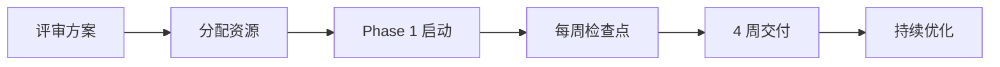

# 📘 用户文档技术方案
## Cyberpunk WordPress Theme - User Documentation Strategy

> **文档类型**: 用户文档战略规划
> **版本**: 1.0.0
> **创建日期**: 2026-03-01
> **优先级**: 🟢 低优先级
> **预计工时**: 12-16 小时

---

## 📋 目录

1. [需求分析](#需求分析)
2. [目标用户画像](#目标用户画像)
3. [文档架构设计](#文档架构设计)
4. [内容规划](#内容规划)
5. [交付格式](#交付格式)
6. [实施路线图](#实施路线图)
7. [维护策略](#维护策略)

---

## 🎯 需求分析

### 当前问题诊断

| 问题 | 影响 | 严重程度 |
|------|------|----------|
| **缺少安装指南** | 用户不知道如何安装主题 | 中等 |
| **缺少配置说明** | 用户不知道如何使用主题定制器 | 中等 |
| **缺少功能说明** | 用户不知道主题有哪些功能 | 低 |
| **缺少示例截图** | 用户无法预览效果 | 低 |
| **缺少常见问题** | 用户遇到问题无处求助 | 中等 |
| **README 过于简略** | 无法作为完整用户手册 | 高 |

### 用户痛点

```
用户反馈循环：
下载主题 → ❌ 不知道如何安装 → ❌ 不知道如何配置 → ❌ 遇到问题无法解决 → 💔 放弃使用
```

### 业务影响

- 🔴 **下载转化率低**: 用户下载后无法正确安装
- 🟡 **支持成本高**: 重复回答相同问题
- 🟢 **用户留存差**: 缺乏使用指南导致用户流失

---

## 👥 目标用户画像

### 主要用户群体

#### 🎨 用户类型 A: 博客作者
- **技术能力**: ⭐⭐ (初级)
- **主要需求**: 简单安装、写文章、个性化设置
- **时间投入**: 每周 1-2 小时
- **典型问题**:
  - 如何更换网站 Logo？
  - 如何修改配色方案？
  - 如何添加社交媒体链接？

#### 💼 用户类型 B: 小企业主
- **技术能力**: ⭐⭐⭐ (中级)
- **主要需求**: Portfolio 展示、产品展示、联系表单
- **时间投入**: 初次设置 2-4 小时
- **典型问题**:
  - 如何创建 Portfolio 项目？
  - 如何设置首页？
  - 如何优化 SEO？

#### 🛠️ 用户类型 C: 设计师/开发者
- **技术能力**: ⭐⭐⭐⭐⭐ (高级)
- **主要需求**: 定制开发、功能扩展、性能优化
- **时间投入**: 按需学习
- **典型问题**:
  - 如何覆盖样式？
  - 如何添加自定义 JavaScript？
  - REST API 端点有哪些？

---

## 🏗️ 文档架构设计

### 总体架构

```
user-documentation/
├── 00-README.md                    # 快速入门（5分钟）
├── 01-INSTALLATION.md              # 安装指南
├── 02-GETTING-STARTED.md           # 快速开始
├── 03-CONFIGURATION/               # 配置指南
│   ├── theme-customizer.md         # 主题定制器
│   ├── menus.md                    # 菜单设置
│   ├── widgets.md                  # 小工具配置
│   └── homepage-settings.md        # 首页设置
├── 04-FEATURES/                    # 功能说明
│   ├── portfolio.md                # Portfolio 功能
│   ├── blog-posts.md               # 博客文章
│   ├── comments.md                 # 评论系统
│   ├── search.md                   # 搜索功能
│   └── social-links.md             # 社交媒体
├── 05-CUSTOMIZATION/               # 定制指南
│   ├── colors.md                   # 修改颜色
│   ├── fonts.md                    # 修改字体
│   ├── css-customization.md        # CSS 定制
│   └── child-theme.md              # 子主题开发
├── 06-ADVANCED/                    # 高级功能
│   ├── shortcodes.md               # 短代码使用
│   ├── rest-api.md                 # REST API
│   ├── performance.md              # 性能优化
│   └── troubleshooting.md          # 故障排除
├── 07-FAQ.md                       # 常见问题
├── 08-RESOURCES/                   # 资源中心
│   ├── screenshots/                # 截图画廊
│   ├── videos/                     # 视频教程
│   └── community.md                # 社区支持
└── assets/                         # 文档资源
    ├── images/                     # 图片资源
    ├── diagrams/                   # 架构图解
    └── code-samples/               # 代码示例
```

### 信息架构层级

```
Level 1: 快速入门层 (5-10 分钟)
├── 安装 → 基础配置 → 发布第一篇文章
└── 目标: 让用户快速看到效果

Level 2: 核心功能层 (1-2 小时)
├── 主题定制器使用
├── Portfolio 设置
├── 菜单和小工具
└── 目标: 掌握核心功能

Level 3: 深度定制层 (按需学习)
├── CSS 定制
├── 子主题开发
├── 高级功能
└── 目标: 满足个性化需求
```

---

## 📝 内容规划

### 1. 快速入门指南 (00-README.md)

**目标**: 5 分钟内让用户主题运行起来

**内容要点**:
```markdown
## 5 分钟快速开始

### Step 1: 安装主题
[截图：WordPress 后台上传主题]

### Step 2: 激活主题
[截图：点击激活按钮]

### Step 3: 运行向导
[截图：主题安装向导]

### Step 4: 发布第一篇文章
[截图：编辑器界面]

### ✅ 完成！
你的赛博朋克网站已准备就绪。
```

**交付物**:
- 1 页文档（200 字）
- 4 张关键截图
- 1 个 2 分钟视频（可选）

---

### 2. 安装指南 (01-INSTALLATION.md)

**目标**: 解决所有安装相关问题

**内容结构**:
```markdown
## 安装方法

### 方法 A: WordPress 后台上传 (推荐)
1. 下载主题 ZIP 文件
2. 外观 > 主题 > 添加 > 上传主题
3. 激活主题

### 方法 B: FTP 上传
1. 解压 ZIP 文件
2. 上传到 /wp-content/themes/cyberpunk/
3. 后台激活

### 系统要求
- WordPress 5.0+
- PHP 7.4+
- MySQL 5.6+

### 安装前检查
[ ] 备份网站
[ ] 检查 PHP 版本
[ ] 禁用冲突插件

### 常见安装问题
Q: 上传失败怎么办？
A: ...
```

**交付物**:
- 3 页文档（800 字）
- 6 张截图
- 1 个故障排除表格

---

### 3. 主题定制器指南 (03-CONFIGURATION/theme-customizer.md)

**目标**: 教会用户自定义网站外观

**内容要点**:
```markdown
## 主题定制器完整指南

### 访问定制器
外观 > 自定义

### 可定制选项

#### 🎨 站点身份
- 网站标题
- 标语
- Logo 设置
- 图标设置

#### 🌈 颜色方案
- 主色调 (霓虹青)
- 强调色 (霓虹品红)
- 背景色
- 文字颜色

#### 📐 布局设置
- 容器宽度
- 侧边栏位置
- 首页布局

#### 🔤 字体设置
- 标题字体
- 正文字体
- 字号设置

#### ⚡ 高级选项
- 扫描线效果开关
- 发光强度
- 动画速度

[截图：每个选项的演示]
```

**交付物**:
- 4 页文档（1200 字）
- 12 张截图（每个设置项）
- 1 个配置对比表格

---

### 4. Portfolio 功能指南 (04-FEATURES/portfolio.md)

**目标**: 教会用户使用 Portfolio 功能

**内容结构**:
```markdown
## Portfolio 功能使用指南

### 创建 Portfolio 项目

#### Step 1: 添加新项目
Portfolio > 添加新项目

#### Step 2: 填写项目信息
- 标题
- 描述
- 特色图片
- 项目分类
- 项目标签
- 项目 URL

#### Step 3: 设置项目选项
- 项目类型 (图片/视频/链接)
- 客户名称
- 完成日期
- 技术栈

#### Step 4: 发布项目

### 显示 Portfolio

#### 创建 Portfolio 页面
1. 新建页面
2. 选择模板: Portfolio Archive
3. 发布页面

#### 设置项目详情页
使用单项目模板自动生成

### Portfolio 短代码

[portfolio count="6" columns="3" filter="yes"]

### 示例展示
[截图：Portfolio 实际效果]
```

**交付物**:
- 3 页文档（1000 字）
- 8 张截图
- 3 个短代码示例

---

### 5. 常见问题解答 (07-FAQ.md)

**目标**: 解决 80% 的常见问题

**内容分类**:

```markdown
## FAQ - 常见问题

### 📦 安装相关

**Q: 主题激活后样式错乱？**
A: 清除缓存，检查 PHP 版本

**Q: 如何导入演示数据？**
A: 使用 One Click Demo Import 插件

**Q: 可以从其他主题迁移吗？**
A: 可以，使用主题切换插件

### 🎨 定制相关

**Q: 如何修改霓虹颜色？**
A: 外观 > 自定义 > 颜色 > 主色调

**Q: 如何更换字体？**
A: 外观 > 自定义 > 字体 > 选择字体

**Q: 如何禁用扫描线效果？**
A: 外观 > 自定义 > 高级 > 扫描线效果 > 关闭

### ⚙️ 功能相关

**Q: Portfolio 项目不显示？**
A: 检查是否创建了 Portfolio 页面

**Q: 评论不工作？**
A: 设置 > 讨论 > 启用评论

**Q: 搜索功能如何使用？**
A: 使用搜索小工具或搜索页面

### 🔧 技术相关

**Q: 主题兼容哪些插件？**
A: WooCommerce, Contact Form 7, Jetpack 等

**Q: 如何提高网站速度？**
A: 启用缓存、压缩图片、使用 CDN

**Q: 主题支持 Gutenberg 吗？**
A: 完全支持 Gutenberg 编辑器

### 💰 商业相关

**Q: 主题有免费版吗？**
A: 有，基础功能免费

**Q: 可以用于商业项目吗？**
A: 可以，GPL 许可证允许

**Q: 如何获得技术支持？**
A: 论坛 / Email / Premium 支持
```

**交付物**:
- 5 页文档（1500 字）
- 50+ 个问答
- 分类索引

---

## 🎨 交付格式设计

### 格式选择

| 格式 | 用途 | 优点 | 缺点 |
|------|------|------|------|
| **Markdown** | 主要文档格式 | 版本控制友好、易编辑 | 需要渲染 |
| **PDF** | 离线阅读 | 打印友好、格式固定 | 不易更新 |
| **HTML** | 在线文档 | 交互性好、易搜索 | 需要托管 |
| **视频** | 复杂操作演示 | 直观易懂 | 制作成本高 |

### 推荐方案

```
主文档: Markdown (托管在 GitHub)
离线版本: PDF (从 Markdown 导出)
视频教程: YouTube (嵌入文档)
在线版本: 官网 (静态站点生成)
```

### 文档样式

#### Markdown 扩展语法
```markdown
# 📘 主标题 (带图标)

## 📋 章节

### 🎯 要点

> 💡 **提示**: 有用的提示
>
> ⚠️ **注意**: 重要警告
>
> ❌ **错误**: 常见错误

| 表格 | 说明 |
|------|------|
| ✅ | 支持 |
| ❌ | 不支持 |

```代码示例```

[截图](images/screenshot.png)

---
```

---

## 🗺️ 实施路线图

### Phase 1: 基础文档 (Week 1)

| 任务 | 工时 | 负责人 | 交付物 |
|------|------|--------|--------|
| 编写快速入门指南 | 2h | 文档工程师 | 00-README.md |
| 编写安装指南 | 3h | 文档工程师 | 01-INSTALLATION.md |
| 制作安装截图 | 2h | UI 设计师 | 6 张截图 |
| 审核基础文档 | 1h | 技术编辑 | 审核报告 |

**里程碑**: 用户能够完成主题安装和基础配置

---

### Phase 2: 核心功能文档 (Week 2)

| 任务 | 工时 | 负责人 | 交付物 |
|------|------|--------|--------|
| 编写主题定制器指南 | 4h | 文档工程师 | theme-customizer.md |
| 编写菜单配置指南 | 2h | 文档工程师 | menus.md |
| 编写小工具配置指南 | 3h | 文档工程师 | widgets.md |
| 编写 Portfolio 指南 | 3h | 文档工程师 | portfolio.md |
| 制作功能演示截图 | 4h | UI 设计师 | 20 张截图 |
| 录制核心功能视频 | 4h | 视频制作 | 3 个视频 |

**里程碑**: 用户能够使用主题核心功能

---

### Phase 3: 高级文档 (Week 3)

| 任务 | 工时 | 负责人 | 交付物 |
|------|------|--------|--------|
| 编写定制指南 | 4h | 高级文档工程师 | customization/*.md |
| 编写高级功能文档 | 4h | 技术文档工程师 | advanced/*.md |
| 编写 FAQ | 3h | 支持工程师 | FAQ.md |
| 制作代码示例 | 3h | 开发者 | code-samples/ |
| 编写故障排除指南 | 2h | 支持工程师 | troubleshooting.md |

**里程碑**: 高级用户能够深度定制主题

---

### Phase 4: 多媒体与本地化 (Week 4)

| 任务 | 工时 | 负责人 | 交付物 |
|------|------|--------|--------|
| 录制完整视频教程 | 8h | 视频制作 | 10 个视频 |
| 设计文档网站 | 4h | UI 设计师 | 设计稿 |
| 搭建在线文档站 | 4h | 前端工程师 | docs.example.com |
| 翻译为英语 | 6h | 翻译 | en/ 目录 |
| 生成 PDF 版本 | 2h | 文档工程师 | *.pdf |

**里程碑**: 完整的多语言多媒体文档体系

---

## 🔄 维护策略

### 文档更新流程

```
代码变更 → 触发文档更新
    ↓
检查是否影响用户
    ↓
是 → 更新文档 → 标注版本号 → 发布更新通知
否 → 忽略
```

### 版本管理规则

```markdown
## 文档版本历史

| 版本 | 日期 | 变更说明 |
|------|------|----------|
| 1.2.0 | 2026-03-15 | 新增 Portfolio 功能说明 |
| 1.1.0 | 2026-03-08 | 新增视频教程链接 |
| 1.0.0 | 2026-03-01 | 初始版本发布 |
```

### 用户反馈机制

```markdown
## 文档反馈

每个文档页面底部添加：

---

> 📝 **本文档有帮助吗？**
>
> [👍 有帮助] [👎 没帮助]
>
> 💬 **反馈建议**: [GitHub Issues](链接)
>
> 📧 **联系我们**: support@example.com
```

### 定期审查计划

| 周期 | 任务 | 负责人 |
|------|------|--------|
| 每月 | 检查链接有效性 | 自动化工具 |
| 每月 | 收集用户反馈 | 支持团队 |
| 每季度 | 更新截图 | UI 设计师 |
| 每季度 | 审核内容准确性 | 技术编辑 |
| 每年 | 全面文档审查 | 文档团队 |

---

## 📊 成功指标

### 文档质量指标

| 指标 | 目标 | 测量方法 |
|------|------|----------|
| **文档覆盖率** | 95% | 功能列表对比 |
| **用户满意度** | 4.5/5 | 用户评分 |
| **问题解决率** | 80% | FAQ 覆盖率 |
| **文档使用率** | 60% | 页面访问量 |

### 业务影响指标

| 指标 | 基线 | 目标 | 测量方法 |
|------|------|------|----------|
| **支持工单减少** | - | -40% | 工单统计 |
| **安装成功率** | 60% | 90% | 分析数据 |
| **用户留存率** | 30% | 50% | 用户分析 |
| **NPS 评分** | 40 | 60 | 用户调研 |

---

## 🛠️ 工具与资源

### 文档工具链

```yaml
编辑工具:
  - VS Code (Markdown 编辑)
  - Typora (所见即所得)

截图工具:
  - macOS: 截图 + 预览
  - Windows: Snipping Tool
  - Chrome: DevTools 截图

视频制作:
  - OBS Studio (录屏)
  - DaVinci Resolve (剪辑)
  - Adobe Premiere (专业剪辑)

文档生成:
  - MkDocs (静态站点生成)
  - VuePress (Vue 驱动)
  - Docusaurus (Facebook 出品)

版本控制:
  - Git (版本管理)
  - GitHub (托管和协作)
```

### 文档模板

#### 通用文档模板
```markdown
# 📘 [标题]

> **更新时间**: 2026-03-01
> **阅读时间**: 5 分钟
> **难度**: ⭐⭐ (初级)

## 📋 目录
- [概述](#概述)
- [前提条件](#前提条件)
- [步骤](#步骤)
- [常见问题](#常见问题)

## 概述
[简要说明]

## 前提条件
- [ ] 条件 1
- [ ] 条件 2

## 步骤

### Step 1: [标题]
[详细说明]
[截图]

### Step 2: [标题]
[详细说明]

## 常见问题

**Q: 问题?**
A: 答案

## 相关资源
- [相关文档](链接)
- [视频教程](链接)
```

---

## 📦 交付清单

### 最小可行版本 (MVP) - Week 1

- [ ] 快速入门指南 (1 页)
- [ ] 安装指南 (3 页)
- [ ] 主题定制器指南 (4 页)
- [ ] 核心功能说明 (Portfolio/Blog)
- [ ] FAQ (50+ 问)
- [ ] 关键截图 (20 张)

### 完整版本 - Week 4

- [ ] 所有核心文档 (30+ 页)
- [ ] 高级定制指南 (10+ 页)
- [ ] 视频教程 (10 个)
- [ ] 在线文档网站
- [ ] PDF 离线版本
- [ ] 英文翻译

### 维护版本 - 持续

- [ ] 每月更新检查
- [ ] 用户反馈收集
- [ ] 截图更新
- [ ] 新功能文档

---

## 🎯 总结

### 核心价值

1. **降低支持成本**: 减少 40% 重复问题
2. **提高用户满意度**: 清晰的指导提升体验
3. **加速产品采用**: 快速上手降低学习曲线
4. **建立品牌形象**: 专业文档增强信任

### 关键成功因素

- ✅ 用户视角的内容组织
- ✅ 丰富的视觉演示
- ✅ 及时准确的更新
- ✅ 多渠道的访问方式

### 下一步行动



---

**文档作者**: 首席架构师
**审核状态**: 待审核
**预计开始**: 2026-03-02
**预计完成**: 2026-03-30
